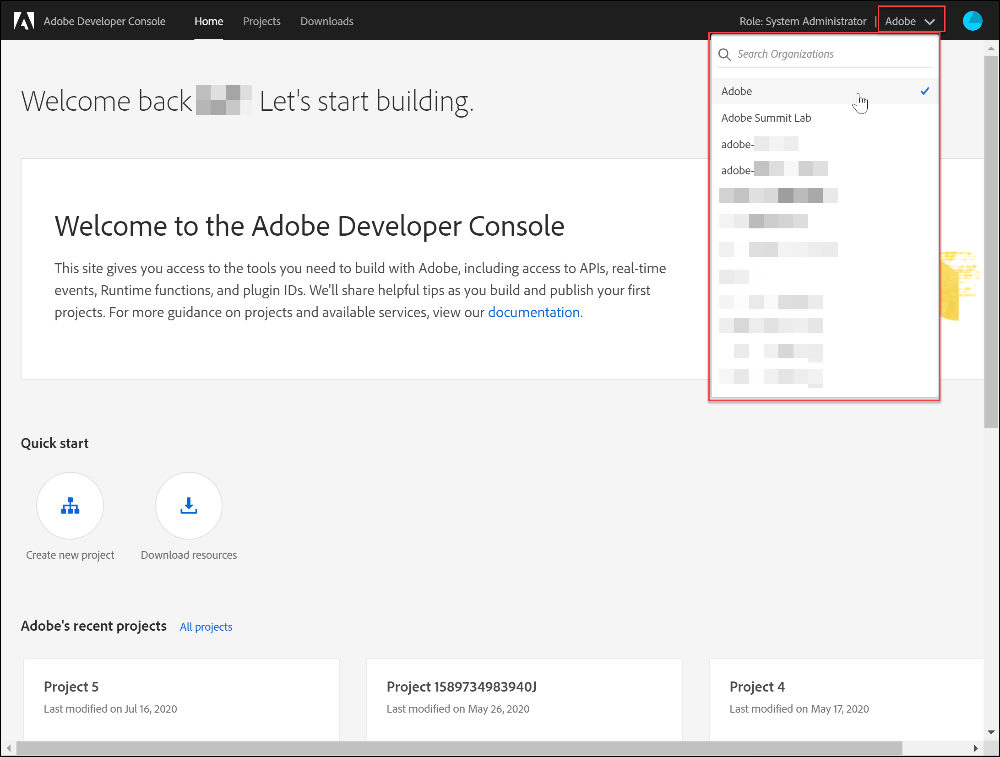
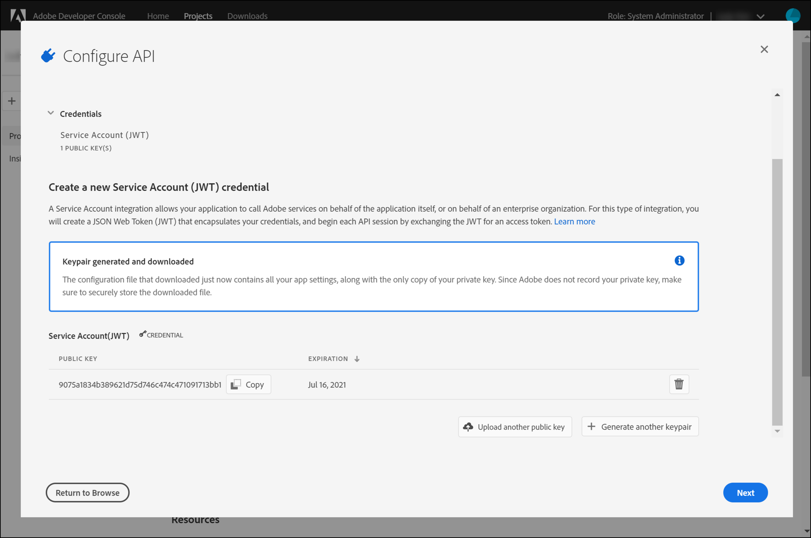
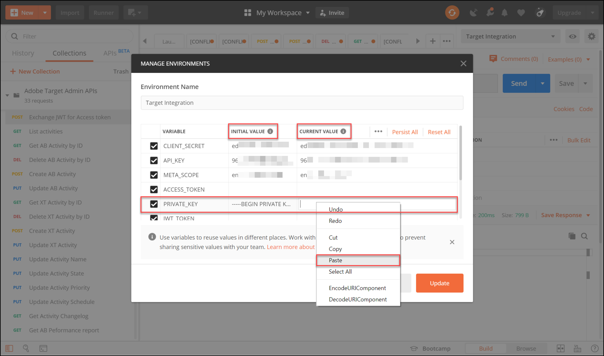
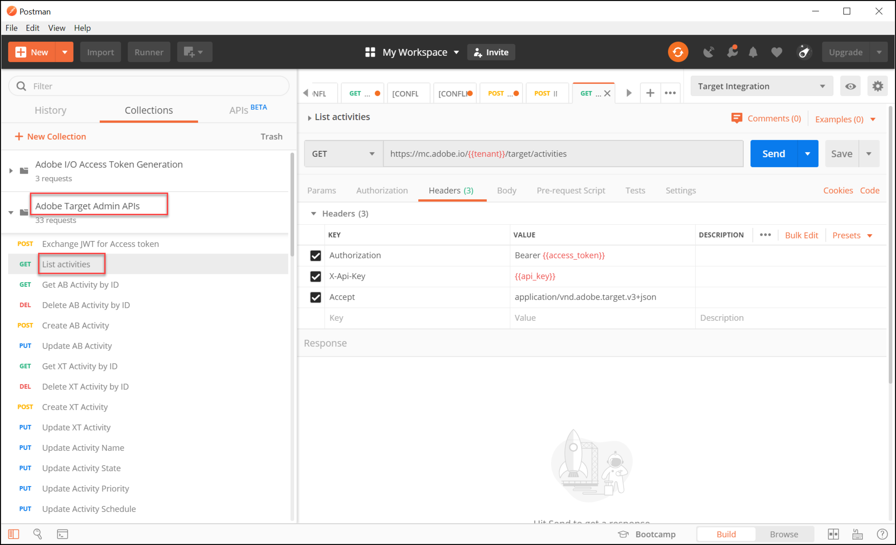
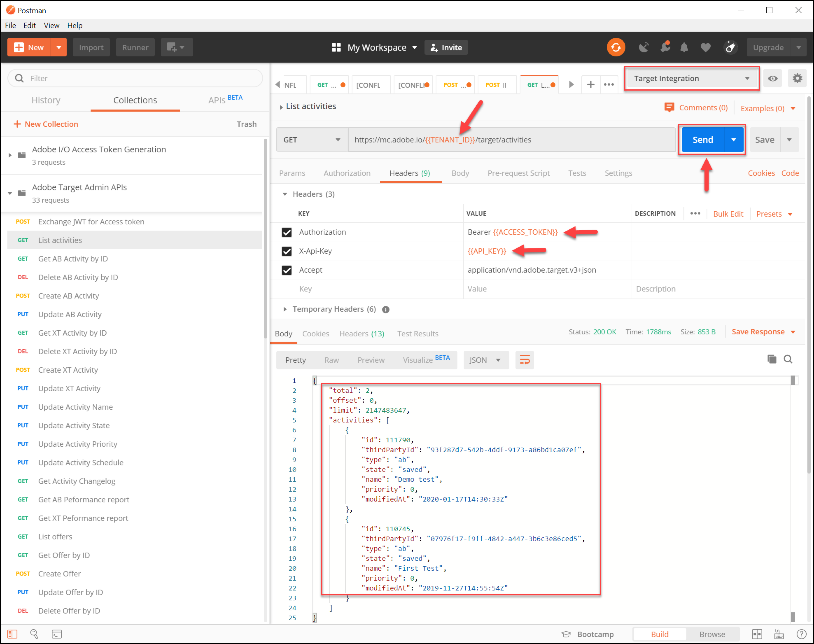

# Configuration de l’authentification pour [!DNL Adobe Target] API

La variable [!DNL Adobe Target] API d’administration, notamment [!DNL Recommendations Admin] Les API sont sécurisées par authentification pour s’assurer que seuls les utilisateurs autorisés les utilisent pour accéder à [!DNL Adobe Target]. Utilisez la variable [Console Adobe Developer](https://developer.adobe.com/console/home) pour gérer cette authentification pour tous [!DNL Adobe Experience Cloud solutions], y compris [!DNL Adobe Target].

>[!IMPORTANT]
>
>Les informations d’identification du compte de service (JWT) décrites dans cet article seront abandonnées au profit des nouvelles informations d’identification OAuth serveur à serveur.
>
>Les informations d’identification du compte de service (JWT) continueront à fonctionner jusqu’au 1er janvier 2025. Vous devez migrer votre application ou intégration pour utiliser les nouvelles informations d’identification OAuth Server-to-Server avant le 1er janvier 2025.
>
>Pour plus d’informations et des instructions détaillées sur la migration de votre intégration, voir [Migration des informations d’identification du compte de service (JWT) vers les informations d’identification OAuth serveur à serveur](https://developer.adobe.com/developer-console/docs/guides/authentication/ServerToServerAuthentication/migration/){target=_blank} dans le *Developer Console* la documentation.
>
>Pour plus d’informations sur la configuration de nouvelles informations d’identification OAuth, voir [Mise en oeuvre des informations d’identification OAuth Server-to-Server](https://developer.adobe.com/developer-console/docs/guides/authentication/ServerToServerAuthentication/implementation/){target=_blank} dans le *Developer Console* la documentation.

Voici les étapes préliminaires requises pour générer les jetons d’authentification JWT hérités nécessaires pour interagir avec succès. [!DNL Adobe Target] API :

1. Créez un projet (précédemment appelé intégration) dans le [!DNL Adobe Developer Console].
1. Exportez les détails du projet vers Postman.
1. Générez un jeton d’accès au porteur.
1. Testez le jeton d’accès au porteur.

## Conditions requises

| Ressource | Détails |
| --- | --- |
| Postman | Pour réussir ces étapes, obtenez la variable [application Postman](https://www.postman.com/downloads/) pour votre système d’exploitation. Postman basic est gratuit avec la création de compte. Bien que non requis pour utiliser [!DNL Adobe Target] API en général, Postman facilite les workflows d’API et [!DNL Adobe Target] fournit plusieurs collections Postman pour aider à exécuter ses API et découvrir comment elles fonctionnent. Le reste de ce guide suppose des connaissances opérationnelles de Postman. Pour obtenir de l’aide, voir [Documentation Postman](https://learning.getpostman.com/). |
| Références | Le reste de ce guide se familiarisera avec les ressources suivantes :<ul><li>[Adobe I/O Github](https://github.com/adobeio)</li><li>[Documentation sur l’API d’administration et de profil de Target](../administer/admin-api/admin-api-overview-new.md)</li><li>[Documentation de l’API Recommendations](https://developer.adobe.com/target/administer/recommendations-api/)</li></ul> |

## Création d’un projet Adobe I/O

Dans cette section, vous accédez au [!DNL Adobe Developer Console] et créer un projet pour [!DNL Adobe Target]. Pour plus d’informations, reportez-vous au [documentation sur les projets](https://developer.adobe.com/developer-console/docs/guides/projects/).

&lt;!---(1. Générez votre clé privée et votre certificat public, selon les [documentation sur l’authentification](https://developer.adobe.com/developer-console/docs/guides/authentication/). // [//]: # (comme décrit dans la section **Étape 1** de [Comment configurer l’Adobe IO : Authentification - Étape par étape](https://helpx.adobe.com/marketing-cloud-core/kb/adobe-io-authentication-step-by-step.html). Une fois l’étape 1 terminée, revenez à ce guide et reprenez l’étape 2 ci-dessous. // Le résultat de cette étape doit être la création d’un `private.key` et un `certificate_pub.crt` fichier . Revenez à ce guide une fois que vous avez généré ces deux fichiers.)—>

1. Dans le [Adobe Admin Console](https://adminconsole.adobe.com/), assurez-vous que [!DNL Adobe] le compte utilisateur a reçu les deux [Administrateur de produit](https://helpx.adobe.com/enterprise/using/admin-roles.html) et [Développeur](https://helpx.adobe.com/enterprise/using/manage-developers.html) accès de niveau à [!DNL Target].

1. Dans le [Console Adobe Developer](https://developer.adobe.com/console/home), sélectionnez la variable [!UICONTROL Organisation Experience Cloud] pour laquelle vous souhaitez créer cette intégration. (Notez qu’il est probable que vous n’ayez accès qu’à une seule [!UICONTROL Organisation Experience Cloud].)

   

1. Cliquez sur **[!UICONTROL Créer un projet]**.

   

1. Cliquez sur **[!UICONTROL Ajouter une API]** pour ajouter une API REST à votre projet afin d’accéder à [!DNL Adobe] services et produits.

   

1. Sélectionner **[!DNL Adobe Target]** comme la propriété [!DNL Adobe] service avec lequel vous souhaitez intégrer. Cliquez sur le bouton **[!UICONTROL Suivant]** qui s’affiche.

   

1. Sélectionnez une option pour associer des clés publiques et privées à l’intégration du compte de service pour laquelle vous créez [!DNL Target]. Pour cet exemple, sélectionnez **[!UICONTROL Option 1 : générer une paire de clés]** et cliquez sur **[!UICONTROL Générer une paire de clés]**.

   

1. Selon les instructions, prenez note du fichier de configuration automatiquement téléchargé (`config`), qui contient votre clé privée. Cliquez sur **[!UICONTROL Suivant]**.

   

1. Dans votre système de fichiers, vérifiez l’emplacement de la variable `config`, qui est le fichier de configuration compressé créé à l’étape précédente. Encore une fois, ceci `config` contient votre clé privée, dont vous aurez besoin plus tard. L’emplacement exact de votre système de fichiers peut différer de celui illustré ici.

   

1. De retour dans la console Adobe Developer, sélectionnez l’option [profil(s) de produit](https://helpx.adobe.com/fr/enterprise/using/manage-products-and-profiles.html) correspondant aux propriétés dans lesquelles vous utilisez Adobe Recommendations. (Si vous n’utilisez pas de propriétés, sélectionnez l’option Espace de travail par défaut .) Cliquez sur **[!UICONTROL Enregistrer l’API configurée]**.

   

1. Cliquez sur **[!UICONTROL Créer une intégration]**. Vous devriez recevoir un message temporaire indiquant que votre API a été correctement configurée.
1. Pour terminer, renommez votre projet en un nom plus significatif que celui d’origine. `Project 1`. Pour ce faire, accédez au projet à l’aide du chemin de navigation affiché, cliquez sur **[!UICONTROL Modifier le projet]** pour accéder au **[!UICONTROL Modifier le projet]** modale et renommez le projet.

   

>[!NOTE]
>
>Dans cet exemple, nous nommons notre projet &quot;[!DNL Target] Intégration.&quot; Si vous prévoyez d’utiliser votre projet pour plus que [!DNL Adobe Target], vous pouvez le nommer en conséquence. Par exemple, vous pouvez choisir de le nommer &quot;API d’Adobe&quot; ou &quot;API d’Experience Cloud&quot;, car il peut être utilisé avec d’autres solutions dans Adobe Experience Cloud.

## Exportation des détails du projet

Maintenant que vous disposez d’un projet Adobe que vous pouvez utiliser pour accéder à [!DNL Target], vous devez vous assurer d’envoyer les détails de ce projet avec vos demandes d’API Adobe. Ces détails sont requis pour interagir avec plusieurs API Adobe, dont plusieurs [!DNL Target] API. Par exemple, les détails de l’intégration incluent les informations d’autorisation et d’authentification requises par la variable [!DNL Target] API d’administration. Par conséquent, pour utiliser les API avec Postman, vous devez obtenir ces détails dans Postman.

Il existe de nombreuses façons de spécifier les détails de votre projet dans Postman, mais dans cette section, nous tirons parti de certaines fonctionnalités et collections préconfigurées. Tout d’abord (dans cette section), vous allez exporter les détails de votre intégration dans un environnement Postman. Ensuite (dans la section suivante), vous allez générer un jeton d’accès au porteur pour vous accorder l’accès aux ressources d’Adobe nécessaires.

>[!NOTE]
>
>Pour obtenir des instructions vidéo applicables à toute solution Experience Cloud, y compris [!DNL Target], voir [Utilisation de Postman avec des API Experience Platform](https://experienceleague.adobe.com/docs/platform-learn/tutorials/platform-api-authentication.html). Les sections suivantes sont pertinentes pour la [!DNL Target] API : 1. Créez et exportez l’API Experience Platform vers Postman 2. Générez un jeton d’accès avec Postman. Ces étapes sont également fournies ci-dessous.

1. Toujours dans la variable [Console Adobe Developer](https://developer.adobe.com/console/home), accédez à pour afficher les **[!UICONTROL Compte de service (JWT)]** informations d’identification. Utilisez le volet de navigation de gauche ou le **[!UICONTROL Informations d’identification]** , comme indiqué.

   

   Dans **[!UICONTROL Informations d’identification]**, notez que vous pouvez afficher vos **[!UICONTROL Clé(s) publique(s)]**, **[!UICONTROL ID client]**, ainsi que d’autres informations relatives à votre compte de service.

   

1. Cliquez pour accéder aux informations sur la variable **[!DNL Adobe Target]** API. Utilisez le volet de navigation de gauche ou le **Produits et services connectés** , comme indiqué.

   

1. Cliquez sur **[!UICONTROL Téléchargement pour Postman]** > **[!UICONTROL Compte de service (JWT)]** pour créer un fichier JSON capturant vos informations d’authentification pour un environnement Postman.

   

   Notez le fichier JSON dans votre système de fichiers.

   

1. Dans Postman, cliquez sur l’icône d’engrenage pour gérer vos environnements, puis cliquez sur **[!UICONTROL Importer]** pour importer le fichier JSON (environnement).

   

1. Sélectionnez votre fichier et cliquez sur **[!UICONTROL Ouvrir]**.

   

1. Dans Postman **Gestion des environnements** modale, cliquez sur le nom de l’environnement nouvellement importé pour l’inspecter. (Le nom de votre environnement peut être différent de celui illustré ici. Modifiez le nom suivant vos besoins. Il ne doit pas nécessairement correspondre au nom de la variable [!DNL Adobe] project.)

   

1. Remarque `CLIENT_SECRET` et `API_KEY` (ainsi que d’autres variables) leurs valeurs sont préremplies, issues de votre intégration, comme défini dans la console Adobe Developer. (Le Postman `CLIENT_SECRET` doit correspondre au `CLIENT SECRET` Adobe des informations d’identification telles qu’elles s’affichent dans Developer Console ; et `API_KEY` dans Postman doit également correspondre à `CLIENT ID` dans Developer Console.) Par contraste, note `PRIVATE_KEY`, `JWT_TOKEN`, et `ACCESS_TOKEN` sont vides. Commençons par fournir la variable `PRIVATE_KEY` .

   

1. À partir de votre système de fichiers, ouvrez votre `config` et ouvrez le fichier `private` fichier de clé.

   

1. Sélectionnez et copiez l’intégralité du contenu de la `private` fichier de clé.

   

1. Dans Postman, collez votre valeur de clé privée dans la variable **[!UICONTROL VALEUR INITIALE]** et **[!UICONTROL VALEUR ACTUELLE]** des champs.

   

1. Cliquez sur **[!UICONTROL Mettre à jour]** et fermez la fenêtre modale Environnements .

## Génération du jeton d’accès au porteur

Dans cette section, vous générez votre jeton d’accès au porteur, nécessaire pour authentifier votre interaction avec [!DNL Adobe Target] API. Pour générer votre jeton d’accès porteur, vous devez envoyer les détails de votre intégration (définis dans les sections précédentes) au [Adobe Identity Management Service (IMS)](https://www.adobe.io/authentication/auth-methods.html#!AdobeDocs/adobeio-auth/master/AuthenticationOverview/AuthenticationGuide.md). Il existe plusieurs façons de procéder, mais dans ce guide, nous profitons d’une collection Postman contenant un appel IMS prédéfini qui rend le processus direct et facile. Une fois la collection importée, vous pouvez la réutiliser si nécessaire afin de générer de nouveaux jetons non seulement pour [!DNL Adobe Target], mais également d’autres API d’Adobe.

1. Accédez au [Exemples d’appels API Adobe Service](https://github.com/adobe/experience-platform-postman-samples/tree/master/apis/ims).

   

1. Cliquez sur le bouton **[!UICONTROL Collection Postman de génération de jetons d’accès Adobe I/O]**.

   

1. Obtenez le fichier JSON brut pour cette collection en cliquant sur **[!UICONTROL Brut]**, puis en copiant le fichier JSON obtenu dans le presse-papiers. (Vous pouvez également enregistrer le fichier JSON brut sous la forme d’un fichier .json.)

   

1. Dans Postman, importez la collection en la collant et en l’envoyant à partir du Presse-papiers. (Vous pouvez également télécharger le fichier .json que vous avez enregistré.) Cliquez sur **[!UICONTROL Continue]** (Continuer).

   

1. Sélectionnez la variable **[!UICONTROL IMS : JWT Generate + Auth via User Token]** dans la collection Postman de génération de jetons d’accès Adobe I/O, vérifiez que votre environnement est sélectionné, puis cliquez sur **[!UICONTROL Envoyer]** pour générer le jeton.

   

   >[!NOTE]
   >
   >Ce jeton d’accès au porteur sera valide pendant 24 heures. Envoyez à nouveau la requête chaque fois que vous devez générer un nouveau jeton.

1. Ouvrez à nouveau le modal Manage Environments (Gérer les environnements), puis sélectionnez votre environnement.

   

1. Notez que `ACCESS_TOKEN` et `JWT_TOKEN` sont désormais renseignées.

   

Question : Dois-je utiliser la collection Postman de génération de jeton d’accès Adobe I/O pour générer le jeton web JSON (JWT) et le jeton d’accès porteur ?

Réponse : Non. La collection Postman de génération de jeton d’accès Adobe I/O est disponible à titre de commodité pour générer plus facilement le jeton d’accès JWT et support dans Postman. Vous pouvez également utiliser les fonctionnalités de la console Adobe Developer pour générer manuellement le jeton d’accès au porteur.

## Tester le jeton d’accès au porteur

Dans cet exercice, vous utiliserez votre nouveau jeton d’accès au porteur en envoyant une requête API qui récupère une liste des activités de votre [!DNL Target] compte . Une réponse réussie indique que votre [!DNL Adobe] Le projet et l’authentification fonctionnent comme prévu afin d’utiliser l’API.

1. Importez la variable [[!DNL Adobe Target] Collecte Postman des API d’administration](https://developers.adobetarget.com/api/#admin-postman-collection). Suivez toutes les invites jusqu’à ce que la collection soit importée dans Postman.

   

1. Développez la collection, puis notez le **[!UICONTROL Lister des activités]** requête.

   

1. Notez que les variables telles que `{{access_token}}` ne sont pas résolues au départ. Vous pouvez le résoudre de plusieurs manières différentes ; par exemple, vous pouvez définir une nouvelle variable de collection appelée `{{access_token}}`: dans ce guide, vous allez modifier la requête d’API afin d’exploiter l’environnement Postman que vous utilisiez précédemment. Cela permettra à l’environnement de continuer à servir de consolidation unique et cohérente de toutes les variables communes à toutes les API Adobe.

   

1. Type à remplacer `{{access_token}}` avec `{{ACCESS_TOKEN}}`.

   

1. Type à remplacer `{{api_key}}` avec `{{API_KEY}}`.

   

1. Type à remplacer `{{tenant}}` avec `{{TENANT_ID}}`. Remarque `{{TENANT_ID}}` n’est pas encore reconnu.

   

1. Ouvrez le modal Manage Environments (Gérer les environnements), puis sélectionnez votre environnement.

   

1. Saisissez pour ajouter une nouvelle `{{TENANT_ID}}` Variable d’environnement. Copiez et collez votre valeur d’identifiant de tenant dans la variable **[!UICONTROL VALEUR INITIALE]** et **[!UICONTROL VALEUR ACTUELLE]** des champs de votre nouveau `TENANT_ID` Variable d’environnement.

   

   >[!NOTE]
   >
   >L’identifiant du client est différent de votre [!DNL Target] `clientcode`. L’ID de tenant existe dans l’URL lorsque vous êtes connecté à [!DNL Target]. Pour obtenir votre ID de tenant, connectez-vous à Adobe Experience Cloud, ouvrez [!DNL Target], puis cliquez sur la carte Target . Utilisez la valeur de l’identifiant du client comme indiqué dans le sous-domaine de l’URL. Par exemple, si votre URL lors de la connexion à [!DNL Adobe Target] is `<https://mycompany.experiencecloud.adobe.com/...>` alors votre identifiant de tenant est &quot;mycompany&quot;.

1. Envoyez votre requête, après avoir vérifié que vous avez sélectionné l’environnement approprié. Vous devriez recevoir une réponse contenant votre liste d’activités.

   

Maintenant que vous avez vérifié votre authentification par Adobe, vous pouvez l’utiliser pour interagir avec [!DNL Adobe Target] API (ainsi que d’autres API Adobe). Par exemple, vous pouvez [Utilisation des API Recommendations](recs-api/overview.md) pour créer ou gérer des recommandations, ou vous pouvez les utiliser avec l’événement [API de diffusion Target](/help/dev/implement/delivery-api/overview.md).
