# Configuration de l’authentification pour les API [!DNL Adobe Target]

Les API [!DNL Adobe Target] Admin, y compris les API [!DNL Recommendations Admin], sont sécurisées par authentification afin de s’assurer que seuls les utilisateurs autorisés les utilisent pour accéder aux [!DNL Adobe Target]. Utilisez  pour gérer cette authentification pour tous les [!DNL Adobe Experience Cloud solutions], y compris les [!DNL Adobe Target].

>[!IMPORTANT]
>
>Les informations d’identification du compte de service (JWT) décrites dans cet article seront abandonnées au profit des nouvelles informations d’identification de serveur à serveur OAuth.
>
>Les informations d’identification du compte de service (JWT) continueront à fonctionner jusqu’au 1er janvier 2025. Vous devez migrer votre application ou intégration pour utiliser les nouvelles informations d’identification de serveur à serveur OAuth avant le 1er janvier 2025.
>
>Pour plus d’informations et des instructions détaillées sur la migration de votre intégration, consultez [Migration des informations d’identification du compte de service (JWT) vers les informations d’identification OAuth de serveur à serveur](https://developer.adobe.com/developer-console/docs/guides/authentication/ServerToServerAuthentication/migration/){target=_blank} dans la documentation de *Developer Console*.
>
>Pour plus d’informations sur la configuration des nouvelles informations d’identification OAuth, voir [Implémentation des informations d’identification de serveur à serveur](https://developer.adobe.com/developer-console/docs/guides/authentication/ServerToServerAuthentication/implementation/){target=_blank} dans la documentation de *Developer Console*.

Voici les étapes préliminaires requises pour générer les jetons d’authentification JWT hérités nécessaires pour interagir avec les API [!DNL Adobe Target] :

1. Créez un projet (auparavant appelé intégration) dans le [!DNL Adobe Developer Console] .
1. Exportez les détails du projet vers Postman.
1. Générez un jeton d’accès porteur.
1. Testez le jeton d’accès du porteur.

## Conditions requises

| Ressource | Détails |
| --- | --- |
| Postman | Pour réussir ces étapes, procurez-vous l&#39;application  pour votre système d&#39;exploitation. Postman basic est gratuit avec la création de compte. Bien que cela ne soit pas nécessaire pour utiliser les API [!DNL Adobe Target] en général, Postman facilite les workflows d’API et [!DNL Adobe Target] fournit plusieurs collections Postman pour aider à exécuter ses API et à apprendre à les utiliser. Le reste de ce guide suppose une connaissance pratique de Postman. Pour obtenir de l’aide, consultez la documentation de . |
| Références | Tout au long du reste de ce guide, les ressources suivantes doivent être connues :<ul><li>[Adobe I/O Github](https://github.com/adobeio)</li><li>[Documentation de l’API Target Admin et Profile](../administer/admin-api/admin-api-overview-new.md)</li><li>[Documentation de l’API Recommendations](https://developer.adobe.com/target/administer/recommendations-api/)</li></ul> |

## Création d’un projet Adobe I/O

Dans cette section, vous accéderez au [!DNL Adobe Developer Console] et créerez un projet à [!DNL Adobe Target]. Pour plus d’informations, consultez la [documentation sur les projets](https://developer.adobe.com/developer-console/docs/guides/projects/).

&lt;!---(1. Générez votre clé privée et votre certificat public, conformément à la [documentation sur l’authentification](https://developer.adobe.com/developer-console/docs/guides/authentication/). // [//] : # (comme décrit dans **Étape 1** de [Comment configurer Adobe IO : Authentification - Étape par étape](https://helpx.adobe.com/marketing-cloud-core/kb/adobe-io-authentication-step-by-step.html). Après avoir terminé l’étape 1, revenez à ce guide et reprenez avec l’étape 2 ci-dessous. // Le résultat de cette étape doit être la création d&#39;un fichier `private.key` et d&#39;un fichier `certificate_pub.crt`. Revenez à ce guide une fois que vous avez généré ces deux fichiers.)—>

1. Dans le , vérifiez que votre compte utilisateur [!DNL Adobe] a reçu l’accès de niveau [Administrateur de produit](https://helpx.adobe.com/enterprise/using/admin-roles.html) et [Développeur](https://helpx.adobe.com/enterprise/using/manage-developers.html) à [!DNL Target].

1. Dans , sélectionnez le [!UICONTROL Experience Cloud Organization] pour lequel vous souhaitez créer cette intégration. (Notez qu’il est probable que vous n’ayez accès qu’à une seule [!UICONTROL Experience Cloud Organization].)

   

1. Cliquez sur **[!UICONTROL Create new project]**.

   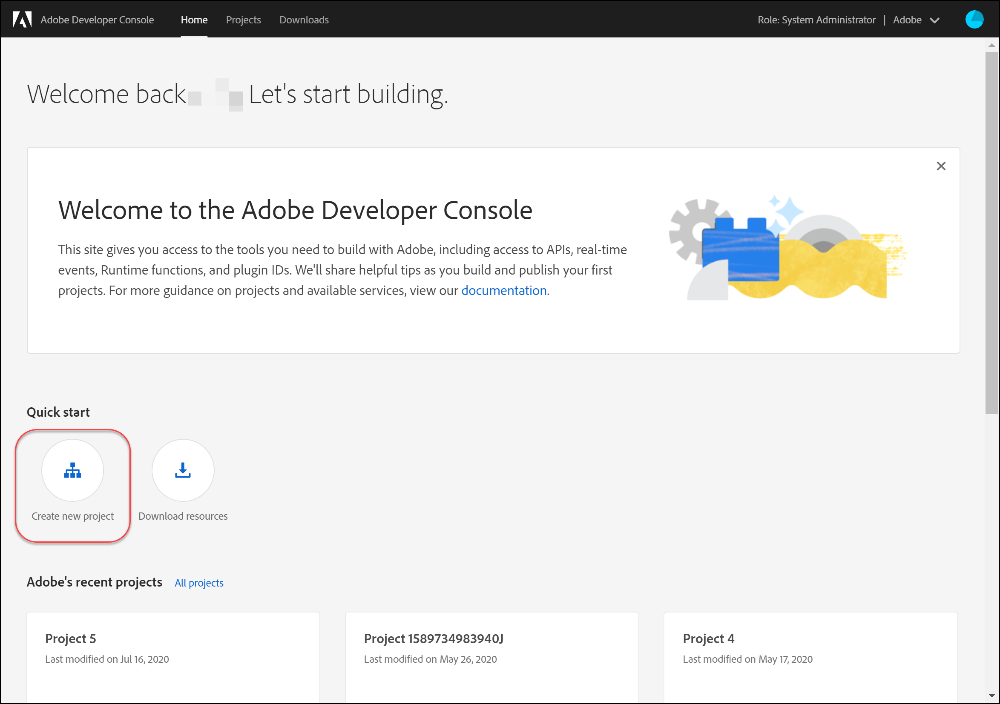

1. Cliquez sur **[!UICONTROL Add API]** pour ajouter une API REST à votre projet afin d’accéder aux services et produits [!DNL Adobe].

   

1. Sélectionnez **[!DNL Adobe Target]** comme service de [!DNL Adobe] auquel vous souhaitez intégrer. Cliquez sur le bouton **[!UICONTROL Next]** qui s’affiche.

   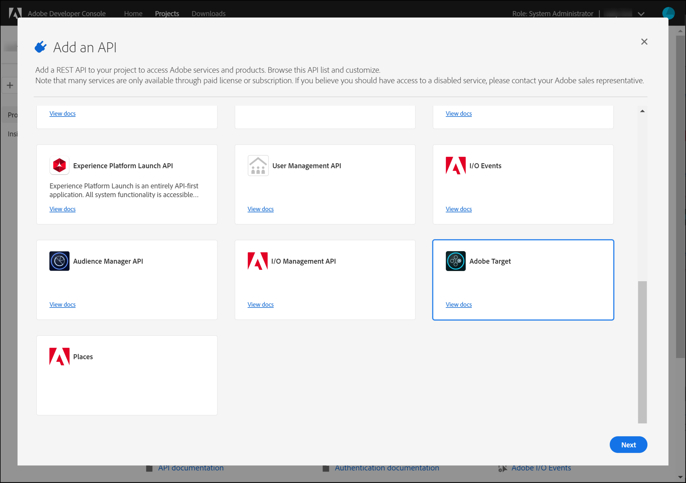

1. Sélectionnez une option pour associer des clés publiques et privées à l’intégration de compte de service que vous créez pour [!DNL Target]. Pour cet exemple, sélectionnez **[!UICONTROL Option 1: Generate a key pair]** et cliquez sur **[!UICONTROL Generate keypair]**.

   

1. Comme indiqué, notez le fichier de configuration téléchargé automatiquement (`config`), qui contient votre clé privée. Cliquez sur **[!UICONTROL Next]**.

   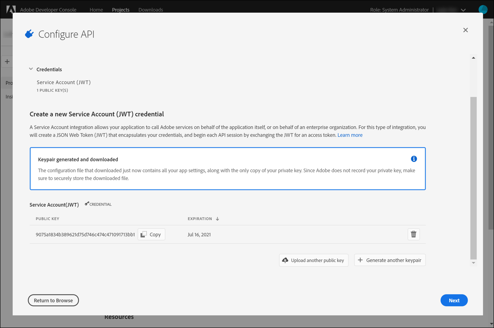

1. Dans votre système de fichiers, vérifiez l’emplacement de `config`, qui est le fichier de configuration compressé créé à l’étape précédente. Là encore, ce fichier `config` contient votre clé privée, dont vous aurez besoin ultérieurement. L’emplacement exact au sein de votre système de fichiers peut différer de celui illustré ici.

   

1. De retour dans le Adobe Developer Console, sélectionnez le ou les [profils de produit)](https://helpx.adobe.com/fr/enterprise/using/manage-products-and-profiles.html) correspondant aux propriétés dans lesquelles vous utilisez Adobe Recommendations. (Si vous n’utilisez pas de propriétés, sélectionnez l’option Workspace par défaut .) Cliquez sur **[!UICONTROL Save configured API]**.

   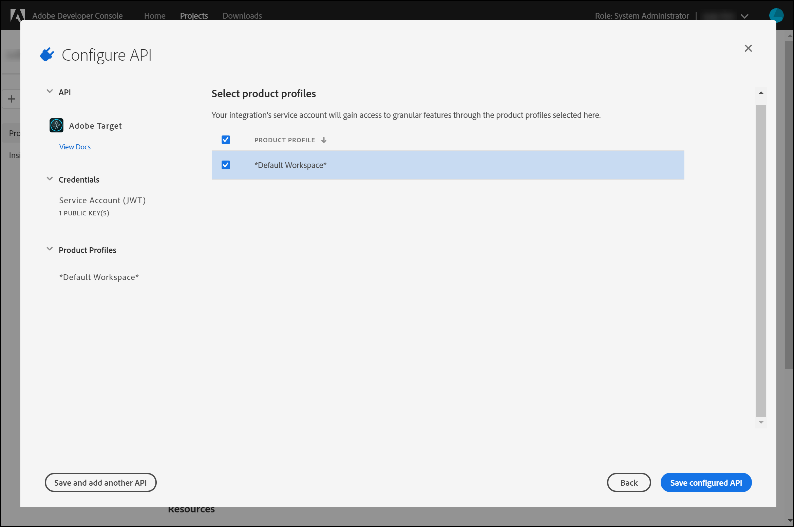

1. Cliquez sur **[!UICONTROL Create Integration]**. Vous devriez recevoir un message temporaire indiquant que votre API a bien été configurée.
1. Pour terminer, renommez votre projet avec un nom plus significatif que le `Project 1` d’origine. Pour ce faire, accédez au projet à l’aide du chemin de navigation comme illustré, cliquez sur **[!UICONTROL Edit project]** pour accéder à la boîte de dialogue modale **[!UICONTROL Edit Project]** et renommez le projet.

   

>[!NOTE]
>
>Dans cet exemple, nous nommons notre projet « Intégration [!DNL Target] ». Si vous prévoyez d’utiliser votre projet pour plus que [!DNL Adobe Target], vous pouvez le nommer en conséquence. Par exemple, vous pouvez choisir de le nommer « API Adobe » ou « API Experience Cloud », car il peut être utilisé avec d’autres solutions dans le Adobe Experience Cloud.

## Exporter les détails du projet

Maintenant que vous disposez d’un projet Adobe que vous pouvez utiliser pour accéder à [!DNL Target], vous devez veiller à envoyer les détails de ce projet avec vos requêtes d’API Adobe. Ces informations sont requises pour interagir avec plusieurs API d’Adobe, y compris plusieurs API d’[!DNL Target]. Par exemple, les détails de l’intégration incluent les informations d’autorisation et d’authentification requises par les API [!DNL Target] Admin. Par conséquent, pour utiliser les API avec Postman, vous devez obtenir ces détails dans Postman.

Il existe de nombreuses façons de spécifier les détails de votre projet dans Postman, mais dans cette section, nous tirons parti de certaines fonctionnalités et collections préconfigurées. Tout d’abord (dans cette section), vous allez exporter les détails de votre intégration dans un environnement Postman. Ensuite (dans la section suivante), vous allez générer un jeton d’accès porteur pour vous accorder l’accès aux ressources Adobe nécessaires.

>[!NOTE]
>
>Pour obtenir des instructions vidéo applicables à toute solution Experience Cloud, y compris [!DNL Target], consultez [Utilisation de Postman avec les API Experience Platform](https://experienceleague.adobe.com/docs/platform-learn/tutorials/platform-api-authentication.html). Les sections suivantes concernent les API [!DNL Target] : 1. Création et exportation de l’API Experience Platform vers Postman 2. Générez un jeton d’accès avec Postman. Ces étapes sont également fournies ci-dessous.

1. Toujours dans , accédez à pour afficher les informations d&#39;identification **[!UICONTROL Service Account (JWT)]** de votre nouveau projet. Utilisez le volet de navigation de gauche ou la section **[!UICONTROL Credentials]**, comme indiqué.

   

   Dans **[!UICONTROL Credential details]**, notez que vous pouvez afficher vos **[!UICONTROL Public key(s)]**, **[!UICONTROL Client ID]** et autres informations relatives à votre compte de service.

   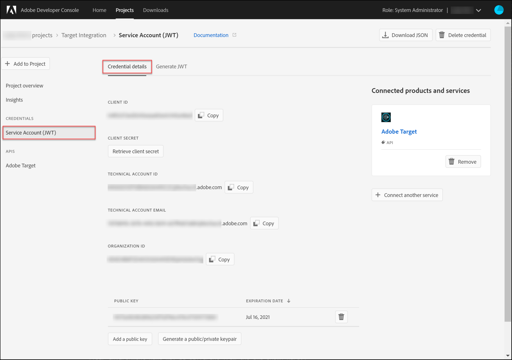

1. Cliquez pour accéder aux informations sur l’API **[!DNL Adobe Target]**. Utilisez le volet de navigation de gauche ou la section **Produits et services connectés** comme illustré.

   

1. Cliquez sur **[!UICONTROL Download for Postman]** > **[!UICONTROL Service Account (JWT)]** pour créer un fichier JSON capturant vos informations d’authentification pour un environnement Postman.

   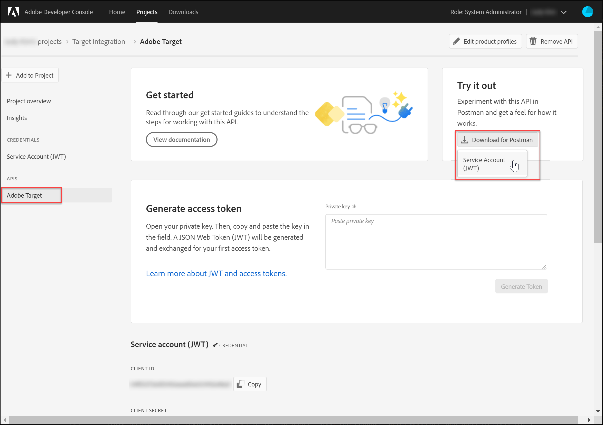

   Notez le fichier JSON dans votre système de fichiers.

   

1. Dans Postman, cliquez sur l’icône en forme d’engrenage pour gérer vos environnements, puis cliquez sur **[!UICONTROL Import]** pour importer le fichier JSON (environnement).

   

1. Choisissez votre fichier et cliquez sur **[!UICONTROL Open]**.

   

1. Dans la boîte de dialogue modale Postman **Gérer les environnements**, cliquez sur le nom de l’environnement nouvellement importé pour l’examiner. (Le nom de votre environnement peut être différent de celui affiché ici. Modifiez le nom selon vos besoins. Il n’est pas nécessaire qu’il corresponde au nom du projet [!DNL Adobe].)

   

1. Notez que les valeurs `CLIENT_SECRET` et `API_KEY` (ainsi que d’autres variables) sont pré-renseignées, à partir de votre intégration telle que définie dans le Adobe Developer Console. (La variable `CLIENT_SECRET` de Postman doit correspondre aux informations d’identification Adobe `CLIENT SECRET` affichées dans le Developer Console, et les `API_KEY` dans Postman doivent également correspondre aux `CLIENT ID` dans le Developer Console.) En revanche, les notes `PRIVATE_KEY`, `JWT_TOKEN` et `ACCESS_TOKEN` sont vides. Commençons par fournir la valeur `PRIVATE_KEY`.

   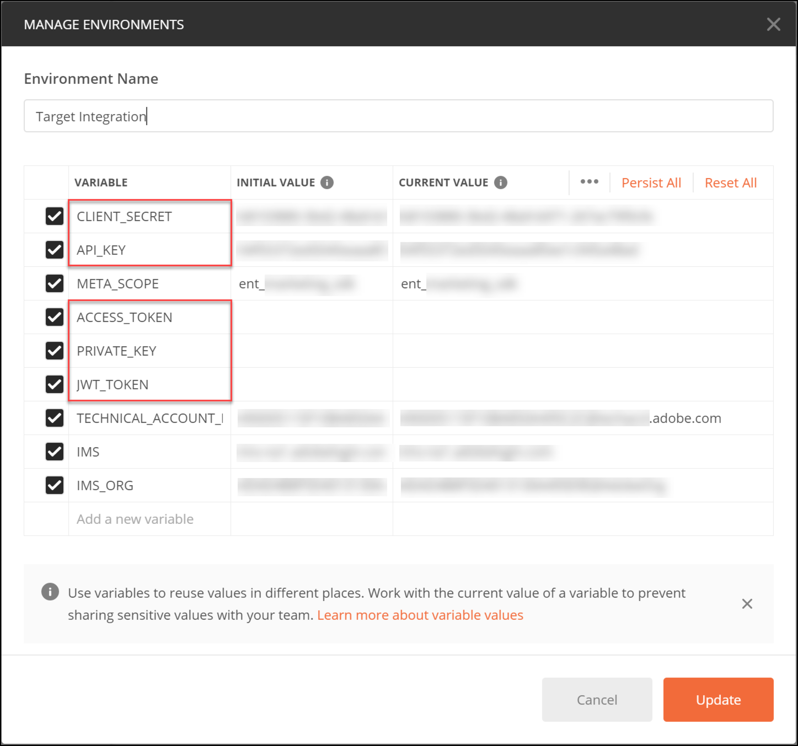

1. À partir de votre système de fichiers, ouvrez votre fichier `config`, puis ouvrez le fichier de clé `private`.

   

1. Sélectionnez et copiez l’intégralité du contenu du fichier de clé `private`.

   

1. Dans Postman, collez la valeur de votre clé privée dans les champs **[!UICONTROL INITIAL VALUE]** et **[!UICONTROL CURRENT VALUE]** .

   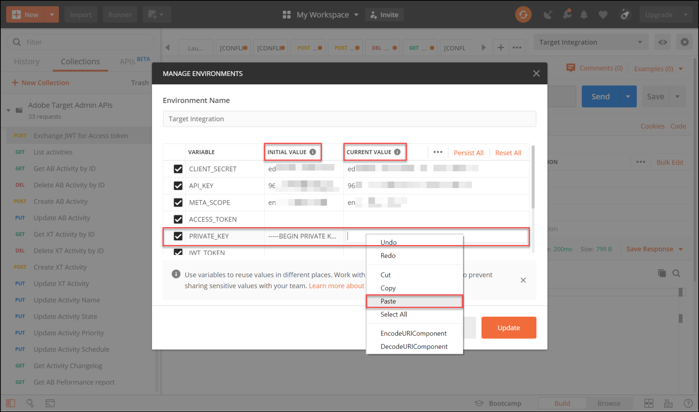

1. Cliquez sur **[!UICONTROL Update]**, puis fermez la boîte de dialogue modale Environnements .

## Générer le jeton d’accès du porteur

Dans cette section, vous générez votre jeton d’accès porteur, qui est requis pour authentifier votre interaction avec les API [!DNL Adobe Target]. Pour générer votre jeton d’accès porteur, vous devez envoyer les détails de votre intégration (établis dans les sections précédentes) au [service Adobe Identity Management (IMS)](https://www.adobe.io/authentication/auth-methods.html#!AdobeDocs/adobeio-auth/master/AuthenticationOverview/AuthenticationGuide.md). Il existe plusieurs façons de procéder, mais dans ce guide, nous tirons parti d’une collection Postman contenant un appel IMS préconfiguré qui rend le processus direct et facile. Une fois la collection importée, vous pouvez la réutiliser si nécessaire, afin de générer de nouveaux jetons non seulement pour [!DNL Adobe Target], mais également pour d’autres API Adobe.

1. Accédez aux [exemples d’appels de l’API Adobe Identity Management Service](https://github.com/adobe/experience-platform-postman-samples/tree/master/apis/ims).

   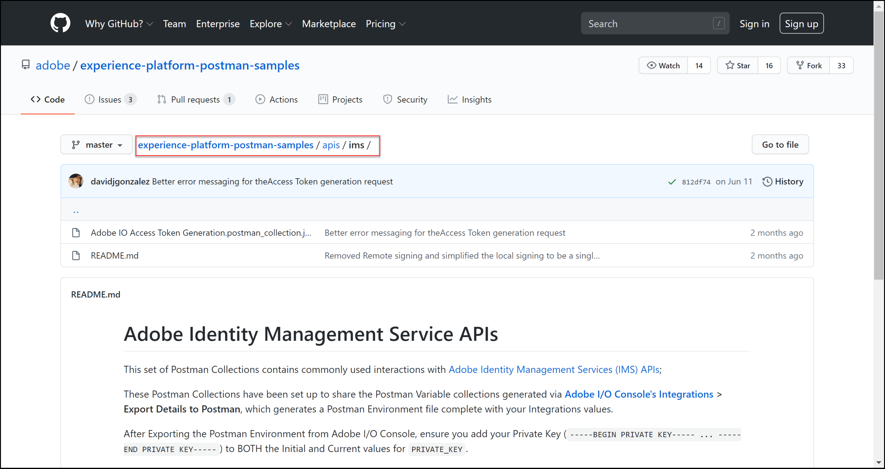

1. Cliquez sur le **[!UICONTROL Adobe I/O Access Token Generation Postman collection]** .

   

1. Obtenez le fichier JSON brut pour cette collection en cliquant sur **[!UICONTROL Raw]**, puis copiez le fichier JSON obtenu dans le presse-papiers. (Vous pouvez également enregistrer le fichier JSON brut en tant que fichier .json.)

   

1. Dans Postman, importez la collection en collant et en envoyant le fichier JSON brut à partir du presse-papiers. (Vous pouvez également télécharger le fichier .json que vous avez enregistré.) Cliquez sur **[!UICONTROL Continue]**.

   

1. Sélectionnez la requête **[!UICONTROL IMS: JWT Generate + Auth via User Token]** dans la collection Postman de génération de jeton d’accès Adobe I/O , assurez-vous que votre environnement est sélectionné, puis cliquez sur **[!UICONTROL Send]** pour générer le jeton.

   

   >[!NOTE]
   >
   >Ce jeton d’accès porteur sera valide pendant 24 heures. Envoyez à nouveau la demande chaque fois que vous devez générer un nouveau jeton.

1. Ouvrez à nouveau la boîte de dialogue modale Gérer les environnements et sélectionnez votre environnement.

   

1. Notez que les valeurs `ACCESS_TOKEN` et `JWT_TOKEN` sont maintenant renseignées.

   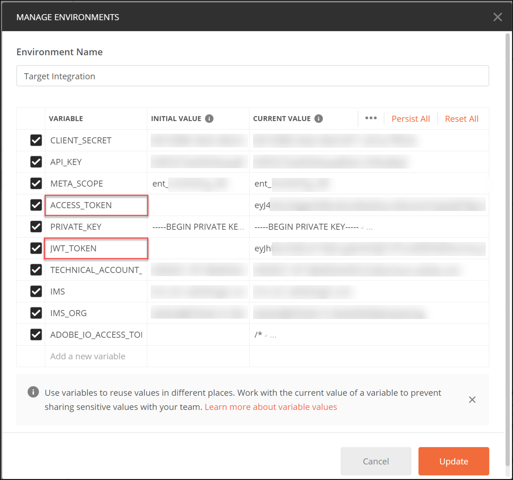

Question : Dois-je utiliser la collection Postman de génération de jeton d’accès Adobe I/O pour générer le jeton Web JSON (JWT) et le jeton d’accès du porteur ?

Réponse : Non. La collection Postman de génération de jetons d’accès Adobe I/O est disponible pour faciliter la génération du jeton JWT et du jeton d’accès porteur dans Postman. Vous pouvez également utiliser les fonctionnalités du Adobe Developer Console pour générer manuellement le jeton d’accès du porteur.

## Tester le jeton d’accès du porteur

Dans cet exercice, vous allez utiliser votre nouveau jeton d’accès porteur en envoyant une requête API qui récupère une liste d’activités de votre compte [!DNL Target]. Une réponse réussie indique que votre projet [!DNL Adobe] et votre authentification fonctionnent comme prévu pour utiliser l’API.

1. Importez la [[!DNL Adobe Target] collection Postman des API d’administration](https://developers.adobetarget.com/api/#admin-postman-collection). Suivez toutes les invites jusqu&#39;à ce que la collection soit importée dans Postman.

   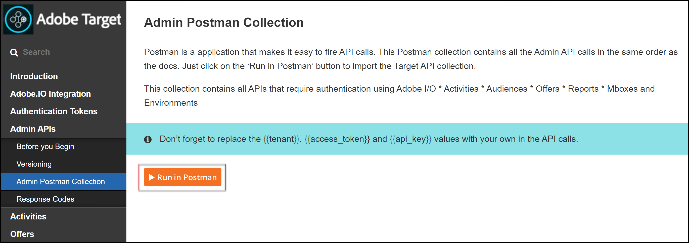

1. Développez la collection et notez la requête **[!UICONTROL List activities]**.

   

1. Notez que les variables telles que `{{access_token}}` ne sont pas résolues au départ. Vous pouvez résoudre ce problème de différentes manières (par exemple, vous pouvez définir une nouvelle variable de collection appelée `{{access_token}}`), mais dans ce guide, vous allez plutôt modifier la requête API pour tirer parti de l’environnement Postman que vous utilisiez précédemment. Cela permettra à l’environnement de continuer à servir de consolidation unique et cohérente de toutes les variables communes à toutes les API d’Adobe.

   

1. Tapez pour remplacer `{{access_token}}` par `{{ACCESS_TOKEN}}`.

   

1. Tapez pour remplacer `{{api_key}}` par `{{API_KEY}}`.

   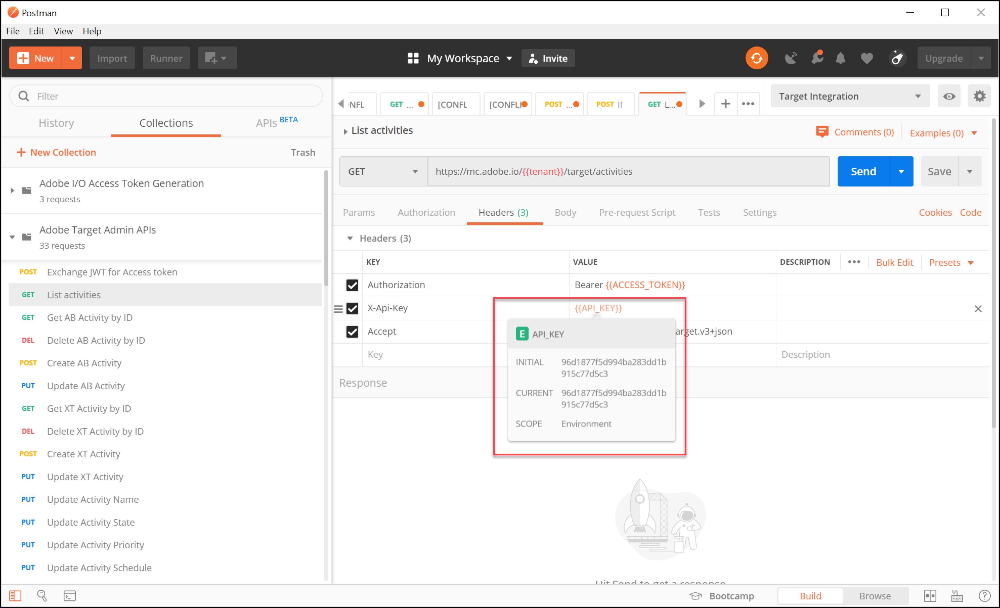

1. Tapez pour remplacer `{{tenant}}` par `{{TENANT_ID}}`. La note `{{TENANT_ID}}` n&#39;est pas encore reconnue.

   

1. Ouvrez la boîte de dialogue modale Gérer les environnements et sélectionnez votre environnement.

   

1. Saisissez pour ajouter une nouvelle variable d’environnement `{{TENANT_ID}}`. Copiez et collez votre valeur d’identifiant client dans les champs **[!UICONTROL INITIAL VALUE]** et **[!UICONTROL CURRENT VALUE]** pour votre nouvelle variable d’environnement `TENANT_ID`.

   

   >[!NOTE]
   >
   >L’ID de client est différent de votre `clientcode` [!DNL Target]. L’ID de client existe dans l’URL lorsque vous êtes connecté à [!DNL Target]. Pour obtenir votre identifiant client, connectez-vous au Adobe Experience Cloud, ouvrez le [!DNL Target], puis cliquez sur la carte Target . Utilisez la valeur de l’ID de client comme indiqué dans le sous-domaine de l’URL. Par exemple, si l’URL de votre connexion à [!DNL Adobe Target] est `<https://mycompany.experiencecloud.adobe.com/...>`, votre ID client est « mycompany ».

1. Envoyez votre demande, après vous être assuré d’avoir sélectionné l’environnement approprié. Vous devriez recevoir une réponse contenant votre liste d’activités.

   

Maintenant que vous avez vérifié votre authentification Adobe, vous pouvez l’utiliser pour interagir avec les API [!DNL Adobe Target] (ainsi qu’avec d’autres API Adobe). Par exemple, vous pouvez [Utiliser les API Recommendations](recs-api/overview.md) pour créer ou gérer des recommandations, ou vous pouvez l’utiliser avec l’[API de diffusion Target](/help/dev/implement/delivery-api/overview.md).
