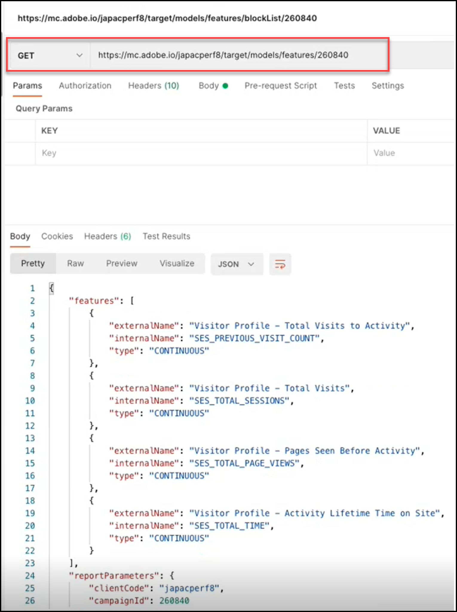
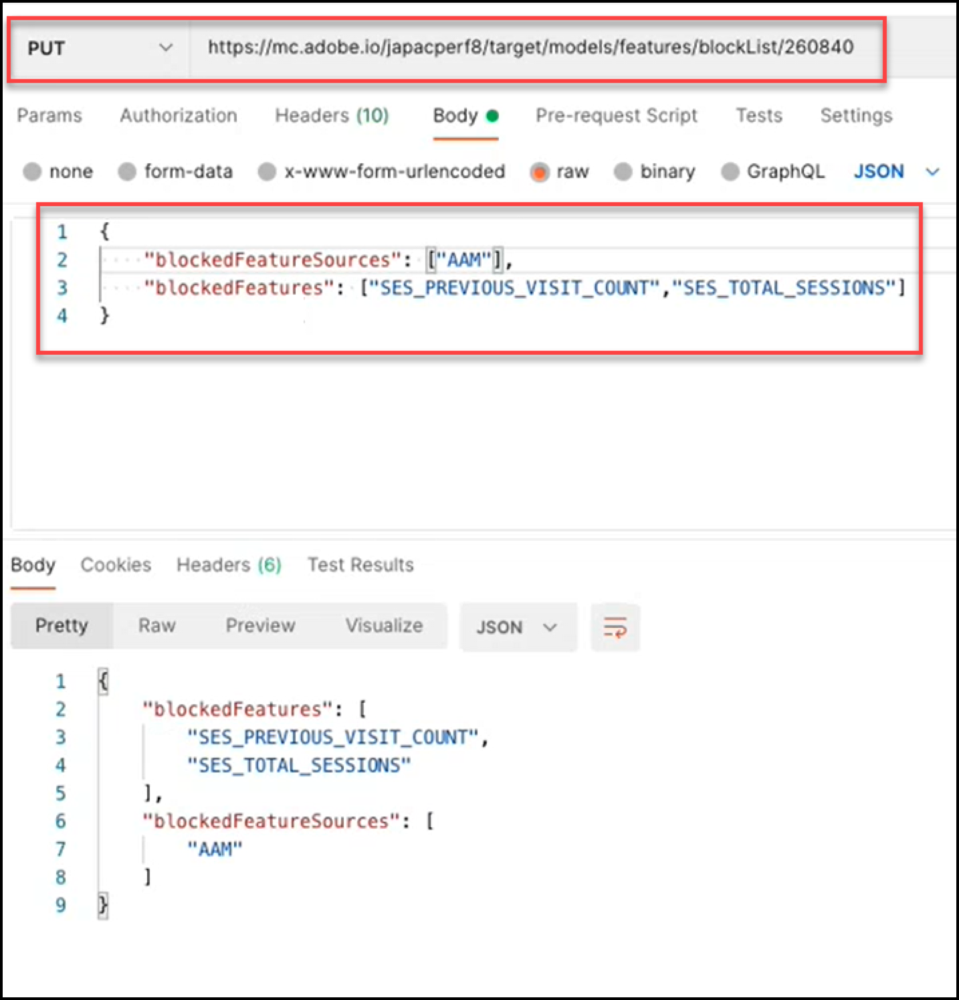
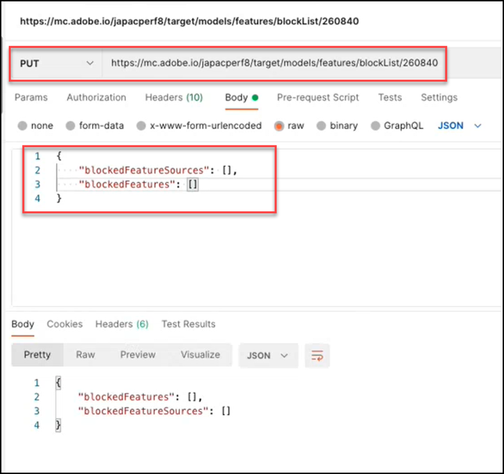
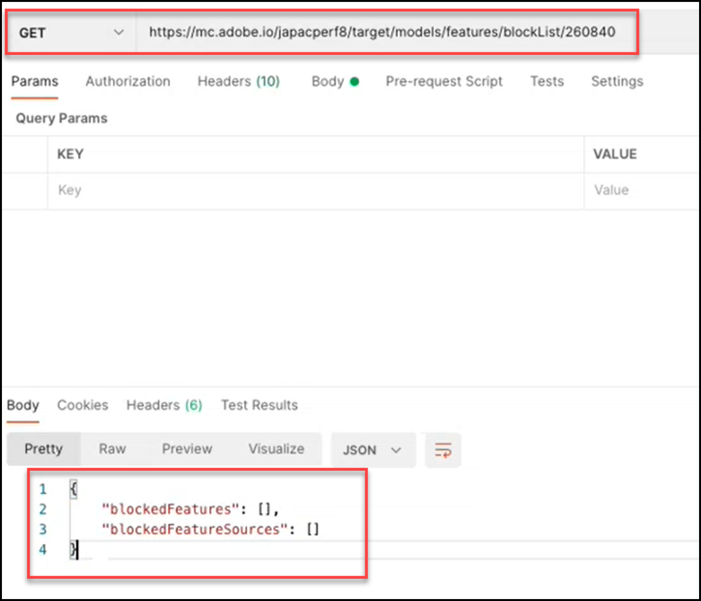
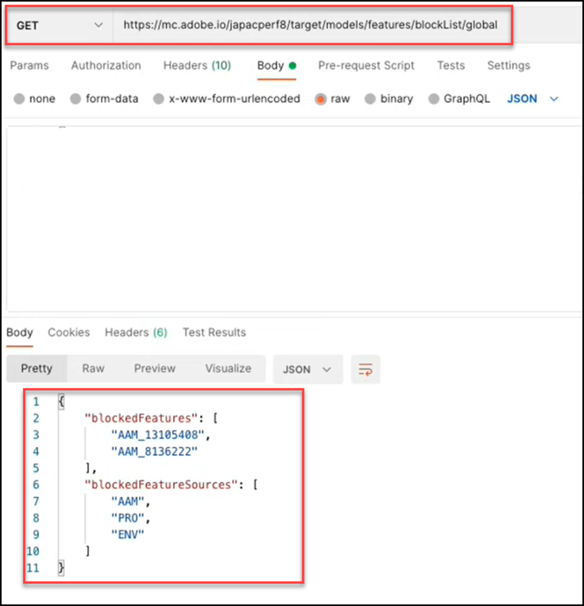

# Présentation de l’API Modèles

L’API Modèles, également appelée API de Place sur la liste bloquée, permet aux utilisateurs d’afficher et de gérer la liste des fonctionnalités utilisées dans les modèles de machine learning pour les activités [!UICONTROL Automated Personalization] (AP) et [!DNL Auto-Target] (AT). Si un utilisateur souhaite exclure une fonctionnalité de l’utilisation des modèles pour les activités AP ou AT, il peut utiliser l’API Modèles pour ajouter cette fonctionnalité au « place sur la liste bloquée ».

Un **[!UICONTROL blocklist]** définit l’ensemble des fonctionnalités qui seront exclues par [!DNL Adobe Target] de ses modèles de machine learning. Pour plus d’informations sur les fonctionnalités de , consultez [Données utilisées par les algorithmes  [!DNL Target]  machine learning](https://experienceleague.adobe.com/docs/target/using/activities/automated-personalization/ap-data.html).

Les Places sur la liste bloquée peuvent être définies par activité (niveau d’activité) ou pour toutes les activités d’un compte [!DNL Target] (niveau global).

<!-- To get started with the Models API in order to create and manage your blocklist, download the Postman Collection [here](https://git.corp.adobe.com/target/ml-configuration-management-service/tree/nextRelease/rest_api_library). Note this is an Adobe internal link. Need to publish this publicly if want to share with customers. -->

## Spécification de l’API Modèles

Affichez la spécification de l’API Modèles [ici](../administer/models-api/models-api-overview.md).

## Conditions préalables

Pour utiliser l’API Modèles, vous devez configurer l’authentification à l’aide de [](https://developer.adobe.com/console/home) comme vous le feriez avec l’API [Target Admin](../administer/admin-api/admin-api-overview-new.md). Pour plus d’informations, voir [Configuration de l’authentification](../before-administer/configure-authentication.md).

## Instructions d’utilisation de l’API Modèles

Comment gérer les places sur la liste bloquée

[**Étape 1 :**](#step1) afficher la liste des fonctionnalités d’une activité

[**Étape 2 :**](#step2) vérifier la place sur la liste bloquée de l’activité

[**Étape 3 :**](#step3) ajout de fonctionnalités à la place sur la liste bloquée de l’activité

[**Étape 4 :**](#step4) (Facultatif) Débloquer

[**Étape 5 :**](#step5) (facultatif) Gérer la liste bloquée globale


## Étape 1 : afficher la liste des fonctionnalités d’une activité {#step1}

Avant de placer sur la liste bloquée une fonctionnalité, consultez la liste des fonctionnalités actuellement incluses dans les modèles pour cette activité.

>[!BEGINTABS]

>[!TAB Demande]

```json {line-numbers="true"}
GET https://mc.adobe.io/<tenant>/target/models/features/<campaignId>
```

>[!TAB Réponse]

```json {line-numbers="true"}
{
    "features": [
        {
            "externalName": "Visitor Profile - Total Visits to Activity",
            "internalName": "SES_PREVIOUS_VISIT_COUNT",
            "type": "CONTINUOUS"
        },
        {
            "externalName": "Visitor Profile - Total Visits",
            "internalName": "SES_TOTAL_SESSIONS",
            "type": "CONTINUOUS"
        },
        {
            "externalName": "Visitor Profile - Pages Seen Before Activity",
            "internalName": "SES_PREVIOUS_VISIT_COUNT",
            "type": "CONTINUOUS"
        },
        {
            "externalName": "Visitor Profile - Activity Lifetime Time on Site",
            "internalName": "SES_TOTAL_TIME",
            "type": "CONTINUOUS"
        }
    ],
    "reportParameters": {
        "clientCode": <tenant>,
        "campaignId": <campaignId>
    }
}
```

>[!ENDTABS]

<!-- JUDY: Update codeblock above once you have the complete Response. -->

Dans l’exemple illustré ici, l’utilisateur vérifie la liste des fonctionnalités utilisées dans le modèle de l’activité dont l’ID d’activité est 260840.



>[!NOTE]
>
>Pour trouver l’identifiant d’activité de votre activité, accédez à la liste des activités dans l’interface utilisateur de [!DNL Target]. Cliquez sur l’activité qui vous intéresse. L’ID d’activité s’affiche dans le corps de la page d’aperçu des activités qui en résulte, ainsi qu’à la fin de l’URL de cette page.

Le **[!UICONTROL externalName]** est un nom convivial pour une fonctionnalité. Elle est créée par [!DNL Target], et il est possible que cette valeur change au fil du temps. Les utilisateurs peuvent afficher ces noms conviviaux dans le rapport Personalization Insights [](https://experienceleague.adobe.com/docs/target/using/reports/insights/personalization-insights-reports.html).

L’**[!UICONTROL internalName]** est l’identifiant réel de la fonction. Il est également créé par [!DNL Target], mais il ne peut pas être modifié. Il s’agit de la valeur que vous devez référencer pour identifier la ou les fonctionnalités que vous souhaitez placer sur la liste bloquée.

Notez que pour que la liste des fonctionnalités soit renseignée avec des valeurs (c’est-à-dire pour qu’elle soit non nulle), une activité :

1. Doit avoir le statut = Actif ou doit avoir été activé précédemment
1. Doit avoir fonctionné suffisamment longtemps pour qu’il y ait une activité de campagne, de sorte que le modèle ait eu des données contre lesquelles exécuter.

## Étape 2 : vérifier la place sur la liste bloquée de l&#39;activité {#step2}

Ensuite, affichez la place sur la liste bloquée. En d’autres termes, vérifiez quelles fonctionnalités, le cas échéant, sont actuellement bloquées pour l’inclusion dans les modèles de cette activité.

>[!ERROR]
>
>Notez que la `/blockList/` est sensible à la casse dans la requête.

>[!BEGINTABS]

>[!TAB Demande]

```json {line-numbers="true"}
GET https://mc.adobe.io/<tenant>/target/models/features/blockList/<campaignId>
```

>[!TAB Réponse]

```json {line-numbers="true"}

```

>[!ENDTABS]

Dans l’exemple illustré ici, l’utilisateur vérifie la liste des fonctionnalités bloquées pour l’activité dont l’ID d’activité est 260840. Les résultats sont vides, ce qui signifie que cette activité ne comporte actuellement aucune fonctionnalité placée sur la liste bloquée.


>[!NOTE]
>
>Il se peut que des résultats vides comme celui-ci s’affichent la première fois que vous vérifiez la place sur la liste bloquée complète, avant d’y ajouter des fonctionnalités. Cependant, une fois que vous avez ajouté (et ensuite supprimé) des fonctionnalités d’un tableau de fonctionnalités, vous pouvez voir des résultats légèrement différents, dans lesquels un tableau de fonctionnalités vide et placé sur la liste bloquée est renvoyé. Poursuivez la lecture pour voir un exemple à ce sujet à [étape 4](#step4).

## Étape 3 : ajout de fonctionnalités à la place sur la liste bloquée de l&#39;activité {#step3}

Pour ajouter des fonctionnalités à la place sur la liste bloquée, remplacez la requête de GET par PUT, puis modifiez le corps de la requête pour spécifier la `blockedFeatureSources` ou le `blockedFeatures` selon vos besoins.

* Le corps de la requête nécessite `blockedFeatures` ou `blockedFeatureSources`. Les deux peuvent être inclus.
* Renseignez les `blockedFeatures` avec des valeurs identifiées à partir de `internalName`. Voir [Étape 1](#step1).
* Renseignez les `blockedFeatureSources` avec les valeurs du tableau ci-dessous.

Notez que `blockedFeatureSources` indique l’origine d’une fonctionnalité. Pour les besoins de la liste bloquée, ils servent de groupes ou de catégories de fonctionnalités, ce qui permet aux utilisateurs et utilisatrices de bloquer des ensembles entiers de fonctionnalités à la fois. Les valeurs de `blockedFeatureSources` correspondent aux premiers caractères de l’identifiant d’une fonctionnalité (valeurs `blockedFeatures` ou `internalName`) ; elles peuvent donc également être considérées comme des « préfixes de fonctionnalité ».

### Tableau des valeurs `blockedFeatureSources` {#table}

| Préfixe | Description |
| --- | --- |
| BOX | Paramètre de mbox |
| URL | Personnalisé - Paramètre d’URL |
| ENV | Environnement |
| SES | Profil du visiteur |
| GÉO | Géolocalisation |
| PRO | Personnalisé - Profil |
| SEG | Personnalisé - Segment de création de rapports |
| AAM | Personnalisé - Segment Experience Cloud |
| FOULE | Mobile |
| CRS | Personnalisé - Attributs du client |
| UPA | Personnalisé - Attribut de profil RT-CDP |
| IAC | Zones d’intérêt du visiteur |

>[!BEGINTABS]

>[!TAB Demande]

```json {line-numbers="true"}
PUT https://mc.adobe.io/<tenant>/target/models/features/blockList/<campaignId>

{
    "blockedFeatureSources": ["AAM"],
    "blockedFeatures": ["SES_PREVIOUS_VISIT_COUNT", "SES_TOTAL_SESSIONS"]
}
```

>[!TAB Réponse]

```json {line-numbers="true"}
{
    "blockedFeatures": [
            "SES_PREVIOUS_VISIT_COUNT",
            "SES_TOTAL_SESSIONS"
        ],
    "blockedFeatureSources": [
            "AAM"
        ]
}
```

>[!ENDTABS]

Dans l’exemple illustré ici, l’utilisateur bloque deux fonctionnalités, `SES_PREVIOUS_VISIT_COUNT` et `SES_TOTAL_SESSIONS`, qu’il a précédemment identifiées en interrogeant la liste complète des fonctionnalités de l’activité dont l’ID d’activité est 260480, comme décrit à l’[Étape 1](#step1). Ils bloquent également toutes les fonctionnalités provenant des segments Experience Cloud, ce qui est réalisé en bloquant les fonctionnalités avec le préfixe « AAM », comme décrit dans le [tableau](#table) ci-dessus.



Notez qu’après avoir placé sur la liste bloquée une fonctionnalité, il est recommandé de vérifier la place sur la liste bloquée mise à jour en effectuant à nouveau [Étape 2](#step2) (GET la liste bloquée). Vérifiez que les résultats s’affichent comme prévu (vérifiez que les résultats incluent les fonctionnalités ajoutées à partir de la dernière demande PUT).

## Étape 4 : (Facultatif) Débloquer {#step4}

Pour débloquer toutes les fonctionnalités placées sur la liste bloquée, effacez les valeurs de `blockedFeatureSources` ou `blockedFeatures`.

>[!BEGINTABS]

>[!TAB Demande]

```json {line-numbers="true"}
PUT https://mc.adobe.io/<tenant>/target/models/features/blockList/<campaignId>

{
    "blockedFeatureSources": [],
    "blockedFeatures": []
}
```

>[!TAB Réponse]

```json {line-numbers="true"}
{
    "blockedFeatures": [],
    "blockedFeatureSources": []
}
```

>[!ENDTABS]

Dans l’exemple illustré ici, l’utilisateur efface son pour l’activité dont l’ID d’activité est 260840. Notez que la réponse confirme l’existence de tableaux vides pour les fonctionnalités bloquées et leurs sources (`blockedFeatureSources` et `blockedFeatures`, respectivement).



Comme toujours, après avoir modifié la place sur la liste bloquée, il est recommandé d’effectuer à nouveau l’[étape 2](#step2) (GET la liste bloquée pour vérifier que la liste inclut les fonctionnalités comme prévu). Dans l’exemple illustré ici, l’utilisateur vérifie que sa liste bloquée est maintenant vide.



Question : Comment supprimer une partie, mais pas la totalité, d’une ?

Réponse : pour supprimer un sous-ensemble distinct de fonctionnalités placées sur la liste bloquée d’une liste bloquée à fonctionnalités multiples, les utilisateurs et utilisatrices peuvent simplement envoyer la liste mise à jour des fonctionnalités qu’ils ou elles souhaitent bloquer dans [la demande de suppression de la liste bloquée ](#step3), plutôt que d’effacer l’intégralité de la grille et de rajouter les fonctionnalités souhaitées. En d’autres termes, envoyez la liste des fonctionnalités mise à jour (comme indiqué à l’[étape 3](#step3)) en veillant à exclure les fonctionnalités que vous souhaitez « supprimer » de la place sur la liste bloquée.

## Étape 5 : (facultatif) gérer la liste bloquée globale {#step5}

Les exemples ci-dessus s’inscrivaient tous dans le cadre d’une seule activité. Vous pouvez également bloquer les fonctionnalités de toutes les activités sur un client donné (client), au lieu d’avoir à spécifier la liste bloquée de chaque activité individuellement. Pour effectuer une place sur la liste bloquée globale, utilisez l’appel `/blockList/global` au lieu de `blockList/<campaignId>`.

>[!BEGINTABS]

>[!TAB Demande]

```json {line-numbers="true"}
PUT https://mc.adobe.io/<tenant>/target/models/features/blockList/global

{
    "blockedFeatureSources": ["AAM", "PRO", "ENV"],
    "blockedFeatures": ["AAM_FEATURE_1", "AAM_FEATURE_2"]
}
```

>[!TAB Réponse]

```json {line-numbers="true"}
{
    "blockedFeatures": [
        "AAM_FEATURE_1",
        "AAM_FEATURE_2"
    ],
    "blockedFeatureSources": [
        "AAM",
        "PRO",
        "ENV"
    ]
}
```

>[!ENDTABS]

Dans l’exemple de requête illustré ci-dessus, l’utilisateur bloque deux fonctionnalités, « AAM_FEATURE_1 » et « AAM_FEATURE_2 », pour toutes les activités de son compte [!DNL Target]. Cela signifie que, quelle que soit l’activité, « AAM_FEATURE_1 » et « AAM_FEATURE_2 » ne seront pas inclus dans les modèles de machine learning pour ce compte. En outre, l’utilisateur bloque également globalement toutes les fonctionnalités dont le préfixe est « AAM », « PRO » ou « ENV ».

Question : L’exemple de code ci-dessus n’est-il pas redondant ?

Réponse : Oui. Il est redondant de bloquer les fonctionnalités dont les valeurs commencent par « AAM », tout en bloquant également toutes les fonctionnalités dont la source est « AAM ». Par conséquent, toutes les fonctionnalités provenant d’AAM (segments Experience Cloud) seront bloquées. Par conséquent, si l’objectif est de bloquer toutes les fonctionnalités des segments Experience Cloud, il n’est pas nécessaire de spécifier individuellement certaines fonctionnalités commençant par « AAM », dans l’exemple ci-dessus.

Étape finale : que ce soit au niveau de l’activité ou au niveau global, il est recommandé de vérifier votre place sur la liste bloquée après l’avoir modifiée, pour vous assurer qu’elle contient les valeurs attendues. Pour ce faire, modifiez la `PUT` en `GET`.

L’exemple de réponse illustré ci-dessous indique [!DNL Target] bloque deux fonctionnalités individuelles, ainsi que toutes les fonctionnalités provenant de « AAM », « PRO » et « ENV ».


