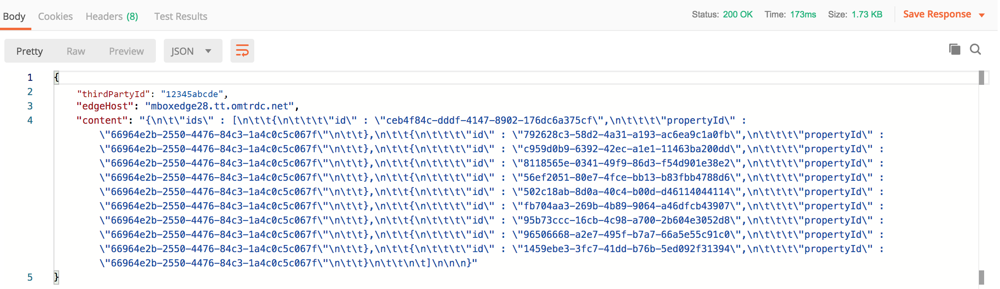

# Récupération de Recommendations avec l’API de diffusion

Les API Adobe Target et Adobe Target Recommendations peuvent être utilisées pour envoyer des réponses aux pages web, mais également dans des expériences non basées sur des HTMLS, notamment des applications, des écrans, des consoles, des courriers électroniques, des kiosques et d’autres périphériques d’affichage. En d’autres termes, lorsque les bibliothèques Target et JavaScript ne peuvent pas être utilisés, la variable [API de diffusion Target](/help/dev/implement/delivery-api/overview.md) permet toujours d’accéder à l’ensemble des fonctionnalités de Target, afin de proposer des expériences personnalisées.

>[!NOTE]
>
>Lorsque vous demandez du contenu contenant des recommandations réelles (produits ou éléments recommandés), utilisez l’API de diffusion Target.

Pour récupérer les recommandations, envoyez un appel du POST de l’API de diffusion Adobe Target avec les informations contextuelles appropriées, qui peuvent inclure un ID utilisateur (à utiliser avec des recommandations spécifiques au profil telles que les éléments récemment consultés par l’utilisateur), le nom de mbox approprié, les paramètres de mbox, les paramètres de profil ou d’autres attributs. La réponse comprend les entity.ids recommandés (et peut inclure d’autres données d’entité) au format JSON ou HTML, qui peuvent ensuite être affichés sur l’appareil.

La variable [API de diffusion](/help/dev/implement/delivery-api/overview.md) pour Adobe Target, expose toutes les fonctionnalités existantes fournies par une requête Target standard.

L’API de diffusion :

* Permet de récupérer des expériences ou des offres pour un emplacement et une audience d’une manière RESTful.
* Ne nécessite aucune authentification.
* Publications uniquement.
* Ne traite pas les cookies ni les appels de redirection.
* Ne nécessite ni ne reconnaît les &quot;rôles utilisateur&quot;. Il récupère simplement du contenu ou des événements de rapports sur les serveurs Target Edge.

Pour utiliser l’API de diffusion afin de diffuser des expériences Target, y compris des recommandations, procédez comme suit :

1. Créez une activité Target (A/B, XT, AP ou Recommendations) à l’aide du compositeur d’après les formulaires (et non du compositeur d’expérience visuelle).
1. Utilisez l’API de diffusion pour obtenir une réponse aux requêtes générées par l’activité Target que vous venez de créer.

&lt;!— Q : Pourquoi les DEUX étapes sont-elles nécessaires pour cela ? Si une recommandation basée sur un formulaire est définie pour une mbox, quel est l’intérêt d’avoir ÉGALEMENT l’étape API de diffusion dans pour récupérer les résultats ? Pourquoi ne pouvez-vous pas simplement faire livrer les résultats par le Rec basé sur les formulaires sur l’appareil de destination...?? R : Voir le cas d’utilisation ci-dessous... c’est quand vous voulez &quot;intercepter&quot; les résultats en attente afin de faire plus avant d’afficher les résultats. Des éléments comme les comparaisons en temps réel aux niveaux d’inventaire. --->

## Création d’une recommandation à l’aide du compositeur d’expérience d’après les formulaires

Pour créer des recommandations qui peuvent être utilisées avec l’API de diffusion, utilisez la méthode [Compositeur d’après les formulaires](https://experienceleague.adobe.com/docs/target/using/experiences/form-experience-composer.html).

1. Tout d’abord, créez et enregistrez une conception basée sur JSON à utiliser dans votre recommandation. Pour obtenir un exemple de code JSON, ainsi que des informations d’arrière-plan sur la manière dont les réponses JSON peuvent être renvoyées lors de la configuration d’une activité basée sur un formulaire, consultez la documentation sur [Création de conceptions de recommandations](https://experienceleague.adobe.com/docs/target/using/recommendations/recommendations-design/create-design.html). Dans cet exemple, la conception est nommée *JSON simple.*
   

1. Dans Target, accédez à **[!UICONTROL Activités]** > **[!UICONTROL Créer une activité]** > **[!UICONTROL Recommendations]**, puis sélectionnez **[!UICONTROL Formulaire]**.

   

1. Sélectionnez une propriété, puis cliquez sur **[!UICONTROL Suivant]**.
1. Définissez l’emplacement où vous souhaitez que les utilisateurs reçoivent la réponse de la recommandation. L’exemple ci-dessous utilise un emplacement nommé *api_charter*. Sélectionnez votre conception basée sur JSON, créée précédemment, nommée *JSON simple.*
   
1. Enregistrez et activez la recommandation. Cela produira des résultats. [Une fois les résultats prêts](https://experienceleague.adobe.com/docs/target/using/recommendations/recommendations-activity/previewing-and-launching-your-recommendations-activity.html), vous pouvez utiliser l’ API de diffusion pour les récupérer.

## Utilisation de l’API de diffusion

La syntaxe de la variable [API de diffusion](/help/dev/implement/delivery-api/overview.md) est :

`POST https://{{CLIENT_CODE}}.tt.omtrdc.net/rest/v1/delivery`

1. Notez que le code client est requis. Pour rappel, votre code client peut être trouvé dans Adobe Target en accédant à **[!UICONTROL Recommendations]** > **[!UICONTROL Paramètres]**. Notez que **Code client** dans la variable **Jeton d’API de recommandation** .
   
1. Une fois que vous disposez de votre code client, créez votre appel API de diffusion. L’exemple ci-dessous commence par le **[!UICONTROL Appel de l’API de diffusion des mbox mises en cache web]** fourni dans la variable [Collection Postman des API de diffusion](../../implement/delivery-api/overview.md/#section/Getting-Started/Postman-Collection), en effectuant des modifications pertinentes. Par exemple :
   * la valeur **browser** et **address** ont été supprimés des objets **Corps**, puisqu’elles ne sont pas requises pour les cas d’utilisation non HTMLS
   * *api_charter* est répertorié comme nom de l’emplacement dans cet exemple.
   * entity.id est spécifié, car cette recommandation est basée sur la similarité de contenu, qui nécessite qu’une clé d’élément actif soit transmise à Target.
     
Pensez à configurer correctement vos paramètres de requête. Par exemple, veillez à spécifier `{{CLIENT_CODE}}` le cas échéant. &lt;!— Q : Dans la syntaxe d’appel mise à jour, entity.id est répertorié en tant que profileParameter au lieu d’un mboxParameter comme dans les anciennes versions. ---> &lt;!— Q : Ancienne image  Ancien texte d’accompagnement : &quot;Notez que cette recommandation est basée sur du contenu . Des produits similaires sont basés sur le paramètre entity.id envoyé via mboxParameters.&quot; —>
     
1. Envoyez la requête. Cette opération s’exécute sur la propriété *api_charter* emplacement, sur lequel une recommandation principale est exécutée, défini avec votre conception JSON, qui génère une liste d’entités recommandées.
1. Recevez une réponse basée sur la conception JSON.
   
La réponse comprend l’identifiant de clé, ainsi que les identifiants d’entité des entités recommandées.

L’utilisation de l’API de diffusion avec Recommendations vous permet ainsi d’effectuer des étapes supplémentaires avant d’afficher des recommandations au visiteur sur un périphérique autre que HTML. Par exemple, vous pouvez utiliser la réponse de l’API de diffusion pour effectuer une recherche supplémentaire en temps réel des détails d’attribut d’entité (inventaire, prix, évaluation, etc.) à partir d’un autre système (tel qu’une plateforme CMS, PIM ou eCommerce), avant d’afficher les résultats finaux.

En utilisant l’approche décrite dans ce guide, vous pouvez demander à n’importe quelle application d’exploiter la réponse de Target pour fournir des recommandations personnalisées.

## Exemple de mises en œuvre

Les ressources suivantes fournissent des exemples de différentes mises en oeuvre non axées sur les HTMLS. Gardez à l’esprit que chaque mise en oeuvre sera unique en raison du système et des périphériques impliqués.

| Ressource | Détails |
| --- | --- |
| [Adobe Target partout : implémentation côté serveur ou dans IoT](https://expleague.azureedge.net/labs/L733/index.html) | Adobe Summit 2019 Lab qui offre une expérience pratique pour une application React qui tire parti des API côté serveur Adobe Target. |
| [Adobe Target dans une application mobile sans SDK Adobe](https://community.tealiumiq.com/t5/Universal-Data-Hub/Adobe-Target-in-a-Mobile-App-Without-the-Adobe-SDK/ta-p/26753) | Ce guide explique comment configurer Adobe Target dans votre application mobile sans installer le SDK Adobe. Cette solution utilise l’affichage web du SDK Tealium et le module Commandes distantes pour envoyer et recevoir des requêtes à l’API visiteur Adobe (Experience Cloud) et à l’API Adobe Target. |
| [Fonctionnement d’Adobe Target dans les applications mobiles](../../implement/mobile/how-target-works-mobile-apps.md) | Fonctionnement de Target avec le SDK Mobile |
| [Configuration de l’extension Target dans les API Experience Platform Launch et implémentation des API Target](https://developer.adobe.com/client-sdks/documentation/adobe-target/) | Procédure de configuration de l’extension Target dans Experience Platform Launch, d’ajout de l’extension Target à votre application et d’implémentation des API Target pour demander des activités, prérécupérer des offres et passer en mode d’aperçu visuel. |
| [Client de noeud Adobe Target](https://www.npmjs.com/package/@adobe/target-nodejs-sdk) | SDK Target Node.js Open Source v1.0 |
| [Présentation côté serveur](../../implement/server-side/server-side-overview.md) | Informations sur les API de diffusion côté serveur Adobe Target, les API de diffusion par lots côté serveur, le SDK Node.js et les API Recommendations Adobe Target. |
| [Recommendations de contenu Adobe Campaign dans Email](https://medium.com/adobetech/adobe-campaign-content-recommendations-in-email-b51ced771d7f) | Blog qui décrit comment exploiter les recommandations de contenu dans les emails via Adobe Target et Adobe I/O Runtime dans Adobe Campaign. |

## Gestion de la configuration de Recommendations avec les API

La plupart du temps, les recommandations sont configurées dans l’interface utilisateur d’Adobe Target, puis utilisées ou accessibles via les API de Target, pour des raisons telles que celles mentionnées dans les sections ci-dessus. Cette coordination entre l’interface utilisateur et l’API est courante. Cependant, il arrive parfois que les utilisateurs souhaitent effectuer toutes les actions via les API (configuration, ainsi que l’utilisation des résultats). Bien que beaucoup moins courant, les utilisateurs peuvent absolument configurer, exécuter, *et* tirer parti des résultats des recommandations entièrement à l’aide des API.

Nous avons appris dans une [section précédente](manage-catalog.md) comment gérer les entités Recommendations Adobe Target et les diffuser côté serveur. De même, la variable [Console Adobe Developer](https://developer.adobe.com/console/home) vous permet de gérer les critères, les promotions, les collections et les modèles de conception sans avoir à vous connecter à Adobe Target. Une liste complète de toutes les API Recommendations se trouve [here](http://developers.adobetarget.com/api/recommendations/), mais voici un résumé à titre de référence.

| Ressource | Détails |
| --- | --- |
| [Collections](http://developers.adobetarget.com/api/recommendations/#tag/Collections) | Répertorier, créer, obtenir, modifier et supprimer des collections |
| [Critères](http://developers.adobetarget.com/api/recommendations/#tag/Criteria) | Listez et obtenez des critères. |
| [Conceptions](http://developers.adobetarget.com/api/recommendations/#tag/Designs) | Répertorier, créer, obtenir, modifier, supprimer et valider des conceptions. |
| [Entités](http://developers.adobetarget.com/api/recommendations/#tag/Entities) | Enregistrez, supprimez et obtenez des entités. |
| [Promotions](http://developers.adobetarget.com/api/recommendations/#tag/Promotions) | Répertorier, créer, obtenir, modifier et supprimer des promotions. |
| [Critères de catégorie](http://developers.adobetarget.com/api/recommendations/#tag/Category-Criteria) | Répertorier, créer, obtenir, modifier et supprimer des critères de catégorie. |
| [Critères personnalisés](http://developers.adobetarget.com/api/recommendations/#tag/Custom-Criteria) | Répertorier, créer, obtenir, modifier et supprimer des critères personnalisés. |
| [Critères d’élément](http://developers.adobetarget.com/api/recommendations/#tag/Item-Criteria) | Répertorier, créer, obtenir, modifier et supprimer des critères d’élément. |
| [Critères de popularité](http://developers.adobetarget.com/api/recommendations/#tag/Popularity-Criteria) | Répertorier, créer, obtenir, modifier et supprimer des critères de popularité. |
| [Critères d’attribut de profil](http://developers.adobetarget.com/api/recommendations/#tag/Profile-Attribute-Criteria) | Répertorier, créer, obtenir, modifier et supprimer des critères d’attribut de profil. |
| [Critères récents](http://developers.adobetarget.com/api/recommendations/#tag/Recent-Criteria) | Répertorier, créer, obtenir, modifier et supprimer des critères récents. |
| [Critères de séquence](http://developers.adobetarget.com/api/recommendations/#tag/Sequence-Criteria) | Lister, créer, obtenir, modifier et supprimer des critères de séquence. |

## Documentation de référence

* [Documentation de l’API de diffusion Adobe Target](/help/dev/implement/delivery-api/overview.md)
* [Intégration de Recommendations dans la messagerie électronique](https://experienceleague.adobe.com/docs/target/using/recommendations/recommendations-faq/integrating-recs-email.html)

## Résumé et révision

Félicitations ! En suivant ce guide, vous avez appris à :
* [Gestion de votre catalogue à l’aide de l’API Recommendations](manage-catalog.md)
* [Gestion des critères personnalisés à l’aide de l’API Recommendations](manage-custom-criteria.md)
* [Utilisation de l’API de diffusion avec Recommendations](fetch-recs-server-side-delivery-api.md)
