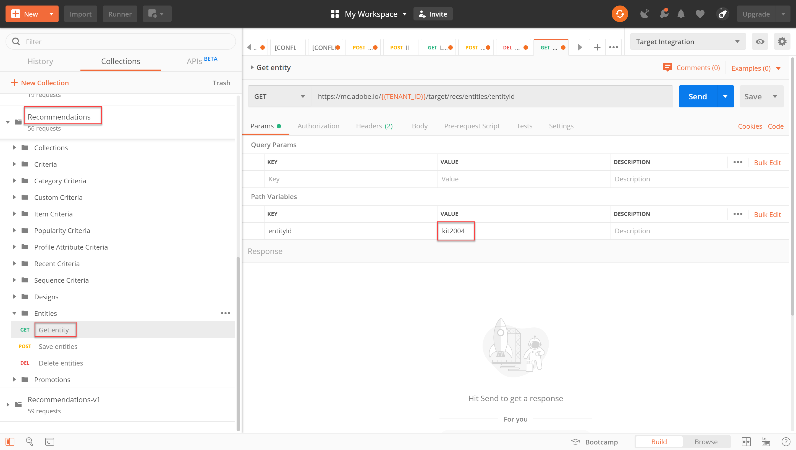

# Gestion de votre catalogue Recommendations à l’aide d’API

Tout en vous assurant que vous répondez à la variable [conditions requises pour utiliser l’API Recommendations](/help/dev/before-administer/recs-api/overview.md#prerequisites), vous avez appris à [générer un jeton d’accès ;](/help/dev/before-administer/configure-authentication.md) utilisation du flux d’authentification JWT pour utiliser la variable [!DNL Adobe Target] API d’administration sur le [Console Adobe Developer](https://developer.adobe.com/console/home).

Vous pouvez désormais utiliser la variable [API RECOMMENDATIONS](https://developer.adobe.com/target/administer/recommendations-api/) pour ajouter, mettre à jour ou supprimer des éléments dans votre catalogue de recommandations. Comme pour le reste des API d’administration Adobe Target, les API Recommendations nécessitent une authentification.

>[!NOTE]
>
>Envoyez la variable **[!UICONTROL IMS : JWT Generate + Auth via User Token]** à chaque fois que vous devez actualiser votre jeton d’accès pour authentification, puisqu’il expire au bout de 24 heures. Voir [Configuration de l’authentification de l’API d’Adobe](../configure-authentication.md) pour obtenir des instructions.


Avant de poursuivre, obtenez la variable [Collection Recommendations Postman](https://developer.adobe.com/target/administer/recommendations-api/#section/Postman).

## Création et mise à jour d’éléments à l’aide de l’API Enregistrer les entités

Pour renseigner votre base de données de produits Recommendations à l’aide de l’API plutôt que d’un flux de produits CSV ou de demandes Target se déclenchant sur des pages de produits, utilisez le [API Enregistrer les entités](https://developer.adobe.com/target/administer/recommendations-api/#operation/saveEntities). Cette requête ajoute ou met à jour un élément dans un seul environnement Target. La syntaxe est la suivante :

```
POST https://mc.adobe.io/{{TENANT_ID}}/target/recs/entities
```

Par exemple, les entités de sauvegarde peuvent être utilisées pour mettre à jour des éléments chaque fois que certains seuils sont atteints (seuils d’inventaire ou de prix, par exemple) afin de les marquer et de les empêcher d’être recommandés.

1. Accédez à **[!UICONTROL Cible]** > **[!UICONTROL Configuration]** > **[!UICONTROL Hôtes]** > **[!UICONTROL Environnements CONTROL]** pour obtenir l’identifiant de l’environnement cible dans lequel vous souhaitez ajouter ou mettre à jour un élément.

   

1. Vérifier `TENANT_ID` et `API_KEY` référencez les variables d’environnement Postman établies précédemment. Utilisez l’image ci-dessous pour la comparaison. Si nécessaire, modifiez les en-têtes et le chemin d’accès dans votre requête d’API afin qu’ils correspondent à ceux de l’image ci-dessous.

   

1. Saisissez votre JSON comme **raw** dans le **Corps**. N’oubliez pas de spécifier votre ID d’environnement à l’aide de la variable `environment` Variable . (Dans l’exemple ci-dessous, l’ID d’environnement est 6781.)

   

   Vous trouverez ci-dessous un exemple JSON qui ajoute entity.id kit2001 aux valeurs d’entité associées pour un produit grille-pain dans l’environnement 6781.

   ```
       {
       "entities": [{
               "name": "Toaster Oven",
               "id": "kit2001",
               "environment": 6781,
               "categories": [
                   "housewares:appliances"
               ],
               "attributes": {
                   "inventory": 77,
                   "margin": 23,
                   "message": "crashing helicopter",
                   "pageUrl": "www.foobar.foo.com/helicopter.html",
                   "thumbnailUrl": "www.foobar.foo.com/helicopter.jpg",
                  "value": 19.2
               }
           }]
       }
   ```

1. Cliquez sur **[!UICONTROL Envoyer]**. Vous devriez recevoir la réponse suivante.

   

   L’objet JSON peut être mis à l’échelle pour envoyer plusieurs produits. Par exemple, ce code JSON spécifie deux entités.

   ```
       {
           "entities": [{
                   "name": "Toaster Oven",
                   "id": "kit2001",
                   "environment": 6781,
                   "categories": [
                       "housewares:appliances"
                   ],
                   "attributes": {
                       "inventory": 89,
                       "margin": 11,
                       "message": "Toaster Oven",
                       "pageUrl": "www.foobar.foo.com/helicopter.html",
                       "thumbnailUrl": "www.foobar.foo.com/helicopter.jpg",
                       "value": 102.5
                   }
               },
               {
                   "name": "Blender",
                   "id": "kit2002",
                   "environment": 6781,
                   "categories": [
                       "housewares:appliances"
                   ],
                   "attributes": {
                       "inventory": 36,
                       "margin": 5,
                       "message": "Blender",
                       "pageUrl": "www.foobar.foo.com/helicopter.html",
                       "thumbnailUrl": "www.foobar.foo.com/helicopter.jpg",
                       "value": 54.5
                   }
               }
           ]
       }
   ```

1. Maintenant c&#39;est ton tour ! Utilisez la variable **[!UICONTROL Enregistrer les entités]** API pour ajouter les éléments suivants à votre catalogue. Utilisez l’exemple JSON ci-dessus comme point de départ. (Vous devez étendre le fichier JSON pour inclure d’autres entités.)

   

Il semble que ces deux derniers éléments n&#39;appartiennent pas à . Examinons-les à l’aide du **[!UICONTROL Obtenir l’entité]** et, si nécessaire, supprimez-les à l’aide de l’API **[!UICONTROL Supprimer des entités]** API.

## Obtention des détails d’élément avec l’API Get Entity

Pour récupérer les détails d’un élément existant, utilisez le [Obtenir l’API d’entité](https://developer.adobe.com/target/administer/recommendations-api/#operation/getEntity). La syntaxe est la suivante :

```
GET https://mc.adobe.io/{{TENANT_ID}}/target/recs/entities/[entity.id]
```

Les détails d’entité ne peuvent être récupérés que pour une seule entité à la fois. Vous pouvez utiliser l’option Obtenir l’entité pour confirmer que des mises à jour ont été effectuées dans le catalogue comme prévu ou pour contrôler le contenu du catalogue.

1. Dans la requête API, spécifiez l’ID d’entité à l’aide de la variable . `entityId`. L’exemple suivant renvoie les détails de l’entité dont entityId=kit2004.

   

1. Vérifier `TENANT_ID` et `API_KEY` référencez les variables d’environnement Postman établies précédemment. Utilisez l’image ci-dessous pour la comparaison. Si nécessaire, modifiez les en-têtes et le chemin d’accès dans votre requête d’API afin qu’ils correspondent à ceux de l’image ci-dessous.

   

1. Envoyez la requête.

   
Si vous recevez une erreur indiquant que l’entité est introuvable, comme illustré dans l’exemple ci-dessus, vérifiez que vous envoyez la demande au bon environnement Target.


   >[!NOTE]
   >
   >Si aucun environnement n’est explicitement spécifié, Get Entity tente d’obtenir l’entité de votre [environnement par défaut](https://experienceleague.adobe.com/docs/target/using/administer/environments.html) uniquement. Si vous souhaitez extraire de tout environnement autre que votre environnement par défaut, vous devez spécifier l’identifiant de l’environnement.

1. Si nécessaire, ajoutez le `environmentId` puis envoyer à nouveau la demande.

   

1. Envoyer un autre **[!UICONTROL Obtenir l’entité]** , cette fois pour inspecter l’entité dont entityId=kit2005.

   

Supposons que vous décidiez que ces entités doivent être supprimées de votre catalogue. Utilisons le **[!UICONTROL Supprimer des entités]** API.

## Suppression d’éléments avec l’API Supprimer des entités

Pour supprimer des éléments de votre catalogue, utilisez la méthode [API Supprimer les entités](https://developer.adobe.com/target/administer/recommendations-api/#operation/deleteEntities). La syntaxe est la suivante :

```
DELETE https://mc.adobe.io/{{TENANT_ID}}/target/recs/entities?ids=[comma-delimited-entity-ids]&environment=[environmentId]
```

>[!WARNING]
>
>L’API Supprimer les entités supprime les entités référencées par les identifiants que vous spécifiez. Si aucun identifiant d’entité n’est fourni, toutes les entités de l’environnement donné sont supprimées. Si aucun identifiant d’environnement n’est indiqué, les entités seront supprimées de tous les environnements. Faites attention à ceci !

1. Accédez à **[!UICONTROL Cible]** > **[!UICONTROL Configuration]** > **[!UICONTROL Hôtes]** > **[!UICONTROL Environnements]** pour obtenir l’identifiant de l’environnement cible à partir duquel vous souhaitez supprimer des éléments.

   

1. Dans la requête API, spécifiez les ID d’entité des entités que vous souhaitez supprimer, en utilisant la syntaxe `&ids=[comma-delimited-entity-ids]` (un paramètre de requête). Lors de la suppression de plusieurs entités, séparez les identifiants à l’aide de virgules.

   

1. Spécifiez l’ID d’environnement en utilisant la syntaxe `&environment=[environmentId]`, dans le cas contraire, les entités de tous les environnements seront supprimées.

   

1. Vérifier `TENANT_ID` et `API_KEY` référencez les variables d’environnement Postman établies précédemment. Utilisez l’image ci-dessous pour la comparaison. Si nécessaire, modifiez les en-têtes et le chemin d’accès dans votre requête d’API afin qu’ils correspondent à ceux de l’image ci-dessous.

   

1. Envoyez la requête.

   

1. Vérifiez vos résultats à l’aide de **[!UICONTROL Obtenir l’entité]**, qui doit maintenant indiquer que les entités supprimées sont introuvables.

   

   

Félicitations ! Vous pouvez désormais utiliser les API Recommendations pour créer, mettre à jour, supprimer et obtenir des détails sur les entités de votre catalogue. Dans la section suivante, vous apprendrez à gérer les critères personnalisés.

&lt;!— [Suite : &quot;Gestion des critères personnalisés&quot; >](manage-custom-criteria.md) —>
