# Gestion de votre catalogue de recommandations à l’aide d’API

Tout en vous assurant de respecter les [conditions requises pour utiliser l’API Recommendations](/help/dev/before-administer/recs-api/overview.md#prerequisites), vous avez appris à [générer un jeton d’accès](/help/dev/before-administer/configure-authentication.md) à l’aide du flux d’authentification JWT pour utiliser les API d’administration [!DNL Adobe Target] sur le [Adobe Developer Console](https://developer.adobe.com/console/home).

Vous pouvez désormais utiliser les [API Recommendations](https://developer.adobe.com/target/administer/recommendations-api/) pour ajouter, mettre à jour ou supprimer des éléments de votre catalogue de recommandations. Comme pour le reste des API d’administration Adobe Target, les API Recommendations nécessitent une authentification.

>[!NOTE]
>
>Envoyez la demande **[!UICONTROL IMS: JWT Generate + Auth via User Token]** chaque fois que vous devez actualiser votre jeton d’accès pour l’authentification, puisqu’il expire après 24 heures. Voir [Configurer l’authentification de l’API Adobe](../configure-authentication.md) pour obtenir des instructions.


Avant de poursuivre, accédez à la [collection Postman Recommendations](https://developer.adobe.com/target/administer/recommendations-api/#section/Postman).

## Création et mise à jour d’éléments à l’aide de l’API Save Entities

Pour renseigner votre base de données de produits Recommendations à l’aide de l’API plutôt qu’un flux de produit CSV ou que des requêtes Target déclenchées sur des pages de produit, utilisez l’API [Save Entities](https://developer.adobe.com/target/administer/recommendations-api/#operation/saveEntities). Cette requête permet d’ajouter ou de mettre à jour un élément dans un seul environnement Target. La syntaxe est la suivante :

```
POST https://mc.adobe.io/{{TENANT_ID}}/target/recs/entities
```

Par exemple, les entités de sauvegarde peuvent être utilisées pour mettre à jour des articles lorsque certains seuils sont atteints, tels que les seuils de stock ou de prix, afin de marquer ces articles et d&#39;empêcher qu&#39;ils ne soient recommandés.

1. Accédez à **[!UICONTROL Target]** > **[!UICONTROL Setup]** > **[!UICONTROL Hosts]** > **[!UICONTROL CONTROL Environments]** pour obtenir l’identifiant d’environnement cible dans lequel vous souhaitez ajouter ou mettre à jour un élément.

   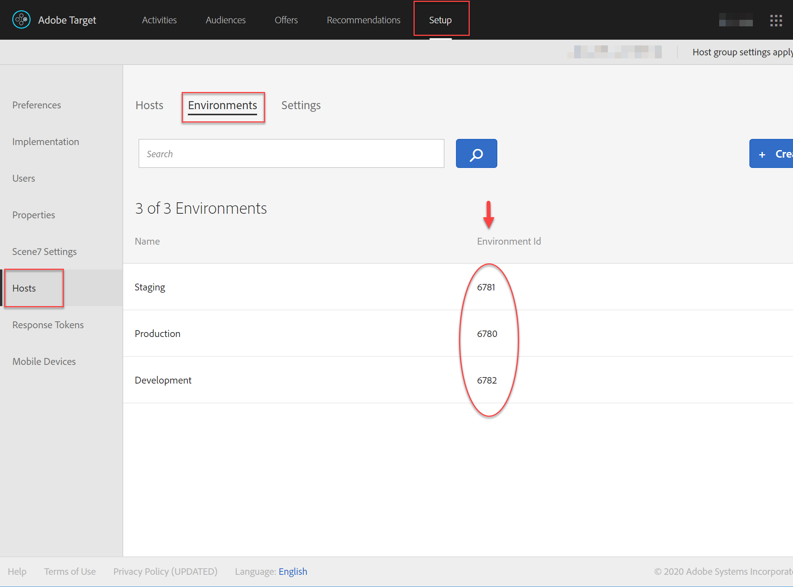

1. Vérifiez `TENANT_ID` et `API_KEY` référencez les variables d’environnement Postman établies précédemment. Utilisez l’image ci-dessous à des fins de comparaison. Si nécessaire, modifiez les en-têtes et le chemin d’accès dans votre requête API pour qu’ils correspondent à ceux de l’image ci-dessous.

   

1. Saisissez votre code JSON **brut** dans le champ **Corps**. N’oubliez pas de spécifier votre identifiant d’environnement à l’aide de la variable `environment` . (Dans l’exemple ci-dessous, l’ID d’environnement est 6781.)

   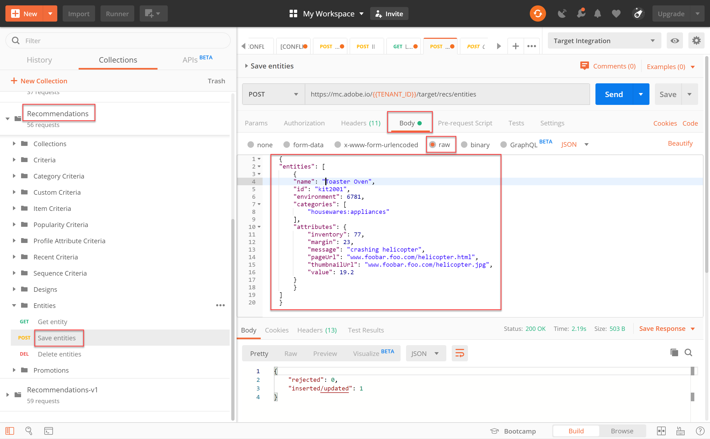

   Vous trouverez ci-dessous un exemple de JSON qui ajoute entity.id kit2001 avec les valeurs d’entité associées pour un produit Toaster Oven, dans l’environnement 6781.

   ```
       {
       "entities": [{
               "name": "Toaster Oven",
               "id": "kit2001",
               "environment": 6781,
               "categories": [
                   "housewares:appliances"
               ],
               "attributes": {
                   "inventory": 77,
                   "margin": 23,
                   "message": "crashing helicopter",
                   "pageUrl": "www.foobar.foo.com/helicopter.html",
                   "thumbnailUrl": "www.foobar.foo.com/helicopter.jpg",
                  "value": 19.2
               }
           }]
       }
   ```

1. Cliquez sur **[!UICONTROL Send]**. Vous devriez recevoir la réponse suivante.

   

   L’objet JSON peut être mis à l’échelle pour envoyer plusieurs produits. Par exemple, ce fichier JSON spécifie deux entités.

   ```
       {
           "entities": [{
                   "name": "Toaster Oven",
                   "id": "kit2001",
                   "environment": 6781,
                   "categories": [
                       "housewares:appliances"
                   ],
                   "attributes": {
                       "inventory": 89,
                       "margin": 11,
                       "message": "Toaster Oven",
                       "pageUrl": "www.foobar.foo.com/helicopter.html",
                       "thumbnailUrl": "www.foobar.foo.com/helicopter.jpg",
                       "value": 102.5
                   }
               },
               {
                   "name": "Blender",
                   "id": "kit2002",
                   "environment": 6781,
                   "categories": [
                       "housewares:appliances"
                   ],
                   "attributes": {
                       "inventory": 36,
                       "margin": 5,
                       "message": "Blender",
                       "pageUrl": "www.foobar.foo.com/helicopter.html",
                       "thumbnailUrl": "www.foobar.foo.com/helicopter.jpg",
                       "value": 54.5
                   }
               }
           ]
       }
   ```

1. C&#39;est à ton tour ! Utilisez l’API **[!UICONTROL Save Entities]** pour ajouter les éléments suivants à votre catalogue. Utilisez l’exemple de fichier JSON ci-dessus comme point de départ. (Vous devez étendre le fichier JSON pour inclure des entités supplémentaires.)

   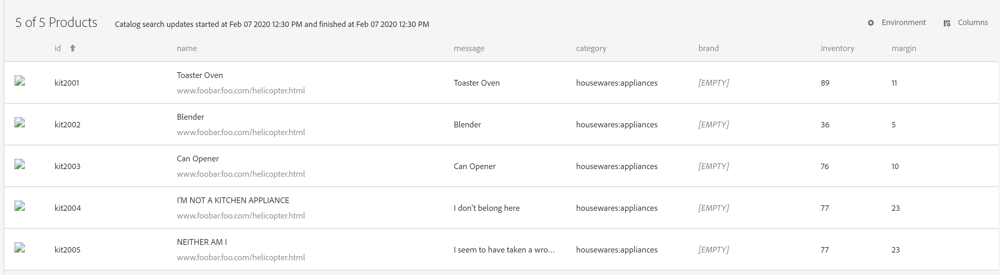

On dirait que ces deux derniers éléments n&#39;ont pas leur place. Examinons-les à l’aide de l’API **[!UICONTROL Get Entity]** et, si nécessaire, supprimons-les à l’aide de l’API **[!UICONTROL Delete Entities]**.

## Obtention des détails d’élément avec l’API Get Entity

Pour récupérer les détails d’un élément existant, utilisez l’[API Get Entity](https://developer.adobe.com/target/administer/recommendations-api/#operation/getEntity). La syntaxe est la suivante :

```
GET https://mc.adobe.io/{{TENANT_ID}}/target/recs/entities/[entity.id]
```

Les détails de l’entité ne peuvent être récupérés que pour une seule entité à la fois. Vous pouvez utiliser Get Entity pour confirmer que les mises à jour ont été effectuées dans le catalogue comme prévu, ou pour contrôler le contenu du catalogue.

1. Dans la requête API, spécifiez l’ID d’entité à l’aide de la variable `entityId`. L&#39;exemple suivant renvoie des détails pour l&#39;entité dont entityId=kit2004.

   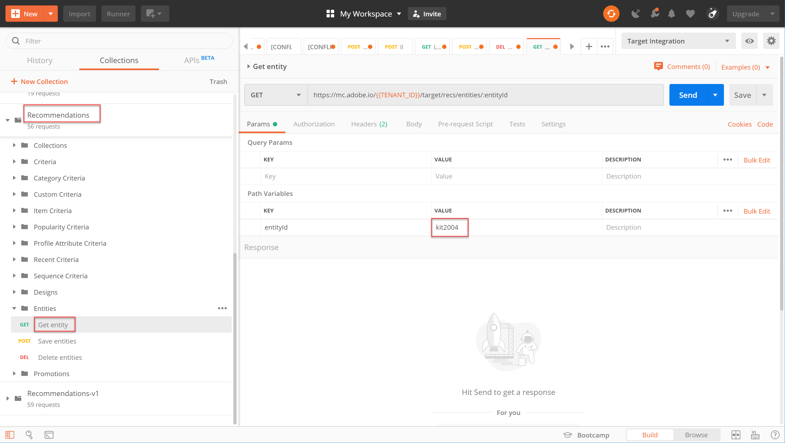

1. Vérifiez `TENANT_ID` et `API_KEY` référencez les variables d’environnement Postman établies précédemment. Utilisez l’image ci-dessous à des fins de comparaison. Si nécessaire, modifiez les en-têtes et le chemin d’accès dans votre requête API pour qu’ils correspondent à ceux de l’image ci-dessous.

   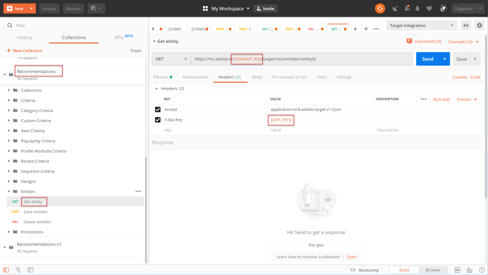

1. Envoyez la demande.

   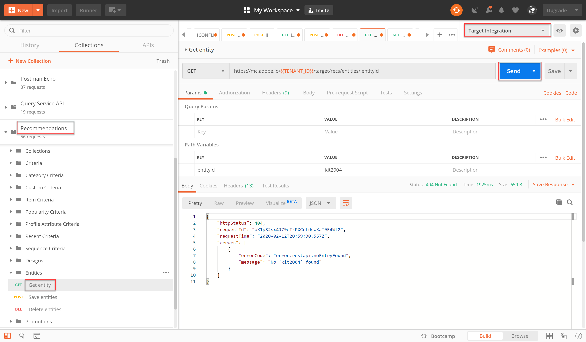
Si vous recevez une erreur indiquant que l’entité est introuvable, comme illustré dans l’exemple ci-dessus, vérifiez que vous envoyez la requête à l’environnement Target approprié.


   >[!NOTE]
   >
   >Si aucun environnement n&#39;est spécifié explicitement, Get Entity tente d&#39;obtenir l&#39;entité à partir de votre [environnement par défaut](https://experienceleague.adobe.com/docs/target/using/administer/environments.html?lang=fr) uniquement. Si vous souhaitez effectuer une extraction à partir de n’importe quel environnement autre que votre environnement par défaut, vous devez spécifier l’identifiant d’environnement.

1. Si nécessaire, ajoutez le paramètre `environmentId` et renvoyez la requête.

   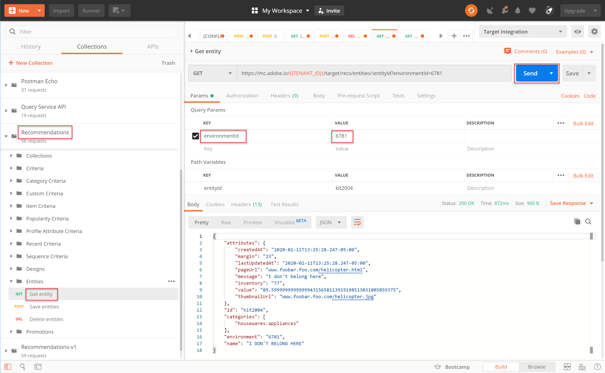

1. Envoyez une autre requête **[!UICONTROL Get Entity]**, cette fois pour inspecter l’entité dont entityId=kit2005.

   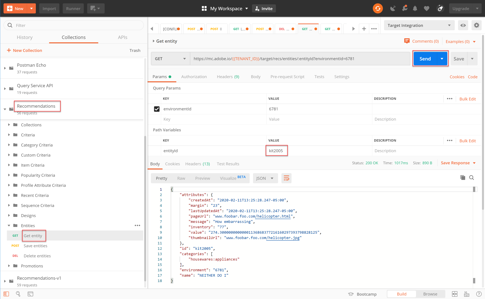

Supposons que vous décidiez que ces entités doivent être supprimées de votre catalogue. Utilisons l’API **[!UICONTROL Delete Entities]**.

## Suppression d’éléments à l’aide de l’API Delete Entities

Pour supprimer des éléments de votre catalogue, utilisez l’API [Supprimer des entités](https://developer.adobe.com/target/administer/recommendations-api/#operation/deleteEntities). La syntaxe est la suivante :

```
DELETE https://mc.adobe.io/{{TENANT_ID}}/target/recs/entities?ids=[comma-delimited-entity-ids]&environment=[environmentId]
```

>[!WARNING]
>
>L’API Delete Entities supprime les entités référencées par les identifiants que vous spécifiez. Si aucun ID d’entité n’est fourni, toutes les entités de l’environnement donné sont supprimées. Si aucun identifiant d’environnement n’est donné, les entités seront supprimées de tous les environnements. Utilisez-le avec précaution !

1. Accédez à **[!UICONTROL Target]** > **[!UICONTROL Setup]** > **[!UICONTROL Hosts]** > **[!UICONTROL Environments]** pour obtenir l’identifiant d’environnement cible à partir duquel vous souhaitez supprimer des éléments.

   

1. Dans la requête API, spécifiez les identifiants des entités à supprimer à l’aide de la syntaxe `&ids=[comma-delimited-entity-ids]` (un paramètre de requête). Lors de la suppression de plusieurs entités, séparez les identifiants par des virgules.

   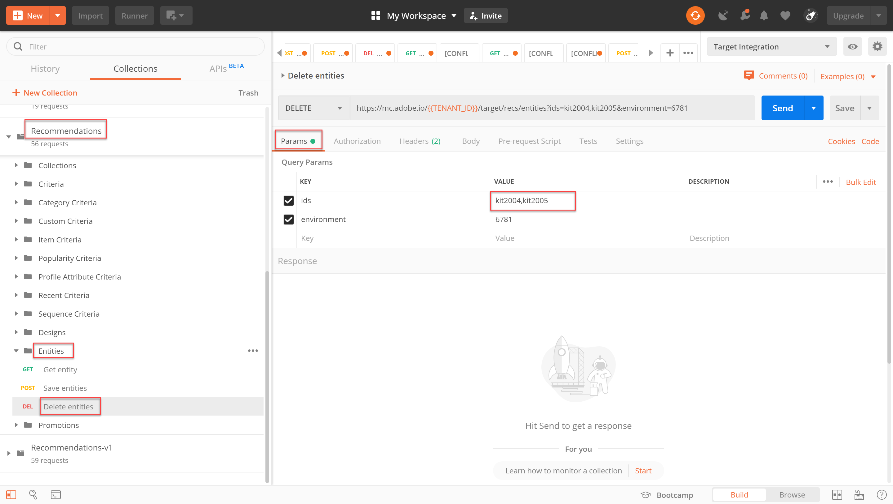

1. Spécifiez l’identifiant d’environnement à l’aide de la syntaxe `&environment=[environmentId]`, sinon les entités de tous les environnements seront supprimées.

   

1. Vérifiez `TENANT_ID` et `API_KEY` référencez les variables d’environnement Postman établies précédemment. Utilisez l’image ci-dessous à des fins de comparaison. Si nécessaire, modifiez les en-têtes et le chemin d’accès dans votre requête API pour qu’ils correspondent à ceux de l’image ci-dessous.

   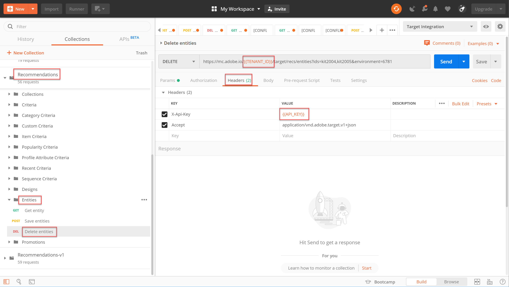

1. Envoyez la demande.

   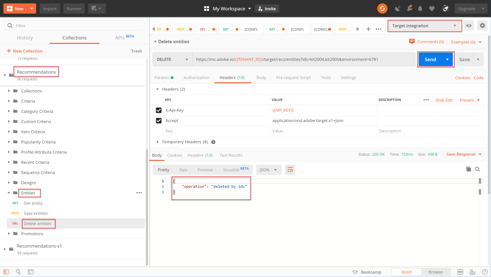

1. Vérifiez vos résultats à l’aide de **[!UICONTROL Get Entity]**, qui doit maintenant indiquer que les entités supprimées sont introuvables.

   

   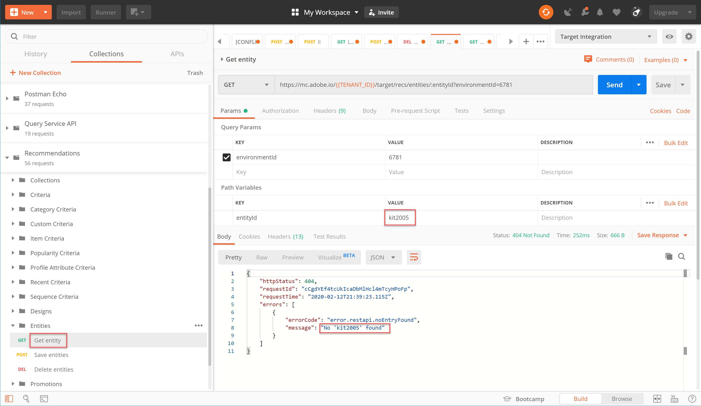

Félicitations ! Vous pouvez désormais utiliser les API Recommendations pour créer, mettre à jour, supprimer et obtenir des détails sur les entités de votre catalogue. Dans la section suivante, vous apprendrez à gérer les critères personnalisés.

<!-- [Next "Manage Custom Criteria" >](manage-custom-criteria.md) -->
