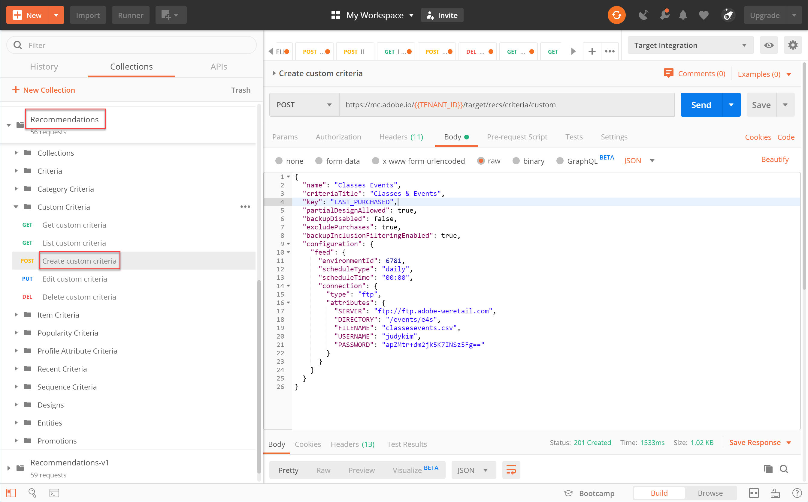
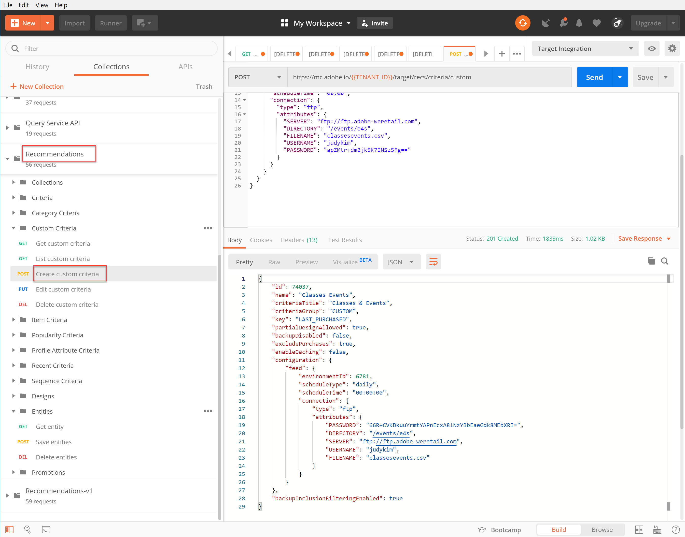
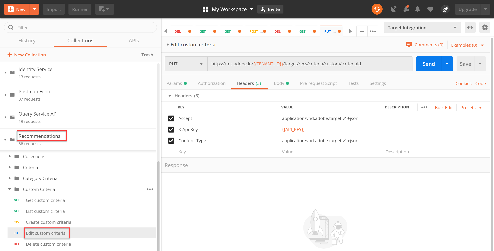
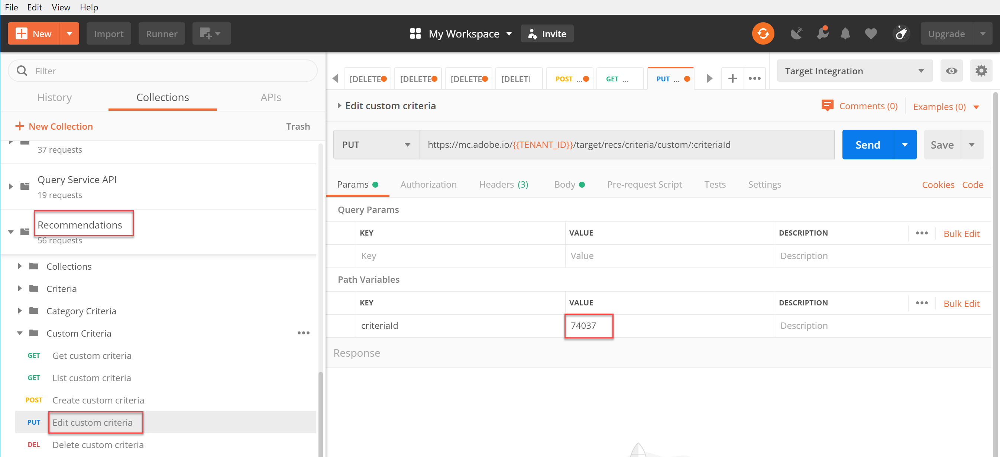
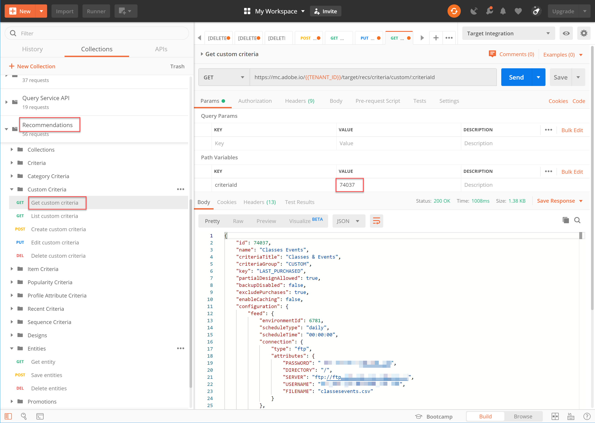
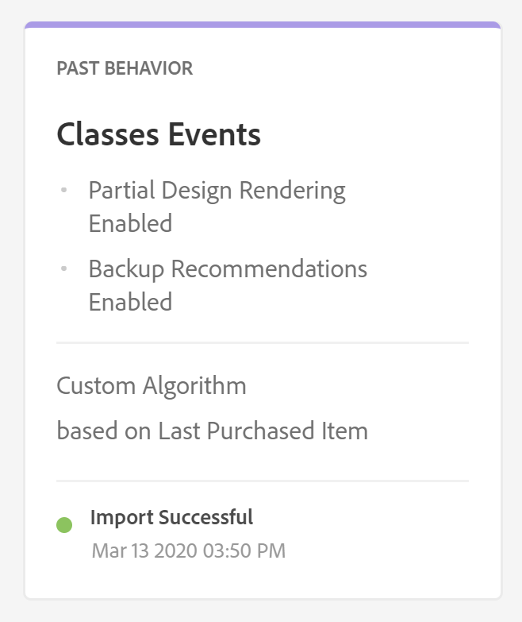

# Gérer les critères personnalisés

Parfois, les algorithmes fournis par Recommendations ne permettent pas de faire apparaître des éléments spécifiques que vous souhaitez promouvoir. Dans ce cas, les critères personnalisés vous permettent de fournir un ensemble spécifique d’éléments recommandés pour un élément ou une catégorie clé donnée.

Pour créer des critères personnalisés, définissez et importez le mappage souhaité entre l’élément ou la catégorie clé et les éléments recommandés. Ce processus est décrit dans la [documentation sur les critères personnalisés](https://experienceleague.adobe.com/docs/target/using/recommendations/criteria/recommendations-csv.html). Comme indiqué dans cette documentation, vous pouvez créer, modifier et supprimer des critères personnalisés via l’interface utilisateur (IU) de Target. Cependant, Target fournit également un ensemble d’API de critères personnalisés qui permettent une gestion plus détaillée de vos critères personnalisés.

>[!WARNING]
>
>Pour les critères personnalisés, effectuez toutes les actions (créer, modifier, supprimer) pour un critère personnalisé donné à l’aide des API ou effectuez toutes les actions (créer, modifier, supprimer) à l’aide de l’interface utilisateur. La gestion de vos critères personnalisés par le biais d’une combinaison de l’interface utilisateur et de l’API peut entraîner des informations conflictuelles ou des résultats inattendus. Par exemple, la création d’un critère personnalisé dans l’interface utilisateur, mais sa modification ensuite via l’API ne reflètera pas vos mises à jour dans l’interface utilisateur, même si elle sera mise à jour en arrière-plan, comme visible via l’API.

## Créer des critères personnalisés

Pour créer des critères personnalisés à l’aide de l’API [Create Custom Criteria](https://developer.adobe.com/target/administer/recommendations-api/#operation/createCriteriaCustom), la syntaxe est la suivante :

`POST https://mc.adobe.io/{{TENANT_ID}}/target/recs/criteria/custom`

>[!WARNING]
>
>Les critères personnalisés créés à l’aide de l’API Créer des critères personnalisés, comme décrit dans cet exercice, s’affichent dans l’interface utilisateur, où ils persistent. Vous ne pourrez pas les modifier ni les supprimer de l’interface utilisateur. Vous pouvez les modifier ou les supprimer **via l’API**, mais ils continueront à apparaître dans l’interface utilisateur de Target. Pour conserver la possibilité de modifier ou de supprimer des éléments de l’interface utilisateur, créez les critères personnalisés à l’aide de l’interface utilisateur conformément [ la documentation](https://experienceleague.adobe.com/docs/target/using/recommendations/criteria/recommendations-csv.html), plutôt qu’à l’aide de l’API Créer des critères personnalisés.

N’effectuez les étapes suivantes qu’après avoir lu l’avertissement ci-dessus et que vous êtes à l’aise pour créer des critères personnalisés qui ne peuvent pas être supprimés de l’interface utilisateur par la suite.

1. Vérifiez `TENANT_ID` et `API_KEY` pour **[!UICONTROL Create custom criteria]** référence aux variables d’environnement Postman établies précédemment. Utilisez l’image ci-dessous à des fins de comparaison.

   

1. Ajoutez votre **Corps** en tant que JSON **brut** qui définit l’emplacement de votre fichier CSV de critères personnalisés. Utilisez l’exemple fourni dans la documentation [Créer une API de critère personnalisé](https://developer.adobe.com/target/administer/recommendations-api/#operation/getAllCriteriaCustom) comme modèle, en fournissant vos `environmentId` et d’autres valeurs si nécessaire. Dans cet exemple, la clé est LAST_PURCHASED.

   

1. Envoyez la requête et observez la réponse, qui contient les détails des critères personnalisés que vous venez de créer.

   

1. Pour vérifier que vos critères personnalisés ont été créés, accédez dans Adobe Target à **[!UICONTROL Recommendations > Criteria]** et recherchez vos critères par nom, ou utilisez le **[!UICONTROL List Custom Criteria API]** à l’étape suivante.

   

Dans ce cas, une erreur s’est produite. Examinons l’erreur en examinant de plus près les critères personnalisés, à l’aide de l’**[!UICONTROL List Custom Criteria API]** .

## Liste des critères personnalisés

Pour récupérer une liste de tous vos critères personnalisés ainsi que des détails de chacun, utilisez la [API List Custom Criteria](https://developer.adobe.com/target/administer/recommendations-api/#operation/getAllCriteriaCustom). La syntaxe est la suivante :

`GET https://mc.adobe.io/{{TENANT_ID}}/target/recs/criteria/custom`

1. Vérifiez `TENANT_ID` et `API_KEY` comme précédemment, puis envoyez la requête. Dans la réponse, notez l’identifiant du critère personnalisé, ainsi que des détails concernant le message d’erreur noté précédemment.
   

Dans ce cas, l’erreur s’est produite, car les informations du serveur sont incorrectes, ce qui signifie que Target ne peut pas accéder au fichier CSV contenant la définition des critères personnalisés. Modifions les critères personnalisés pour corriger ce problème.

## Modifier les critères personnalisés

Pour modifier les détails d’une définition de critère personnalisé, utilisez l’[API Modifier les critères personnalisés](https://developer.adobe.com/target/administer/recommendations-api/#operation/updateCriteriaCustom). La syntaxe est la suivante :

`POST https://mc.adobe.io/{{TENANT_ID}}/target/recs/criteria/custom/:criteriaId`

1. Vérifiez `TENANT_ID` et `API_KEY`, comme auparavant.
   

1. Indiquez l’identifiant du critère personnalisé (unique) que vous souhaitez modifier.
   

1. Dans le corps, fournissez le fichier JSON mis à jour avec les informations correctes du serveur. (Pour cette étape, spécifiez l’accès FTP à un serveur auquel vous pouvez accéder.)
   

1. Envoyez la requête et notez la réponse.
   

Vérifions le succès des critères personnalisés mis à jour à l’aide de l’**[!UICONTROL Get Custom Criteria API]** .

## Obtenir les critères personnalisés

Pour afficher les détails d’un critère personnalisé spécifique, utilisez l’[API Get Custom Criteria](https://developer.adobe.com/target/administer/recommendations-api/#operation/getCriteriaCustom). La syntaxe est la suivante :

`GET https://mc.adobe.io/{{TENANT_ID}}/target/recs/criteria/custom/:criteriaId`

1. Spécifiez l’ID de critère des critères personnalisés dont vous souhaitez obtenir les détails. Envoyez la requête et vérifiez la réponse.
   
1. Vérification réussie. (Dans notre cas, vérifiez qu’il n’y a plus d’erreurs FTP.)
   
1. (Facultatif) Vérifiez que la mise à jour est correctement répercutée dans l’interface utilisateur.
   

## Supprimer les critères personnalisés

À l’aide de l’identifiant de critère mentionné précédemment, supprimez vos critères personnalisés à l’aide de l’API [Supprimer les critères personnalisés](https://developer.adobe.com/target/administer/recommendations-api/#operation/deleteCriteriaCustom). La syntaxe est la suivante :

`DELETE https://mc.adobe.io/{{TENANT_ID}}/target/recs/criteria/custom/:criteriaId`

1. Indiquez l’identifiant du critère personnalisé (unique) que vous souhaitez supprimer. Cliquez sur **[!UICONTROL Send]**.
   

1. Vérifiez que le critère a été supprimé à l’aide de l’option Obtenir les critères personnalisés.
   
Dans ce cas, l’erreur 404 attendue indique que les critères supprimés sont introuvables.

>[!NOTE]
>
>Pour rappel, les critères ne seront pas supprimés de l’interface utilisateur de Target, même s’ils ont été supprimés, car ils ont été créés à l’aide de l’API Créer des critères personnalisés.

Félicitations ! Vous pouvez désormais créer, répertorier, modifier, supprimer des critères personnalisés et obtenir des détails à leur sujet à l’aide de l’API Recommendations. Dans la section suivante, vous allez utiliser l’API de diffusion Target pour récupérer des recommandations.

&lt;!— [Suite : « Récupérer des recommandations avec l’API de diffusion côté serveur » >](fetch-recs-server-side-delivery-api.md) —>
