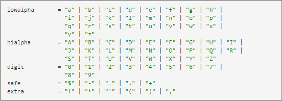
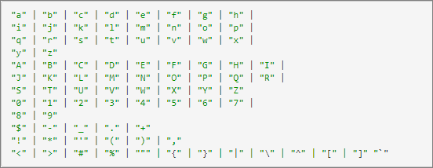

# Paramètres de page

Les paramètres de page (également appelés « paramètres de mbox ») sont des paires nom/valeur transmises directement par le biais du code de page, qui ne sont pas stockées dans le profil du visiteur pour une utilisation ultérieure.

Les paramètres de page sont utiles pour envoyer des données de page à des [!DNL Adobe Target] qui n’ont pas besoin d’être stockées avec le profil du visiteur pour une utilisation ultérieure de ciblage. Ces valeurs sont utilisées pour décrire la page ou l’action effectuée par l’utilisateur sur cette page spécifique.

## Format

Les paramètres de page sont transmis à [!DNL Target] via un appel au serveur sous la forme d’une paire nom/valeur de chaîne. Les noms et les valeurs de paramètre sont personnalisables (cependant, certains noms sont réservés à des utilisations spécifiques).

Voici quelques exemples de paramètres de page

* `page=productPage`

* `categoryId=homeLoans`

## Exemples de cas d’utilisation

* **Pages produit** : envoyez des informations sur le produit spécifique consulté (cette méthode décrit le fonctionnement de Recommendations).
* **Détails de la commande** : envoyez l’ID de commande, orderTotal, etc. pour la collecte des commandes.
* **Affinité catégorielle** : envoyez des informations consultées par catégorie aux [!DNL Target] pour acquérir des connaissances sur l’affinité de l’utilisateur ou de l’utilisatrice avec des catégories de site spécifiques
* **Données tierces** : envoyez des informations provenant de sources de données tierces, telles que les fournisseurs de ciblage météo, les fournisseurs de données de compte (par exemple, DemandBase), les fournisseurs de données démographiques (par exemple, Experian), etc.

## Avantages de la méthode

Les données sont envoyées à [!DNL Target] en temps réel et peuvent être utilisées sur le même serveur pour appeler les données dans lesquelles elles arrivent.

## Avertissements

* Nécessite une mise à jour du code de page (directement ou par l’intermédiaire d’un système de gestion des balises).
* Si les données doivent être utilisées pour le ciblage lors d’un appel page/serveur suivant, elles doivent être traduites en script de profil.
* Les chaînes de requête ne peuvent contenir que des caractères conformément à la norme [Internet Engineering Task Force (IETF)](https://www.ietf.org/rfc/rfc3986.txt) .

  En plus des caractères mentionnés sur le site de l’IETF, [!DNL Target] autorise les caractères suivants dans les chaînes de requête :

  `< > # % " { } | \ ^ [ ] `

  Le reste doit être encodé en URL. La norme spécifie le format suivant ( [&#128279;](https://www.ietf.org/rfc/rfc1738.txt) ), comme illustré ci-dessous :

  

  Ou la liste complète, pour plus de simplicité :

  

## Exemples de code

targetPageParamsAll (ajoute les paramètres à tous les appels de mbox sur la page) :

`function targetPageParamsAll() { return "param1=value1&param2=value2&p3=hello%20world";`

targetPageParams (ajoute les paramètres à la mbox globale sur la page) :

`function targetPageParams() { return "param1=value1&param2=value2&p3=hello%20world";`

## Liens vers des informations pertinentes

Recommandations : [implémentation selon le type de page](https://experienceleague.adobe.com/docs/target/using/recommendations/plan-implement.html?lang=fr)

Confirmation de commande : [suivi des conversions](../../implement/client-side/atjs/how-to-deployatjs/implement-target-without-a-tag-manager.md#track-conversions)

Affinité catégorielle : [affinité catégorielle](https://experienceleague.adobe.com/docs/target/using/audiences/visitor-profiles/category-affinity.html?lang=fr)
