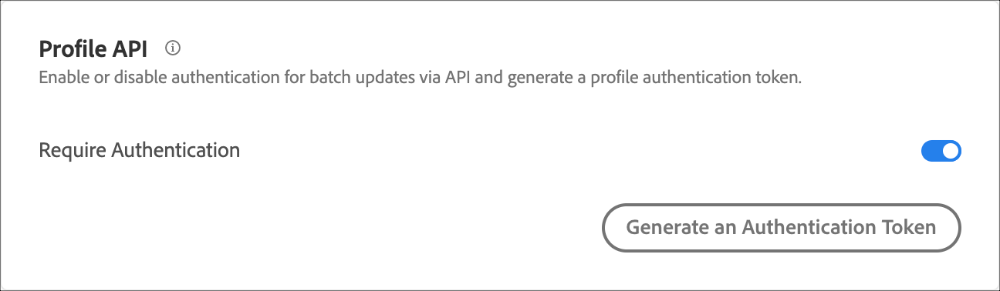

# Paramètres de l’API de profil

Activez ou désactivez l’authentification pour les mises à jour par lots via les API [!DNL Adobe Target] et générez un jeton d’authentification de profil.

[!DNL Adobe Target] crée et conserve un profil pour chaque utilisateur. Ce profil est stocké sur le cluster Edge de [!DNL Target] et est mis à jour en temps réel après chaque visite. Vous pouvez également mettre à jour un profil individuellement ou en bloc via l’API.

Pour plus de sécurité, vous pouvez exiger que l’appel de l’API de mise à jour en masse requiert qu’un jeton d’accès valide soit transmis dans l’en-tête de la demande.

**Pour exiger une authentification et générer un jeton d’accès à l’aide de l’interface utilisateur [!DNL Target] :**

1. Cliquez sur **[!UICONTROL Administration]** > **[!UICONTROL Implementation]**.
1. Sous **[!UICONTROL Profile API]** diapositive, basculez le bouton **[!UICONTROL Require Authentication]** vers la position activée ou désactivée.

   

1. (Conditionnel) Si vous avez activé l’exigence d’authentification, cliquez sur **[!UICONTROL Generate New Profile Authentication Token]**.

   

   Le jeton expire en fonction de la durée répertoriée dans la zone Expire dans .

   Vous devez disposer de l’une des autorisations utilisateur suivantes pour générer un jeton d’authentification :

   * Rôle d’administrateur ou disposent au moins des droits d’approbateur

     Pour plus d’informations concernant les clients Target Standard, voir [Spécifier les rôles et autorisations](https://experienceleague.adobe.com/docs/target/using/administer/manage-users/users/user-management.html#roles-permissions) dans *Utilisateurs*. Pour plus d’informations concernant les clients [!DNL Target Premium], consultez [Configuration des autorisations d’Enterprise](https://experienceleague.adobe.com/docs/target/using/administer/manage-users/enterprise/properties-overview.html).

   * Rôle d’administrateur au niveau de l’espace de travail/du profil de produit

     Les espaces de travail sont disponibles uniquement pour les clients [!DNL Target Premium]. Pour plus d’informations, consultez [Configuration des autorisations d’Enterprise](https://experienceleague.adobe.com/docs/target/using/administer/manage-users/enterprise/properties-overview.html).

   * Droits d’administrateur (autorisation Sysadmin) au niveau du produit [!DNL Adobe Target]

Vous pouvez également générer un jeton d’authentification de profil via l’API. Pour plus d’informations, voir « Profils » dans le guide de l’[API d’administration et de profil ](../../administer/admin-api/admin-api-overview-new.md).

1. Copiez le jeton et incluez-le dans l’en-tête de la requête au format : « Authorization » : « Porteur ».

1. Cliquez sur **[!UICONTROL Generate New Profile Authentication Token]** pour régénérer le jeton si nécessaire.

>[!WARNING]
>
>La réinitialisation de ce jeton entraîne l’échec des appels d’API utilisant le jeton actuel. Vous devez, de ce fait, mettre à jour tous les scripts ou applications utilisant ce jeton.
