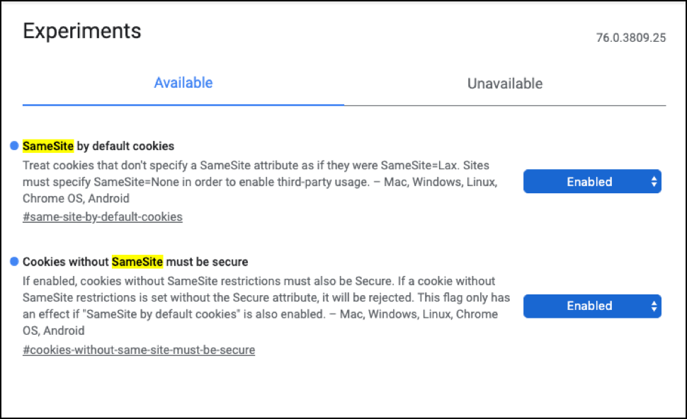

# Politiques en matière de cookies SameSite de Google Chrome

Google commencera à imposer de nouvelles politiques en matière de cookies par défaut pour ses utilisateurs, à partir de Chrome 80, dont la sortie est prévue début 2020. Cet article explique tout ce que vous devez savoir sur les nouvelles stratégies de cookies SameSite, comment [!DNL Adobe Target] prend en charge ces stratégies et comment utiliser [!DNL Target] pour se conformer aux nouvelles stratégies de cookies SameSite de Google Chrome.

À partir de Chrome 80, les développeurs web doivent spécifier explicitement quels cookies peuvent fonctionner sur les sites web. Il s’agit de la première d’une longue série d’annonces prévues par Google pour améliorer la confidentialité et la sécurité sur le web.

Étant donné que Facebook a été sur la sellette quant à ses politiques de confidentialité et de sécurité, d’autres acteurs majeurs tels qu’Apple, et désormais Google, ont rapidement saisi l’occasion de se créer de nouvelles identités en tant que champions de la confidentialité et de la sécurité. Apple a été le premier à annoncer la modification de ses politiques en matière de cookies au début de l’année via ITP 2.1 et, plus récemment, ITP 2.2. Dans ITP 2.1, Apple bloque complètement les cookies tiers et conserve les cookies créés sur le navigateur pendant sept jours seulement. Dans ITP 2.2, les cookies ne sont conservés que pendant une journée. L’annonce de Google est loin d’être aussi agressive qu’Apple, mais c’est la première étape vers le même objectif final. Pour plus d’informations sur les politiques d’Apple, consultez la page [ITP (Intelligent Tracking Prevention) 2.x d’Apple](/help/dev/before-implement/privacy/apple-itp-2x.md).

## Que sont les cookies et comment sont-ils utilisés ?

Avant d’examiner les modifications apportées aux stratégies de cookies de Google, nous vous conseillons de définir les cookies et leur mode d’utilisation. En résumé, les cookies sont de petits fichiers texte stockés dans le navigateur web qui sont utilisés pour mémoriser les attributs utilisateur.

Les cookies sont importants car ils améliorent l’expérience de l’utilisateur lorsqu’il navigue sur le Web. Par exemple, si vous effectuez des achats sur un site web d’e-commerce et ajoutez quelque chose à votre panier, mais que vous ne vous connectez pas ou n’effectuez pas d’achat au cours de cette visite, les cookies mémorisent vos articles et les conservent dans votre panier pour votre prochaine visite. Imaginez que vous ayez à saisir votre nom d’utilisateur et votre mot de passe chaque fois que vous visitez votre réseau social préféré. Les cookies évitent ce problème, car ils stockent des informations qui aident les sites à identifier qui vous êtes. Ces types de cookies sont appelés cookies propriétaires, car ils sont créés et utilisés par le site web que vous avez visité.

D’autres cookies existent, notamment les cookies tiers. Pour mieux les comprendre, prenons l’exemple suivant :

Supposons qu’une hypothétique société de médias sociaux appelée &quot;Amis&quot; propose un bouton Partager que d’autres sites implémentent pour permettre aux utilisateurs Amis de partager le contenu du site sur le flux Amis. Désormais, un utilisateur lit un article sur un site web d’actualités qui utilise le bouton Partager et clique dessus pour le publier automatiquement sur son compte Amis .

Pour ce faire, le navigateur récupère le bouton Partager d’Amis depuis `platform.friends.com` au chargement de l’article. Au cours de ce processus, le navigateur joint les cookies Amis, qui contiennent les informations d’identification de l’utilisateur, à la demande envoyée aux serveurs Amis. Cela permet aux amis de publier l’article d’actualité dans leur flux pour le compte de l’utilisateur sans exiger que l’utilisateur se connecte.

Tout cela est rendu possible grâce à l’utilisation de cookies tiers. Dans ce cas, le cookie tiers est enregistré dans le navigateur pour la variable `platform.friends.com`, de sorte que `platform.friends.com` Vous pouvez effectuer la publication dans l’application Amis pour le compte de l’utilisateur.

Si ce scénario avait lieu sans cookies tiers, l’utilisateur devrait suivre de nombreuses étapes manuelles. Tout d’abord, l’utilisateur devrait copier le lien de l’article de presse. Deuxièmement, il devrait se connecter séparément à l’application Amis. L’utilisateur cliquerait ensuite sur le bouton Créer une publication. Pour finir, l’utilisateur copierait/collerait le lien dans le champ de texte et cliquerait sur Publier. Comme vous pouvez le constater, les cookies tiers améliorent de façon significative l’expérience utilisateur, en réduisant le nombre d’étapes manuelles.

Plus généralement, les cookies tiers permettent de stocker les données dans le navigateur d’un utilisateur sans exiger de ce dernier qu’il consulte explicitement un site web.

## Problèmes de sécurité

Bien que les cookies améliorent les expériences utilisateur et la publicité, ils peuvent également introduire des failles de sécurité telles que les attaques CSRF (Cross-Site Request Forgery, falsification de requête intersite). Par exemple, si un utilisateur se connecte à un site bancaire pour payer ses factures de carte de crédit, quitte le site sans se déconnecter, puis accède à un site malveillant au cours de la même session, une attaque CSRF peut se produire. Le site malveillant peut inclure du code qui émet une requête au site bancaire qui s’exécute au chargement de la page. Comme l’utilisateur est toujours authentifié sur le site bancaire, le cookie de session peut être utilisé pour lancer une attaque CSRF afin d’initier un événement de transfert de fonds en dehors du compte bancaire de l’utilisateur. En effet, chaque fois que vous visitez un site, tous les cookies sont joints à la requête HTTP. Et à cause de ces problèmes de sécurité, Google tente maintenant de les atténuer.

## Comment [!DNL Target] utilise les cookies ?

Tout cela dit, voyons comment [!DNL Target] utilise des cookies. Pour que vous puissiez utiliser [!DNL Target], vous devez commencer par installer la bibliothèque JavaScript de [!DNL Target] sur votre site. Cela vous permet de placer un cookie propriétaire sur le navigateur de l’utilisateur qui visite votre site. Lorsque votre utilisateur interagit avec votre site web, vous pouvez transmettre ses données de comportement et d’intérêt à [!DNL Target] par le biais de la bibliothèque JavaScript. La variable [!DNL Target] La bibliothèque JavaScript utilise des cookies propriétaires pour extraire les informations d’identification de l’utilisateur à mapper sur le comportement et les données d’intérêt de l’utilisateur. Ces données sont ensuite utilisées par [!DNL Target] pour alimenter vos activités de personnalisation.

Target utilise (parfois) aussi des cookies tiers. Si vous possédez plusieurs sites web qui se trouvent sur des domaines différents et que vous souhaitez effectuer le suivi du parcours utilisateur sur ces sites, vous pouvez utiliser des cookies tiers grâce au suivi inter-domaines. En activant le suivi inter-domaines dans la bibliothèque JavaScript de [!DNL Target], votre compte commencera à utiliser des cookies tiers. Lorsqu’un utilisateur passe d’un domaine à un autre, le navigateur communique avec le serveur principal de Target. Dans ce processus, un cookie tiers est créé et placé dans le navigateur de l’utilisateur. Par le biais du cookie tiers qui réside sur le navigateur de l’utilisateur, [!DNL Target] est capable de fournir une expérience cohérente sur différents domaines pour un utilisateur unique.

## Google : nouvelle recette de cookie

Pour garantir la protection des utilisateurs lors de l’envoi de cookies à des sites, Google prévoit d’ajouter la prise en charge d’une norme IETF appelée SameSite, qui oblige les développeurs web à gérer les cookies avec le composant d’attribut SameSite dans l’en-tête Set-Cookie.

Il existe trois valeurs différentes qui peuvent être transmises à l’attribut SameSite : Strict, Lax (Permissif) ou None (Aucun).

| Valeur | Description |
| --- | --- |
| Strict | Les cookies avec ce paramètre sont accessibles uniquement lors de la visite du domaine sur lequel il a été initialement défini. En d’autres termes, Strict empêche complètement le cookie d’être utilisé sur plusieurs sites. Cette option serait préférable pour les applications nécessitant une sécurité élevée, telles que les banques. |
| Lax | Les cookies avec ce paramètre sont envoyés uniquement sur les requêtes de même site ou sur la navigation globale avec des requêtes HTTP non idempotentes, telles que `HTTP GET`. Par conséquent, cette option est utilisée si le cookie peut être utilisé par des tiers, mais avec une sécurité supplémentaire pour protéger les utilisateurs contre les attaques par CSRF (Cross-Site Request Forgery). |
| None | Les cookies avec ce paramètre fonctionnent de la même manière que les cookies aujourd’hui. |

En gardant à l’esprit les points ci-dessus, Chrome 80 introduit deux paramètres Utilisateur : « Cookies SameSite par défaut » et « Cookies sans SameSite doivent être sécurisés ». Ces paramètres seront activés par défaut dans Chrome 80.

* **Cookies samesite par défaut**: lorsqu’il est défini, tous les cookies qui ne spécifient pas l’attribut samesite sont automatiquement forcés d’utiliser `SameSite = Lax`.
* **Les cookies sans samesite doivent être sécurisés** : si cette option est définie, les cookies sans attribut SameSite ou avec `SameSite = None` doit être sécurisé. Dans ce contexte, toutes les demandes de navigateur doivent respecter le protocole HTTPS. Les cookies qui ne respectent pas cette exigence sont rejetés. Tous les sites web doivent utiliser HTTPS pour répondre à cette exigence.

## [!DNL Target] respecte les bonnes pratiques de sécurité de Google

En Adobe, nous voulons toujours soutenir les dernières bonnes pratiques du secteur en matière de sécurité et de confidentialité. Nous sommes heureux de vous annoncer que [!DNL Target] prend en charge les nouveaux paramètres de sécurité et de confidentialité introduits par Google.

Pour le paramètre « Cookies SameSite par défaut », [!DNL Target] continuera à fournir la personnalisation sans aucun impact ni intervention de votre part. [!DNL Target] utilise des cookies propriétaires et continuera à fonctionner correctement lorsque l’indicateur `SameSite = Lax` est appliqué par Google Chrome.

Pour l’option &quot;Les cookies sans samesite doivent être sécurisés&quot;, si vous ne souscrivez pas à la fonctionnalité de suivi inter-domaines dans Target, les cookies propriétaires dans [!DNL Target] continuera à travailler.

Cependant, lorsque vous souscrivez à l’utilisation du suivi inter-domaines pour utiliser [!DNL Target] sur plusieurs domaines, Chrome requiert l’utilisation des indicateurs `SameSite = None` et Secure pour les cookies tiers. Cela signifie que vous devez veiller à ce que vos sites utilisent le protocole HTTPS. Les bibliothèques côté client dans [!DNL Target] utiliseront automatiquement le protocole HTTPS et joignent les indicateurs `SameSite = None` et Secure aux cookies tiers dans [!DNL Target] pour s’assurer que toutes les activités continuent de s’exécuter.

## Que dois-je faire ?

Pour comprendre ce que vous devez faire pour que [!DNL Target] continue à fonctionner pour les utilisateurs de Google Chrome 80+. Consultez le tableau ci-dessous, qui comporte les colonnes suivantes :

* **Bibliothèque JavaScript de Target** : si vous utilisez at.js 1.*x* ou at.js 2.*x* sur vos sites.
* **Cookies SameSite par défaut = Activé** : si vos utilisateurs ont activé « Cookies SameSite par défaut », comment cela vous affecte-t-il et devez-vous prendre des mesures pour que [!DNL Target] continue à fonctionner ?
* **Les cookies sans SameSite doivent être sécurisés = Activé** : si vos visiteurs ont activé « Les cookies sans SameSite doivent être sécurisés », comment cela vous affecte-t-il et devez-vous prendre des mesures pour que [!DNL Target] continue à fonctionner ?

| Bibliothèque JavaScript de Target | Cookies SameSite par défaut = Activé | Les cookies sans SameSite doivent être sécurisés = Activé |
| --- | --- | --- |
| at.js 1.*x* avec cookie propriétaire. | Aucun impact. | Aucun impact car vous n’utilisez pas le suivi inter-domaines. |
| at.js 1.*x* avec suivi inter-domaines activé. | Aucun impact. | Vous devez activer le protocole HTTPS pour votre site. Target utilise un cookie tiers pour effectuer le suivi des utilisateurs et Google exige que les cookies tiers disposent de `SameSite = None` et l’indicateur sécurisé . L’indicateur Secure exige que vos sites utilisent le protocole HTTPS. |
| at.js 2.*x* | Aucun impact. | Aucun impact. |

## Que doit faire [!DNL Target] ?

Alors, qu’avons-nous dû faire sur notre plateforme pour vous aider à vous conformer aux nouvelles politiques en matière de cookies SameSite de Google Chrome 80+ ?

| Bibliothèque JavaScript de Target | Cookies SameSite par défaut = Activé | Les cookies sans SameSite doivent être sécurisés = Activé |
| --- | --- | --- |
| at.js 1.*x* avec cookie propriétaire. | Aucun impact. | Aucun impact car vous n’utilisez pas le suivi inter-domaines. |
| at.js 1.*x* avec suivi inter-domaines activé. | Aucun impact. | at.js 1.*x* avec suivi inter-domaines activé. |
| at.js 2.*x* | Aucun impact. | Aucun impact. |

## Quel est l’impact si vous n’utilisez pas le protocole HTTPS ?

Le seul cas d’utilisation qui vous affectera est si vous utilisez la fonctionnalité de suivi inter-domaines dans [!DNL Target] via at.js 1.*x*. Sans passer à HTTPS, qui est une exigence de Google, vous verrez un pic du nombre de visiteurs uniques sur vos domaines, car le cookie tiers que nous utilisons sera ignoré par Google. Et puisqu’il sera ignoré, [!DNL Target] ne sera pas en mesure de fournir une expérience cohérente et personnalisée à cet utilisateur lorsque celui-ci navigue d’un domaine à un autre. Le cookie tiers est principalement utilisé pour identifier un utilisateur unique naviguant entre les domaines dont vous êtes propriétaire.

## Conclusion

Alors que le secteur s’efforce de créer un site web plus sécurisé pour les consommateurs, Adobe s’engage à aider ses clients à offrir des expériences personnalisées de manière à garantir sécurité et confidentialité aux utilisateurs finaux. Tout ce que vous devez faire est de suivre les bonnes pratiques mentionnées ci-dessus et de profiter de [!DNL Target] pour se conformer aux nouvelles stratégies de cookies SameSite de Google Chrome.
