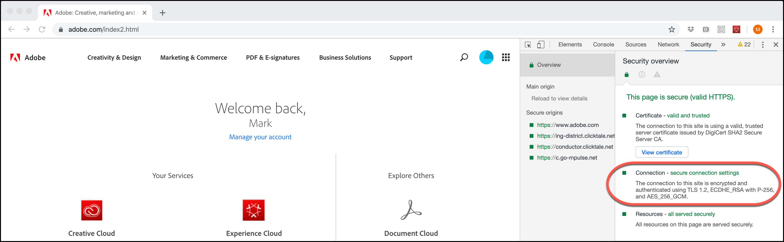

# Modifications du chiffrement de TLS (Transport Layer Security)

Informations sur les modifications apportées à l’utilisation [!DNL Adobe] et [!DNL Adobe Target] du protocole TLS (Transport Layer Security) pour maintenir les normes de sécurité les plus élevées et promouvoir la sécurité des données client.

Transport Layer Security (TLS) est le protocole de sécurité le plus répandu utilisé aujourd’hui pour les navigateurs web et autres applications exigeant que les données soient échangées en toute sécurité sur un réseau. Adobe a adopté des normes de conformité en matière de sécurité qui exigent la cessation des protocoles plus anciens et impose l’utilisation de TLS 1.2 afin de disposer de la version la plus récente et la plus sécurisée.

>[!WARNING]
>
>À compter du 1er mars 2020, [!DNL Target] ne prendra plus en charge le chiffrement TLS 1.1 pour le compositeur d’expérience visuelle (VEC), le compositeur d’expérience amélioré (EEC), la diffusion d’activité, les API, etc. Veuillez effectuer la mise à niveau vers TLS 1.2 pour éviter tout problème.

Cette modification ne devrait pas avoir de répercussions importantes sur les données des clients ou le compte rendu des performances.

## Compositeur d’expérience visuelle (VEC) avec Compositeur d’expérience avancé activé

TLS 1.2 est la valeur par défaut à compter du 1er mars 2020 et TLS 1.1 ne sera plus pris en charge.

Adobe fera évoluer progressivement les clients vers TLS 1.2. Pour ceux dont les domaines sont déjà conformes à la version 1.2, nous les déplacerons vers TLS 1.2 sans que vous ayez besoin d’apporter de modifications. La plupart des domaines clients prennent déjà en charge TLS 1.2. Cependant, si votre domaine ne prend pas en charge TLS 1.2, nous conserverons ces domaines sur TLS 1.1 comme aujourd’hui (jusqu’en mars 2020).

Aucun problème ne devrait se poser pendant cette phase de migration. Si le compositeur d’expérience visuelle a arrêté de charger un site qui fonctionnait auparavant, [ouvrez un ticket d’assistance clientèle](https://experienceleague.adobe.com/docs/target/using/cmp-resources-and-contact-information.html?#reference_ACA3391A00EF467B87930A450050077C) en citant cette migration comme cause possible.

Cependant, si vous êtes l’un de ces clients qui utilisent TSL 1.1 sans prendre en charge TLS 1.2, vous devez planifier le déplacement de vos domaines/infrastructures vers TLS 1.2. Nous continuerons à prendre en charge le protocole TLS 1.1 jusqu’au 1er mars 2020. À compter du 1er mars 2020, [!DNL Target] ne prendra pas en charge le protocole TLS 1.1 à utiliser pour le compositeur d’expérience visuelle via la fonctionnalité Enhanced Experience Composer.

Bien que nous recommandions fortement à tout le monde de travailler avec TLS 1.2 à l’avenir, si vous êtes un nouveau client, mais que vous ne prenez *PAS* en charge TLS 1.2, veuillez contacter l’assistance clientèle pour l’informer que vous devez être sur TLS 1.1 pour le Compositeur d’expérience avancé. Cependant, veuillez prévoir de passer à TLS 1.2, car la prise en charge ne sera plus disponible d’ici le lundi 1 mars 2020.

## Diffusion d’activité

À compter du 1er mars 2020, les serveurs [!DNL Target] ne prendront plus en charge TLS 1.1. Avec cette modification, les serveurs [!DNL Target] n’accepteront plus les requêtes des visiteurs disposant d’appareils ou de navigateurs web plus anciens qui ne prennent pas en charge TLS 1.2 (ou version ultérieure). De ce fait, les appareils et navigateurs plus anciens prenant uniquement en charge TLS 1.1 (ou prenant en charge TLS 1.1 par défaut) ne recevront pas de contenu d’activité d’Adobe Target. Le contenu par défaut du site sera rendu.

Certains des anciens appareils et navigateurs qui seront affectés incluent :

* Google Chrome (Chrome pour Android) versions 29 et antérieures
* Navigateur Opera (Opera Mobile) versions 12.17 et antérieures
* Mozilla Firefox (Firefox pour Mobile) versions 26 et antérieures
* Android 4.3 et versions antérieures
* Internet Explorer 8-10 sous Windows 7 et versions antérieures
* Internet Explorer 10 sous Windows Phone 8.0
* Safari 6.0.4/OS X 10.8.4 et versions antérieures.

Lorsque vous planifiez ce changement, tenez compte de ce qui suit (notez que l’échéance du lundi 1 mars 2020 a une incidence sur tous ces éléments) :

* Vous devez vous assurer que votre site par défaut est prêt à être utilisé avec les appareils et navigateurs conformes.
* Gardez à l’esprit que le nombre de visiteurs dans vos rapports [!DNL Target] peut potentiellement voir une baisse insignifiante du nombre de visiteurs.
* Vous devrez peut-être modifier les audiences créées spécifiquement pour cibler les appareils ou navigateurs plus anciens qui ne prennent pas en charge TLS 1.2. La diffusion vers ces appareils et navigateurs ne fonctionnera plus.

Pour plus d’informations sur les navigateurs pris en charge et leurs versions, voir [Navigateurs pris en charge](supported-browsers.md).

## [!DNL Adobe Target] API

À compter du 1er mars 2020, les API [!DNL Target] ne prendront plus en charge le chiffrement TLS 1.1. Les clients qui accèdent à l’API doivent vérifier qu’ils ne seront pas affectés.

* Les clients d’API qui utilisent Java 7 avec les paramètres par défaut devront être modifiés pour prendre en charge TLS 1.2. Pour plus d’informations, consultez la section « [Modification de la version du protocole TLS par défaut pour les points d’entrée client : TLS 1.0 à TLS 1.2](https://www.java.com/en/configure_crypto.html) » sur le site Web Java.
* Les clients d’API utilisant Java 8 ne devraient pas être affectés, étant donné que TLS 1.2 est la configuration par défaut.
* Les clients API utilisant d’autres structures devront contacter leurs fournisseurs pour plus de détails sur la prise en charge de TLS 1.2.

## Accès aux interfaces des solutions Experience Cloud

Étant donné que l’interface [!DNL Target] Standard/Premium nécessite déjà un [navigateur web moderne](supported-browsers.md), nous n’anticipons pas les problèmes. Si vous ne parvenez pas à vous connecter à Target, mettez à niveau votre navigateur vers la version la plus récente.

## Comment vérifier quelle version TLS votre navigateur utilise

Pour vérifier la version du protocole TLS sur votre site web à l’aide de Google Chrome :

1. Ouvrez le site web concerné dans Chrome.
1. Dans le menu Chrome (les trois points de suspension verticaux), cliquez sur Plus d’outils > Outils de développement.

   

1. Ouvrez l’onglet Sécurité , puis examinez les informations de version du TLS sous Connexion :

   

>[!NOTE]
>
>Ces instructions sont à jour à compter de leur publication et peuvent faire l’objet de modifications. Une recherche rapide sur Internet devrait aider si ces instructions changent. D’autres navigateurs proposent des étapes similaires.

## Comportement attendu avec les navigateurs prenant en charge les versions de TLS inférieures à 1.2

Cette section décrit ce à quoi s’attendre avec les navigateurs qui prennent en charge les versions de TLS inférieures à 1.2 uniquement lors de l’utilisation d’une implémentation d’at.js. À des fins de comparaison, cette section décrit également ce à quoi s’attendre avec les navigateurs qui prennent en charge TLS 1.2.

### Points d’entrée centraux

| Implémentation de [!DNL Target] JavaScript | Détails |
|--- |--- |
| at.js | Avec TLS 1.0 ou TLS 1.1 activé :<ul><li>Lors de l’utilisation des outils de développement du navigateur, « 200 OK » s’affiche sur l’onglet réseau. Cela indique le succès de la requête.</li><li>Le message « Impossible d’établir une connexion sécurisée. » s’affiche. Ce message indique que les paramètres de sécurité TLS du site sont peut-être obsolètes ou risqués.</li><li>Aucune erreur ne s’affiche dans la console.</li></ul>Avec TLS 1.2 activé :<ul><li>Téléchargement du fichier at.js.</li></ul> |

### Points d’entrée Edge

| Implémentation de [!DNL Target] JavaScript | Détails |
|--- |--- |
| Adobe Experience Platform Web SDK | Avec TLS 1.0 ou TLS 1.1 activé :<ul><li>Lors de l’utilisation des outils de développement du navigateur, « 200 OK » s’affiche sur l’onglet réseau. Cela indique le succès de la requête.</li><li>Le message « Impossible d’établir une connexion sécurisée. » s’affiche. Ce message indique que les paramètres de sécurité TLS du site sont peut-être obsolètes ou risqués.</li><li>Aucune erreur ne s’affiche dans la console.</li><li>Le contenu par défaut est présenté.</li></ul>Avec TLS 1.2 activé :<ul><li>Le contenu des offres est présenté.</li></ul> |
| at.js | Avec TLS 1.0 ou TLS 1.1 activé :<ul><li>Lors de l’utilisation des outils de développement du navigateur, « 200 OK » s’affiche sur l’onglet réseau. Cela indique le succès de la requête.</li><li>Le message « Impossible d’établir une connexion sécurisée. » s’affiche. Ce message indique que les paramètres de sécurité TLS du site sont peut-être obsolètes ou risqués.</li><li>Aucune erreur ne s’affiche dans la console.</li><li>Le contenu par défaut est présenté.</li></ul>Avec TLS 1.2 activé :<ul><li>Le contenu des offres est présenté.</li></ul> |

### Activité ciblée avec l’audience de version navigateur (Internet Explorer, versions 6, 7 ou 8)

Les audiences ne fonctionnent plus.

| Implémentation de [!DNL Target] JavaScript | Détails |
|--- |--- |
| Adobe Experience Platform Web SDK | Platform SDK n’est pas pris en charge sur les versions d’Internet Explorer antérieures à la version 10. |
| at.js | at.js n’est pas pris en charge par les versions antérieures à Internet Explorer 10. |
