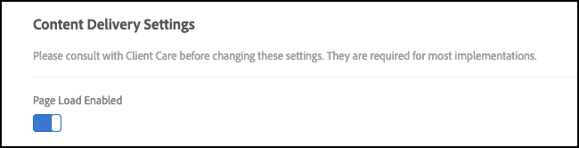

# [!UICONTROL targetGlobalSettings()]

Vous pouvez remplacer les paramètres de la bibliothèque at.js à l’aide de `[!UICONTROL targetGlobalSettings()]`, plutôt que de les configurer dans l’interface utilisateur de [!DNL Target] ou à l’aide d’API REST.

## Paramètres

Vous pouvez remplacer les paramètres suivants :

### aepSandboxId

* **Type** : String
* **Valeur par défaut** : null
* **Description** : paramètre facultatif utilisé pour envoyer [!DNL Adobe Experience Platform] ID de sandbox afin de partager [!DNL Adobe Experience Platform] destinations créées dans le sandbox non par défaut avec [!DNL Target]. Si `aepSandboxId` n’est pas nul, `aepSandboxName` doit également être fourni.

### aepSandboxName

* **Type** : String
* **Valeur par défaut** : null
* **Description** : paramètre facultatif utilisé pour envoyer [!DNL Adobe Experience Platform] nom de sandbox pour partager [!DNL Adobe Experience Platform] destinations créées dans le sandbox non par défaut avec [!DNL Target]. Si `aepSandboxName` n’est pas nul, `aepSandboxId` doit également être fourni.

### artifactLocation

* **Type** : String
* **Valeur Par Défaut** : Aucune
* **Description** : URL complète de l’artefact de règle de prise de décision [&#x200B; sur l’appareil](../../../server-side/sdk-guides/on-device-decisioning/rule-artifact-overview.md)

### bodyHiddenStyle

* **Type** : String
* **Valeur par défaut** : body { opacity: 0 }
* **Description** : utilisé uniquement lorsque `globalMboxAutocreate === true` pour réduire les risques de scintillement.

  Pour plus d’informations, voir [Gestion du scintillement par at.js](/help/dev/implement/client-side/atjs/how-atjs-works/manage-flicker-with-atjs.md).

### bodyHidingEnabled

* **Type** : booléen
* **Valeur par défaut** : true
* **Description** : utilisé pour contrôler le scintillement lorsque `target-global-mbox` est utilisé pour diffuser des offres créées dans le Compositeur d’expérience visuelle, également appelées offres visuelles.

### clientCode

* **Type** : String
* **Valeur par défaut** : valeur définie via l’interface utilisateur.
* **Description** : représente le code client.

### cookieDomain

* **Type** : String
* **Valeur par défaut** : si possible, définie sur le domaine de niveau supérieur.
* **Description** : représente le domaine utilisé lors de l’enregistrement de cookies.

### crossDomain

* **Type** : String
* **Valeur par défaut** : valeur définie via l’interface utilisateur.
* **Description** : indique si le suivi inter-domaines est activé ou non. Les valeurs autorisées dépendent de votre version d’at.js. Pour at.js v1.*x*, indiquez si les fonctionnalités inter-domaines sont `disabled` (les navigateurs définissent les cookies dans votre domaine (cookies propriétaires uniquement)), `x only` (les navigateurs définissent les cookies dans le domaine de [!DNL Target] uniquement) ou les deux, en sélectionnant `enabled` (les navigateurs définissent les cookies propriétaires et tiers). Pour at.js v2.10 et versions ultérieures, indiquez si les fonctionnalités inter-domaines sont `enabled` (les navigateurs définissent des cookies propriétaires et tiers) ou `disabled` (les navigateurs ne définissent pas de cookies tiers).

### cspScriptNonce

* **Type** : consultez la section [Politique de sécurité du contenu](#content-security-policy) ci-dessous.
* **Valeur par défaut** : consultez la section [Politique de sécurité du contenu](#content-security-policy) ci-dessous.
* **Description** : consultez la section [Politique de sécurité du contenu](#content-security-policy) ci-dessous.

### cspStyleNonce

* **Type** : consultez la section [Politique de sécurité du contenu](#content-security-policy) ci-dessous.
* **Valeur par défaut** : consultez la section [Politique de sécurité du contenu](#content-security-policy) ci-dessous.
* **Description** : consultez la section [Politique de sécurité du contenu](#content-security-policy) ci-dessous.

### dataProviders

* **Type** : consultez la section [Fournisseurs de données](#data-providers) ci-dessous.
* **Valeur par défaut** : consultez la section [Fournisseurs de données](#data-providers) ci-dessous.
* **Description** : consultez la section [Fournisseurs de données](#data-providers) ci-dessous.

### decisioningMethod

* **Type** : String
* **Valeur par défaut** : côté serveur
* **Autres valeurs** : sur l’appareil, hybride
* **Description** : consultez la section Méthodes de prise de décision ci-dessous.

  **Méthodes de prise de décision**

  Avec la prise de décision sur l’appareil, [!DNL Target] introduit un nouveau paramètre appelé Méthode de prise de décision , lequel détermine la manière dont at.js diffuse vos expériences. `decisioningMethod` dispose de trois valeurs : côté serveur uniquement, sur l’appareil uniquement et hybride. Lorsque `decisioningMethod` est défini dans `targetGlobalSettings()`, il agit comme méthode de prise de décision par défaut pour toutes les décisions [!DNL Target].

  **Côté serveur uniquement** :

  Côté serveur uniquement est la méthode de prise de décision par défaut préconfigurée lors de l’implémentation et du déploiement d’at.js 2.5+ sur vos propriétés web.

  L’utilisation de Côté serveur uniquement comme configuration par défaut signifie que toutes les décisions sont prises sur le réseau Edge de [!DNL Target], ce qui implique un appel au serveur bloquant. Cette approche peut entraîner une latence incrémentielle, mais elle offre également des avantages significatifs, comme la possibilité d’appliquer les fonctionnalités de machine learning de [!DNL Target] qui incluent les activités [Recommendations](https://experienceleague.adobe.com/docs/target/using/recommendations/recommendations.html?lang=fr), [Automated Personalization](https://experienceleague.adobe.com/docs/target/using/activities/automated-personalization/automated-personalization.html?lang=fr) (AP) et [Ciblage automatique](https://experienceleague.adobe.com/docs/target/using/activities/auto-target/auto-target-to-optimize.html?lang=fr).

  En outre, l’amélioration de vos expériences personnalisées à l’aide du profil utilisateur de [!DNL Target], qui est persistant entre les sessions et les canaux, peut fournir des résultats performants pour votre entreprise.

  Enfin, la valeur côté serveur uniquement vous permet d’utiliser Adobe Experience Cloud et d’affiner les audiences qui peuvent être ciblées par le biais des segments Audience Manager et Adobe Analytics.

  **Sur l’appareil uniquement** :

  Sur l’appareil uniquement est la méthode de prise de décision qui doit être définie dans at.js 2.5+ lorsque la prise de décision sur l’appareil doit uniquement être utilisée sur l’ensemble de vos pages web.

  La prise de décision sur l’appareil permet une diffusion incroyablement rapide de vos expériences et de vos activités de personnalisation. Les décisions sont en effet prises à partir d’un artefact de règles mis en cache qui contient toutes vos activités remplissant les critères de la prise de décision sur l’appareil.

  Pour en savoir plus sur les activités qui remplissent les critères de la prise de décision sur l’appareil, consultez la section relative aux fonctionnalités prises en charge.

  Cette méthode de prise de décision ne doit être utilisée que si les performances sont très critiques sur toutes les pages qui requièrent des décisions de [!DNL Target]. En outre, gardez en tête que lorsque cette méthode de prise de décision est sélectionnée, vos activités [!DNL Target] ne remplissant pas les critères de la prise de décision sur l’appareil ne seront ni diffusées ni exécutées. La bibliothèque at.js version 2.5+ est configurée pour rechercher uniquement l’artefact de règles mis en cache afin de prendre des décisions.

  **Hybride** :

  Hybride représente la méthode de prise de décision qui doit être définie dans at.js 2.5+ lorsque la prise de décision sur l’appareil et les activités nécessitant un appel réseau au réseau Edge [!DNL Adobe Target] doivent être exécutées.

  Lorsque vous gérez des activités de prise de décision sur l’appareil et des activités côté serveur, il peut s’avérer un peu compliqué et fastidieux de réfléchir à la manière de déployer et de configurer [!DNL Target] sur vos pages. Avec la méthode de prise de décision hybride, [!DNL Target] sait quand il doit effectuer un appel au serveur vers le réseau Edge [!DNL Adobe Target] pour les activités qui nécessitent une exécution côté serveur. Il sait également quand exécuter uniquement les décisions sur l’appareil.

  L’artefact de règles JSON comprend des métadonnées qui indiquent à at.js si une mbox comporte une activité côté serveur en cours d’exécution ou une activité de prise de décision sur l’appareil. Cette méthode de prise de décision garantit que les activités que vous prévoyez de diffuser rapidement sont effectuées par le biais de la prise de décision sur l’appareil. Pour les activités qui nécessitent une personnalisation plus puissante pilotée par ML, ces activités sont effectuées via le réseau Edge [!DNL Adobe Target].

### defaultContentHiddenStyle

* **Type** : String
* **Valeur par défaut** : visibility: hidden
* **Description** : utilisé uniquement pour les mbox d’encapsulation qui font appel à des DIV avec le nom de classe « mboxDefault » et sont exécutées via `mboxCreate()`, `mboxUpdate()` ou `mboxDefine()` pour masquer le contenu par défaut.

### defaultContentVisibleStyle

* **Type** : String
* **Valeur par défaut** : visibility: visible
* **Description** : utilisé uniquement pour les mbox d’encapsulation qui font appel à des DIV avec le nom de classe « mboxDefault » et sont exécutées via `mboxCreate()`, `mboxUpdate()` ou `mboxDefine()` pour révéler l’offre appliquée (le cas échéant) ou le contenu par défaut.

### deviceIdLifetime

* **Type** : nombre
* **Valeur par défaut** : 63244800000 ms = 2 ans
* **Description** : la durée de conservation de `deviceId` dans les cookies.

>[!NOTE]
>
>Le paramètre deviceIdLifetime peut être remplacé dans at.js version 2.3.1 ou une version ultérieure.

### enabled

* **Type** : booléen
* **Valeur par défaut** : true
* **Description** : son activation entraîne l’exécution automatique d’une requête [!DNL Target] pour la récupération d’expériences et une manipulation DOM pour le rendu des expériences. De plus, les appels [!DNL Target] peuvent être exécutés manuellement via `getOffer(s)` / `applyOffer(s)`.

  En cas de désactivation, les requêtes [!DNL Target] ne sont pas exécutées automatiquement ou manuellement.

### globalMboxAutoCreate

* **Type** : nombre
* **Valeur par défaut** : valeur définie via l’interface utilisateur.
* **Description** : indique si la demande de mbox globale doit être déclenchée ou non.

### imsOrgId

* **Type** : String
* **Valeur par défaut** : true
* **Description** : représente l’ID d’organisation IMS.

### optinEnabled

* **Type** : booléen
* **Valeur par défaut** : false
* **Description** : [!DNL Target] fournit une prise en charge de la fonctionnalité d’accord préalable via Adobe Experience Platform pour vous aider à prendre en charge votre stratégie de gestion du consentement. La fonctionnalité de souscription (opt-in) permet aux clients de décider comment et à quel moment la balise [!DNL Target] est déclenchée. Il existe également une option via Adobe Experience Platform pour préapprouver la balise [!DNL Target]. Pour permettre l’utilisation de la fonctionnalité d’accord préalable dans la bibliothèque at.js de [!DNL Target], ajoutez le paramètre `optinEnabled=true`. Dans Adobe Experience Platform, vous devez sélectionner « activer » dans la liste déroulante d’accord préalable RGPD dans la vue d’installation de l’extension. Pour plus d’informations, consultez la [documentation Adobe Experience Platform](/help/dev/implement/client-side/atjs/how-to-deployatjs/implement-target-using-adobe-launch.md). Pour plus d’informations sur ce paramètre en ce qui concerne les réglementations relatives à la confidentialité et à la protection des données, y compris le Règlement général sur la protection des données (RGPD) de l’Union européenne et le California Consumer Privacy Act (CCPA), consultez la section [Réglementations relatives à la confidentialité et à la protection des données](/help/dev/before-implement/privacy/cmp-privacy-and-general-data-protection-regulation.md).

### optoutEnabled

* **Type** : booléen
* **Valeur par défaut** : false
* **Description** : indique si [!DNL Target] devez appeler la fonction de `isOptedOut()` de l’API visiteur. Fait partie de l’activation de Device Graph.

### overrideMboxEdgeServer

* **Type** : booléen
* **Valeur par défaut** : true (à partir de la version 1.6.2 d’at.js)
* **Description** : indique s’il convient d’utiliser le domaine `<clientCode>.tt.omtrdc.net` ou le domaine `mboxedge<clusterNumber>.tt.omtrdc.net`.

  Si cette valeur est définie sur true, le domaine `mboxedge<clusterNumber>.tt.omtrdc.net` est enregistré dans un cookie. Actuellement, cela ne fonctionne pas avec [&#x200B; CNAME &#x200B;](/help/dev/before-implement/implement-cname-support-in-target.md) lors de l’utilisation de versions d’at.js antérieures à at.js 1.8.2 et at.js 2.3.1. Si cela pose problème, pensez à [mettre à jour at.js](/help/dev/implement/client-side/atjs/target-atjs-versions.md) vers une version plus récente et prise en charge.

### overrideMboxEdgeServerTimeout

* **Type** : nombre
* **Valeur par défaut** : 1860000 => 31 minutes
* **Description** : indique la durée de vie du cookie qui contient la valeur `mboxedge<clusterNumber>.tt.omtrdc.net`.

### pageLoadEnabled

* **Type** : booléen
* **Valeur par défaut** : true
* **Description** : son activation entraîne la récupération automatique des expériences qui doivent être renvoyées au chargement de la page.

### pollingInterval

* **Type** : nombre
* **Valeur par défaut** : 300000 (cinq minutes en millisecondes)
* **Description** : intervalle pendant lequel at.js récupère une nouvelle version d’un artefact de prise de décision sur l’appareil et met à jour le cache. 300000 est la valeur minimale autorisée pour `pollingInterval`.

### secureOnly

* **Type** : booléen
* **Valeur par défaut** : false
* **Description** : indique si at.js doit uniquement utiliser le protocole HTTPS ou s’il peut permuter entre les protocoles HTTP et HTTPS en fonction du protocole de la page. Lorsque la valeur est définie sur true, secureOnly définit également les attributs Secure et SameSite sur le cookie de la mbox.

### selectorsPollingTimeout

* **Type** : nombre
* **Valeur par défaut** : 5 000 ms = 5 s
* **Description** : dans at.js 0.9.6, [!DNL Target] présente ce nouveau paramètre qui peut être remplacé via `targetGlobalSettings`.

  Le paramètre `selectorsPollingTimeout` représente la durée d’attente acceptable du client pour que tous les éléments identifiés par les sélecteurs s’affichent sur la page.

  Les activités créées via le compositeur d’expérience visuelle (VEC) comportent des offres qui contiennent des sélecteurs.

### serverDomain

* **Type** : String
* **Valeur par défaut** : valeur définie via l’interface utilisateur.
* **Description** : représente le serveur Edge de [!DNL Target].

### serverState

* **Type** : consultez la section [Personnalisation hybride](#hybrid-personalization) ci-dessous.
* **Valeur par défaut** : consultez la section [Personnalisation hybride](#hybrid-personalization) ci-dessous.
* **Description** : consultez la section [Personnalisation hybride](#hybrid-personalization) ci-dessous.

### telemetryEnabled

* **Type** : booléen
* **Valeur par défaut** : true
* **Description** : lorsqu’il est activé, Adobe collecte des données de télémétrie d’utilisation et de performances des fonctionnalités SDK. Les données personnelles ne sont pas collectées.

### timeout

* **Type** : nombre
* **Valeur par défaut** : valeur définie via l’interface utilisateur.
* **Description** : représente le délai d’expiration de la requête Edge de [!DNL Target].

### viewsEnabled {#viewsenabled}

* **Type** : booléen
* **Valeur par défaut** : true
* **Description** : lorsqu’elles sont activées, les vues sont automatiquement récupérées au chargement de la page. Lorsque `triggerView` est appelé, les vues applicables sont affichées dans le navigateur. Si cette option est désactivée, les vues ne sont pas récupérées au moment du chargement de la page et `triggerView` ne fait rien. Les vues sont prises en charge dans at.js 2.*x* uniquement.

### visitorApiTimeout

* **Type** : nombre
* **Valeur par défaut** : 2 000 ms = 2 s
* **Description** : représente le délai d’expiration de la requête de l’API visiteur.

## Utilisation

Cette fonction peut être définie avant le chargement du fichier at.js ou dans **Administration** > **Implémentation** > **Modifier les paramètres at.js** > **Paramètres de code** > **En-tête de bibliothèque**.

Le champ En-tête de bibliothèque vous permet de saisir du code JavaScript de forme libre. Le code de personnalisation doit être similaire au suivant :

```javascript {line-numbers="true"}
window.targetGlobalSettings = {
   timeout: 200, // using custom timeout
   visitorApiTimeout: 500, // using custom API timeout
   enabled: document.location.href.indexOf('https://www.adobe.com') >= 0 // enabled ONLY on adobe.com
};
```

## Fournisseurs de données {#data-providers}

Ce paramètre permet aux clients de collecter des données auprès de fournisseurs de données tiers, tels que Demandbase, BlueKai et des services personnalisés, et de transmettre les données à [!DNL Target] en tant que paramètres de mbox dans la requête de mbox globale. Cette fonction prend en charge la collecte des données en provenance de fournisseurs multiples via des requêtes synchrones et asynchrones. Cette approche permet de gérer aisément le scintillement du contenu de la page par défaut, tout en incluant des délais d’attente indépendants pour chaque fournisseur afin de limiter l’impact sur les performances de la page

>[!NOTE]
>
>Data Providers requiert at.js version 1.3 ou ultérieure.

Les vidéos suivantes comprennent davantage d’informations :

| Vidéo | Description |
|--- |--- |
| [Utilisation des fournisseurs de données dans Adobe Target](https://experienceleague.adobe.com/docs/target-learn/tutorials/integrations/use-data-providers-to-integrate-third-party-data.html?lang=fr) | L’option Fournisseurs de données est une fonctionnalité qui vous permet de transmettre facilement des données provenant de tiers à Target. Un tiers peut être un service météorologique, une plateforme de gestion des données, ou même votre propre service web. Vous pouvez ensuite utiliser ces données pour créer des audiences, cibler du contenu et enrichir le profil du visiteur. |
| [Implémenter les fournisseurs de données dans Adobe Target](https://experienceleague.adobe.com/docs/target-learn/tutorials/integrations/implement-data-providers-to-integrate-third-party-data.html?lang=fr) | Détails d’implémentation et exemples d’utilisation de la fonctionnalité dataProviders d’Adobe [!DNL Target] pour récupérer des données auprès de fournisseurs de données tiers et les transmettre dans la requête [!DNL Target]. |

Le paramètre `window.targetGlobalSettings.dataProviders` est un tableau de fournisseurs de données.

Chaque fournisseur de données présente la structure suivante :

| Clé | Type | Description |
|--- |--- |--- |
| name | Chaîne | Nom du fournisseur |
| version | Chaîne | Version du fournisseur. Cette clé sera utilisée pour l’évolution du fournisseur. |
| timeout | Nombre | Représente le délai d’expiration du fournisseur dans le cas d’une requête réseau.  Cette clé est facultative. |
| provider | Fonction | Fonction qui contient la logique de recherche des données de fournisseur.<p>La fonction comporte un seul paramètre obligatoire : `callback`. Le paramètre callback est une fonction qui doit être appelée uniquement lorsque les données ont été recherchées avec succès ou qu’une erreur s’est produite.<p>Le paramètre callback appelle lui-même deux paramètres :<ul><li>error : indique qu’une erreur s’est produite. Si l’exécution est correcte, ce paramètre doit être défini sur la valeur Null.</li><li>params : objet JSON, représentant les paramètres qui seront envoyés dans une requête [!DNL Target].</li></ul> |

L’exemple suivant illustre l’exécution synchronisée par le fournisseur de données :

```javascript {line-numbers="true"}
var syncDataProvider = {
  name: "simpleDataProvider",
  version: "1.0.0",
  provider: function(callback) {
    callback(null, {t1: 1});
  }
};

window.targetGlobalSettings = {
  dataProviders: [
    syncDataProvider
  ]
};
```

Une fois qu’at.js a traité la `window.targetGlobalSettings.dataProviders`, la requête [!DNL Target] contient un nouveau paramètre : `t1=1`.

Voici un exemple si les paramètres que vous souhaitez ajouter à la requête [!DNL Target] sont récupérés à partir d’un service tiers, tel que Bluekai, Demandbase, etc :

```javascript {line-numbers="true"}
var blueKaiDataProvider = {
   name: "blueKai",
   version: "1.0.0",
   provider: function(callback) {
      // simulating network request
     setTimeout(function() {
       callback(null, {t1: 1, t2: 2, t3: 3});
     }, 1000);
   }
}

window.targetGlobalSettings = {
   dataProviders: [
      blueKaiDataProvider
   ]
};
```

Une fois qu’at.js a traité la `window.targetGlobalSettings.dataProviders`, la requête [!DNL Target] contient des paramètres supplémentaires : `t1=1`, `t2=2` et `t3=3`.

L’exemple suivant utilise des fournisseurs de données pour collecter des données d’API météo et les envoyer en tant que paramètres dans une requête [!DNL Target]. La requête [!DNL Target] comporte des paramètres supplémentaires, tels que `country` et `weatherCondition`.

```javascript {line-numbers="true"}
var weatherProvider = {
      name: "weather-api",
      version: "1.0.0",
      timeout: 2000,
      provider: function(callback) {
        var API_KEY = "caa84fc6f5dc77b6372d2570458b8699";
        var lat = 44.426767399999996;
        var lon = 26.1025384;
        var url = "//api.openweathermap.org/data/2.5/weather?";
        var data = {
          lat: lat,
          lon: lon,
          appId: API_KEY
        }

        $.ajax({
          type: "GET",
                url: url,
          dataType: "json",
          data: data,
          success: function(data) {
            console.log("Weather data", data);
            callback(null, {
              country: data.sys.country,
              weatherCondition: data.weather[0].main
            });
          },
          error: function(err) {
            console.log("Error", err);
            callback(err);
          }
        });
      }
    };

    window.targetGlobalSettings = {
      dataProviders: [weatherProvider]
    };
```

Tenez compte de ce qui suit lors de l’exploitation du paramètre `dataProviders` :

* Si les fournisseurs de données ajoutés à `window.targetGlobalSettings.dataProviders` sont asynchrones, ils sont exécutés en parallèle. La requête d’API Visitor sera exécutée en parallèle avec des fonctions ajoutées à `window.targetGlobalSettings.dataProviders` afin de permettre un temps d’attente minimal.
* at.js ne tentera pas de mettre les données en cache. Si le fournisseur de données extrait les données en une seule fois, il doit s’assurer que les données sont mises en cache et que, lorsque la fonction du fournisseur est appelée, les données du cache sont envoyées pour le second appel.

## Politique de sécurité du contenu

at.js 2.3.0+ prend en charge la définition de nonces pour la politique de sécurité du contenu sur les balises SCRIPT et STYLE ajoutées au DOM de la page lors de l’application des offres [!DNL Target] diffusées.

Les nonces des balises SCRIPT et STYLE doivent être respectivement définis dans `targetGlobalSettings.cspScriptNonce` et `targetGlobalSettings.cspStyleNonce` avant le chargement d’at.js 2.3.0+. Découvrez un exemple ci-dessous :

```javascript {line-numbers="true"}
...
<head>
 <script nonce="<script_nonce_value>">
window.targetGlobalSettings = {
  cspScriptNonce: "<csp_script_nonce_value>",
  cspStyleNonce: "<csp_style_nonce_value>"
};
 </script>
 <script nonce="<script_nonce_value>" src="at.js"></script>
...
</head>
...
```

Une fois les paramètres `cspScriptNonce` et `cspStyleNonce` spécifiés, at.js 2.3.0+ les définit comme attributs de nonces sur toutes les balises SCRIPT et STYLE qu’il ajoute au DOM lors de l’application d’offres [!DNL Target].

## Personnalisation hybride

`serverState` est un paramètre disponible dans at.js v2.2+ qui peut être utilisé pour optimiser les performances des pages lors de l’implémentation d’une intégration hybride de [!DNL Target]. L’intégration hybride signifie que vous utilisez at.js v2.2+ côté client et l’API de diffusion ou un SDK [!DNL Target] côté serveur pour diffuser des expériences. `serverState` permet à at.js v2.2+ d’appliquer des expériences directement à partir du contenu récupéré côté serveur et renvoyé au client dans le cadre de la page diffusée.

### Conditions requises

Vous devez disposer d’une intégration hybride de [!DNL Target].

* **Côté serveur** : vous devez utiliser l’[API de diffusion](/help/dev/implement/delivery-api/overview.md) ou les [SDK Target](/help/dev/implement/server-side/sdk-guides/getting-started/getting-started.md).
* **Côté client** : vous devez utiliser [at.js version 2.2 ou ultérieure](/help/dev/implement/client-side/atjs/target-atjs-versions.md).

### Exemples de code

Pour mieux comprendre comment cela fonctionne, reportez-vous aux exemples de code ci-dessous que vous trouverez sur votre serveur. Le code suppose que vous utilisez le [SDK Node.js de Target](https://github.com/adobe/target-nodejs-sdk).

```javascript {line-numbers="true"}
// First, we fetch the offers via Target Node.js SDK API, as usual
const targetResponse = await targetClient.getOffers(options);
// A successfull response will contain Target Delivery API request and response objects, which we need to set as serverState
const serverState = {
  request: targetResponse.request,
  response: targetResponse.response
};
// Finally, we should set window.targetGlobalSettings.serverState in the returned page, by replacing it in a page template, for example
const PAGE_TEMPLATE = `
<!doctype html>
<html>
<head>
  ...
  <script>
    window.targetGlobalSettings = {
      overrideMboxEdgeServer: true,
      serverState: ${JSON.stringify(serverState, null, " ")}
    };
  </script>
  <script src="at.js"></script>
</head>
...
</html>
`;
// Return PAGE_TEMPLATE to the client ...
```

Un exemple d’objet JSON `serverState` pour la prérécupération des vues se présente comme suit :

```javascript {line-numbers="true"}
{
 "request": {
  "requestId": "076ace1cd3624048bae1ced1f9e0c536",
  "id": {
   "tntId": "08210e2d751a44779b8313e2d2692b96.21_27"
  },
  "context": {
   "channel": "web",
   "timeOffsetInMinutes": 0
  },
  "experienceCloud": {
   "analytics": {
    "logging": "server_side",
    "supplementalDataId": "7D3AA246CC99FD7F-1B3DD2E75595498E"
   }
  },
  "prefetch": {
   "views": [
    {
     "address": {
      "url": "my.testsite.com/"
     }
    }
   ]
  }
 },
 "response": {
  "status": 200,
  "requestId": "076ace1cd3624048bae1ced1f9e0c536",
  "id": {
   "tntId": "08210e2d751a44779b8313e2d2692b96.21_27"
  },
  "client": "testclient",
  "edgeHost": "mboxedge21.tt.omtrdc.net",
  "prefetch": {
   "views": [
    {
     "name": "home",
     "key": "home",
     "options": [
      {
       "type": "actions",
       "content": [
        {
         "type": "setHtml",
         "selector": "#app > DIV.app-container:eq(0) > DIV.page-container:eq(0) > DIV:nth-of-type(2) > SECTION.section:eq(0) > DIV.container:eq(1) > DIV.heading:eq(0) > H1.title:eq(0)",
         "cssSelector": "#app > DIV:nth-of-type(1) > DIV:nth-of-type(1) > DIV:nth-of-type(2) > SECTION:nth-of-type(1) > DIV:nth-of-type(2) > DIV:nth-of-type(1) > H1:nth-of-type(1)",
         "content": "<span style=\"color:#FF0000;\">Latest</span> Products for 2020"
        }
       ],
       "eventToken": "t0FRvoWosOqHmYL5G18QCZNWHtnQtQrJfmRrQugEa2qCnQ9Y9OaLL2gsdrWQTvE54PwSz67rmXWmSnkXpSSS2Q==",
       "responseTokens": {
        "profile.memberlevel": "0",
        "geo.city": "dublin",
        "activity.id": "302740",
        "experience.name": "Experience B",
        "geo.country": "ireland"
       }
      }
     ],
     "state": "J+W1Fq18hxliDDJonTPfV0S+mzxapAO3d14M43EsM9f12A6QaqL+E3XKkRFlmq9U"
    }
   ]
  }
 }
}
```

Une fois la page chargée dans le navigateur, at.js applique immédiatement toutes les offres [!DNL Target] provenant de `serverState` sans déclencher d’appels au réseau Edge de [!DNL Target]. En outre, at.js prémasque uniquement les éléments DOM pour lesquels des offres [!DNL Target] sont disponibles dans le contenu récupéré côté serveur. Cela a un impact positif sur les performances de chargement des pages et sur l’expérience de l’utilisateur final.

### Remarques importantes

Veuillez tenir compte des points suivants lors de l’utilisation de `serverState` :

* Actuellement, at.js v2.2 prend uniquement en charge la diffusion d’expériences via serverState pour :

   * Les activités créées par le Compositeur d’expérience visuelle qui sont exécutées au chargement de la page.
   * Les vues prérécupérées.

     Dans le cas de SPA utilisant les vues [!DNL Target] et `triggerView()` dans l’API at.js, at.js v2.2 met en cache le contenu de toutes les vues prérécupérées côté serveur et les applique dès que chaque vue est déclenchée via `triggerView()`, toujours sans déclencher d’autres appels de récupération de contenu à [!DNL Target].

   * **Remarque** : les mbox récupérées côté serveur ne sont actuellement pas prises en charge dans `serverState`.

* Lors de l’application d’offres `serverState`, at.js prend en compte les paramètres `pageLoadEnabled` et `viewsEnabled`. Par exemple, les offres de chargement de page ne sont pas appliquées si le paramètre `pageLoadEnabled` est défini sur false.

  Pour activer ces paramètres, activez la bascule dans **Administration > Implémentation > Modifier > Chargement de page activé**.

  

* Si vous utilisez `serverState` ainsi que des balises `<script>` dans le contenu renvoyé, veillez à ce que votre contenu HTML utilise `<\/script>` au lieu de `</script>`. Si vous utilisez `</script>`, le navigateur interprète `</script>` comme la fin d’un SCRIPT inséré et il peut interrompre la page HTML.

### Ressources supplémentaires

Pour en savoir plus sur le fonctionnement de `serverState`, consultez les ressources suivantes :

* [Exemple de code](https://github.com/Adobe-Marketing-Cloud/target-node-client-samples/tree/master/advanced-atjs-integration-serverstate).
* [Exemple d’application monopage (SPA) avec `serverState`](https://github.com/Adobe-Marketing-Cloud/target-node-client-samples/tree/master/react-shopping-cart-demo).
