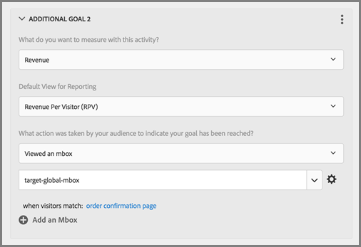

# Questions fréquentes relatives aux mbox globales

Liste des questions fréquentes (FAQ) relatives aux mbox globales.

## Puis-je avoir plusieurs mbox globales si mon compte [!DNL Target] est défini sur plusieurs domaines ?

Une seule mbox globale est prise en charge pour l’ensemble du compte.

Vous pouvez limiter l’exécution des activités en ajoutant des règles d’URL à ces dernières. Pour plus d’informations, voir [Inclure la même expérience sur des pages similaires](https://experienceleague.adobe.com/docs/target/using/experiences/vec/temtest.html).

Vous pouvez également transmettre un paramètre sur la page à l’aide de [targetPageParams](/help/dev/implement/client-side/atjs/atjs-functions/targetpageparams.md), puis sélectionner ces paramètres dans la section « Configurer l’URL » du [!UICONTROL Compositeur d’expérience visuelle] (VEC) ou en ajoutant les paramètres en tant que « affinements » dans le [!UICONTROL Compositeur d’expérience d’après les formulaires].

## Comment transmettre les données de chiffre d’affaires sur une mbox globale [!DNL Target] ?

Pour collecter les informations de chiffre d’affaires et de commande sur la target-global-mbox, les « paramètres de mbox » doivent être envoyés à [!DNL Target]. Ces paramètres sont des paires nom/valeur utilisées pour envoyer plus d’informations à [!DNL Target]. [!DNL Target] recherche automatiquement ces paramètres (noms réservés) pour renseigner les données de chiffre d’affaires.

Pour la `orderConfirmPage`, vous devez transmettre `orderTotal`, `orderId` et `productPurchasedId`.

Ces paramètres doivent être envoyés à target-global-mbox via `targetPageParams()`. Pour plus d’informations, veuillez consulter la section [Transfert de paramètres vers une mbox globale](/help/dev/implement/client-side/atjs/global-mbox/pass-parameters-to-global-mbox.md).

Vous souhaiterez également ajouter le ciblage à l’élément de conversion afin que [!DNL Target] ne compte les conversions sur target-global-mbox que lorsque la page de confirmation de commande a été consultée, comme illustré ci-dessous :

La section Pages du site illustrée ci-dessus comporte les sélections suivantes : Page actuelle, URL, contient, orderconfirm.

Les options de l’illustration ci-dessus incluent les paramètres suivants :

* **Que souhaitez-vous mesurer avec cette activité ? :** Recettes
* **Affichage par défaut pour les rapports :** Recettes par visiteur (RPV)
* **Quelle action a été entreprise par votre audience pour indiquer que votre objectif a été atteint ?** mbox affichée : target-global-mbox
