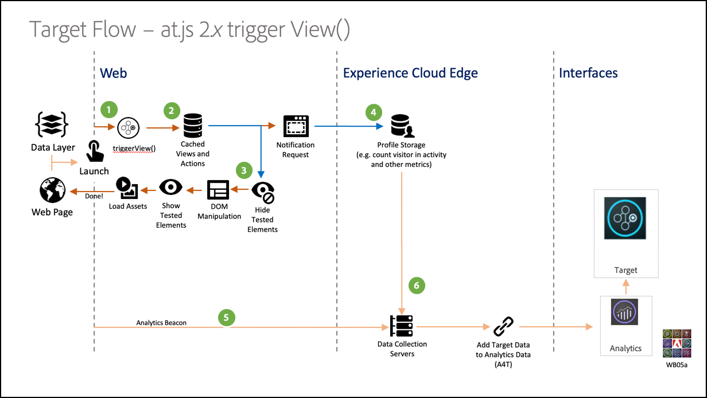

# Mise en œuvre d’une application d’une seule page

Les sites Web traditionnels fonctionnaient sur des modèles de navigation « page à page », appelés également applications multi-pages dans lesquelles les conceptions de site Web étaient étroitement couplées à des URL et les transitions d’une page Web à une autre nécessitaient un chargement de page. Les applications Web modernes, comme les applications monopages, adoptent plutôt un modèle qui projette rapidement le rendu de l’interface utilisateur du navigateur, ce qui est souvent indépendant des rechargements de page. Ces expériences sont souvent déclenchées par des interactions client, comme faire défiler, cliquer et faire bouger le curseur. À mesure de l’évolution des paradigmes du Web moderne, la pertinence des événements génériques traditionnels, comme le chargement des pages, pour déployer la personnalisation et les expériences ne fonctionnent plus.


at.js 2.x offre des fonctionnalités diversifiées qui permettent à votre entreprise d’exécuter la personnalisation sur les technologies côté client de nouvelle génération. Cette version vise à améliorer at.js pour obtenir des interactions harmonieuses avec les applications monopages.

Voici quelques avantages de l’utilisation d’at.js 2.x qui ne sont pas disponibles dans les versions précédentes :

* Capacité à mettre en cache toutes les offres au chargement de la page afin de passer de plusieurs appels serveur à un seul appel serveur.
* Améliorez considérablement l’expérience de vos utilisateurs finaux sur votre site, car les offres sont immédiatement affichées via le cache, sans délai par les appels de serveur traditionnels.
* Une simple ligne de code et une configuration de développement unique pour permettre aux spécialistes marketing de créer et d’exécuter des activités A/B et de ciblage d’expérience (WT) via le VEC sur votre application monopage.

## [!DNL Adobe Target] vues et applications d’une seule page

Le VEC [!DNL Adobe Target] pour SPA tire parti d’un nouveau concept appelé Vues : un groupe logique d’éléments visuels qui, ensemble, constituent une expérience SPA. Une application d’une seule page (SPA) peut donc être considérée comme une transition entre les vues (et pas entre les URL) basée sur les interactions des utilisateurs. Une Vue peut généralement représenter un site entier ou des éléments visuels regroupés dans un site.

Pour en savoir plus sur ce que sont les vues, parcourez cet hypothétique site d’e-commerce en ligne implémenté dans React et explorez quelques exemples de vues. Cliquez sur les liens ci-dessous pour ouvrir ce site dans un nouvel onglet du navigateur.

**Lien : [Home Site](https://target.enablementadobe.com/react/demo/#/)**


Lorsque nous arrivons sur la page d’accueil, nous voyons immédiatement une image à forte identification qui présente les soldes de Pâques ainsi que les produits les plus récents en vente sur le site. Dans ce cas, une Vue peut être définie comme tout le site d’accueil. Ceci est à noter, car nous allons en développer davantage dans la section Implémentation de [!DNL Adobe Target] vues ci-dessous.

**Lien : [Site produit](https://target.enablementadobe.com/react/demo/#/products)**


Comme les produits vendus par l’entreprise nous paraissent intéressants, nous décidons de cliquer sur le lien Produits. Comme pour le site d’accueil, l’intégralité du site de produits peut être définie comme une ue.V Nous pouvons nommer cet affichage « produits » comme le nom de chemin d’accès dans `https://target.enablementadobe.com/react/demo/#/products)`.


Au début de cette section, nous avons défini les vues en tant que site entier ou même un groupe d’éléments visuels sur le site. Comme illustré ci-dessus, les quatre produits affichés sur le site peuvent également être regroupés et considérés comme une vue. Si nous souhaitons donner un nom à cet affichage, nous pouvons l’appeler « Produits ».


Nous décidons de cliquer sur le bouton Voir Plus pour découvrir d’autres produits sur le site. L’URL du site Web ne change pas dans ce cas. Mais une Vue ici ne représente que la deuxième ligne des produits ci-dessus. Cette Vue peut être appelée « PAGE-PRODUIT-2 ».

**Lien : [Passage en caisse](https://target.enablementadobe.com/react/demo/#/checkout)**


Comme nous avons aimé certains produits sur le site, nous avons décidé d’en acheter quelques uns. Sur la page de paiement du site, certaines options permettent de choisir une livraison normale ou express. Parce qu’une Vue peut être n’importe quel groupe d’éléments visuels sur un site, nous pouvons l’appeler « Vue des préférences de livraison ».

De plus, le concept des Vues peut être beaucoup plus étendu. Si les marketeurs souhaitent personnaliser le contenu du site selon la préférence de livraison sélectionnée, une Vue peut être créée pour chaque préférence de livraison. Dans ce cas, lorsque vous sélectionnez Livraison normale, l’affichage peut être appelé « Livraison normale ». Si l’option Livraison express est sélectionnée, l’affichage peut être appelé « Livraison express ».

Désormais, les spécialistes en marketing peuvent exécuter un test A/B pour déterminer si la modification de la couleur du bleu au rouge lorsque la livraison express est sélectionnée peut augmenter les conversions, contrairement au bouton de couleur bleue pour les deux options de livraison.

## Implémentation de [!DNL Adobe Target] vues

Maintenant que nous avons examiné les [!DNL Adobe Target] vues, nous pouvons exploiter ce concept dans [!DNL Target] pour permettre aux marketeurs d’exécuter des tests A/B et XT sur SPA via le VEC. Une configuration développeur unique sera nécessaire. Passons en revue les étapes de la configuration.

1. Installez at.js 2.*x*.

   Tout d’abord, nous devons installer at.js 2.*x*. Cette version d’at.js a été développée avec SPA en tête. Les versions précédentes d’at.js ne prennent pas en charge [!DNL Adobe Target] vues et le compositeur d’expérience visuelle pour SPA.

   Téléchargez at.js 2.*x* via l’interface utilisateur [!DNL Adobe Target] située dans **[!UICONTROL Administration]** > **[!UICONTROL Implementation]**. at.js 2.*x* peut également être déployé via des balises dans [!DNL Adobe Experience Platform].

1. Implémentez at.js 2.fonction *x*, `[triggerView()](/help/dev/implement/client-side/atjs/atjs-functions/adobe-target-triggerview-atjs-2.md)` sur vos sites.

   Après avoir défini les affichages de votre SPA où vous souhaitez exécuter un test A/B ou XT, implémentez at.js 2.*x* `triggerView()` avec les vues transmises en tant que paramètre. Cela permet aux spécialistes du marketing d’utiliser le compositeur d’expérience visuelle pour concevoir et exécuter les tests A/B et XT pour ces vues définies. Si la fonction `triggerView()` n’est pas définie pour ces affichages, le VEC ne détectera pas les affichages. Les spécialistes en marketing ne peuvent donc pas utiliser le VEC pour concevoir et exécuter des tests A/B et XT.

   >[!NOTE]
   >
   >Pour la prise en charge des vues dans at.js, [viewsEnabled](/help/dev/implement/client-side/atjs/atjs-functions/targetglobalsettings.md#viewsenbabled) doit être défini sur true, sinon toutes les fonctionnalités d’affichage sont désactivées.

   **`adobe.target.triggerView(viewName, options)`**

   | Paramètre | Type | Obligatoire ? | Validation | Description |
   | --- | --- | --- | --- | --- |
   | viewName | Chaîne | Oui | 1. Aucun espace à la fin.<br />2. Ne peut pas être vide.<br />3. Le nom de la vue doit être unique pour toutes les pages.<br />4. **Avertissement** : le nom de l’affichage ne doit pas commencer ou se terminer par « `/` ». Cela est dû au fait que le client extrait généralement le nom de la vue à partir du chemin d’URL. Pour nous, « accueil » et « `/home` » sont différents.<br />5. **Avertissement** : la même vue ne doit pas être déclenchée plusieurs fois avec l’option `{page: true}`. | Transmettez n’importe quel nom en tant que type de chaîne que vous souhaitez représenter votre vue. Ce nom d’affichage s’affiche dans le panneau **[!UICONTROL Modifications]** du VEC pour que les marketeurs puissent créer des actions et exécuter leurs activités A/B et XT. |
   | Options | Objet | Non |  |  |
   | options > page | Booléen | Non |  | **TRUE** : la valeur par défaut de la page est true. Lorsque `page=true`, des notifications sont envoyées aux serveurs Edge pour incrémenter le nombre d’impressions.<br />**FALSE** : lorsque `page=false` des notifications sont envoyées pour incrémenter le nombre d’impressions. Cette opération ne doit être utilisée que si vous souhaitez recréer un composant sur une page avec une offre. |

   Examinons maintenant quelques exemples d’utilisation pour appeler la fonction `triggerView()` dans React pour notre hypothétique SPA de commerce électronique :

   **Lien : [Home Site](https://target.enablementadobe.com/react/demo/#/)**

   

   En tant que marketeurs, si nous souhaitons exécuter des tests A/B sur tout le site d’accueil, nous pouvons nommer la vue « accueil » :

```
 function targetView() {
   var viewName = window.location.hash; // or use window.location.pathName if router works on path and not hash

   viewName = viewName || 'home'; // view name cannot be empty

   // Sanitize viewName to get rid of any trailing symbols derived from URL
   if (viewName.startsWith('#') || viewName.startsWith('/')) {
     viewName = viewName.substr(1);
   }

   // Validate if the Target Libraries are available on your website
   if (typeof adobe != 'undefined' && adobe.target && typeof adobe.target.triggerView === 'function') {
     adobe.target.triggerView(viewName);
   }
 }

 // react router v4
 const history = syncHistoryWithStore(createBrowserHistory(), store);
 history.listen(targetView);

 // react router v3
 <Router history={hashHistory} onUpdate={targetView} >
```

**Lien : [Site de produits](https://target.enablementadobe.com/react/demo/#/products)**

Maintenant, regardons un exemple un peu plus compliqué. En tant que marketeurs, nous voulons personnaliser la deuxième ligne des produits en changeant la couleur de l’étiquette &quot;Prix&quot; en rouge après qu’un utilisateur a cliqué sur le bouton Charger plus.


```
 function targetView(viewName) {
   // Validate if the Target Libraries are available on your website
   if (typeof adobe != 'undefined' && adobe.target && typeof adobe.target.triggerView === 'function') {
     adobe.target.triggerView(viewName);
   }
 }

 class Products extends Component {
   render() {
     return (
       <button type="button" onClick={this.handleLoadMoreClicked}>Load more</button>
     );
   }

   handleLoadMoreClicked() {
     var page = this.state.page + 1; // assuming page number is derived from component's state
     this.setState({page: page});
     targetView('PRODUCTS-PAGE-' + page);
   }
 }
```

**Lien : [Passage en caisse](https://target.enablementadobe.com/react/demo/#/checkout)**


Si les marketeurs souhaitent personnaliser le contenu du site selon la préférence de livraison sélectionnée, une Vue peut être créée pour chaque préférence de livraison. Dans ce cas, lorsque vous sélectionnez Livraison normale, l’affichage peut être appelé « Livraison normale ». Si l’option Livraison express est sélectionnée, l’affichage peut être appelé « Livraison express ».

Les marketeurs souhaitent à présent exécuter un test AB pour déterminer si la modification de la couleur du bleu au rouge augmente les conversations lorsque la livraison express est sélectionnée, au lieu de conserver la couleur du bouton bleu pour les deux options de livraison.

```
 function targetView(viewName) {
   // Validate if the Target Libraries are available on your website
   if (typeof adobe != 'undefined' && adobe.target && typeof adobe.target.triggerView === 'function') {
     adobe.target.triggerView(viewName);
   }
 }

 class Checkout extends Component {
   render() {
     return (
       <div onChange={this.onDeliveryPreferenceChanged}>
         <label>
           <input type="radio" id="normal" name="deliveryPreference" value={"Normal Delivery"} defaultChecked={true}/>
           <span> Normal Delivery (7-10 business days)</span>
         </label>

         <label>
           <input type="radio" id="express" name="deliveryPreference" value={"Express Delivery"}/>
           <span> Express Delivery* (2-3 business days)</span>
         </label>
       </div>
     );
   }
   onDeliveryPreferenceChanged(evt) {
     var selectedPreferenceValue = evt.target.value;
     targetView(selectedPreferenceValue);
   }
 }
```

## Diagrammes du système at.js 2.x

Les diagrammes suivants vous aident à comprendre le workflow de tâches d’at.js 2.x avec les vues et la manière dont cela améliore l’intégration des applications web monopages. Pour une meilleure présentation des concepts utilisés dans at.js 2.x, voir [Implémentation d’applications monopage](/help/dev/implement/client-side/atjs/how-to-deployatjs/target-atjs-single-page-application.md).


| Étape | Détails |
| --- | --- |
| 1 | L’appel renvoie l’ID d’Experience Cloud si l’utilisateur est authentifié ; un autre appel synchronise l’ID de client. |
| 2 | La bibliothèque at.js se charge de manière synchrone et masque le corps du document.<br />at.js peut également être chargé de manière asynchrone avec une option pré-masquant l’extrait de code implémenté sur la page. |
| 3 | Une demande de chargement de page est faite, incluant tous les paramètres configurés (MCID, SDID et ID client). |
| 4 | Les scripts de profil s’exécutent, puis sont introduits dans le magasin de profils. Le magasin demande des audiences qualifiées auprès de la bibliothèque d’audiences (par exemple, audiences partagées depuis Adobe Analytics, Gestion de l’audience, etc.).<br />Les attributs du client sont envoyés par lot dans le magasin de profils. |
| 5 | Selon les paramètres de requête d’URL et les données de profil, [!DNL Target] décidez quelles activités et expériences renvoyer au visiteur pour la page active et les futures vues. |
| 6 | Le contenu ciblé est renvoyé à la page, comprenant, éventuellement, les valeurs de profil pour une personnalisation plus poussée.<br />Le contenu ciblé sur la page actuelle est affiché aussi rapidement que possible, sans scintillement du contenu par défaut.<br />Contenu ciblé pour les vues présentées à la suite d’actions de l’utilisateur dans une application d’une seule page cache dans le navigateur, afin qu’elles puissent être appliquées instantanément sans appel au serveur supplémentaire lorsque les vues sont `triggerView()` déclenchées. |
| 7 | Les données Analytics sont envoyées aux serveurs de collecte de données. |
| 8 | Les données ciblées sont associées à des données [!DNL Analytics] via le SDID et sont traitées dans le stockage de rapports [!DNL Analytics].<br />Les données Analytics peuvent ensuite être visualisées dans [!DNL Analytics] et [!DNL Target] via [!DNL Analytics] pour les rapports [!DNL Target] (A4T). |

Désormais, où que soit implémenté `triggerView()` sur votre application d’une seule page, les vues et actions sont récupérées depuis le cache et présentées à l’utilisateur sans appel au serveur. `triggerView()` envoie également une demande de notification au serveur principal [!DNL Target] afin d’incrémenter et d’enregistrer le nombre d’impressions.



| Étape | Détails |
| --- | --- |
| 1 | `triggerView()` est appelée dans l’application d’une seule page pour afficher les vues et appliquer les actions pour modifier les éléments visuels. |
| 2 | Le contenu ciblé pour la vue est lu à partir du cache. |
| 3 | Le contenu ciblé s’affiche aussi rapidement que possible, sans scintillement du contenu par défaut. |
| 4 | La demande de notification est envoyée au magasin de profils [!DNL Target] pour compter le visiteur dans l’activité et incrémenter les mesures. |
| 5 | Les données Analytics sont envoyées aux serveurs de collecte de données. |
| 6 | Les données Target sont associées à des données [!DNL Analytics] par l’intermédiaire du SDID et sont traitées dans le stockage de rapports [!DNL Analytics]. Les données [!DNL Analytics] peuvent ensuite être visualisées dans [!DNL Analytics] et [!DNL Target] au moyen de rapports A4T. |

## Compositeur d’expérience visuelle pour les applications monopages

Après avoir installé le fichier at.js 2.x et l’avoir ajouté `triggerView()` à votre site, utilisez VEC pour exécuter les activités AB et XT. Pour plus d’informations, reportez-vous au [Compositeur d’expérience visuelle pour application d’une seule page (SPA)](https://experienceleague.adobe.com/docs/target/using/experiences/spa-visual-experience-composer.html?lang=fr).

>[!NOTE]
>
>Le compositeur d’expérience visuelle pour applications d’une seule page est en fait le même compositeur d’expérience visuelle que celui que vous utilisez sur les pages web ordinaires, mais certaines fonctionnalités supplémentaires sont disponibles lorsque vous ouvrez une application d’une seule page avec l’implémentation `triggerView()`.

## Utilisez TriggerView pour vous assurer que A4T fonctionne correctement avec at.js 2.x et SPA

Pour vous assurer que [Analytics for Target](https://experienceleague.adobe.com/docs/target/using/integrate/a4t/a4t.html?lang=fr) (A4T) fonctionne correctement avec at.js 2.x, veillez à envoyer le même SDID dans la requête [!DNL Target] et dans la requête [!DNL Analytics].

En tant que bonnes pratiques liées aux applications monopages :

* Utilisez des événements personnalisés pour signaler qu’un élément intéressant se produit dans l’application
* Déclenchez un événement personnalisé avant que la vue ne commence le rendu
* Déclenchement d’un événement personnalisé lorsque la vue termine le rendu

at.js 2.x a ajouté une nouvelle fonction API [déclencheur de vue()](/help/dev/implement/client-side/atjs/atjs-functions/adobe-target-triggerview-atjs-2.md). Vous devez utiliser `triggerView()` pour informer at.js qu’une vue commence le rendu.

Pour découvrir comment combiner des événements personnalisés, at.js 2.x et Analytics, voyons un exemple. Cet exemple suppose que la page HTML contient l’API visiteur, suivie d’at.js 2.x, suivie d’AppMeasurement.

Supposons que les événements personnalisés suivants soient présents :

* `at-view-start` - Lorsque la vue commence le rendu
* `at-view-end` - Lorsque la vue termine le rendu

Pour vérifier qu’A4T fonctionne avec at.js 2.x,

Le gestionnaire de démarrage d’affichage doit se présenter comme suit :

```jsx {line-numbers="true"}
document.addEventListener("at-view-start", function(e) {
  var visitor = Visitor.getInstance("<your Adobe Org ID>");
  
  visitor.resetState();
  adobe.target.triggerView("<view name>");
});
```

Le gestionnaire de fin d’affichage doit ressembler à ceci :

```jsx {line-numbers="true"}
document.addEventListener("at-view-end", function(e) {
  // s - is the AppMeasurement tracker object
  s.t();
});
```

>[!NOTE]
>
>Vous devez déclencher les événements `at-view-start` et `at-view-end`. Ces événements ne font pas partie des événements personnalisés at.js.

Bien que ces exemples utilisent du code JavaScript, tout cela peut être simplifié si vous utilisez un gestionnaire de balises, comme les balises dans [Adobe Experience Platform](/help/dev/implement/client-side/atjs/how-to-deployatjs/implement-target-using-adobe-launch.md).

Si les étapes précédentes sont suivies, vous devez disposer d’une solution A4T robuste pour les applications monopages.

## Bonnes pratiques d’implémentation

Les API at.js 2.x vous permettent de personnaliser votre implémentation [!DNL Target] de plusieurs manières, mais il est important de suivre l’ordre correct des opérations pendant ce processus.

Les informations suivantes décrivent l’ordre des opérations que vous devez suivre lors du chargement d’une application d’une seule page pour la première fois dans un navigateur et pour tout changement d’affichage ultérieur.

### Ordre des opérations pour le chargement initial de la page {#order}

| Étape | Action | Détails |
| --- | --- | --- |
| 1 | Chargement du fichier JavaScript VisitorAPI | Cette bibliothèque est chargée d’affecter un ECID au visiteur. Cet identifiant est ensuite utilisé par d’autres solutions d’Adobe sur la page web. |
| 2 | Chargement d’at.js 2.x | at.js 2.x charge toutes les API nécessaires que vous utilisez pour implémenter les requêtes et vues [!DNL Target]. |
| 3 | Exécuter la requête [!DNL Target] | Si vous disposez d’une couche de données, nous vous recommandons de charger les données critiques qui doivent être envoyées à [!DNL Target] avant d’exécuter la requête [!DNL Target]. Vous pouvez ainsi utiliser `targetPageParams` pour inclure toutes les données à utiliser pour le ciblage.<P>Lorsque `pageLoadEnabled` et `viewsEnabled` sont définis sur true dans [targetGlobalSettings](/help/dev/implement/client-side/atjs/atjs-functions/targetglobalsettings.md), at.js demande automatiquement toutes les offres du VEC [!DNL Target] à votre place à l’étape 2.<P>Notez que `getOffers` peut également être utilisé pour obtenir des offres du VEC après le chargement de la page. Pour ce faire, assurez-vous que la requête inclut `execute>pageLoad` et `prefetch>views` dans l’appel API. |
| 4 | Appel `triggerView()` | Étant donné que la requête [!DNL Target] que vous avez lancée à l’étape 3 peut renvoyer des expériences pour l’exécution du chargement de page ainsi que pour les vues, assurez-vous que `triggerView()` est appelé une fois la requête [!DNL Target] renvoyée et que l’application des offres à la mémoire cache est terminée. Vous ne devez exécuter cette étape qu’une seule fois par vue. |
| 5 | Appelez la balise de page vue [!DNL Analytics] | Cette balise envoie le SDID associé aux étapes 3 et 4 à [!DNL Analytics] pour l’assemblage de données. |
| 6 | Appel de `triggerView({"page": false})` supplémentaires | Il s’agit d’une étape facultative pour les structures SPA qui peuvent potentiellement rendre à nouveau certains composants sur la page sans qu’un changement d’affichage ne se produise. Dans de telles occasions, il est important d’appeler cette API pour vous assurer que [!DNL Target] expériences sont réappliquées une fois que la structure SPA a rendu les composants. Vous pouvez exécuter cette étape autant de fois que vous souhaitez vous assurer que les expériences [!DNL Target] persistent dans vos vues SPA. |

### Ordre des opérations pour le changement d’affichage SPA (aucun rechargement de page complet)

| Étape | Action | Détails |
| --- | --- | --- |
| 1 | Appel `visitor.resetState()` | Cette API garantit que le SDID est à nouveau généré pour la nouvelle vue au fur et à mesure de son chargement. |
| 2 | Mettre à jour le cache en appelant l’API `getOffers()` | Il s’agit d’une étape facultative à entreprendre si ce changement d’affichage peut qualifier le visiteur actuel pour plus d’activités [!DNL Target] ou le exclure des activités. À ce stade, vous pouvez également choisir d’envoyer des données supplémentaires à [!DNL Target] pour activer d’autres fonctionnalités de ciblage. |
| 3 | Appel `triggerView()` | Si vous avez exécuté l’étape 2, vous devez attendre la requête [!DNL Target] et appliquer les offres à mettre en cache avant d’exécuter cette étape. Vous ne devez exécuter cette étape qu’une seule fois par vue. |
| 4 | Appel `triggerView()` | Si vous n’avez pas exécuté l’étape 2, vous pouvez exécuter cette étape dès que vous avez terminé l’étape 1. Si vous avez exécuté les étapes 2 et 3, ignorez cette étape. Vous ne devez exécuter cette étape qu’une seule fois par vue. |
| 5 | Appelez la balise de page vue [!DNL Analytics] | Cette balise envoie le SDID associé aux étapes 2, 3 et 4 à [!DNL Analytics] pour le groupement de données. |
| 6 | Appel de `triggerView({"page": false})` supplémentaires | Il s’agit d’une étape facultative pour les structures SPA qui peuvent potentiellement rendre à nouveau certains composants sur la page sans qu’un changement d’affichage ne se produise. Dans de telles occasions, il est important d’appeler cette API pour vous assurer que [!DNL Target] expériences sont réappliquées une fois que la structure SPA a rendu les composants. Vous pouvez exécuter cette étape autant de fois que vous souhaitez vous assurer que les expériences [!DNL Target] persistent dans vos vues SPA. |

## Vidéos de formation

Les vidéos suivantes comprennent davantage d’informations :

### Fonctionnement d’at.js 2

>[!VIDEO](https://video.tv.adobe.com/v/26250/?quality=12)

Pour plus d’informations, consultez la page [Fonctionnement d’at.js 2.x](https://experienceleague.adobe.com/docs/target-learn/tutorials/implementation/understanding-how-atjs-20-works.html?lang=fr).

### Implémentation d’at.js 2 dans une application d’une seule page

>[!VIDEO](https://video.tv.adobe.com/v/34765/?quality=12&captions=fre_fr)

Pour plus d’informations, voir [Mise en oeuvre d’Adobe Target at.js 2.x dans une application d’une seule page (SPA)](https://experienceleague.adobe.com/docs/target-learn/tutorials/experiences/use-the-visual-experience-composer-for-single-page-applications.html?lang=fr) .

### Utilisation du VEC pour SPA dans [!DNL Adobe Target]

>[!VIDEO](https://video.tv.adobe.com/v/34769/?quality=12&captions=fre_fr)

Pour plus d’informations, voir [Utilisation du compositeur d’expérience visuelle pour application d’une seule page (SPA VEC) dans Adobe Target](https://experienceleague.adobe.com/docs/target-learn/tutorials/experiences/use-the-visual-experience-composer-for-single-page-applications.html?lang=fr) .
