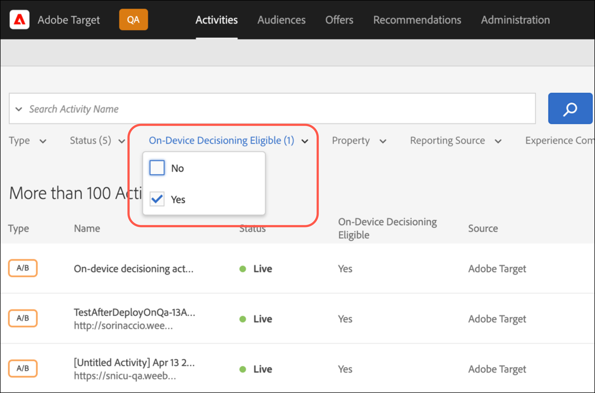

# [!UICONTROL On-device decisioning] pour at.js

À partir de la version 2.5.0, at.js propose [!UICONTROL on-device decisioning]. [!UICONTROL On-device decisioning] vous permet de mettre en cache vos activités [Test A/B](https://experienceleague.adobe.com/docs/target/using/activities/abtest/test-ab.html) et [Ciblage d’expérience](https://experienceleague.adobe.com/docs/target/using/activities/experience-targeting/experience-target.html) (XT) sur le navigateur afin d’effectuer une prise de décision en mémoire sans bloquer une requête réseau à l’Edge Network [!DNL Adobe Target].

>[!NOTE]
>
>[!UICONTROL On-device decisioning] est disponible pour les implémentations côté client et côté serveur. Cet article décrit [!UICONTROL on-device decisioning] côté client. Pour plus d’informations sur [!UICONTROL on-device decisioning] côté serveur, consultez la documentation de mise en oeuvre côté serveur [ici](../../../server-side/sdk-guides/on-device-decisioning/overview.md).

[!DNL Target] offre également la flexibilité de fournir l’expérience la plus pertinente et la plus à jour à partir de vos activités de personnalisation d’expérimentation et d’apprentissage automatique (pilotées par ML) via un appel serveur actif. En d’autres termes, lorsque les performances sont plus importantes, vous pouvez choisir d’utiliser [!UICONTROL on-device decisioning]. Cependant, lorsque l’expérience la plus pertinente, à jour et pilotée par ML est nécessaire, un appel au serveur peut être effectué à la place.

## Quels sont les avantages de [!UICONTROL on-device decisioning] ?

Les avantages de [!UICONTROL on-device decisioning] incluent :

* **Proposez des décisions et des expériences rapides et éblouissantes.** Le regroupement et la prise de décision sont effectués en mémoire et sur le navigateur afin d’éviter de bloquer les requêtes réseau.
* **Améliorez les performances de l’application.** Exécutez des expériences et diffusez la personnalisation à vos clients et utilisateurs sans compromettre les expériences de l’utilisateur final.
* **Améliorez le score de qualité du site Google.** Une fois la prise de décision en mémoire, améliorez le score de qualité du site Google de votre entreprise en ligne pour le rendre plus facilement détectable par les consommateurs.
* **Découvrez les analyses en temps réel.** Obtenez des informations sur les performances de votre activité en temps réel au moyen des rapports [Analytics for Target](https://experienceleague.adobe.com/docs/target/using/integrate/a4t/a4t.html) (A4T). A4T vous permet de faire pivoter votre stratégie à des moments critiques.

## Fonctionnalités prises en charge

Le SDK JS [!DNL Adobe Target] offre aux clients la possibilité de choisir entre les performances et l’actualisation des données pour les décisions. En d’autres termes, si la diffusion de contenu personnalisé le plus pertinent et attrayant par le biais de l’apprentissage automatique est la plus importante pour vous, un appel au serveur en direct doit être effectué. Mais lorsque les performances sont plus critiques, une décision doit être prise sur l’appareil et en mémoire. Pour que [!UICONTROL on-device decisioning] fonctionne, reportez-vous à la liste des fonctionnalités prises en charge :

* Types d’activités
* Ciblage de l’audience
* Méthode d’affectation

Pour plus d’informations, voir [Fonctionnalités prises en charge pour [!UICONTROL on-device decisioning]](/help/dev/implement/client-side/atjs/on-device-decisioning/supported-features.md).

## Comment fonctionne [!UICONTROL on-device decisioning] ?

Lorsque vous déployez et initialisez at.js avec [!UICONTROL on-device decisioning] activé, un [artefact de règle](/help/dev/implement/client-side/atjs/on-device-decisioning/rule-artifact.md) qui inclut votre [!UICONTROL on-device decisioning] pour les activités A/B et XT, les audiences et les ressources, est téléchargé à partir du réseau de diffusion de contenu Akamai le plus proche de votre visiteur et mis en cache localement sur le navigateur de votre visiteur. Lorsqu’une demande est envoyée à partir d’at.js pour récupérer une expérience, la décision concernant l’expérience à renvoyer est prise en mémoire, en fonction des métadonnées codées dans l’artefact de règle mis en cache.

## Méthode de prise de décision

Avec [!UICONTROL on-device decisioning], [!DNL Target] introduit un nouveau paramètre appelé Méthode de prise de décision. Le paramètre Méthode de prise de décision détermine la manière dont at.js diffuse vos expériences. La méthode de prise de décision comporte trois valeurs :

* Côté serveur uniquement
* Sur appareil uniquement
* Hybride

### Côté serveur uniquement

Côté serveur uniquement, la méthode de prise de décision par défaut est configurée en standard lorsque at.js 2.5.0+ est implémenté et déployé sur vos propriétés web.

L’utilisation de la configuration côté serveur uniquement comme configuration par défaut signifie que toutes les décisions sont prises sur le réseau Edge [!DNL Target], ce qui implique un appel au serveur de blocage. Cette approche peut introduire une latence incrémentielle, mais elle offre également des avantages significatifs, comme la possibilité d&#39;appliquer les fonctionnalités d&#39;apprentissage automatique de [!DNL Target] qui incluent les activités [Recommendations](https://experienceleague.adobe.com/docs/target/using/recommendations/recommendations.html), [Automated Personalization](https://experienceleague.adobe.com/docs/target/using/activities/automated-personalization/automated-personalization.html) (AP) et de [ciblage automatique](https://experienceleague.adobe.com/docs/target/using/activities/auto-target/auto-target-to-optimize.html).

En outre, l’amélioration de vos expériences personnalisées à l’aide du profil utilisateur de [!DNL Target], qui est persistant entre les sessions et les canaux, peut fournir de puissants résultats pour votre entreprise.

Enfin, côté serveur, vous pouvez uniquement utiliser Adobe Experience Cloud et affiner les audiences qui peuvent être ciblées par le biais des segments d’Audience Manager et d’Adobe Analytics.

Le diagramme suivant illustre l’interaction entre votre visiteur, le navigateur, at.js 2.5.0+ et le réseau Edge [!DNL Adobe Target]. Ce diagramme de flux capture les nouveaux visiteurs et les visiteurs récurrents.

(Cliquez sur l’image pour agrandir l’image en largeur réelle.)

{zoomable="yes"}

La liste suivante correspond aux nombres du diagramme :

| Étape | Description |
| --- | --- |
| 1 | L’identifiant visiteur Experience Cloud est récupéré à partir du [service Adobe Experience Cloud Identity](https://experienceleague.adobe.com/docs/id-service/using/home.html?). |
| 2 | La bibliothèque at.js se charge de manière synchrone et masque le corps du document.<br />   La bibliothèque at.js peut également être chargée de manière asynchrone avec un fragment de code de prémasquage facultatif implémenté sur la page. |
| 3 | La bibliothèque at.js masque le corps pour éviter le scintillement. |
| 4 | Une requête de chargement de page est envoyée, qui inclut tous les paramètres configurés, tels que (ECID, ID de client, paramètres personnalisés, profil utilisateur, etc.). |
| 5 | Les scripts de profil s’exécutent, puis sont introduits dans le magasin de profils.<br />Le magasin de profils demande des audiences qualifiées auprès de la bibliothèque d’audiences (par exemple, audiences partagées à partir d’Adobe Analytics, de Adobe Audience Manager, etc.).<br />Les attributs du client sont envoyés par lot dans le magasin de profils. |
| 6 | La banque de profils est utilisée pour la qualification et le regroupement des audiences afin de filtrer les activités. |
| 7 | Le contenu résultant est sélectionné une fois l’expérience déterminée à partir des activités [!DNL Target] actives. |
| 8 | La bibliothèque at.js masque les éléments correspondants sur la page associés à l’expérience qui doit être rendue. |
| 9 | La bibliothèque at.js affiche le corps afin que le reste de la page puisse être chargé pour que le visiteur puisse l’afficher. |
| 10 | La bibliothèque at.js manipule le DOM pour rendre l’expérience à partir de l’Edge Network [!DNL Target]. |
| 11 | L’expérience est générée pour le visiteur. |
| 12 | La page web entière se charge. |
| 13 | Les données Analytics sont envoyées aux serveurs de collecte de données. |
| 14 | Les données ciblées sont associées aux données Analytics par l’intermédiaire du SDID et sont traitées dans le stockage de rapports Analytics. Les données Analytics peuvent ensuite être visualisées à la fois dans Analytics et [!DNL Target] par l’intermédiaire des rapports [!UICONTROL Analytics for Target] (A4T). |

### Sur appareil uniquement

Sur l’appareil uniquement est la méthode de prise de décision qui doit être définie dans at.js 2.5.0+ lorsque [!UICONTROL on-device decisioning] doit être utilisé uniquement sur l’ensemble de vos pages web.

[!UICONTROL On-device decisioning] peut diffuser rapidement vos expériences et vos activités de personnalisation, car les décisions sont prises à partir d’un artefact de règles mis en cache qui contient toutes vos activités qui remplissent les critères de [!UICONTROL on-device decisioning].

Pour en savoir plus sur les activités admissibles pour [!UICONTROL on-device decisioning], voir [Fonctionnalités prises en charge dans [!UICONTROL on-device decisioning]](/help/dev/implement/client-side/atjs/on-device-decisioning/supported-features.md).

Cette méthode de prise de décision ne doit être utilisée que si les performances sont extrêmement critiques sur toutes les pages qui nécessitent des décisions de Target. De plus, gardez à l’esprit que lorsque cette méthode de prise de décision est sélectionnée, vos activités [!DNL Target] qui ne remplissent pas les critères pour [!UICONTROL on-device decisioning] ne seront pas diffusées ni exécutées. La bibliothèque at.js version 2.5.0+ est configurée pour rechercher uniquement l’artefact de règles mises en cache afin de prendre des décisions.

Le diagramme suivant illustre l’interaction entre votre visiteur, le navigateur, at.js 2.5.0+ et le réseau de diffusion de contenu Akamai. Le réseau de diffusion de contenu Akamai met en cache l’artefact de règles pour la première visite du visiteur. Pour la première visite de page d’un nouveau visiteur, l’artefact de règles JSON doit être téléchargé à partir du réseau de diffusion de contenu Akamai pour être mis en cache localement sur le navigateur du visiteur. Une fois l’artefact de règles JSON téléchargé, la décision est prise immédiatement sans appel réseau de blocage. Le diagramme de flux suivant capture les nouveaux visiteurs.

(Cliquez sur l’image pour agrandir l’image en largeur réelle.)

{zoomable="yes"}

La liste suivante correspond aux nombres du diagramme :

>[!NOTE]
>
>[!DNL Adobe Target] Les serveurs d’administration qualifient toutes vos activités admissibles pour [!UICONTROL on-device decisioning], génèrent l’artefact de règles JSON et le propagent au réseau de diffusion de contenu Akamai. Vos activités sont surveillées en permanence pour que les mises à jour puissent générer un nouvel artefact de règles JSON à propager sur le réseau de diffusion de contenu Akamai.

| Étape | Description |
| --- | --- |
| 1 | L’identifiant visiteur Experience Cloud est récupéré à partir du [service Adobe Experience Cloud Identity](https://experienceleague.adobe.com/docs/id-service/using/home.html). |
| 2 | La bibliothèque at.js se charge de manière synchrone et masque le corps du document.<br />La bibliothèque at.js peut également être chargée de manière asynchrone avec un extrait de code de pré-masquage facultatif implémenté sur la page. |
| 3 | La bibliothèque at.js masque le corps pour éviter le scintillement. |
| 4 | La bibliothèque at.js émet une requête pour récupérer l’artefact de règle JSON du réseau de diffusion de contenu Akamai le plus proche au visiteur. |
| 5 | Le réseau de diffusion de contenu Akamai répond avec l’artefact de règle JSON. |
| 6 | L’artefact de règle JSON est mis en cache localement sur le navigateur du visiteur. |
| 7 | La bibliothèque at.js interprète l’artefact de règle JSON et exécute la décision de récupérer l’expérience et masque les éléments testés. |
| 8 | La bibliothèque at.js affiche le corps afin que le reste de la page puisse être chargé pour que le visiteur puisse l’afficher. |
| 9 | La bibliothèque at.js manipule le modèle DOM pour effectuer le rendu de l’expérience à partir de l’artefact de règle JSON mis en cache. |
| 10 | L’expérience est générée pour le visiteur. |
| 11 | La page web entière se charge. |
| 12 | Les données Analytics sont envoyées aux serveurs de collecte de données. Les données ciblées sont associées aux données Analytics par l’intermédiaire du SDID et sont traitées dans le stockage de rapports Analytics. Les données Analytics peuvent ensuite être visualisées à la fois dans Analytics et [!DNL Target] par l’intermédiaire des rapports [!UICONTROL Analytics for Target] (A4T). |

Le diagramme suivant illustre l’interaction entre votre visiteur, le navigateur, at.js 2.5.0+ et l’artefact de règle JSON mis en cache pour l’accès à la page ou la visite récurrente du visiteur. Comme l’artefact de règles JSON est déjà mis en cache et disponible sur le navigateur, la décision est prise immédiatement sans appel réseau bloquant. Ce diagramme de flux capture la navigation de page ou les visiteurs récurrents qui s’ensuivent.

(Cliquez sur l’image pour agrandir l’image en largeur réelle.)

{zoomable="yes"}

La liste suivante correspond aux nombres du diagramme :

>[!NOTE]
>
>[!DNL Adobe Target] Les serveurs d’administration qualifient toutes vos activités admissibles pour [!UICONTROL on-device decisioning], génèrent l’artefact de règles JSON et le propagent au réseau de diffusion de contenu Akamai. Vos activités sont surveillées en permanence pour que les mises à jour puissent générer un nouvel artefact de règles JSON à propager sur le réseau de diffusion de contenu Akamai.

| Étape | Description |
| --- | --- |
| 1 | L’identifiant visiteur Experience Cloud est récupéré à partir du [service Adobe Experience Cloud Identity](https://experienceleague.adobe.com/docs/id-service/using/home.html). |
| 2 | La bibliothèque at.js se charge de manière synchrone et masque le corps du document.<br />La bibliothèque at.js peut également être chargée de manière asynchrone avec un extrait de code de pré-masquage facultatif implémenté sur la page. |
| 3 | La bibliothèque at.js masque le corps pour éviter le scintillement. |
| 4 | La bibliothèque at.js interprète l’artefact de règle JSON et exécute en mémoire la décision de récupérer l’expérience. |
| 5 | Les éléments testés sont masqués. |
| 6 | La bibliothèque at.js affiche le corps afin que le reste de la page puisse être chargé pour que le visiteur puisse l’afficher. |
| 7 | La bibliothèque at.js manipule le modèle DOM pour effectuer le rendu de l’expérience à partir de l’artefact de règle JSON mis en cache. |
| 8 | L’expérience est générée pour le visiteur. |
| 9 | La page web entière se charge. |
| 10 | Les données Analytics sont envoyées aux serveurs de collecte de données. Les données ciblées sont associées aux données Analytics par l’intermédiaire du SDID et sont traitées dans le stockage de rapports Analytics. Les données Analytics peuvent ensuite être visualisées à la fois dans Analytics et [!DNL Target] par l’intermédiaire des rapports [!UICONTROL Analytics for Target] (A4T). |

### Hybride

Hybride est la méthode de prise de décision qui doit être définie dans at.js 2.5.0+ lorsque [!UICONTROL on-device decisioning] et les activités qui nécessitent un appel réseau au réseau Edge [!DNL Adobe Target] doivent être exécutées.

Lorsque vous gérez à la fois des activités [!UICONTROL on-device decisioning] et des activités côté serveur, cela peut être un peu compliqué et fastidieux lorsque vous réfléchissez à la manière de déployer et de configurer [!DNL Target] sur vos pages. Avec la méthode de prise de décision hybride, [!DNL Target] sait quand il doit effectuer un appel serveur au réseau Edge [!DNL Adobe Target] pour les activités qui nécessitent une exécution côté serveur, et quand exécuter uniquement les décisions sur l’appareil.

L’artefact de règles JSON comprend des métadonnées pour indiquer à at.js si une mbox comporte une activité côté serveur en cours d’exécution ou une activité [!UICONTROL on-device decisioning]. Cette méthode de prise de décision garantit que les activités que vous prévoyez de diffuser rapidement sont exécutées via [!UICONTROL on-device decisioning] et que pour les activités nécessitant une personnalisation plus puissante pilotée par ML, ces activités sont effectuées via le réseau Edge [!DNL Adobe Target].

Le diagramme suivant illustre l’interaction entre votre visiteur, le navigateur, at.js 2.5.0+, le réseau de diffusion de contenu Akamai et l’Edge Network [!DNL Adobe Target] d’un nouveau visiteur qui consulte votre page pour la première fois. Ce diagramme montre que l’artefact de règles JSON est téléchargé de manière asynchrone pendant que les décisions sont prises via le réseau Edge [!DNL Adobe Target].

Cette approche garantit que la taille de l’artefact, qui peut inclure de nombreuses activités, n’influence pas négativement la latence de la décision. Le téléchargement synchrone de l’artefact de règles JSON et la prise de la décision par la suite peuvent également avoir des effets négatifs sur la latence et peuvent être incohérents. Par conséquent, la méthode de prise de décision hybride est une recommandation recommandée pour toujours effectuer un appel côté serveur pour la décision d’un nouveau visiteur, car l’artefact de règles JSON est mis en cache en parallèle. Pour toutes les visites de page suivantes et les visites récurrentes, les décisions sont prises à partir du cache et en mémoire par le biais de l’artefact de règles JSON.

(Cliquez sur l’image pour agrandir l’image en largeur réelle.)

{zoomable="yes"}

La liste suivante correspond aux nombres du diagramme :

>[!NOTE]
>
>[!DNL Adobe Target] Les serveurs d’administration qualifient toutes vos activités admissibles pour [!UICONTROL on-device decisioning], génèrent l’artefact de règles JSON et le propagent au réseau de diffusion de contenu Akamai. Vos activités sont surveillées en permanence pour que les mises à jour puissent générer un nouvel artefact de règles JSON à propager sur le réseau de diffusion de contenu Akamai.

| Étape | Description |
| --- | --- |
| 1 | L’identifiant visiteur Experience Cloud est récupéré à partir du [service Adobe Experience Cloud Identity](https://experienceleague.adobe.com/docs/id-service/using/home.html). |
| 2 | La bibliothèque at.js se charge de manière synchrone et masque le corps du document.<br />La bibliothèque at.js peut également être chargée de manière asynchrone avec un extrait de code de pré-masquage facultatif implémenté sur la page. |
| 3 | La bibliothèque at.js masque le corps pour éviter le scintillement. |
| 4 | Une requête de chargement de page est envoyée à l’Edge Network [!DNL Adobe Target], y compris tous les paramètres configurés tels que (ECID, ID de client, paramètres personnalisés, profil utilisateur, etc.). |
| 5 | En parallèle, at.js émet une requête pour récupérer l’artefact de règle JSON du réseau de diffusion de contenu Akamai le plus proche au visiteur. |
| 6 | ([!DNL Adobe Target] Edge Network) Les scripts de profil s’exécutent, puis sont introduits dans le magasin de profils. Le magasin de profils demande des audiences qualifiées auprès de la bibliothèque d’audiences (par exemple, audiences partagées depuis Adobe Analytics, Adobe Audience Manager, etc.). |
| 7 | Le réseau de diffusion de contenu Akamai répond avec l’artefact de règle JSON. |
| 8 | La banque de profils est utilisée pour la qualification et le regroupement des audiences afin de filtrer les activités. |
| 9 | Le contenu résultant est sélectionné une fois l’expérience déterminée à partir des activités [!DNL Target] actives. |
| 10 | La bibliothèque at.js masque les éléments correspondants sur la page associés à l’expérience qui doit être rendue. |
| 11 | La bibliothèque at.js affiche le corps afin que le reste de la page puisse être chargé pour que le visiteur puisse l’afficher. |
| 12 | La bibliothèque at.js manipule le DOM pour rendre l’expérience à partir de l’Edge Network [!DNL Target]. |
| 13 | L’expérience est générée pour le visiteur. |
| 14 | La page web entière se charge. |
| 15 | Les données Analytics sont envoyées aux serveurs de collecte de données. Les données ciblées sont associées aux données Analytics par l’intermédiaire du SDID et sont traitées dans le stockage de rapports Analytics. Les données Analytics peuvent ensuite être visualisées à la fois dans Analytics et [!DNL Target] par l’intermédiaire des rapports [!UICONTROL Analytics for Target] (A4T). |

Le diagramme suivant illustre l’interaction entre votre visiteur, le navigateur, at.js 2.5.0+ et l’artefact de règles JSON mis en cache pour une navigation de page ou une visite de retour ultérieure. Dans ce diagramme, concentrez-vous uniquement sur le cas d’utilisation où une décision sur l’appareil est prise pour la navigation ou la visite récurrente de la page suivante. Gardez à l’esprit que, selon les activités actives pour certaines pages, un appel côté serveur peut être effectué pour exécuter des décisions côté serveur.

(Cliquez sur l’image pour agrandir l’image en largeur réelle.)

{zoomable="yes"}

La liste suivante correspond aux nombres du diagramme :

>[!NOTE]
>
>[!DNL Adobe Target] Les serveurs d’administration qualifient toutes vos activités admissibles pour [!UICONTROL on-device decisioning], génèrent l’artefact de règles JSON et le propagent au réseau de diffusion de contenu Akamai. Vos activités sont surveillées en permanence pour que les mises à jour puissent générer un nouvel artefact de règles JSON à propager sur le réseau de diffusion de contenu Akamai.

| Étape | Description |
| --- | --- |
| 1 | L’identifiant visiteur Experience Cloud est récupéré à partir du [service Adobe Experience Cloud Identity](https://experienceleague.adobe.com/docs/id-service/using/home.html). |
| 2 | La bibliothèque at.js se charge de manière synchrone et masque le corps du document.<br />La bibliothèque at.js peut également être chargée de manière asynchrone avec un extrait de code de pré-masquage facultatif implémenté sur la page. |
| 3 | La bibliothèque at.js masque le corps pour éviter le scintillement. |
| 4 | Une demande est envoyée pour récupérer une expérience. |
| 5 | La bibliothèque at.js confirme que l’artefact de règle JSON a déjà été mis en cache et exécute en mémoire la décision de récupérer l’expérience. |
| 6 | Les éléments testés sont masqués. |
| 7 | La bibliothèque at.js affiche le corps afin que le reste de la page puisse être chargé pour que le visiteur puisse l’afficher. |
| 8 | La bibliothèque at.js manipule le modèle DOM pour effectuer le rendu de l’expérience à partir de l’artefact de règle JSON mis en cache. |
| 9 | L’expérience est générée pour le visiteur. |
| 10 | La page web entière se charge. |
| 11 | Les données Analytics sont envoyées aux serveurs de collecte de données. Les données ciblées sont associées aux données Analytics par l’intermédiaire du SDID et sont traitées dans le stockage de rapports Analytics. Les données Analytics peuvent ensuite être visualisées à la fois dans Analytics et [!DNL Target] par l’intermédiaire des rapports [!UICONTROL Analytics for Target] (A4T). |

## Comment activer [!UICONTROL on-device decisioning] ?

[!UICONTROL On-device decisioning] est disponible pour tous les clients [!DNL Target] qui utilisent at.js 2.5.0+.

Pour activer [!UICONTROL on-device decisioning] :

>[!NOTE]
>
>Vous devez disposer du [rôle d’utilisateur](https://experienceleague.adobe.com/docs/target/using/administer/manage-users/user-management.html) administrateur ou approbateur pour activer ou désactiver le bouton de prise de décision sur périphérique.

1. Cliquez sur **[!UICONTROL Administration]** > **[!UICONTROL Implementation]** > **[!UICONTROL Account details]**.
1. Sous **[!UICONTROL Account details]**, faites glisser le bouton d’activation/désactivation **[!UICONTROL On-Device Decisioning]** vers la position &quot;actif&quot;.

   ![[!UICONTROL On-device decisioning] toggle](assets/on-device-decisioning-toggle.png)

   L&#39;option &quot;Inclure toutes les activités qualifiées [!UICONTROL on-device decisioning] existantes dans l&#39;artefact&quot; s&#39;affiche si vous activez [!UICONTROL on-device decisioning].
1. (Conditionnel) Faites glisser le bouton d’activation sur la position &quot;Activé&quot; si vous souhaitez que toutes vos activités [!DNL Target] actives qui remplissent les critères pour [!UICONTROL on-device decisioning] soient automatiquement incluses dans l’artefact.

   Si vous laissez ce bouton désactivé, vous devez recréer et activer toute activité [!UICONTROL on-device decisioning] pour qu’elle soit incluse dans l’artefact de règles généré. En d’autres termes, toute activité à l’état actif avant d’activer le bouton bascule de prise de décision sur l’appareil n’est pas incluse dans l’artefact de règles.

Après avoir activé le bouton bascule de prise de décision sur l’appareil, [!DNL Target] commence à générer et à propager les [artefacts de règle](/help/dev/implement/client-side/atjs/on-device-decisioning/rule-artifact.md) pour votre client.

>[!WARNING]
>
>Assurez-vous d’activer le bouton bascule avant d’initialiser le SDK [!DNL Adobe Target] pour utiliser [!UICONTROL on-device decisioning]. Les artefacts de règle doivent d’abord être générés et propagés aux réseaux de diffusion de contenu Akamai pour que [!UICONTROL on-device decisioning] fonctionne. La propagation peut prendre entre cinq et dix minutes pour que le premier artefact de règle soit généré et propagé vers le réseau de diffusion de contenu Akamai.

## Comment configurer at.js 2.5.0+ pour utiliser [!UICONTROL on-device decisioning] ?

1. Cliquez sur **[!UICONTROL Administration]** > **[!UICONTROL Implementation]** > **[!UICONTROL Account details]**.
1. Sous **[!UICONTROL Implementation Methods]** > **[!UICONTROL Main Implementation Method]**, cliquez sur **[!UICONTROL Edit]** en regard de votre version d’at.js (at.js 2.5.0 ou version ultérieure).

   

   >[!WARNING]
   >
   >Avant de modifier ces paramètres par défaut, consultez le service à la clientèle pour éviter d’affecter votre mise en oeuvre actuelle.

1. Sélectionnez la méthode de prise de décision souhaitée :

   * Côté serveur uniquement
   * Sur appareil uniquement
   * Hybride

   

### Paramètres globaux

Vous pouvez configurer une méthode de prise de décision par défaut pour toutes les décisions [!DNL Target]. Les différentes méthodes de prise de décision sont côté serveur uniquement, on-device uniquement et hybride. La méthode de prise de décision sélectionnée dans l’interface utilisateur [!DNL Target] est configurée dans `window.targetGlobalSettings` sous le champ `decisioningMethod`. En savoir plus sur `decisioningMethod` dans [targetGlobalSettings()](/help/dev/implement/client-side/atjs/atjs-functions/targetglobalsettings.md#decisioningmethod).

```javascript {line-numbers="true"}
<head> 
    <script type="text/javascript">

        window.targetGlobalSettings = { 
            clientCode: "yourClientCodeHere", 
            imsOrgId: "imsOrgId@AdobeOrg", 
            decisioningMethod: "on-device"

        }; 
    </script>

    <script type="text/javascript" src="at.js"></script> 
</head>
```

### Paramètre personnalisé

Si vous définissez `decisioningMethod` dans `window.targetGlobalSettings`, mais souhaitez remplacer `decisioningMethod` pour chaque décision [!DNL Adobe Target] en fonction de votre cas d’utilisation, vous pouvez effectuer cette procédure en spécifiant `decisioningMethod` dans l’appel [getOffers()](/help/dev/implement/client-side/atjs/atjs-functions/adobe-target-getoffers-atjs-2.md) d’at.js2.5.0+.

```javascript {line-numbers="true"}
adobe.target.getOffers({ 

  decisioningMethod:"on-device", 
  request: { 
    execute: { 
      mboxes: [ 
        { 
          index: 0, 
          name: "homepage" 
        } 
      ] 
    } 
 } 
});
```

>[!NOTE]
>
>Pour utiliser &quot;sur l’appareil&quot; ou &quot;hybride&quot; comme méthode de prise de décision dans l’appel getOffers() , assurez-vous que le paramètre global a `decisioningMethod` comme &quot;sur l’appareil&quot; ou &quot;hybride&quot;. La bibliothèque at.js version 2.5.0+ doit savoir si l’artefact des règles JSON doit être téléchargé et mis en cache immédiatement après le chargement sur la page. Si la méthode de prise de décision pour le paramètre global est définie sur &quot;côté serveur&quot; et que la méthode de prise de décision &quot;on-device&quot; ou &quot;hybride&quot; est transmise à l’appel getOffers(), at.js 2.5.0+ n’aurait pas l’artefact de règle JSON mis en cache pour exécuter vos décisions sur l’appareil.

### TTL du cache d’artefacts

Target représente vos activités qui remplissent les critères de [!UICONTROL on-device decisioning] comme artefact constitué de métadonnées, de règles et de conditions. Cet artefact est mis en cache sur le réseau de diffusion de contenu Akamai. Lors de la première visite de votre utilisateur, le navigateur de l’utilisateur télécharge et met en cache l’artefact qui représente vos activités [!UICONTROL on-device decisioning].

Lors des visites suivantes sur votre site, le navigateur vérifie automatiquement s’il doit télécharger une version plus récente de l’artefact. Cette vérification ajoute une latence. La durée de vie (TTL) du cache des artefacts définit le nombre de minutes pendant lesquelles le navigateur ne doit pas rechercher un artefact mis à jour depuis le dernier téléchargement réussi. Plus la période est longue, meilleures sont les performances. Plus la période est courte, plus l’actualisation des données est importante, mais au prix d’une latence supplémentaire.

## Comment savoir qu’une activité est [!UICONTROL on-device decisioning] éligible ?

Une fois que vous avez créé une activité [!UICONTROL on-device decisioning] éligible, un libellé qui indique Prise de décision sur l’appareil éligible est visible dans la page Aperçu de l’activité.


Ce libellé ne signifie pas que l’activité sera toujours diffusée via [!UICONTROL on-device decisioning]. Cette activité ne sera exécutée sur l’appareil que lorsque at.js 2.5.0+ est configuré pour utiliser [!UICONTROL on-device decisioning]. Si at.js 2.5.0+ n’est pas configuré pour utiliser sur l’appareil, cette activité sera toujours diffusée via un appel au serveur effectué à partir d’at.js.

Vous pouvez filtrer toutes les activités [!UICONTROL on-device decisioning] éligibles sur la page Activités via le filtre Éligible de prise de décision sur périphérique .



>[!NOTE]
>
>Après avoir créé et activé une activité [!UICONTROL on-device decisioning] éligible, il peut s’écouler entre cinq et dix minutes avant qu’elle ne soit incluse dans l’artefact de règles généré et propagé vers le point de présence Akamai CDN.

## Résumé des étapes pour garantir que mes activités [!UICONTROL on-device decisioning] sont diffusées via At.js 2.5.0+?

1. Accédez à l’interface utilisateur de [!DNL Adobe Target] et accédez à **[!UICONTROL Administration]** > **[!UICONTROL Implementation]** > **[!UICONTROL Account Details]** pour activer le bouton d’activation/désactivation de **[!UICONTROL On-Device Decisioning]**.
1. Activez le bouton bascule **[!UICONTROL "Include all existing [!UICONTROL on-device decisioning] qualified activities in the artifact"]** .

   La première génération d’artefact de règles JSON peut prendre jusqu’à 10 minutes.

1. Créez et activez un type d&#39;activité [pris en charge par [!UICONTROL on-device decisioning]](/help/dev/implement/client-side/atjs/on-device-decisioning/supported-features.md), et vérifiez qu&#39;il est [!UICONTROL on-device decisioning] éligible.
1. Définissez **[!UICONTROL Decisioning Method]** sur **[!UICONTROL "Hybrid"]** ou **[!UICONTROL "On-device only"]** via l’interface utilisateur des paramètres at.js.
1. Téléchargez et déployez at.js 2.5.0+ sur vos pages.
