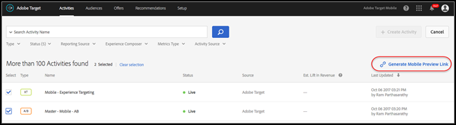
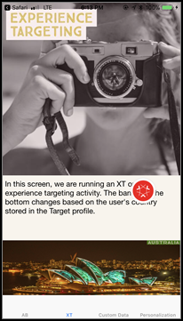

# [!DNL Target] aperçu mobile

Utilisez les liens d’aperçu mobile pour vérifier simplement et de manière exhaustive la qualité des activités des applications mobiles et vous inscrire à différentes expériences à l’aide de votre appareil sans périphérique de test spécial.

La fonctionnalité d’aperçu mobile vous permet de tester entièrement vos activités d’application mobile avant de les lancer en ligne.

## Conditions préalables

1. **Utilisez une version prise en charge du SDK :** La fonction d’aperçu mobile requiert que vous téléchargiez et installez la version appropriée de la fonction [!DNL Adobe Mobile SDK] dans vos applications correspondantes.

   Pour obtenir des instructions sur le téléchargement du SDK approprié, voir [Versions actuelles du SDK](https://developer.adobe.com/client-sdks/documentation/current-sdk-versions/){target=_blank} dans le *[!DNL Adobe Experience Platform Mobile SDK]* la documentation.

1. **Configurez un modèle d’URL :** le lien d’aperçu utilise un modèle d’URL pour ouvrir votre application. Spécifiez un modèle d’URL unique pour l’aperçu.

   Pour plus d’informations, voir [Aperçu visuel](https://developer.adobe.com/client-sdks/documentation/adobe-target/#visual-preview){target=_blank} in *Configuration de l’extension Target dans l’interface utilisateur de connexion aux données* dans le *[!DNL Mobile SDK]* la documentation.

   Les liens suivants contiennent plus d’informations :

   * **iOS**: pour plus d’informations sur la définition de schémas d’URL pour iOS, voir [Définition d’un modèle d’URL personnalisé pour votre application](https://developer.apple.com/documentation/xcode/defining-a-custom-url-scheme-for-your-app){target=_blank} sur le *Développeur Apple* site web.
   * **Android**: pour plus d’informations sur la définition de schémas d’URL pour Android, voir [Création de liens profonds vers le contenu de l’application](https://developer.android.com/training/app-links/deep-linking){target=_blank} sur le *Développeurs Android* site web.

1. **Configurez la variable `collectLaunchInfo` API (i0S uniquement)**

   Pour plus d’informations, voir [Aperçu visuel](https://developer.adobe.com/client-sdks/documentation/adobe-target/#visual-preview){target=_blank} in *Configuration de l’extension Target dans l’interface utilisateur de connexion aux données* dans le *[!DNL Mobile SDK]* la documentation.

## Génération d’un lien d’aperçu

1. Dans le [!DNL Target] Cliquez sur l’interface utilisateur **[!UICONTROL Plus d’options]** (points de suspension verticaux), puis sélectionnez **[!UICONTROL Créer un lien d’aperçu mobile]**.

   

1. Sélectionnez les activités à prévisualiser, puis cliquez sur **[!UICONTROL Générer un lien d’aperçu mobile]**.

   >[!NOTE]
   >
   >Vous pouvez sélectionner uniquement Basé sur un formulaire. [!UICONTROL Test A/B] et [!UICONTROL Ciblage d’expérience] (XT).

   

1. Spécifiez le modèle d’URL de votre application.

   Le modèle d’URL doit être identique à celui existant dans votre application iOS ou Android. Répétez cette procédure séparément pour iOS et Android, si nécessaire.

   

1. Cliquez sur **[!UICONTROL Générer un lien d’aperçu mobile]**, puis copiez le lien.

   

## Afficher l’aperçu sur votre appareil

Ouvrez le lien dans un navigateur mobile sur l’appareil sur lequel vous avez installé votre application. Cette application peut être l’application de production que vous avez téléchargée à partir de [!DNL Apple App Store] ou le [!DNL Google Play Store]. L’application n’a pas besoin d’être une version spéciale. Si vous disposez d’un lien d’aperçu actif, vous pouvez afficher les expériences sur l’appareil.

1. Ouvrez le lien dans votre navigateur mobile.

   Partagez le lien que vous avez copié dans la section précédente à partir du [!DNL Target] de l’interface utilisateur de votre périphérique mobile d’une manière pratique, par exemple en utilisant du texte, des courriers électroniques ou des [!DNL Slack].

   |||

   Votre application s’ouvre et démarre. [!DNL Target] [!UICONTROL Mode Aperçu mobile].

1. Sélectionnez la combinaison d’expériences que vous souhaitez afficher, puis cliquez sur **[!UICONTROL Démarrer les expériences]**.

   ||||
||||

## Limites 

* Après avoir cliqué sur le bouton **[!UICONTROL Démarrer les expériences]**, la vue doit charger à nouveau pour afficher le nouveau contenu. Le moyen le plus simple est de basculer vers un autre écran et de revenir ensuite dans l’écran où la modification doit avoir lieu.
* L’aperçu mobile n’est pas pris en charge pour les versions Android antérieures à API-19 (KitKat).
