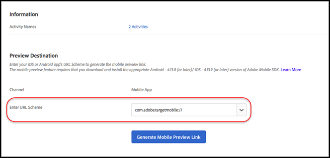
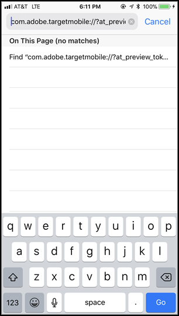

# [!DNL Target] l’aperçu mobile

Utilisez les liens d’aperçu mobile pour effectuer un contrôle qualité de bout en bout facile pour les activités d’applications mobiles et vous inscrire à différentes expériences à l’aide de votre appareil sans appareils de test spéciaux.

La fonctionnalité d’aperçu mobile vous permet de tester entièrement les activités de vos applications mobiles avant de les lancer en direct.

## Conditions préalables

1. **Utiliser une version prise en charge du SDK :** la fonction d’aperçu mobile nécessite que vous téléchargiez et installiez la version appropriée du [!DNL Adobe Mobile SDK] dans vos applications correspondantes.

   Pour obtenir des instructions sur le téléchargement du SDK approprié, voir [Versions actuelles de SDK](https://developer.adobe.com/client-sdks/documentation/current-sdk-versions/){target=_blank} dans la documentation *[!DNL Adobe Experience Platform Mobile SDK]*.

1. **Configurez un modèle d’URL :** le lien d’aperçu utilise un modèle d’URL pour ouvrir votre application. Spécifiez un modèle d’URL unique pour l’aperçu.

   Pour plus d’informations, consultez [Aperçu visuel](https://developer.adobe.com/client-sdks/documentation/adobe-target/#visual-preview){target=_blank} dans *Configuration de l’extension cible dans l’interface utilisateur de connexion aux données* dans la documentation de *[!DNL Mobile SDK]*.

   Les liens suivants contiennent des informations supplémentaires :

   * **iOs** : pour plus d’informations sur la définition de schémas d’URL pour iOS, voir [Définition d’un schéma d’URL personnalisé pour votre application](https://developer.apple.com/documentation/xcode/defining-a-custom-url-scheme-for-your-app){target=_blank} sur le site web *Apple Developer*.
   * **** : pour plus d’informations sur la définition de schémas d’URL pour Android, consultez la section [Créer des liens profonds vers le contenu de l’application](https://developer.android.com/training/app-links/deep-linking){target=_blank} sur le site web *Android Developers*.

1. **Configurer l’API `collectLaunchInfo` (i0S uniquement)**

   Pour plus d’informations, consultez [Aperçu visuel](https://developer.adobe.com/client-sdks/documentation/adobe-target/#visual-preview){target=_blank} dans *Configuration de l’extension cible dans l’interface utilisateur de connexion aux données* dans la documentation de *[!DNL Mobile SDK]*.

## Génération d’un lien d’aperçu

1. Dans l’interface utilisateur de [!DNL Target], cliquez sur l’icône **[!UICONTROL Plus d’options]** (les points de suspension verticaux), puis sélectionnez **[!UICONTROL Créer un lien d’aperçu mobile]**.

   

1. Sélectionnez les activités à prévisualiser, puis cliquez sur **[!UICONTROL Générer un lien d’aperçu mobile]**.

   >[!NOTE]
   >
   >Vous pouvez sélectionner uniquement des activités de test A/B basées sur des formulaires [!UICONTROL Test A/B] et [!UICONTROL Ciblage d’expérience] (XT).

   

1. Spécifiez le modèle d’URL de votre application.

   Le schéma d’URL doit être identique à celui présent dans votre application iOS ou Android. Répétez ce processus séparément pour iOS et Android, si nécessaire.

   

1. Cliquez sur **[!UICONTROL Générer le lien d’aperçu mobile]**, puis copiez le lien.

   

## Afficher l’aperçu sur votre appareil

Ouvrez le lien dans un navigateur mobile sur l’appareil sur lequel vous avez installé votre application. Il peut s’agir de l’application de production que vous avez téléchargée à partir du [!DNL Apple App Store] ou du [!DNL Google Play Store]. L’application n’a pas besoin d’être une version spéciale. Si vous disposez d’un lien d’aperçu actif, vous pouvez afficher les expériences sur l’appareil.

1. Ouvrez le lien dans votre navigateur mobile.

   Partagez le lien que vous avez copié dans la section précédente de l’interface utilisateur de [!DNL Target] sur votre appareil mobile de manière pratique, par exemple en utilisant du texte, des e-mails ou des [!DNL Slack].

   |||

   Votre application s’ouvre et démarre le [!DNL Target] [!UICONTROL mode d’aperçu mobile].

1. Sélectionnez la combinaison d’expériences que vous souhaitez afficher, puis cliquez sur **[!UICONTROL Démarrer les expériences]**.

   ||||
||||

## Limites

* Après avoir cliqué sur le bouton **[!UICONTROL Démarrer les expériences]**, la vue doit charger à nouveau pour afficher le nouveau contenu. Le moyen le plus simple est de basculer vers un autre écran et de revenir ensuite dans l’écran où la modification doit avoir lieu.
* L’aperçu mobile n’est pas pris en charge pour les versions Android antérieures à API-19 (KitKat).
