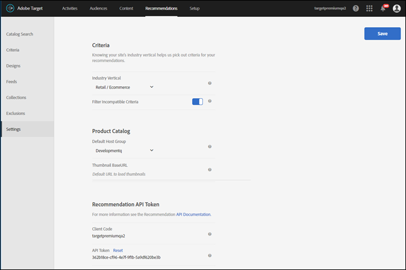

# Planification et implémentation [!UICONTROL Recommendations]

Informations pour vous aider à planifier et à mettre en oeuvre [!DNL Adobe Target Recommendations].

>[!NOTE]
>
>En plus de cet article, la variable [Guide du professionnel d’Adobe Target](https://experienceleague.adobe.com/docs/target/using/target-home.html?lang=fr){target=_blank} contains in-depth information about [Target Recommendations](https://experienceleague.adobe.com/docs/target/using/recommendations/recommendations.html){target=_blank}.

Avant de configurer votre premier [!UICONTROL Recommendations] activité dans [!DNL Adobe Target], procédez comme suit :

1. [Mise en oeuvre [!UICONTROL Cible]](#implement-target) sur le web et les applications mobiles, les surfaces que vous souhaitez utiliser pour capturer le comportement des utilisateurs et diffuser des recommandations.
1. [Configurez vos [!UICONTROL Recommendations] catalogue](#set-up-your-recommendations-catalog) de produits ou de contenu que vous souhaitez recommander à vos utilisateurs.
1. [Transmission d’informations comportementales et de contexte](#pass-behavioral-information-and-context) to [!DNL Target Recommendations] pour lui permettre de fournir des recommandations personnalisées.
1. [Configuration des exclusions globales](#configure-global-exclusions).
1. [Configurer [!UICONTROL Recommendations] paramètres](#configure-recommendations-settings).
1. (Facultatif) [Administrer [!UICONTROL Recommendations] utilisation des API d’administration](#administer-recommendations-using-admin-apis).

## 1. Mise en oeuvre [!UICONTROL Cible]

[!DNL Target Recommendations] nécessite la mise en oeuvre du SDK Web Adobe Experience Platform ou d’at.js 0.9.2 (ou version ultérieure). Voir [[!UICONTROL Cible] guides de mise en oeuvre côté client](../client-side/overview.md) pour plus d’informations.

## 2. Configurez votre [!UICONTROL Recommendations] catalogue

Pour fournir des recommandations de grande qualité, [!UICONTROL Cible] doivent connaître les produits ou le contenu que vous souhaitez recommander. Les catalogues incluent généralement trois types d’informations sur les articles recommandés. Supposons que vous recommandiez des films. Insérez les éléments suivants :

1. Données que vous souhaitez afficher pour l’utilisateur recevant la recommandation Vous pouvez, par exemple, afficher le nom du film et l’URL d’une miniature de l’affiche.
1. Données qui s’avèrent utiles pour appliquer des contrôles marketing et de marchandisage Par exemple, vous pouvez afficher la note du film afin de ne pas recommander de films NC-17.
1. Données utiles pour déterminer la similarité d’éléments avec d’autres éléments d’éléments. Vous pouvez, par exemple, afficher le genre du film et le réalisateur du film.

[!UICONTROL Cible] propose plusieurs options d’intégration pour compléter votre catalogue. Ces options peuvent être utilisées conjointement pour mettre à jour différents éléments du catalogue ou pour mettre à jour différents attributs d’élément sur différentes fréquences.

| Méthode | Qu’est-ce que c’est ? | Quand l’utiliser | Informations supplémentaires |
| --- | --- | --- | --- |
| Flux de catalogue | Planifiez le chargement et l’ingestion quotidiens d’un flux (CSV, XML de produit Google ou Classifications de produit Analytics). | Pour envoyer des informations sur plusieurs éléments à la fois. Pour envoyer des informations qui changent rarement. | Voir [Flux](https://experienceleague.adobe.com/docs/target/using/recommendations/entities/feeds.html). |
| API Entités | Appelez une API pour envoyer des mises à jour instantanées pour un seul élément. | Pour envoyer des mises à jour lorsqu’elles surviennent sur un élément à la fois. Pour envoyer des informations qui changent fréquemment (par exemple, le prix, le stock/le niveau de stock). | Voir [Documentation destinée aux développeurs de l’API Entities](https://developer.adobe.com/target/administer/recommendations-api/#tag/Entities). |
| Transmission des mises à jour sur la page | Envoyez les mises à jour instantanées d’un seul élément à l’aide de JavaScript sur la page ou de l’API de diffusion. | Pour envoyer des mises à jour lorsqu’elles surviennent sur un élément à la fois. Pour envoyer des informations qui changent fréquemment (par exemple, le prix, le stock/le niveau de stock). | Voir [Consultations d’articles/pages de produits](#item-views-or-product-pages) ci-dessous |

La plupart des clients doivent mettre en oeuvre au moins un flux. Vous pouvez ensuite choisir de compléter votre flux avec des mises à jour pour les attributs ou éléments fréquemment modifiés à l’aide de l’API Entités ou de la méthode sur la page.

## 3. Transmission des informations comportementales et du contexte

Les informations comportementales et le contexte auxquels vous devez transmettre [!UICONTROL Cible] dépend de l’action effectuée par le visiteur, souvent associée au type de page avec laquelle le visiteur interagit.

### Consultations d’articles ou pages de produits

Sur les pages où un visiteur consulte un seul élément, comme une page des détails du produit, vous devez transmettre l’identité de l’élément que le visiteur consulte. Vous devez également transmettre la catégorie la plus granulaire de l’élément que le visiteur consulte, afin de permettre le filtrage des recommandations sur la catégorie actuelle.

Vous pouvez également transmettre certains attributs qui changent rapidement sur la page de produits elle-même. Par exemple, vous pouvez transmettre le prix (`value`) et au niveau du stock/du stock.

#### Prix et inventaire des transactions

```js {line-numbers="true"}
<script type="text/javascript">
function targetPageParams() { 
   return { 
      "entity": { 
         "id": "32323", 
         "categoryId": "running-shoes", 
         "value": 119.99, 
         "inventory": 329 
      } 
   } 
}
</script>
```

### Vues de catégorie/pages de catégorie

Sur une page de catégorie, il est probable que vous souhaitiez limiter vos recommandations aux produits ou au contenu de cette catégorie. Pour ce faire, veillez à transmettre l’identité de la catégorie actuellement consultée.

#### Transmettre la catégorie actuelle

```js {line-numbers="true"}
function targetPageParams() { 
   return { 
      "entity": { 
         "categoryId": "running-shoes" 
      } 
   } 
}
```

### Pages Ajouts au panier/consultations de panier/passage en caisse

Sur une page de panier, vous pouvez recommander des articles en fonction du contenu du panier actuel du visiteur. Pour ce faire, transmettez les identifiants de tous les éléments du panier actuel du visiteur à l’aide du paramètre spécial . `cartIds`.

#### Transmission d’éléments actuellement dans le panier

```js {line-numbers="true"}
function targetPageParams() {
   return {
      "cartIds": "352,223,23432,432,553"
      }
}
```

Pour plus d’informations sur les recommandations basées sur le panier, voir [Basé sur le panier](https://experienceleague.adobe.com/docs/target/using/recommendations/criteria/base-the-recommendation-on-a-recommendation-key.html?lang=en#cart-based) dans le *[!DNL Adobe Target]Guide du praticien professionnel*.

### Exclure des éléments déjà présents dans le panier du visiteur

Sur les pages de votre site, vous pouvez exclure certains éléments des recommandations. Par exemple, vous pouvez ne pas recommander des articles qui se trouvent déjà dans le panier actuel du visiteur. Pour ce faire, transmettez les identifiants de tous les éléments à exclure à l’aide du paramètre spécial . `excludedIds`.

#### Transmettre des éléments à exclure

```js {line-numbers="true"}
function targetPageParams() {
   return {
      "excludedIds": "352,223,23432,432,553"
      }
}
```

### Pages de confirmation des achats/commandes

Lorsqu’un événement d’achat se produit, transmettez l’identité du ou des articles achetés. Voir [Suivi des conversions](../client-side/atjs/how-to-deployatjs/implement-target-without-a-tag-manager.md#track-conversions) dans le [Déploiement d’at.js > Implémentation [!UICONTROL Cible] sans gestionnaire de balises](../client-side/atjs/how-to-deployatjs/implement-target-without-a-tag-manager.md) article.

## 4. Configuration des exclusions globales

Excluez tous les éléments à un niveau global que vous ne souhaitez jamais recommander à un visiteur. Voir [Exclusions](https://experienceleague.adobe.com/docs/target/using/recommendations/entities/exclusions.html) dans le *[!DNL Adobe Target]Guide du praticien professionnel*.

## 5. Configuration [!UICONTROL Recommendations] paramètres

Utilisez les paramètres pour gérer votre implémentation de [!UICONTROL Recommandations].

Pour accéder aux options de **[!UICONTROL configuration des recommandations]**, ouvrez Target dans [!DNL Adobe Experience Cloud], puis cliquez sur **[!UICONTROL Recommandations]** > **[!UICONTROL Paramètres]**.



Les options disponibles sont les suivantes :

| Paramètre | Description |
|--- |--- |
| Mbox globale personnalisée | (Facultatif) Indiquez la mbox globale personnalisée utilisée pour les activités [!UICONTROL Target]. Par défaut, la mbox globale utilisée par [!UICONTROL Target] est utilisée pour les [!UICONTROL Recommandations].<P>Remarque : Cette option est définie sur la variable [!UICONTROL Cible] **[!UICONTROL Administration]** page. Ouvrir [!UICONTROL Cible], puis cliquez sur **[!UICONTROL Administration]** > **[!UICONTROL Compositeur d’expérience visuelle]**. |
| Secteur industriel vertical | Le secteur industriel vertical permet de classer les critères de recommandations. Ces informations aident les membres de votre équipe à trouver des critères logiques pour une page spécifique, tels que les critères les mieux adaptés à la page du panier ou à une page multimédia. |
| Filtrer les critères incompatibles | Activez cette option pour afficher uniquement les critères pour lesquels la page sélectionnée transmet les données requises. Tous les critères ne s’exécutent pas correctement sur chaque page. La page ou la mbox doit être transmise `entity.id` ou `entity.categoryId` pour que les recommandations d’élément/de catégorie actuel(le) soient compatibles. En général, il est préférable de n’afficher que les critères compatibles. Néanmoins, si vous souhaitez que des critères incompatibles soient disponibles pour l’activité, décochez l’option.<P>Il est recommandé de désactiver cette option si vous utilisez une solution de gestion des balises.<P>Pour plus d’informations sur cette option, voir [[!UICONTROL Recommendations] FAQ](https://experienceleague.adobe.com/docs/target/using/recommendations/recommendations-faq/recommendations-faq.html) dans le *[!DNL Adobe Target]Guide du praticien professionnel*. |
| Groupe d’hôtes par défaut | Sélectionnez votre groupe d’hôtes par défaut.<P>Le groupe d’hôtes peut servir à séparer les éléments disponibles dans votre catalogue pour différents usages. Par exemple, vous pouvez utiliser des groupes d’hôtes pour les environnements de développement et de production, des marques différentes ou plusieurs zones géographiques. Par défaut, les résultats d’aperçu dans la recherche de catalogue, les collections et les exclusions sont basés sur le groupe d’hôtes par défaut. (Vous pouvez également sélectionner un autre groupe d’hôtes pour prévisualiser les résultats à l’aide du filtre Environnement.) Par défaut, les éléments nouvellement ajoutés sont disponibles dans tous les groupes d’hôtes, sauf si un identifiant d’environnement est spécifié lors de la création ou de la mise à jour de l’élément. Les recommandations fournies dépendent du groupe d’hôtes spécifié dans la requête.<P>Si vos produits ne sont pas répertoriés, vérifiez que vous utilisez le groupe d’hôtes approprié. Si, par exemple, vous configurez votre recommandation pour utiliser un environnement d’évaluation et que vous définissez votre groupe d’hôtes sur Évaluation, il se peut que vous deviez recréer vos collections dans l’environnement d’évaluation pour les produits à afficher. Pour voir quels produits sont disponibles dans chaque environnement, utilisez la recherche catalogue pour chaque environnement. Vous pouvez également prévisualiser le contenu de [!UICONTROL Recommendations] collections et exclusions pour un environnement sélectionné (groupe d’hôtes).<P>**Remarque :** après avoir modifié l’environnement sélectionné, vous devez cliquer sur Rechercher pour mettre à jour les résultats renvoyés.<P> **[!UICONTROL Le filtre Environment est disponible à partir des emplacements suivants dans l’interface utilisateur de Target :]**<ul><li>Recherche catalogue (**[!UICONTROL Recommendations]** > **[!UICONTROL Recherche catalogue]**)</li><li>Boîte de dialogue Créer une collection (**[!UICONTROL Recommendations]** > **[!UICONTROL Collections]** > **[!UICONTROL Créer]**)</li><li>Boîte de dialogue Mettre à jour la collection (**[!UICONTROL Recommendations]** > **[!UICONTROL Collections]** > **[!UICONTROL Modifier]**)</li><li>Boîte de dialogue Créer une exclusion (**[!UICONTROL Recommendations]** > **[!UICONTROL Exclusions]** > **[!UICONTROL Créer]**)</li><li>Boîte de dialogue Mettre à jour l’exclusion (**[!UICONTROL Recommendations]** > **[!UICONTROL Exclusions]** > **[!UICONTROL Modifier]**)</li></ul>Pour plus d’informations, voir [Hôtes](https://experienceleague.adobe.com/docs/target/using/administer/hosts.html) dans le *[!DNL Adobe Target]Guide du praticien professionnel*. |
| URL de base de la miniature | La définition d’une URL de base pour votre catalogue de produits rend possible l’utilisation d’URL relatives lors de la spécification de miniatures de vos produits lors du transfert de votre URL de miniature.<P>Par exemple :<P>`"entity.thumbnailURL=/Images/Homepage/product1.jpg"`<P>définit une URL relative à l’URL de base de la miniature. |
| [!UICONTROL Jeton API de Recommendations] | Utilisez ce jeton dans [!UICONTROL Recommendations] Appels d’API, tels que l’API de téléchargement. |

## 6. (Facultatif) Administration [!UICONTROL Recommendations] utilisation des API d’administration

Voir [Utilisation [!UICONTROL Recommendations] API](../../before-administer/recs-api/overview.md) guide pratique pour apprendre à configurer et à utiliser le [!UICONTROL Cible] API d’administration et de diffusion pour [!UICONTROL Recommendations].
