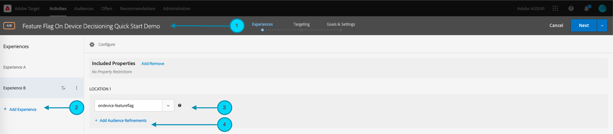
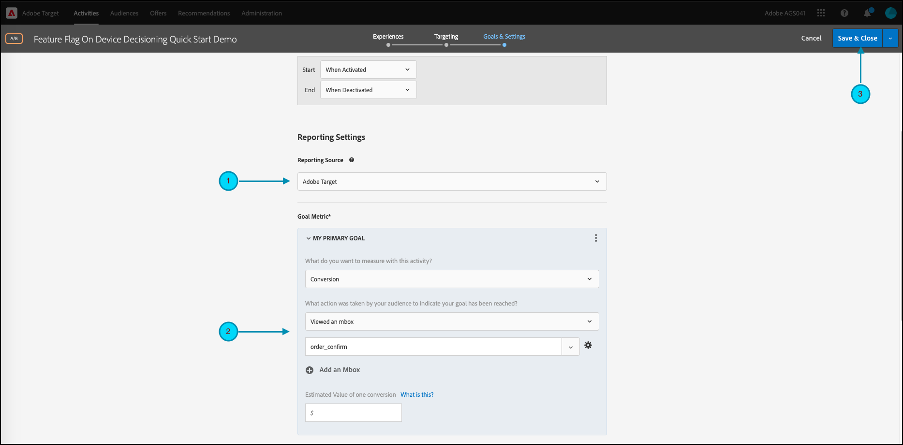

# Prise en main des SDK [!DNL Target]

Pour être opérationnel, nous vous encourageons à créer votre première activité d’indicateur de fonctionnalité [prise de décision sur l’appareil](../on-device-decisioning/overview.md) dans la langue de votre choix :

* Node.js
* Java
* .NET
* Python

## Résumé des étapes

1. Activation de la prise de décision sur l’appareil pour votre organisation
1. Installation du SDK
1. Initialiser le SDK
1. Configurer les indicateurs de fonctionnalité dans une activité [!DNL Adobe Target] [!UICONTROL Test A/B]
1. Implémenter et générer la fonctionnalité dans votre application
1. Implémenter le suivi des événements dans votre application
1. Activez votre activité [!UICONTROL  Test A/B ]

## &#x200B;1. Activation de la prise de décision sur l’appareil pour votre organisation

L’activation de la prise de décision sur l’appareil garantit l’exécution d’une activité de test [!UICONTROL A/B] avec une latence proche de zéro. Pour activer cette fonctionnalité, accédez à **[!UICONTROL Administration]** > **[!UICONTROL Implémentation]** > **[!UICONTROL Détails du compte]** et activez le bouton **[!UICONTROL Prise de décision sur l’appareil]**.


>[!NOTE]
>
>Vous devez disposer du rôle **[!UICONTROL Administrateur]** ou **[!UICONTROL Approbateur]** [utilisateur](https://experienceleague.adobe.com/docs/target/using/administer/manage-users/user-management.html) pour activer ou désactiver le bouton (bascule) **[!UICONTROL Prise de décision sur l’appareil]**.

Après avoir activé le bouton (bascule) **[!UICONTROL Prise de décision sur l’appareil]**, [!DNL Adobe Target] commence à générer des [artefacts de règle](../on-device-decisioning/rule-artifact-overview.md) pour votre client.

## &#x200B;2. Installation du SDK

Pour Node.js, Java et Python, exécutez la commande suivante dans le répertoire du projet du terminal. Pour .NET, ajoutez-le en tant que dépendance en [installant depuis NuGet](https://www.nuget.org/packages/Adobe.Target.Client).

>[!BEGINTABS]

>[!TAB Node.js (NPM)]

```js {line-numbers="true"}
npm i @adobe/target-nodejs-sdk -P
```

>[!TAB Java (Maven)]

```javascript {line-numbers="true"}
<dependency>
   <groupId>com.adobe.target</groupId>
   <artifactId>java-sdk</artifactId>
   <version>2.0</version>
</dependency>
```

>[!TAB .NET (Bash)]

```bash {line-numbers="true"}
dotnet add package Adobe.Target.Client
```

>[!TAB Python (pip)]

```python {line-numbers="true"}
pip install target-python-sdk
```

>[!ENDTABS]

## &#x200B;3. Initialiser le SDK

L’artefact de règle est téléchargé pendant l’étape d’initialisation de SDK. Vous pouvez personnaliser l’étape d’initialisation afin de déterminer comment l’artefact est téléchargé et utilisé.

>[!BEGINTABS]

>[!TAB Node.js]

```js {line-numbers="true"}
const TargetClient = require("@adobe/target-nodejs-sdk");

const CONFIG = {
   client: "<your target client code>",
   organizationId: "your EC org id",
   decisioningMethod: "on-device",
   events: {
      clientReady: targetClientReady
      }
};

const tClient = TargetClient.create(CONFIG);

function targetClientReady() {
   //Adobe Target SDK has now downloaded the JSON artifact locally, which contains the activity details.
   //We will see how to use the artifact here very soon.
}
```

>[!TAB Java (Maven)]

```javascript {line-numbers="true"}
ClientConfig config = ClientConfig.builder()
   .client("testClient")
   .organizationId("ABCDEF012345677890ABCDEF0@AdobeOrg")
   .build();
TargetClient targetClient = TargetClient.create(config);
```

>[!TAB .NET (C#)]

```csharp {line-numbers="true"}
var targetClientConfig = new TargetClientConfig.Builder("testClient", "ABCDEF012345677890ABCDEF0@AdobeOrg")
   .Build();
this.targetClient.Initialize(targetClientConfig);
```

>[!TAB Python]

```python {line-numbers="true"}
from target_python_sdk import TargetClient

def target_client_ready():
   # Adobe Target SDK has now downloaded the JSON artifact locally, which contains the activity details.
   # We will see how to use the artifact here very soon.

CONFIG = {
   "client": "<your target client code>",
   "organization_id": "your EC org id",
   "decisioning_method": "on-device",
   "events": {
      "client_ready": target_client_ready
   }
}

target_client = TargetClient.create(CONFIG)
```

>[!ENDTABS]

## &#x200B;4. Configurer les indicateurs de fonctionnalité dans une activité [!DNL Adobe Target] [!UICONTROL Test A/B]

1. Dans [!DNL Target], accédez à la page **[!UICONTROL Activités]**, puis sélectionnez **[!UICONTROL Créer une activité]** > **[!UICONTROL Test A/B]**.

   

1. Dans la fenêtre modale **[!UICONTROL Créer une activité de test A/B]**, laissez l’option Web par défaut sélectionnée (1), sélectionnez **[!UICONTROL Formulaire]** en tant que compositeur d’expérience (2), sélectionnez **[!UICONTROL Workspace par défaut]** avec **[!UICONTROL Aucune restriction de propriété]**(3), puis cliquez sur **[!UICONTROL Suivant]** (4).

   

1. À l’étape **[!UICONTROL Expériences]** de la création d’une activité, attribuez un nom à votre activité (1) et ajoutez une deuxième expérience, l’expérience B, en cliquant sur **[!UICONTROL Ajouter une expérience]** (2). Entrez le nom de l&#39;emplacement de votre choix (3). Par exemple, `ondevice-featureflag` ou `homepage-addtocart-featureflag` sont des noms d’emplacement indiquant les destinations pour les tests d’indicateurs de fonctionnalité.  Dans l’exemple illustré ci-dessous, `ondevice-featureflag` est l’emplacement défini pour l’expérience B. Vous pouvez éventuellement ajouter des ajustements d’audience (4) pour limiter la qualification à l’activité.

   

1. Dans la section **[!UICONTROL CONTENT]** de la même page, sélectionnez **[!UICONTROL Créer une offre JSON]** dans la liste déroulante (1), comme illustré.

   

1. Dans la zone de texte **[!UICONTROL Données JSON]** qui s’affiche, saisissez les variables d’indicateur de fonctionnalité pour chaque expérience (1), à l’aide d’un objet JSON valide (2).

   Saisissez les variables d’indicateur de fonctionnalité pour l’expérience A.

   

   **(exemple de fichier JSON pour l’expérience A, ci-dessus)**

   ```json {line-numbers="true"}
   {
      "enabled" : true,
      "flag" : "expA"
   }
   ```

   Saisissez les variables d’indicateur de fonctionnalité pour l’expérience B.

   

   **(Exemple de fichier JSON pour l’expérience B, ci-dessus)**

   ```json {line-numbers="true"}
   {
      "enabled" : true,
      "flag" : "expB"
   }
   ```

1. Cliquez sur **[!UICONTROL Suivant]** (1) pour passer à l’étape **[!UICONTROL Ciblage]** de création de l’activité.

   

1. Dans l’exemple d’étape **[!UICONTROL Ciblage]** illustré ci-dessous, le ciblage d’audience (2) reste sur l’ensemble par défaut de Tous les visiteurs, par souci de simplicité. Cela signifie que l’activité n’est pas ciblée. Notez toutefois qu’Adobe vous recommande de toujours cibler vos audiences pour les activités de production. Cliquez sur **[!UICONTROL Suivant]** (3) pour accéder à l’étape **[!UICONTROL Objectifs et paramètres]** de la création de l’activité.

   

1. À l’étape **[!UICONTROL Objectifs et paramètres]**, définissez **[!UICONTROL Reporting Source]** sur **[!UICONTROL Adobe Target]** (1). Définissez la **[!UICONTROL mesure d’objectif]** comme **[!UICONTROL conversion]**, en spécifiant les détails en fonction des mesures de conversion de votre site (2). Cliquez sur **[!UICONTROL Enregistrer et fermer]** (3) pour enregistrer l’activité.

   

## &#x200B;5. Implémenter et générer la fonctionnalité dans votre application

Après avoir configuré les variables d’indicateur de fonctionnalité dans [!DNL Target], modifiez le code de votre application pour les utiliser. Par exemple, après avoir obtenu l’indicateur de fonctionnalité dans l’application, vous pouvez l’utiliser pour activer des fonctionnalités et effectuer le rendu de l’expérience pour laquelle le visiteur s’est qualifié.

>[!BEGINTABS]

>[!TAB Node.js]

```js {line-numbers="true"}
//... Code removed for brevity
​
let featureFlags = {};
​
function targetClientReady() {
   tClient.getAttributes(["ondevice-featureflag"]).then(function(response) {
      const featureFlags = response.asObject("ondevice-featureflag");
      if(featureFlags.enabled && featureFlags.flag !== "expA") { //Assuming "expA" is control
         console.log("Render alternate experience" + featureFlags.flag);
      }
      else {
         console.log("Render default experience");
      }
   });
}
```

>[!TAB Java (Maven)]

```javascript {line-numbers="true"}
MboxRequest mbox = new MboxRequest().name("ondevice-featureflag").index(0);
TargetDeliveryRequest request = TargetDeliveryRequest.builder()
   .context(new Context().channel(ChannelType.WEB))
   .execute(new ExecuteRequest().mboxes(Arrays.asList(mbox)))
   .build();
Attributes attributes = targetClient.getAttributes(request, "ondevice-featureflag");
String flag = attributes.getString("ondevice-featureflag", "flag");
```

>[!TAB .NET (C#)]

```csharp {line-numbers="true"}
var mbox = new MboxRequest(index: 0, name: "ondevice-featureflag");
var deliveryRequest = new TargetDeliveryRequest.Builder()
   .SetContext(new Context(ChannelType.Web))
   .SetExecute(new ExecuteRequest(mboxes: new List<MboxRequest> { mbox }))
   .Build();
var attributes = targetClient.GetAttributes(request, "ondevice-featureflag");
var flag = attributes.GetString("ondevice-featureflag", "flag");
```

>[!TAB Python]

```python {line-numbers="true"}
# ... Code removed for brevity

feature_flags = {}

def target_client_ready():
   attribute_provider = target_client.get_attributes(["ondevice-featureflag"])
   feature_flags = attribute_provider.as_object(mbox_name="ondevice-featureflag")
   if feature_flags.get("enabled") and feature_flags.get("flag") != "expA": # Assuming "expA" is control
      print("Render alternate experience {}".format(feature_flags.get("flag")))
   else:
      print("Render default experience")
```

>[!ENDTABS]

## &#x200B;6. Implémenter un suivi supplémentaire des événements dans votre application

Vous pouvez éventuellement envoyer des événements supplémentaires pour le suivi des conversions à l’aide de la fonction sendNotification() .

>[!BEGINTABS]

>[!TAB Node.js]

```js {line-numbers="true"}
//... Code removed for brevity
​
//When a conversion happens
TargetClient.sendNotifications({
   targetCookie,
   "request" : {
      "notifications" : [
      {
         type: "display",
         timestamp : Date.now(),
         id: "conversion",
         mbox : {
            name : "orderConfirm"
         },
         order : {
            id: "BR9389",
            total : 98.93,
            purchasedProductIds : ["J9393", "3DJJ3"]
         }
      }
      ]
   }
})
```

>[!TAB Java (Maven)]

```javascript {line-numbers="true"}
Notification notification = new Notification();
notification.setId("conversion");
notification.setImpressionId(UUID.randomUUID().toString());
notification.setType(MetricType.DISPLAY);
notification.setTimestamp(System.currentTimeMillis());
Order order = new Order("BR9389");
order.total(98.93);
order.purchasedProductIds(["J9393", "3DJJ3"]);
notification.setOrder(order);

TargetDeliveryRequest notificationRequest =
   TargetDeliveryRequest.builder()
      .context(new Context().channel(ChannelType.WEB))
      .notifications(Collections.singletonList(notification))
      .build();

NotificationDeliveryService notificationDeliveryService = new NotificationDeliveryService();
notificationDeliveryService.sendNotification(notificationRequest);
```

>[!TAB .NET (C#)]

```csharp {line-numbers="true"}
var order = new Order
{
   Id = "BR9389",
   Total = 98.93M,
   PurchasedProductIds = new List<string> { "J9393", "3DJJ3" },
};
​
var notification = new Notification
{
   Id = "conversion",
   ImpressionId = Guid.NewGuid().ToString(),
   Type = MetricType.Display,
   Timestamp = DateTimeOffset.UtcNow.ToUnixTimeMilliseconds(),
   Order = order,
};
​
var notificationRequest = new TargetDeliveryRequest.Builder()
   .SetContext(new Context(ChannelType.Web))
   .SetNotifications(new List<Notification> {notification})
   .Build();
​
targetClient.SendNotifications(notificationRequest);
```

>[!TAB Python]

```python {line-numbers="true"}
# ... Code removed for brevity

# When a conversion happens
notification_mbox = NotificationMbox(name="orderConfirm")
order = Order(id="BR9389, total=98.93, purchased_product_ids=["J9393", "3DJJ3"])
notification = Notification(
   id="conversion",
   type=MetricType.DISPLAY,
   timestamp=1621530726000,  # Epoch time in milliseconds
   mbox=notification_mbox,
   order=order
)
notification_request = DeliveryRequest(notifications=[notification])


target_client.send_notifications({
   "target_cookie": target_cookie,
   "request" : notification_request
})
```

>[!ENDTABS]

## &#x200B;7. Activez votre activité [!UICONTROL  Test A/B ]

1. Cliquez sur **[!UICONTROL Activer]** (1) pour activer votre activité [!UICONTROL  Test A/B ].

   >[!NOTE]
   >
   >Pour effectuer cette étape, vous devez disposer du rôle **[!UICONTROL Approbateur]** ou **[!UICONTROL Éditeur]** [utilisateur](https://experienceleague.adobe.com/docs/target/using/administer/manage-users/user-management.html).

   
