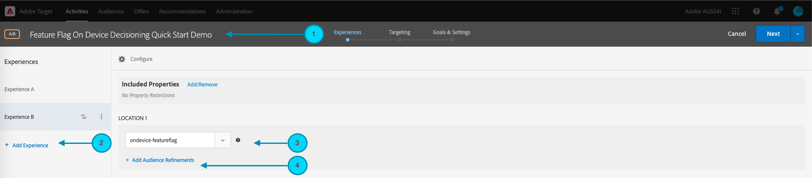
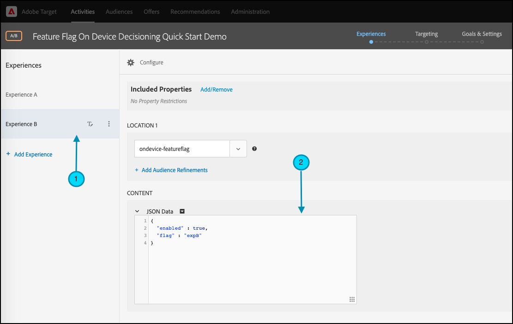
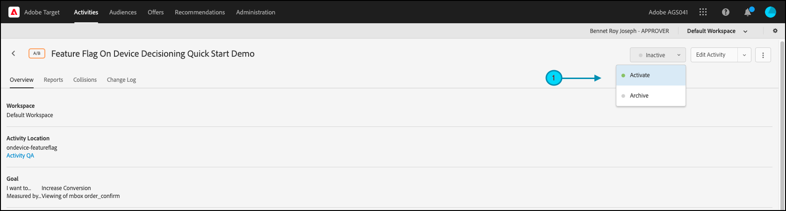

# Prise en main des [!DNL Target] SDK

Pour être opérationnel, nous vous encourageons à créer votre première activité d’indicateur de fonctionnalité [prise de décision sur l’appareil](../on-device-decisioning/overview.md) dans la langue de votre choix :

* Node.js
* Java
* .NET
* Python

## Résumé des étapes

1. Activation de la prise de décision sur les appareils pour votre entreprise
1. Installation du SDK
1. Initialisation du SDK
1. Configuration des indicateurs de fonctionnalité dans une activité [!DNL Adobe Target] [!UICONTROL A/B Test]
1. Mise en oeuvre et rendu de la fonctionnalité dans votre application
1. Mise en oeuvre du suivi des événements dans votre application
1. Activation de votre activité [!UICONTROL A/B Test]

## 1. Activez la prise de décision sur l’appareil pour votre organisation.

L’activation de la prise de décision sur l’appareil garantit qu’une activité [!UICONTROL A/B Test] est exécutée à une latence proche de zéro. Pour activer cette fonction, accédez à **[!UICONTROL Administration]** > **[!UICONTROL Implementation]** > **[!UICONTROL Account details]** et activez le bouton d’activation/désactivation **[!UICONTROL On-Device Decisioning]**.


>[!NOTE]
>
>Vous devez disposer du **[!UICONTROL Admin]** ou du **[!UICONTROL Approver]** [rôle utilisateur](https://experienceleague.adobe.com/docs/target/using/administer/manage-users/user-management.html?lang=fr) pour activer ou désactiver le bouton d’activation/désactivation de **[!UICONTROL On-Device Decisioning]**.

Après avoir activé le bouton d’activation **[!UICONTROL On-Device Decisioning]**, [!DNL Adobe Target] commence à générer des [artefacts de règle](../on-device-decisioning/rule-artifact-overview.md) pour votre client.

## 2. Installation du SDK

Pour Node.js, Java et Python, exécutez la commande suivante dans le répertoire de votre projet dans le terminal. Pour .NET, ajoutez-le en tant que dépendance en [installant à partir de NuGet](https://www.nuget.org/packages/Adobe.Target.Client).

>[!BEGINTABS]

>[!TAB Node.js (NPM)]

```js {line-numbers="true"}
npm i @adobe/target-nodejs-sdk -P
```

>[!TAB Java (Maven)]

```javascript {line-numbers="true"}
<dependency>
   <groupId>com.adobe.target</groupId>
   <artifactId>java-sdk</artifactId>
   <version>2.0</version>
</dependency>
```

>[!TAB .NET (Bash)]

```bash {line-numbers="true"}
dotnet add package Adobe.Target.Client
```

>[!TAB Python (pip)]

```python {line-numbers="true"}
pip install target-python-sdk
```

>[!ENDTABS]

## 3. Initialisation du SDK

L’artefact de règle est téléchargé lors de l’étape d’initialisation du SDK. Vous pouvez personnaliser l’étape d’initialisation pour déterminer comment l’artefact est téléchargé et utilisé.

>[!BEGINTABS]

>[!TAB Node.js]

```js {line-numbers="true"}
const TargetClient = require("@adobe/target-nodejs-sdk");

const CONFIG = {
   client: "<your target client code>",
   organizationId: "your EC org id",
   decisioningMethod: "on-device",
   events: {
      clientReady: targetClientReady
      }
};

const tClient = TargetClient.create(CONFIG);

function targetClientReady() {
   //Adobe Target SDK has now downloaded the JSON artifact locally, which contains the activity details.
   //We will see how to use the artifact here very soon.
}
```

>[!TAB Java (Maven)]

```javascript {line-numbers="true"}
ClientConfig config = ClientConfig.builder()
   .client("testClient")
   .organizationId("ABCDEF012345677890ABCDEF0@AdobeOrg")
   .build();
TargetClient targetClient = TargetClient.create(config);
```

>[!TAB .NET (C#)]

```csharp {line-numbers="true"}
var targetClientConfig = new TargetClientConfig.Builder("testClient", "ABCDEF012345677890ABCDEF0@AdobeOrg")
   .Build();
this.targetClient.Initialize(targetClientConfig);
```

>[!TAB Python]

```python {line-numbers="true"}
from target_python_sdk import TargetClient

def target_client_ready():
   # Adobe Target SDK has now downloaded the JSON artifact locally, which contains the activity details.
   # We will see how to use the artifact here very soon.

CONFIG = {
   "client": "<your target client code>",
   "organization_id": "your EC org id",
   "decisioning_method": "on-device",
   "events": {
      "client_ready": target_client_ready
   }
}

target_client = TargetClient.create(CONFIG)
```

>[!ENDTABS]

## 4. Configurez les indicateurs de fonctionnalité dans une activité [!DNL Adobe Target] [!UICONTROL A/B Test]

1. Dans [!DNL Target], accédez à la page **[!UICONTROL Activities]**, puis sélectionnez **[!UICONTROL Create Activity]** > **[!UICONTROL A/B test]**.

   

1. Dans le modal **[!UICONTROL Create A/B Test Activity]**, laissez l’option Web par défaut sélectionnée (1), sélectionnez **[!UICONTROL Form]** comme compositeur d’expérience (2), sélectionnez **[!UICONTROL Default Workspace]** avec **[!UICONTROL No Property Restrictions]**(3), puis cliquez sur **[!UICONTROL Next]** (4).

   

1. À l’étape **[!UICONTROL Experiences]** de la création de l’activité, donnez un nom à votre activité (1) et ajoutez une seconde expérience, l’expérience B, en cliquant sur **[!UICONTROL Add Experience]** (2). Saisissez le nom de l’emplacement de votre choix (3). Par exemple, `ondevice-featureflag` ou `homepage-addtocart-featureflag` sont des noms d’emplacement indiquant les destinations pour les tests d’indicateur de fonctionnalité.  Dans l’exemple ci-dessous, `ondevice-featureflag` est l’emplacement défini pour l’expérience B. Vous pouvez éventuellement ajouter des perfectionnements d’audience (4) pour limiter la qualification à l’activité.

   

1. Dans la section **[!UICONTROL CONTENT]** de la même page, sélectionnez **[!UICONTROL Create JSON Offer]** dans la liste déroulante (1) comme indiqué.

   

1. Dans la zone de texte **[!UICONTROL JSON Data]** qui s’affiche, saisissez vos variables d’indicateur de fonctionnalité pour chaque expérience (1), à l’aide d’un objet JSON valide (2).

   Saisissez les variables d’indicateur de fonctionnalité pour l’expérience A.

   

   **(Exemple de JSON pour l’expérience A, ci-dessus)**

   ```json {line-numbers="true"}
   {
      "enabled" : true,
      "flag" : "expA"
   }
   ```

   Saisissez les variables d’indicateur de fonctionnalité pour l’expérience B.

   

   **(Exemple de JSON pour l’expérience B, ci-dessus)**

   ```json {line-numbers="true"}
   {
      "enabled" : true,
      "flag" : "expB"
   }
   ```

1. Cliquez sur **[!UICONTROL Next]** (1) pour passer à l’étape **[!UICONTROL Targeting]** de la création de l’activité.

   

1. Dans l’exemple d’étape **[!UICONTROL Targeting]** illustré ci-dessous, le ciblage d’audience (2) reste sur l’ensemble par défaut de Tous les visiteurs, pour plus de simplicité. Cela signifie que l’activité n’est pas ciblée. Notez toutefois que l’Adobe vous recommande de toujours cibler vos audiences pour les activités de production. Cliquez sur **[!UICONTROL Next]** (3) pour passer à l’étape **[!UICONTROL Goals & Settings]** de la création de l’activité.

   

1. À l’étape **[!UICONTROL Goals & Settings]**, définissez **[!UICONTROL Reporting Source]** sur **[!UICONTROL Adobe Target]** (1). Définissez le **[!UICONTROL Goal Metric]** comme **[!UICONTROL Conversion]**, en spécifiant les détails en fonction des mesures de conversion de votre site (2). Cliquez sur **[!UICONTROL Save & Close]** (3) pour enregistrer l’activité.

   

## 5. Implémentez et effectuez le rendu de la fonctionnalité dans votre application.

Après avoir configuré les variables d’indicateur de fonctionnalité dans [!DNL Target], modifiez le code de votre application pour les utiliser. Par exemple, après avoir obtenu l’indicateur de fonctionnalité dans l’application, vous pouvez l’utiliser pour activer les fonctionnalités et générer le rendu de l’expérience pour laquelle le visiteur a rempli les critères.

>[!BEGINTABS]

>[!TAB Node.js]

```js {line-numbers="true"}
//... Code removed for brevity
​
let featureFlags = {};
​
function targetClientReady() {
   tClient.getAttributes(["ondevice-featureflag"]).then(function(response) {
      const featureFlags = response.asObject("ondevice-featureflag");
      if(featureFlags.enabled && featureFlags.flag !== "expA") { //Assuming "expA" is control
         console.log("Render alternate experience" + featureFlags.flag);
      }
      else {
         console.log("Render default experience");
      }
   });
}
```

>[!TAB Java (Maven)]

```javascript {line-numbers="true"}
MboxRequest mbox = new MboxRequest().name("ondevice-featureflag").index(0);
TargetDeliveryRequest request = TargetDeliveryRequest.builder()
   .context(new Context().channel(ChannelType.WEB))
   .execute(new ExecuteRequest().mboxes(Arrays.asList(mbox)))
   .build();
Attributes attributes = targetClient.getAttributes(request, "ondevice-featureflag");
String flag = attributes.getString("ondevice-featureflag", "flag");
```

>[!TAB .NET (C#)]

```csharp {line-numbers="true"}
var mbox = new MboxRequest(index: 0, name: "ondevice-featureflag");
var deliveryRequest = new TargetDeliveryRequest.Builder()
   .SetContext(new Context(ChannelType.Web))
   .SetExecute(new ExecuteRequest(mboxes: new List<MboxRequest> { mbox }))
   .Build();
var attributes = targetClient.GetAttributes(request, "ondevice-featureflag");
var flag = attributes.GetString("ondevice-featureflag", "flag");
```

>[!TAB Python]

```python {line-numbers="true"}
# ... Code removed for brevity

feature_flags = {}

def target_client_ready():
   attribute_provider = target_client.get_attributes(["ondevice-featureflag"])
   feature_flags = attribute_provider.as_object(mbox_name="ondevice-featureflag")
   if feature_flags.get("enabled") and feature_flags.get("flag") != "expA": # Assuming "expA" is control
      print("Render alternate experience {}".format(feature_flags.get("flag")))
   else:
      print("Render default experience")
```

>[!ENDTABS]

## 6. Implémentation du suivi supplémentaire pour les événements dans votre application

Vous pouvez éventuellement envoyer des événements supplémentaires pour le suivi des conversions à l’aide de la fonction sendNotification() .

>[!BEGINTABS]

>[!TAB Node.js]

```js {line-numbers="true"}
//... Code removed for brevity
​
//When a conversion happens
TargetClient.sendNotifications({
   targetCookie,
   "request" : {
      "notifications" : [
      {
         type: "display",
         timestamp : Date.now(),
         id: "conversion",
         mbox : {
            name : "orderConfirm"
         },
         order : {
            id: "BR9389",
            total : 98.93,
            purchasedProductIds : ["J9393", "3DJJ3"]
         }
      }
      ]
   }
})
```

>[!TAB Java (Maven)]

```javascript {line-numbers="true"}
Notification notification = new Notification();
notification.setId("conversion");
notification.setImpressionId(UUID.randomUUID().toString());
notification.setType(MetricType.DISPLAY);
notification.setTimestamp(System.currentTimeMillis());
Order order = new Order("BR9389");
order.total(98.93);
order.purchasedProductIds(["J9393", "3DJJ3"]);
notification.setOrder(order);

TargetDeliveryRequest notificationRequest =
   TargetDeliveryRequest.builder()
      .context(new Context().channel(ChannelType.WEB))
      .notifications(Collections.singletonList(notification))
      .build();

NotificationDeliveryService notificationDeliveryService = new NotificationDeliveryService();
notificationDeliveryService.sendNotification(notificationRequest);
```

>[!TAB .NET (C#)]

```csharp {line-numbers="true"}
var order = new Order
{
   Id = "BR9389",
   Total = 98.93M,
   PurchasedProductIds = new List<string> { "J9393", "3DJJ3" },
};
​
var notification = new Notification
{
   Id = "conversion",
   ImpressionId = Guid.NewGuid().ToString(),
   Type = MetricType.Display,
   Timestamp = DateTimeOffset.UtcNow.ToUnixTimeMilliseconds(),
   Order = order,
};
​
var notificationRequest = new TargetDeliveryRequest.Builder()
   .SetContext(new Context(ChannelType.Web))
   .SetNotifications(new List<Notification> {notification})
   .Build();
​
targetClient.SendNotifications(notificationRequest);
```

>[!TAB Python]

```python {line-numbers="true"}
# ... Code removed for brevity

# When a conversion happens
notification_mbox = NotificationMbox(name="orderConfirm")
order = Order(id="BR9389, total=98.93, purchased_product_ids=["J9393", "3DJJ3"])
notification = Notification(
   id="conversion",
   type=MetricType.DISPLAY,
   timestamp=1621530726000,  # Epoch time in milliseconds
   mbox=notification_mbox,
   order=order
)
notification_request = DeliveryRequest(notifications=[notification])


target_client.send_notifications({
   "target_cookie": target_cookie,
   "request" : notification_request
})
```

>[!ENDTABS]

## 7. Activez votre activité [!UICONTROL A/B Test]

1. Cliquez sur **[!UICONTROL Activate]** (1) pour activer votre activité [!UICONTROL A/B Test].

   >[!NOTE]
   >
   >Pour effectuer cette étape, vous devez disposer du **[!UICONTROL Approver]** ou du **[!UICONTROL Publisher]** [rôle utilisateur](https://experienceleague.adobe.com/docs/target/using/administer/manage-users/user-management.html?lang=fr).

   
