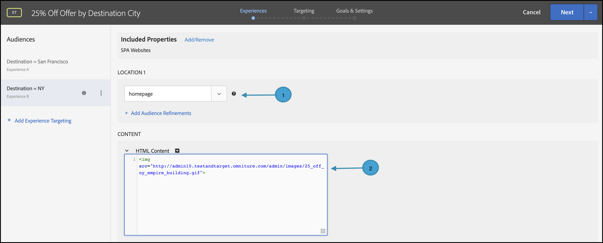

# Personnalisation de la diffusion

## Résumé des étapes

1. Activer [!UICONTROL on-device decisioning] pour votre organisation
1. Créer une activité [!UICONTROL Experience Targeting] (XT)
1. Définition d’une expérience personnalisée par audience
1. Vérifier l’expérience personnalisée par audience
1. Configuration de la création de rapports
1. Ajout de mesures pour le suivi des indicateurs clés de performance
1. Mettre en oeuvre des offres personnalisées dans votre application
1. Mise en oeuvre du code pour suivre les événements de conversion
1. Activez votre activité de personnalisation [!UICONTROL Experience Targeting] (XT)

Supposons que vous soyez une compagnie touristique. Vous souhaitez proposer une offre personnalisée de 25 % sur certains forfaits de voyage. Pour que l’offre interagisse avec vos utilisateurs, vous décidez d’afficher un point de repère de la ville de destination. Vous souhaitez également vous assurer que la diffusion de vos offres personnalisées est exécutée à une latence proche de zéro afin qu’elle n’ait pas d’incidence négative sur les expériences utilisateur et n’influence pas les résultats.

## 1. Activez [!UICONTROL on-device decisioning] pour votre organisation.

1. L’activation de la prise de décision sur l’appareil garantit qu’une activité A/B est exécutée à une latence proche de zéro. Pour activer cette fonction, accédez à **[!UICONTROL Administration]** > **[!UICONTROL Implementation]** > **[!UICONTROL Account details]** dans [!DNL Adobe Target] et activez le bouton d’activation/désactivation de **[!UICONTROL On-Device Decisioning]**.

   

   >[!NOTE]
   >
   >Vous devez disposer du rôle d’administrateur ou d’approbateur [utilisateur](https://experienceleague.adobe.com/docs/target/using/administer/manage-users/user-management.html?lang=fr) pour activer ou désactiver le bouton d’activation/désactivation de [!UICONTROL On-Device Decisioning].

   Après avoir activé le bouton d’activation **[!UICONTROL On-Device Decisioning]**, [!DNL Adobe Target] commence à générer des *artefacts de règle* pour votre client.

## 2. Créer une activité [!UICONTROL Experience Targeting] (XT)

1. Dans [!DNL Adobe Target], accédez à la page **[!UICONTROL Activities]**, puis sélectionnez **[!UICONTROL Create Activity]** > **[!UICONTROL Experience Targeting]**.

   

1. Dans le modal **[!UICONTROL Create Experience Targeting Activity]**, laissez l’option **[!UICONTROL Web]** par défaut sélectionnée (1), sélectionnez **[!UICONTROL Form]** comme compositeur d’expérience (2), sélectionnez un espace de travail et une propriété (3), puis cliquez sur **[!UICONTROL Next]** (4).

   

## 3. Définir une expérience personnalisée par audience

1. À l’étape **[!UICONTROL Experiences]** de la création de l’activité, cliquez sur **[!UICONTROL Change Audience]** pour créer une audience de ces visiteurs qui souhaitent se rendre à San Francisco, en Californie.

   

1. Dans le modal **[!UICONTROL Create Audience]**, définissez une règle personnalisée où `destinationCity = San Francisco`. Cela définit le groupe d’utilisateurs qui souhaitent se rendre à San Francisco.

   

1. Toujours à l’étape **[!UICONTROL Experiences]**, saisissez le nom de l’emplacement (1) dans votre application où vous souhaitez effectuer le rendu d’une offre spéciale concernant le Golden Gate Bridge, mais uniquement pour ceux qui se sont rendus à San Francisco. Dans l’exemple illustré ici, la page d’accueil est l’emplacement sélectionné pour l’offre d’HTML (2), qui est définie dans la zone **[!UICONTROL Content]**.

   

1. Ajoutez une autre audience de ciblage en cliquant sur **[!UICONTROL Add Experience Targeting]**. Cette fois, ciblez une audience qui souhaite se rendre à New York en définissant une règle d’audience où `destinationCity = New York`. Définissez l’emplacement dans votre application où vous souhaitez effectuer le rendu d’une offre spéciale concernant l’Empire State Building. Dans l’exemple illustré ici, `homepage` est l’emplacement sélectionné pour l’offre d’HTML (2), qui est défini dans la zone **[!UICONTROL Content]**.

   

## 4. Vérifier l’expérience personnalisée par audience

À l’étape **[!UICONTROL Targeting]**, vérifiez que vous avez configuré l’expérience personnalisée souhaitée par audience.


## 5. Configuration de la création de rapports

À l’étape **[!UICONTROL Goals & Settings]**, choisissez **[!UICONTROL Adobe Target]** comme **[!UICONTROL Reporting Source]** pour afficher les résultats de l’activité dans l’interface utilisateur de [!DNL Adobe Target] ou sélectionnez **[!UICONTROL Adobe Analytics]** pour les afficher dans l’interface utilisateur d’Adobe Analytics.


## 6. Ajout de mesures pour le suivi des indicateurs clés de performance

Sélectionnez un **[!UICONTROL Goal Metric]** pour mesurer le succès de l’activité. Dans cet exemple, une conversion réussie dépend du clic de l’utilisateur sur l’offre de destination personnalisée.

## 7. Mettre en oeuvre vos offres personnalisées dans votre application

>[!BEGINTABS]

>[!TAB Node.js]

```js {line-numbers="true"}
const TargetClient = require("@adobe/target-nodejs-sdk");

const CONFIG = {
  client: "acmeclient",
  organizationId: "1234567890@AdobeOrg"
};

const targetClient = TargetClient.create(CONFIG);

targetClient.getOffers({
  request: {      
    execute: {
      pageLoad: {
        parameters: {
          destinationCity: "San Francisco"
        }
      }
    }       
  }
})
.then(console.log)
.catch(console.error);
```

>[!TAB Java]

```java {line-numbers="true"}
ClientConfig config = ClientConfig.builder()
  .client("acmeclient")
  .organizationId("1234567890@AdobeOrg")
  .build();
TargetClient targetClient = TargetClient.create(config);

Context context = new Context().channel(ChannelType.WEB);

ExecuteRequest executeRequest = new ExecuteRequest();

RequestDetails pageLoad = new RequestDetails();
pageLoad.setParameters(
    new HashMap<String, String>() {
      {
        put("destinationCity", "San Francisco");
      }
    });

executeRequest.setPageLoad(pageLoad);

TargetDeliveryRequest request = TargetDeliveryRequest.builder()
  .context(context)
  .execute(executeRequest)
  .build();

TargetDeliveryResponse offers = targetClient.getOffers(request);
```

>[!ENDTABS]

## 8. Mise en oeuvre du code pour suivre les événements de conversion

>[!BEGINTABS]

>[!TAB Node.js]

```js {line-numbers="true"}
//... Code removed for brevity

//When a conversion happens
TargetClient.sendNotifications({
    targetCookie,
    "request" : {
      "notifications" : [
        {
          type: "click",
          timestamp : Date.now(),
          id: "conversion",
          mbox : {
            name : "destinationOffer"
          }
        }
      ]
    }
})
```

>[!TAB Java]

```java {line-numbers="true"
ClientConfig config = ClientConfig.builder()
  .client("acmeclient")
  .organizationId("1234567890@AdobeOrg")
  .build();
TargetClient targetClient = TargetClient.create(config);

Context context = new Context().channel(ChannelType.WEB);

ExecuteRequest executeRequest = new ExecuteRequest();

RequestDetails pageLoad = new RequestDetails();
pageLoad.setParameters(
    new HashMap<String, String>() {
      {
        put("destinationCity", "San Francisco");
      }
    });

executeRequest.setPageLoad(pageLoad);
NotificationDeliveryService notificationDeliveryService = new NotificationDeliveryService();

Notification notification = new Notification();
notification.setId("conversion");
notification.setImpressionId(UUID.randomUUID().toString());
notification.setType(MetricType.CLICK);
notification.setTimestamp(System.currentTimeMillis());
notification.setTokens(
    Collections.singletonList(
        "IbG2Jz2xmHaqX7Ml/YRxRGqipfsIHvVzTQxHolz2IpSCnQ9Y9OaLL2gsdrWQTvE54PwSz67rmXWmSnkXpSSS2Q=="));

TargetDeliveryRequest targetDeliveryRequest =
    TargetDeliveryRequest.builder()
        .context(context)
        .execute(executeRequest)
        .notifications(Collections.singletonList(notification))
        .build();

TargetDeliveryResponse offers = targetClient.getOffers(request);
notificationDeliveryService.sendNotification(request);
```

>[!ENDTABS]

## 9. Activez votre activité de ciblage d’expérience (XT).


