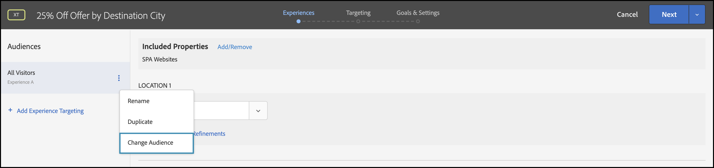
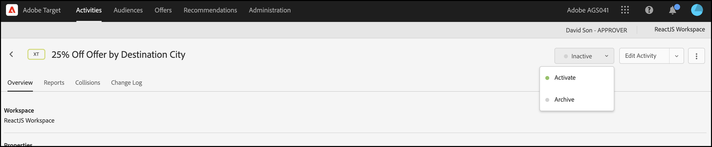

# Personnalisation de la diffusion

## Résumé des étapes

1. Activez la [!UICONTROL prise de décision sur l’appareil] pour votre organisation
1. Créer une activité [!UICONTROL Ciblage d’expérience] (XT)
1. Définition d’une expérience personnalisée par audience
1. Vérifier l’expérience personnalisée par audience
1. Configurer des rapports
1. Ajout de mesures pour le suivi des KPI
1. Mise en œuvre d’offres personnalisées dans votre application
1. Implémenter le code pour suivre les événements de conversion
1. Activez votre activité de personnalisation [!UICONTROL  Ciblage d’expérience ] (XT)

Supposons que vous soyez une société itinérante. Vous souhaitez proposer une offre personnalisée de 25 % de réduction sur certains forfaits. Pour que l’offre résonne auprès de vos utilisateurs et utilisatrices, vous décidez de montrer un point de repère de la ville de destination. Vous devez également vous assurer que la diffusion de vos offres personnalisées est exécutée avec une latence proche de zéro, afin qu’elle n’ait pas d’impact négatif sur les expériences utilisateur et ne fausse pas les résultats.

## &#x200B;1. Activez la [!UICONTROL prise de décision sur l’appareil] pour votre organisation

1. L’activation de la prise de décision sur l’appareil garantit l’exécution d’une activité A/B avec une latence proche de zéro. Pour activer cette fonctionnalité, accédez à **[!UICONTROL Administration]** > **[!UICONTROL Implémentation]** > **[!UICONTROL Détails du compte]** dans [!DNL Adobe Target], puis activez le bouton (bascule) **[!UICONTROL Prise de décision sur l’appareil]**.

   

   >[!NOTE]
   >
   >Vous devez disposer du [rôle utilisateur](https://experienceleague.adobe.com/docs/target/using/administer/manage-users/user-management.html) Administrateur ou Approbateur pour activer ou désactiver le bouton [!UICONTROL Prise de décision sur l’appareil].

   Après avoir activé le bouton (bascule) **[!UICONTROL Prise de décision sur l’appareil]**, [!DNL Adobe Target] commence à générer des *artefacts de règle* pour votre client.

## &#x200B;2. Créer une activité [!UICONTROL Ciblage d’expérience] (XT)

1. Dans [!DNL Adobe Target], accédez à la page **[!UICONTROL Activités]**, puis sélectionnez **[!UICONTROL Créer une activité]** > **[!UICONTROL Ciblage d’expérience]**.

   

1. Dans la boîte de dialogue modale **[!UICONTROL Créer une activité de ciblage d’expérience]**, laissez l’option par défaut **[!UICONTROL Web]** sélectionnée (1), sélectionnez **[!UICONTROL Formulaire]** comme compositeur d’expérience (2), sélectionnez un espace de travail et une propriété (3), puis cliquez sur **[!UICONTROL Suivant]** (4).

   

## &#x200B;3. Définition d’une expérience personnalisée par audience

1. À l’étape **[!UICONTROL Expériences]** de la création de l’activité, cliquez sur **[!UICONTROL Modifier l’audience]** pour créer une audience des visiteurs qui souhaitent se rendre à San Francisco, en Californie.

   

1. Dans la fenêtre modale **[!UICONTROL Créer une audience]**, définissez une règle personnalisée où `destinationCity = San Francisco`. Ceci définit le groupe d’utilisateurs qui souhaitent se rendre à San Francisco.

   

1. Toujours à l’étape **[!UICONTROL Expériences]**, saisissez le nom de l’emplacement (1) dans votre application où vous souhaitez effectuer le rendu d’une offre spéciale concernant le Golden Gate Bridge, mais uniquement pour ceux qui se rendent à San Francisco. Dans l’exemple illustré ici, la page d’accueil est l’emplacement sélectionné pour l’offre HTML (2), qui est définie dans la zone **[!UICONTROL Contenu]**.

   

1. Ajoutez une autre audience de ciblage en cliquant sur **[!UICONTROL Ajouter le ciblage d’expérience]**. Cette fois, ciblez une audience qui souhaite se rendre à New York en définissant une règle d’audience où `destinationCity = New York`. Définissez l’emplacement dans votre application où vous souhaitez effectuer le rendu d’une offre spéciale concernant l’Empire State Building. Dans l’exemple illustré ici, `homepage` est l’emplacement sélectionné pour l’offre HTML (2), qui est définie dans la zone **[!UICONTROL Contenu]**.

   

## &#x200B;4. Vérifier l’expérience personnalisée par audience

À l’étape **[!UICONTROL Ciblage]**, vérifiez que vous avez configuré l’expérience personnalisée souhaitée par audience.


## &#x200B;5. Configurer des rapports

À l’étape **[!UICONTROL Objectifs et paramètres]**, choisissez **[!UICONTROL Adobe Target]** comme **[!UICONTROL Source de création de rapports]** pour afficher les résultats des activités dans l’interface utilisateur de [!DNL Adobe Target], ou choisissez **[!UICONTROL Adobe Analytics]** pour les afficher dans l’interface utilisateur d’Adobe Analytics.


## &#x200B;6. Ajout de mesures pour le suivi des KPI

Choisissez une **[!UICONTROL mesure d’objectif]** pour mesurer le succès de l’activité. Dans cet exemple, la réussite d’une conversion dépend du clic de l’utilisateur ou de l’utilisatrice sur l’offre de destination personnalisée.

## &#x200B;7. Implémenter vos offres personnalisées dans votre application

>[!BEGINTABS]

>[!TAB Node.js]

```js {line-numbers="true"}
const TargetClient = require("@adobe/target-nodejs-sdk");

const CONFIG = {
  client: "acmeclient",
  organizationId: "1234567890@AdobeOrg"
};

const targetClient = TargetClient.create(CONFIG);

targetClient.getOffers({
  request: {      
    execute: {
      pageLoad: {
        parameters: {
          destinationCity: "San Francisco"
        }
      }
    }       
  }
})
.then(console.log)
.catch(console.error);
```

>[!TAB Java]

```java {line-numbers="true"}
ClientConfig config = ClientConfig.builder()
  .client("acmeclient")
  .organizationId("1234567890@AdobeOrg")
  .build();
TargetClient targetClient = TargetClient.create(config);

Context context = new Context().channel(ChannelType.WEB);

ExecuteRequest executeRequest = new ExecuteRequest();

RequestDetails pageLoad = new RequestDetails();
pageLoad.setParameters(
    new HashMap<String, String>() {
      {
        put("destinationCity", "San Francisco");
      }
    });

executeRequest.setPageLoad(pageLoad);

TargetDeliveryRequest request = TargetDeliveryRequest.builder()
  .context(context)
  .execute(executeRequest)
  .build();

TargetDeliveryResponse offers = targetClient.getOffers(request);
```

>[!ENDTABS]

## &#x200B;8. Implémenter le code pour suivre les événements de conversion

>[!BEGINTABS]

>[!TAB Node.js]

```js {line-numbers="true"}
//... Code removed for brevity

//When a conversion happens
TargetClient.sendNotifications({
    targetCookie,
    "request" : {
      "notifications" : [
        {
          type: "click",
          timestamp : Date.now(),
          id: "conversion",
          mbox : {
            name : "destinationOffer"
          }
        }
      ]
    }
})
```

>[!TAB Java]

```java {line-numbers="true"
ClientConfig config = ClientConfig.builder()
  .client("acmeclient")
  .organizationId("1234567890@AdobeOrg")
  .build();
TargetClient targetClient = TargetClient.create(config);

Context context = new Context().channel(ChannelType.WEB);

ExecuteRequest executeRequest = new ExecuteRequest();

RequestDetails pageLoad = new RequestDetails();
pageLoad.setParameters(
    new HashMap<String, String>() {
      {
        put("destinationCity", "San Francisco");
      }
    });

executeRequest.setPageLoad(pageLoad);
NotificationDeliveryService notificationDeliveryService = new NotificationDeliveryService();

Notification notification = new Notification();
notification.setId("conversion");
notification.setImpressionId(UUID.randomUUID().toString());
notification.setType(MetricType.CLICK);
notification.setTimestamp(System.currentTimeMillis());
notification.setTokens(
    Collections.singletonList(
        "IbG2Jz2xmHaqX7Ml/YRxRGqipfsIHvVzTQxHolz2IpSCnQ9Y9OaLL2gsdrWQTvE54PwSz67rmXWmSnkXpSSS2Q=="));

TargetDeliveryRequest targetDeliveryRequest =
    TargetDeliveryRequest.builder()
        .context(context)
        .execute(executeRequest)
        .notifications(Collections.singletonList(notification))
        .build();

TargetDeliveryResponse offers = targetClient.getOffers(request);
notificationDeliveryService.sendNotification(request);
```

>[!ENDTABS]

## &#x200B;9. Activation de votre activité de ciblage d’expérience (XT)


