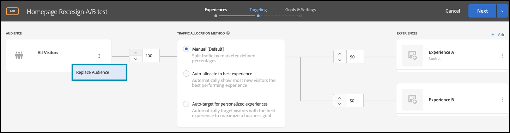
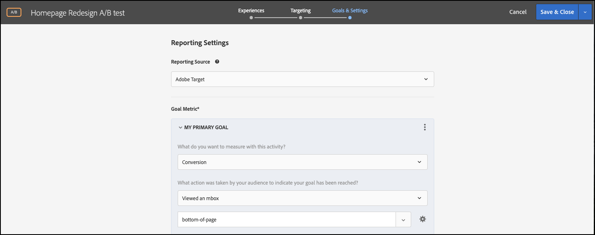
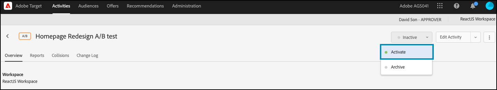

# Exécution de tests A/B avec des indicateurs de fonctionnalité

## Résumé des étapes

1. Activer [!UICONTROL on-device decisioning] pour votre organisation
1. Créer une activité [!UICONTROL A/B Test]
1. Définissez vos A et B
1. Ajout d’une audience
1. Définition de l’affectation du trafic
1. Définir la distribution du trafic sur les variations
1. Configuration de la création de rapports
1. Ajout de mesures pour le suivi des indicateurs clés de performance
1. Mise en oeuvre du code pour exécuter des tests A/B avec des indicateurs de fonctionnalité
1. Activation de votre test A/B avec des indicateurs de fonctionnalité

>[!NOTE]
>
>Supposons que vous souhaitiez déterminer si la reconception de votre page d’accueil sur le thème des abandons sera bien reçue par vos utilisateurs. Vous décidez de le tester en exécutant une expérience A/B dans [!DNL Adobe Target]. Vous souhaitez également vous assurer que l’expérience est fournie avec de grandes performances afin qu’une expérience utilisateur négative ou lente ne biaise pas les résultats.

## 1. Activez [!UICONTROL on-device decisioning] pour votre organisation.

L’activation de la prise de décision sur l’appareil garantit qu’une activité A/B est exécutée à une latence proche de zéro. Pour activer cette fonction, accédez à **[!UICONTROL Administration]** > **[!UICONTROL Implementation]** > **[!UICONTROL Account details]** dans [!DNL Adobe Target] et activez le bouton d’activation/désactivation de **[!UICONTROL On-Device Decisioning]**.

&lt;!— Insérer image-odd-4.png —>


>[!NOTE]
>
>Vous devez disposer du [rôle d’utilisateur](https://experienceleague.adobe.com/docs/target/using/administer/manage-users/user-management.html) administrateur ou approbateur pour activer ou désactiver le bouton de prise de décision sur périphérique.

Après avoir activé le bouton bascule **[!UICONTROL On-Device Decisioning]**, [!DNL Adobe Target] commence à générer des artefacts de règle pour votre client.

## 2. Créer une activité [!UICONTROL A/B Test]

Dans [!DNL Adobe Target], accédez à la page **[!UICONTROL Activities]**, puis sélectionnez **[!UICONTROL Create Activity]** > **[!UICONTROL A/B test]**.


Dans le modal **[!UICONTROL Create A/B Test Activity]**, laissez l’option **[!UICONTROL Web]** par défaut sélectionnée (1), sélectionnez **[!UICONTROL Form]** comme compositeur d’expérience (2), sélectionnez **[!UICONTROL Default Workspace]** avec No **[!UICONTROL Property Restrictions]** (3), puis cliquez sur **[!UICONTROL Next]** (4).


## 3. Définissez vos A et B

1. À l’étape **[!UICONTROL Experiences]** de la création de l’activité, donnez un nom à votre activité (1) et ajoutez une seconde expérience, l’expérience B, en cliquant sur le bouton **[!UICONTROL Add Experience]** (2). Saisissez le nom de l’emplacement (3) dans l’application où vous souhaitez exécuter votre test A/B. Dans l’exemple ci-dessous, la page d’accueil est l’emplacement défini pour l’expérience A (il s’agit également de l’emplacement défini pour l’expérience B).

   L’expérience A définit le contrôle, qui est la conception actuelle de la page d’accueil.

   

   L’expérience B définit l’expérience concurrente, qui représente une page d’accueil repensée. Cliquez sur pour modifier le contenu par défaut (1).

   

1. Dans l’expérience B, cliquez pour remplacer le contenu **[!UICONTROL Default Content]** par le contenu reconçu en sélectionnant **[!UICONTROL Create JSON Offer]** comme illustré ci-dessous (1).

   

1. Définissez le fichier JSON avec des attributs qui seront utilisés comme indicateurs pour permettre à la logique métier de rendre la nouvelle page d’accueil repensée, plutôt que la page d’accueil actuelle en production.


   >[!NOTE]
   >
   >Lorsque [!DNL Adobe Target] regroupe un utilisateur pour afficher l’expérience B (la page d’accueil repensée), le fichier JSON avec les attributs définis dans l’exemple est renvoyé. Dans votre code, vous devez vérifier les valeurs d’attribut pour décider d’exécuter la logique métier pour effectuer le rendu de la page d’accueil repensée. Vous pouvez définir les noms, les valeurs et le nombre d’attributs dans cette réponse JSON.

   

## 4. Ajout d’une audience

Supposons que vous souhaitiez d’abord tester la reconception sur vos clients fidèles, que vous pouvez identifier selon qu’ils sont connectés ou non.

1. À l’étape **[!UICONTROL Targeting]**, cliquez pour remplacer l’audience **[!UICONTROL All Visitors]**, comme indiqué.

   

1. Dans le modal **[!UICONTROL Create Audience]**, définissez une règle personnalisée où `logged-in = true`. Cela définit le groupe d’utilisateurs connectés. Utilisez cette audience dans votre activité.

   

## 5. Définition de l’affectation du trafic

Définissez le pourcentage de vos utilisateurs connectés par rapport auxquels vous souhaitez tester la nouvelle conception de votre page d’accueil. En d’autres termes, à quel pourcentage de vos utilisateurs souhaitez-vous déployer ce test ? Dans cet exemple, pour déployer ce test sur tous les utilisateurs connectés, conservez l’affectation du trafic à 100 %.


## 6. Définir la distribution du trafic sur des variations

Définissez le pourcentage des utilisateurs connectés qui visualiseront la conception actuelle de la page d’accueil ou la toute nouvelle conception. Dans cet exemple, conservez la distribution du trafic sous la forme d’une répartition 50/50 entre les expériences A et B.


## 7. Configuration de la création de rapports

À l’étape **[!UICONTROL Goals & Settings]**, choisissez **[!UICONTROL Adobe Target]** comme **[!UICONTROL Reporting Source]** pour afficher les résultats de l’activité dans l’interface utilisateur de [!DNL Adobe Target] ou sélectionnez **[!UICONTROL Adobe Analytics]** pour les afficher dans l’interface utilisateur d’Adobe Analytics.



## 8. Ajout de mesures pour les indicateurs clés de performance de suivi

Sélectionnez un **[!UICONTROL Goal Metric]** pour mesurer le test A/B. Dans cet exemple, une conversion réussie dépend de si l’utilisateur atteint le bas de la page, indiquant un engagement. Par conséquent, **[!UICONTROL Conversion]** est déterminé en fonction de si l’utilisateur a consulté l’emplacement nommé bas de la page.

## 9. Implémentez du code pour exécuter des tests A/B avec des indicateurs de fonctionnalité dans votre application.

>[!BEGINTABS]

>[!TAB Node.js]

```js {line-numbers="true"}
const TargetClient = require("@adobe/target-nodejs-sdk");
const options = {
  client: "testClient",
  organizationId: "ABCDEF012345677890ABCDEF0@AdobeOrg",
  decisioningMethod: "on-device",
  events: {
    clientReady: targetClientReady
  }
};
const targetClient = TargetClient.create(options);

function targetClientReady() {
  return targetClient.getAttributes(["homepage"]).then(function(attributes) {
    const flag = attributes.getValue("homepage", "feature-flag");
    // ...
  });
}
```

>[!TAB Java]

```java {line-numbers="true"}
import com.adobe.target.edge.client.ClientConfig;
import com.adobe.target.edge.client.TargetClient;
import com.adobe.target.delivery.v1.model.ChannelType;
import com.adobe.target.delivery.v1.model.Context;
import com.adobe.target.delivery.v1.model.ExecuteRequest;
import com.adobe.target.delivery.v1.model.MboxRequest;
import com.adobe.target.edge.client.entities.TargetDeliveryRequest;
import com.adobe.target.edge.client.model.TargetDeliveryResponse;

ClientConfig config = ClientConfig.builder()
    .client("testClient")
    .organizationId("ABCDEF012345677890ABCDEF0@AdobeOrg")
    .build();
TargetClient targetClient = TargetClient.create(config);
MboxRequest mbox = new MboxRequest().name("homepage").index(0);
TargetDeliveryRequest request = TargetDeliveryRequest.builder()
    .context(new Context().channel(ChannelType.WEB))
    .execute(new ExecuteRequest().mboxes(Arrays.asList(mbox)))
    .build();
Attributes attributes = targetClient.getAttributes(request, "homepage");
String flag = attributes.getString("homepage", "feature-flag");
```

>[!ENDTABS]

## 10. Activez votre test A/B avec l’indicateur de fonctionnalité.


