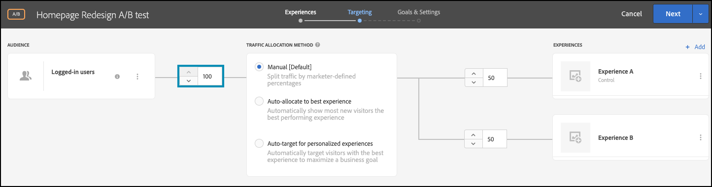
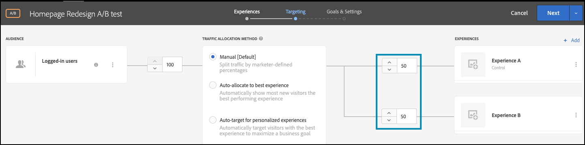

# Exécuter des tests A/B avec des indicateurs de fonctionnalité

## Résumé des étapes

1. Activez la [!UICONTROL prise de décision sur l’appareil] pour votre organisation
1. Création d’une activité [!UICONTROL Test A/B]
1. Définition des éléments A et B
1. Ajouter une audience
1. Définir l’affectation du trafic
1. Définition de la distribution du trafic sur des variations
1. Configurer des rapports
1. Ajout de mesures pour le suivi des KPI
1. Implémenter le code pour exécuter des tests A/B avec des indicateurs de fonctionnalité
1. Activer votre test A/B avec les indicateurs de fonctionnalité

>[!NOTE]
>
>Supposons que vous souhaitiez déterminer si la nouvelle conception de votre page d’accueil sur le thème de l’automne serait bien reçue par vos utilisateurs. Vous décidez de le tester en exécutant une expérience A/B dans [!DNL Adobe Target]. Vous devez également vous assurer que l’expérience est fournie avec de grandes performances afin qu’une expérience utilisateur négative ou lente ne biaise pas les résultats.

## &#x200B;1. Activez la [!UICONTROL prise de décision sur l’appareil] pour votre organisation

L’activation de la prise de décision sur l’appareil garantit l’exécution d’une activité A/B avec une latence proche de zéro. Pour activer cette fonctionnalité, accédez à **[!UICONTROL Administration]** > **[!UICONTROL Implémentation]** > **[!UICONTROL Détails du compte]** dans [!DNL Adobe Target], puis activez le bouton (bascule) **[!UICONTROL Prise de décision sur l’appareil]**.

&lt;!— Insérer image-odd4.png —>


>[!NOTE]
>
>Vous devez disposer du [rôle utilisateur](https://experienceleague.adobe.com/docs/target/using/administer/manage-users/user-management.html?lang=fr) Administrateur ou Approbateur pour activer ou désactiver le bouton (bascule) Prise de décision sur l’appareil.

Après avoir activé le bouton (bascule) **[!UICONTROL Prise de décision sur l’appareil]**, [!DNL Adobe Target] commence à générer des artefacts de règle pour votre client.

## &#x200B;2. Création d’une activité [!UICONTROL Test A/B]

Dans [!DNL Adobe Target], accédez à la page **[!UICONTROL Activités]**, puis sélectionnez **[!UICONTROL Créer une activité]** > **[!UICONTROL Test A/B]**.


Dans la boîte de dialogue modale **[!UICONTROL Créer une activité de test A/B]**, laissez l’option par défaut **[!UICONTROL Web]** sélectionnée (1), sélectionnez **[!UICONTROL Formulaire]** comme compositeur d’expérience (2), sélectionnez **[!UICONTROL Workspace par défaut]** sans **[!UICONTROL Restrictions de propriété]** (3), puis cliquez sur **[!UICONTROL Suivant]** (4).


## &#x200B;3. Définition des éléments A et B

1. À l’étape **[!UICONTROL Expériences]** de la création de l’activité, attribuez un nom à votre activité (1) et ajoutez une deuxième expérience, l’expérience B, en cliquant sur le bouton **[!UICONTROL Ajouter une expérience]** (2). Saisissez le nom de l’emplacement (3) dans votre application où vous souhaitez exécuter votre test A/B. Dans l’exemple illustré ci-dessous, la page d’accueil est l’emplacement défini pour l’expérience A. (Il s’agit également de l’emplacement défini pour l’expérience B.)

   L’expérience A définit le contrôle, qui est la conception actuelle de la page d’accueil.

   

   L’expérience B définit le challenger, qui représente une page d’accueil repensée. Cliquez pour modifier le contenu par défaut (1).

   

1. Dans l’expérience B, cliquez pour modifier le contenu de **[!UICONTROL Contenu par défaut]** au contenu repensé en sélectionnant **[!UICONTROL Créer une offre JSON]** comme illustré ci-dessous (1).

   

1. Définissez le JSON avec des attributs qui seront utilisés comme indicateurs pour permettre à votre logique commerciale d’effectuer le rendu de la page d’accueil nouvellement reconçue, plutôt que de la page d’accueil actuelle en production.


   >[!NOTE]
   >
   >Lorsque [!DNL Adobe Target] regroupe un utilisateur pour afficher l’expérience B (page d’accueil repensée), le fichier JSON avec les attributs définis dans l’exemple est renvoyé. Dans votre code, vous devez vérifier les valeurs d’attribut pour décider d’exécuter ou non la logique commerciale afin d’effectuer le rendu de la page d’accueil repensée. Vous pouvez définir les noms, les valeurs et le nombre d’attributs dans cette réponse JSON.

   

## &#x200B;4. Ajouter une audience

Supposons que vous souhaitiez d’abord tester la reconception auprès de vos clients fidèles, que vous pouvez identifier selon qu’ils sont connectés ou non.

1. À l’étape **[!UICONTROL Ciblage]**, cliquez sur pour remplacer l’audience **[!UICONTROL Tous les visiteurs]**, comme illustré ci-dessous.

   

1. Dans la fenêtre modale **[!UICONTROL Créer une audience]**, définissez une règle personnalisée où `logged-in = true`. Cet exemple définit le groupe d’utilisateurs connectés. Utilisez cette audience dans votre activité.

   

## &#x200B;5. Définir l’affectation du trafic

Définissez le pourcentage de vos utilisateurs connectés par rapport auquel vous souhaitez tester la nouvelle conception de votre page d’accueil. En d’autres termes, à quel pourcentage de vos utilisateurs souhaitez-vous déployer ce test ? Dans cet exemple, pour déployer ce test sur tous les utilisateurs connectés, conservez l’affectation du trafic à 100 %.



## &#x200B;6. Définition de la distribution du trafic sur des variations

Définissez le pourcentage de vos utilisateurs connectés qui verront la conception actuelle de la page d’accueil ou la nouvelle conception complète. Dans cet exemple, conservez la répartition du trafic sous la forme d’une répartition 50/50 entre les expériences A et B.



## &#x200B;7. Configurer des rapports

À l’étape **[!UICONTROL Objectifs et paramètres]**, choisissez **[!UICONTROL Adobe Target]** comme **[!UICONTROL Source de création de rapports]** pour afficher les résultats des activités dans l’interface utilisateur de [!DNL Adobe Target], ou choisissez **[!UICONTROL Adobe Analytics]** pour les afficher dans l’interface utilisateur d’Adobe Analytics.


## &#x200B;8. Ajout de mesures pour le suivi des KPI

Choisissez une **[!UICONTROL mesure d’objectif]** pour mesurer le test A/B. Dans cet exemple, une conversion réussie dépend du fait que l’utilisateur atteint ou non le bas de la page, ce qui indique un engagement. Par conséquent, la **[!UICONTROL Conversion]** est déterminée en fonction du fait que l’utilisateur ou l’utilisatrice a consulté l’emplacement nommé en bas de la page ou non.

## &#x200B;9. Implémentez le code pour exécuter des tests A/B avec des indicateurs de fonctionnalité dans votre application.

>[!BEGINTABS]

>[!TAB Node.js]

```js {line-numbers="true"}
const TargetClient = require("@adobe/target-nodejs-sdk");
const options = {
  client: "testClient",
  organizationId: "ABCDEF012345677890ABCDEF0@AdobeOrg",
  decisioningMethod: "on-device",
  events: {
    clientReady: targetClientReady
  }
};
const targetClient = TargetClient.create(options);

function targetClientReady() {
  return targetClient.getAttributes(["homepage"]).then(function(attributes) {
    const flag = attributes.getValue("homepage", "feature-flag");
    // ...
  });
}
```

>[!TAB Java]

```java {line-numbers="true"}
import com.adobe.target.edge.client.ClientConfig;
import com.adobe.target.edge.client.TargetClient;
import com.adobe.target.delivery.v1.model.ChannelType;
import com.adobe.target.delivery.v1.model.Context;
import com.adobe.target.delivery.v1.model.ExecuteRequest;
import com.adobe.target.delivery.v1.model.MboxRequest;
import com.adobe.target.edge.client.entities.TargetDeliveryRequest;
import com.adobe.target.edge.client.model.TargetDeliveryResponse;

ClientConfig config = ClientConfig.builder()
    .client("testClient")
    .organizationId("ABCDEF012345677890ABCDEF0@AdobeOrg")
    .build();
TargetClient targetClient = TargetClient.create(config);
MboxRequest mbox = new MboxRequest().name("homepage").index(0);
TargetDeliveryRequest request = TargetDeliveryRequest.builder()
    .context(new Context().channel(ChannelType.WEB))
    .execute(new ExecuteRequest().mboxes(Arrays.asList(mbox)))
    .build();
Attributes attributes = targetClient.getAttributes(request, "homepage");
String flag = attributes.getString("homepage", "feature-flag");
```

>[!ENDTABS]

## &#x200B;10. Activer votre test A/B avec l’indicateur de fonctionnalité


