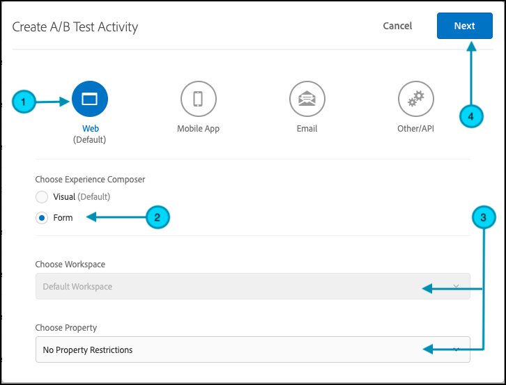
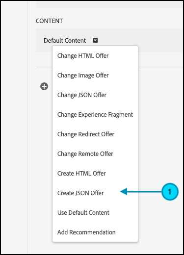
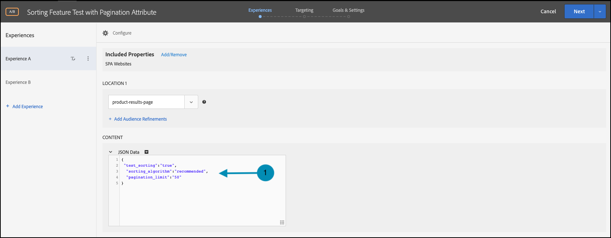
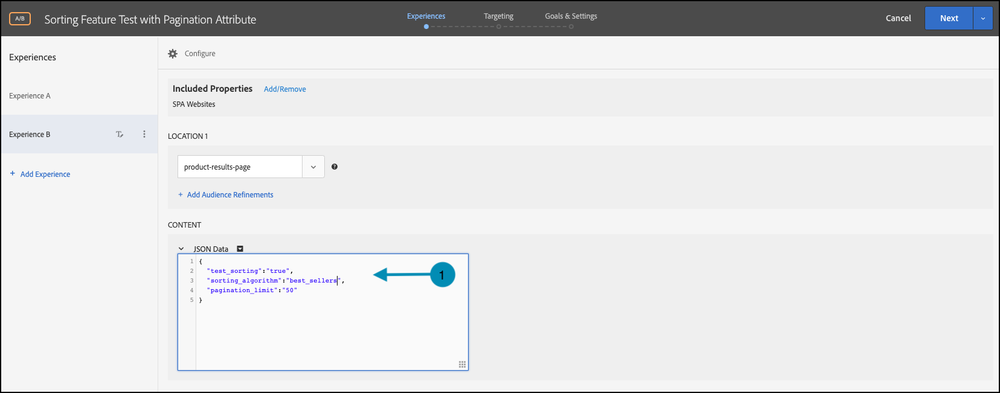

# Exécuter des tests de fonctionnalité avec des attributs

## Résumé des étapes

1. Activation de [!UICONTROL on-device decisioning] pour votre organisation
1. Création d’une activité [!UICONTROL A/B Test]
1. Définition des éléments A et B
1. Ajouter une audience
1. Définir l’affectation du trafic
1. Définition de la distribution du trafic sur des variations
1. Configurer des rapports
1. Ajout de mesures pour le suivi des KPI
1. Implémentez le code pour exécuter des tests de fonctionnalité avec des attributs
1. Implémenter le code pour suivre les événements de conversion
1. Activez vos tests de fonctionnalités avec des attributs

>[!NOTE]
>
>Supposons que vous soyez une société de commerce électronique. Vous souhaitez augmenter le taux de conversion lorsque les clients parcourent et trient votre catalogue de produits. Vous avez une hypothèse selon laquelle certains algorithmes de tri et certaines stratégies de pagination produisent de meilleurs résultats que d’autres. Pour tester cette théorie, vous décidez d’exécuter un test de fonctionnalité qui implique la reconception du widget de tri à l’aide de différentes options de tri pour vos utilisateurs finaux. Vous devez vous assurer que ce test de fonctionnalité est exécuté avec une latence proche de zéro afin qu’il n’ait pas d’impact négatif sur les expériences utilisateur et ne biaise pas les résultats.

## &#x200B;1. Activation de [!UICONTROL on-device decisioning] pour votre organisation

L’activation de la prise de décision sur l’appareil garantit l’exécution d’une activité A/B avec une latence proche de zéro. Pour activer cette fonctionnalité, accédez à **[!UICONTROL Administration]** > **[!UICONTROL Implementation]** > **[!UICONTROL Account details]** dans [!DNL Adobe Target], puis activez le bouton (bascule) **[!UICONTROL On-Device Decisioning]**.


>[!NOTE]
>
>Vous devez disposer du [rôle utilisateur](https://experienceleague.adobe.com/docs/target/using/administer/manage-users/user-management.html) Administrateur ou Approbateur pour activer ou désactiver le bouton **[!UICONTROL On-Device Decisioning]**.

Après avoir activé le bouton **[!UICONTROL On-Device Decisioning]**, [!DNL Adobe Target] commence à générer des *artefacts de règle* pour votre client.

## &#x200B;2. Création d’une activité [!UICONTROL A/B Test]

1. Dans [!DNL Adobe Target], accédez à la page **[!UICONTROL Activities]**, puis sélectionnez **[!UICONTROL Create Activity]** > **[!UICONTROL A/B test]**.

   

1. Dans la boîte de dialogue modale **[!UICONTROL Create A/B Test Activity]**, laissez l’option de **[!UICONTROL Web]** par défaut sélectionnée (1), sélectionnez **[!UICONTROL Form]** comme compositeur d’expérience (2), sélectionnez **[!UICONTROL Default Workspace]** avec **[!UICONTROL No Property Restrictions]** (3), puis cliquez sur **[!UICONTROL Next]** (4).

   

## &#x200B;3. Définition des éléments A et B

1. À l’étape **[!UICONTROL Experiences]** de la création d’une activité, attribuez un nom à votre activité (1) et ajoutez une deuxième expérience, Expérience B, en cliquant sur le bouton **[!UICONTROL Add Experience]** (2). Saisissez le nom de l’emplacement (3) dans votre application où vous souhaitez exécuter votre test de fonctionnalité avec des attributs. Dans l’exemple illustré ci-dessous, `product-results-page` est l’emplacement défini pour l’expérience A. (Il s’agit également de l’emplacement défini pour l’expérience B.)

   

   **[!UICONTROL Experience A]** contient le fichier JSON qui signale à votre logique commerciale d’effectuer les opérations suivantes :

   * Lancer la fonction d&#39;algorithme de tri via l&#39;indicateur de fonction `test_sorting`
   * Exécuter l&#39;algorithme de tri recommandé défini dans le `sorting_algorithm _**_attribute`
   * Renvoie 50 produits par page, comme défini par la stratégie de pagination définie dans le `pagination_limit`

1. Dans l’expérience A, cliquez pour modifier le contenu de **[!UICONTROL Default Content]** en JSON en sélectionnant **[!UICONTROL Create JSON Offer]** comme illustré ci-dessous (1).

   

1. Définissez le fichier JSON avec des indicateurs et des attributs `test_sorting`, `sorting_algorithm` et `pagination_limit` qui seront utilisés pour lancer l’algorithme de tri recommandé avec une limite de pagination de 50 produits.

   >[!NOTE]
   >
   >Lorsque [!DNL Adobe Target] regroupe un utilisateur pour afficher l’expérience A, le fichier JSON avec les attributs définis dans l’exemple est renvoyé. Dans votre code, vous devez vérifier la valeur de l&#39;indicateur de fonction `test_sorting` pour voir si la fonction de tri doit être activée. Si tel est le cas, vous utiliserez la valeur recommandée de l’attribut `sorting_algorithm` pour afficher les produits recommandés dans la vue de liste de produits. La limite de produits à afficher pour votre application sera de 50, car il s’agit de la valeur de l’attribut `pagination_limit`.

   

   **[!UICONTROL Experience B]** définit le JSON qui signale à votre logique commerciale d’effectuer les opérations suivantes :

   * Lancez la fonction d&#39;algorithme de tri via l&#39;indicateur de fonction test_sorting
   * Exécuter l&#39;algorithme de tri `best_sellers` défini dans le `sorting_algorithm _**_attribute`
   * Renvoie 50 produits par page, comme défini par la stratégie de pagination définie dans le `pagination_limit`

   >[!NOTE]
   >
   >Lorsque [!DNL Adobe Target] regroupe un utilisateur pour afficher l’expérience B, le fichier JSON avec les attributs définis dans l’exemple est renvoyé. Dans votre code, vous devez vérifier la valeur de l&#39;indicateur de fonction `test_sorting` pour voir si la fonction de tri doit être activée. Si tel est le cas, vous utiliserez la valeur `best_sellers` de l’attribut `sorting_algorithm` pour afficher les produits les plus vendus dans la vue de la liste des produits. La limite de produits à afficher pour votre application sera de 50, car il s’agit de la valeur de l’attribut `pagination_limit`.

   

## &#x200B;4. Ajouter une audience

Dans l’étape **[!UICONTROL Targeting]**, conservez l’audience **[!UICONTROL All Visitors]**. Vous pourrez ainsi comprendre l’impact de votre fonction de tri, ainsi que l’algorithme et le nombre d’éléments qui influencent le mieux les résultats.


## &#x200B;5. Définir l’affectation du trafic

Définissez le pourcentage de vos visiteurs par rapport auquel vous souhaitez tester vos algorithmes de tri et votre stratégie de pagination. En d’autres termes, à quel pourcentage de vos utilisateurs souhaitez-vous déployer ce test ? Dans cet exemple, pour déployer ce test sur tous les utilisateurs connectés, conservez l’affectation du trafic à 100 %.


## &#x200B;6. Définition de la distribution du trafic sur des variations

Définissez le pourcentage de vos visiteurs qui verront l’algorithme de tri recommandé par rapport à celui des meilleures ventes, avec une limite de 50 produits par page. Dans cet exemple, conservez la répartition du trafic sous la forme d’une répartition 50/50 entre les expériences A et B.


## &#x200B;7. Configurer des rapports

À l’étape **[!UICONTROL Goals & Settings]**, choisissez **[!UICONTROL Adobe Target]** comme **[!UICONTROL Reporting Source]** pour afficher les résultats de vos tests A/B dans l’interface utilisateur de [!DNL Adobe Target] ou choisissez **[!UICONTROL Adobe Analytics]** pour les afficher dans l’interface utilisateur d’Adobe Analytics.


## &#x200B;8. Ajout de mesures pour le suivi des KPI

Choisissez un **[!UICONTROL Goal Metric]** pour mesurer le test de fonctionnalité avec des attributs. Dans cet exemple, la réussite dépend du fait que l’utilisateur achète ou non un produit, selon l’algorithme de tri et la stratégie de pagination qui lui ont été présentés.

## &#x200B;9. Implémentez des tests de fonctionnalité avec des attributs dans votre application.

>[!BEGINTABS]

>[!TAB Node.js]

```js {line-numbers="true"}
const TargetClient = require("@adobe/target-nodejs-sdk");
const options = {
  client: "testClient",
  organizationId: "ABCDEF012345677890ABCDEF0@AdobeOrg",
  decisioningMethod: "on-device",
  events: {
    clientReady: targetClientReady
  }
};
const targetClient = TargetClient.create(options);

function targetClientReady() {
  return targetClient.getAttributes(["product-results-page"]).then(function(attributes) {
    const test_sorting = attributes.getValue("product-results-page", "test-sorting");
    const sorting_algorithm = attributes.getValue("product-results-page", "sorting_algorithm");
    const pagination_limit = attributes.getValue("product-results-page", "pagination_limit");
  });
}
```

>[!TAB Java]

```java {line-numbers="true"}
import com.adobe.target.edge.client.ClientConfig;
import com.adobe.target.edge.client.TargetClient;
import com.adobe.target.delivery.v1.model.ChannelType;
import com.adobe.target.delivery.v1.model.Context;
import com.adobe.target.delivery.v1.model.ExecuteRequest;
import com.adobe.target.delivery.v1.model.MboxRequest;
import com.adobe.target.edge.client.entities.TargetDeliveryRequest;
import com.adobe.target.edge.client.model.TargetDeliveryResponse;

ClientConfig config = ClientConfig.builder()
    .client("testClient")
    .organizationId("ABCDEF012345677890ABCDEF0@AdobeOrg")
    .build();
TargetClient targetClient = TargetClient.create(config);
MboxRequest mbox = new MboxRequest().name("product-results-page").index(0);
TargetDeliveryRequest request = TargetDeliveryRequest.builder()
    .context(new Context().channel(ChannelType.WEB))
    .execute(new ExecuteRequest().mboxes(Arrays.asList(mbox)))
    .build();
Attributes attributes = targetClient.getAttributes(request, "product-results-page");
String testSorting = attributes.getString("product-results-page", "test-sorting");
String sortingAlgorithm = attributes.getString("product-results-page", "sorting_algorithm");
String paginationLimit = attributes.getString("product-results-page", "pagination_limit");
```

>[!ENDTABS]

## &#x200B;10. Implémenter le code pour suivre les événements de conversion

>[!BEGINTABS]

>[!TAB Node.js]

```js {line-numbers="true"}
//... Code removed for brevity

//When a conversion happens
TargetClient.sendNotifications({
    targetCookie,
    "request" : {
      "notifications" : [
        {
          type: "click",
          timestamp : Date.now(),
          id: "conversion",
          mbox : {
            name : "product-results-page"
          }
        }
      ]
    }
})
```

>[!TAB Java]

```java {line-numbers="true"}
ClientConfig config = ClientConfig.builder()
  .client("acmeclient")
  .organizationId("1234567890@AdobeOrg")
  .build();
TargetClient targetClient = TargetClient.create(config);

Context context = new Context().channel(ChannelType.WEB);

ExecuteRequest executeRequest = new ExecuteRequest();

NotificationDeliveryService notificationDeliveryService = new NotificationDeliveryService();

Notification notification = new Notification();
notification.setId("conversion");
notification.setImpressionId(UUID.randomUUID().toString());
notification.setType(MetricType.CLICK);
notification.setTimestamp(System.currentTimeMillis());
notification.setTokens(
    Collections.singletonList(
        "IbG2Jz2xmHaqX7Ml/YRxRGqipfsIHvVzTQxHolz2IpSCnQ9Y9OaLL2gsdrWQTvE54PwSz67rmXWmSnkXpSSS2Q=="));

TargetDeliveryRequest targetDeliveryRequest =
    TargetDeliveryRequest.builder()
        .context(context)
        .execute(executeRequest)
        .notifications(Collections.singletonList(notification))
        .build();

TargetDeliveryResponse offers = targetClient.getOffers(request);
notificationDeliveryService.sendNotification(request);

Attributes attributes = targetClient.getAttributes(request, "product-results-page");
String testSorting = attributes.getString("product-results-page", "test-sorting");
String sortingAlgorithm = attributes.getString("product-results-page", "sorting_algorithm");
String paginationLimit = attributes.getString("product-results-page", "pagination_limit");
```

>[!ENDTABS]

## &#x200B;11. Activez vos tests de fonctionnalités avec des attributs


