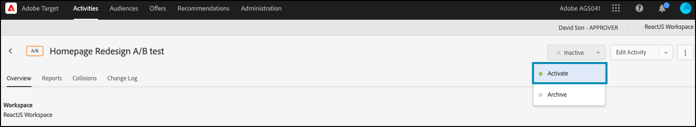

# Exécution de tests de fonctionnalités avec des attributs

## Résumé des étapes

1. Activer [!UICONTROL on-device decisioning] pour votre organisation
1. Créer une activité [!UICONTROL A/B Test]
1. Définissez vos A et B
1. Ajout d’une audience
1. Définition de l’affectation du trafic
1. Définir la distribution du trafic sur les variations
1. Configuration de la création de rapports
1. Ajout de mesures pour le suivi des indicateurs clés de performance
1. Mise en oeuvre du code pour exécuter des tests de fonctionnalités avec des attributs
1. Mise en oeuvre du code pour suivre les événements de conversion
1. Activation des tests de fonctionnalités avec des attributs

>[!NOTE]
>
>Supposons que vous soyez une société de commerce électronique au détail. Vous souhaitez augmenter le taux de conversion lorsque les clients parcourent votre catalogue de produits et le trient. Vous avez l’hypothèse que certains algorithmes de tri et stratégies de pagination donnent de meilleurs résultats que d’autres. Pour tester cette théorie, vous décidez d’exécuter un test de fonctionnalité qui implique la reconception du widget de tri à l’aide de différentes options de tri pour vos utilisateurs finaux. Vous souhaitez vous assurer que ce test de fonctionnalité est exécuté à une latence proche de zéro afin qu’il n’ait pas d’incidence négative sur les expériences utilisateur et n’ajuste pas les résultats.

## 1. Activez [!UICONTROL on-device decisioning] pour votre organisation.

L’activation de la prise de décision sur l’appareil garantit qu’une activité A/B est exécutée à une latence proche de zéro. Pour activer cette fonction, accédez à **[!UICONTROL Administration]** > **[!UICONTROL Implementation]** > **[!UICONTROL Account details]** dans [!DNL Adobe Target] et activez le bouton d’activation/désactivation de **[!UICONTROL On-Device Decisioning]**.


>[!NOTE]
>
>Vous devez disposer du rôle d’administrateur ou d’approbateur [utilisateur](https://experienceleague.adobe.com/docs/target/using/administer/manage-users/user-management.html?lang=fr) pour activer ou désactiver le bouton d’activation/désactivation de **[!UICONTROL On-Device Decisioning]**.

Après avoir activé le bouton d’activation **[!UICONTROL On-Device Decisioning]**, [!DNL Adobe Target] commence à générer des *artefacts de règle* pour votre client.

## 2. Créer une activité [!UICONTROL A/B Test]

1. Dans [!DNL Adobe Target], accédez à la page **[!UICONTROL Activities]**, puis sélectionnez **[!UICONTROL Create Activity]** > **[!UICONTROL A/B test]**.

   

1. Dans le modal **[!UICONTROL Create A/B Test Activity]**, laissez l’option **[!UICONTROL Web]** par défaut sélectionnée (1), sélectionnez **[!UICONTROL Form]** comme compositeur d’expérience (2), sélectionnez **[!UICONTROL Default Workspace]** avec **[!UICONTROL No Property Restrictions]** (3), puis cliquez sur **[!UICONTROL Next]** (4).

   

## 3. Définissez vos A et B

1. À l’étape **[!UICONTROL Experiences]** de la création de l’activité, donnez un nom à votre activité (1) et ajoutez une seconde expérience, l’expérience B, en cliquant sur le bouton **[!UICONTROL Add Experience]** (2). Saisissez le nom de l’emplacement (3) dans votre application où vous souhaitez exécuter votre test de fonctionnalité avec des attributs. Dans l’exemple ci-dessous, `product-results-page` est l’emplacement défini pour l’expérience A. (Il s’agit également de l’emplacement défini pour l’expérience B.)

   

   **[!UICONTROL Experience A]** contiendra le JSON qui signale à votre logique métier d’effectuer les opérations suivantes :

   * Lancement de la fonction d’algorithme de tri via l’indicateur de fonctionnalité `test_sorting`
   * Exécutez l’algorithme de tri recommandé défini dans le `sorting_algorithm _**_attribute`
   * Renvoie 50 produits par page, tels que définis par la stratégie de pagination définie dans le `pagination_limit`

1. Dans l’expérience A, cliquez pour modifier le contenu de **[!UICONTROL Default Content]** en JSON en sélectionnant **[!UICONTROL Create JSON Offer]** comme illustré ci-dessous (1).

   

1. Définissez le JSON avec les indicateurs `test_sorting`, `sorting_algorithm` et `pagination_limit` et les attributs qui seront utilisés pour lancer l’algorithme de tri recommandé avec une limite de pagination de 50 produits.

   >[!NOTE]
   >
   >Lorsque [!DNL Adobe Target] regroupe un utilisateur pour afficher l’expérience A, le fichier JSON avec les attributs définis dans l’exemple est renvoyé. Dans votre code, vous devrez vérifier la valeur de l’indicateur de fonctionnalité `test_sorting` pour voir si la fonction de tri doit être activée. Si tel est le cas, vous utiliserez la valeur recommandée de l’attribut `sorting_algorithm` pour afficher les produits recommandés dans la vue de liste de produits. La limite de produits à afficher pour votre application sera de 50, car il s’agit de la valeur de l’attribut `pagination_limit` .

   

   **[!UICONTROL Experience B]** définira le JSON qui signale à votre logique métier d’effectuer les opérations suivantes :

   * Lancement de la fonction d’algorithme de tri à l’aide de l’indicateur de fonction test_sorting
   * Exécutez l’algorithme de tri `best_sellers` défini dans le `sorting_algorithm _**_attribute`
   * Renvoie 50 produits par page, tels que définis par la stratégie de pagination définie dans le `pagination_limit`

   >[!NOTE]
   >
   >Lorsque [!DNL Adobe Target] regroupe un utilisateur pour afficher l’expérience B, le fichier JSON avec les attributs définis dans l’exemple est renvoyé. Dans votre code, vous devrez vérifier la valeur de l’indicateur de fonctionnalité `test_sorting` pour voir si la fonction de tri doit être activée. Si tel est le cas, vous utiliserez la valeur `best_sellers` de l’attribut `sorting_algorithm` pour afficher les produits les plus vendus dans la vue de liste de produits. La limite de produits à afficher pour votre application sera de 50, car il s’agit de la valeur de l’attribut `pagination_limit` .

   

## 4. Ajout d’une audience

À l’étape **[!UICONTROL Targeting]**, conservez l’audience **[!UICONTROL All Visitors]**. Cela vous permettra de comprendre l’impact de votre fonction de tri, ainsi que l’algorithme et le nombre d’éléments qui influencent le mieux les résultats.


## 5. Définition de l’affectation du trafic

Définissez le pourcentage de vos visiteurs par rapport auquel vous souhaitez tester vos algorithmes de tri et votre stratégie de pagination. En d’autres termes, à quel pourcentage de vos utilisateurs souhaitez-vous déployer ce test ? Dans cet exemple, pour déployer ce test sur tous les utilisateurs connectés, conservez l’affectation du trafic à 100 %.


## 6. Définir la distribution du trafic sur des variations

Définissez le pourcentage de vos visiteurs qui verront l’algorithme de tri des meilleurs vendeurs et les recommandations, avec une limite de 50 produits par page. Dans cet exemple, conservez la distribution du trafic sous la forme d’une répartition 50/50 entre les expériences A et B.


## 7. Configuration de la création de rapports

À l’étape **[!UICONTROL Goals & Settings]**, choisissez **[!UICONTROL Adobe Target]** comme **[!UICONTROL Reporting Source]** pour afficher les résultats de votre test A/B dans l’interface utilisateur de [!DNL Adobe Target] ou sélectionnez **[!UICONTROL Adobe Analytics]** pour les afficher dans l’interface utilisateur d’Adobe Analytics.


## 8. Ajout de mesures pour les indicateurs clés de performance de suivi

Sélectionnez un **[!UICONTROL Goal Metric]** pour mesurer le test de fonctionnalité avec des attributs. Dans cet exemple, la réussite dépend de l’achat ou non d’un produit par l’utilisateur, selon l’algorithme de tri et la stratégie de pagination affichés.

## 9. Mise en oeuvre de tests de fonctionnalités avec des attributs dans votre application

>[!BEGINTABS]

>[!TAB Node.js]

```js {line-numbers="true"}
const TargetClient = require("@adobe/target-nodejs-sdk");
const options = {
  client: "testClient",
  organizationId: "ABCDEF012345677890ABCDEF0@AdobeOrg",
  decisioningMethod: "on-device",
  events: {
    clientReady: targetClientReady
  }
};
const targetClient = TargetClient.create(options);

function targetClientReady() {
  return targetClient.getAttributes(["product-results-page"]).then(function(attributes) {
    const test_sorting = attributes.getValue("product-results-page", "test-sorting");
    const sorting_algorithm = attributes.getValue("product-results-page", "sorting_algorithm");
    const pagination_limit = attributes.getValue("product-results-page", "pagination_limit");
  });
}
```

>[!TAB Java]

```java {line-numbers="true"}
import com.adobe.target.edge.client.ClientConfig;
import com.adobe.target.edge.client.TargetClient;
import com.adobe.target.delivery.v1.model.ChannelType;
import com.adobe.target.delivery.v1.model.Context;
import com.adobe.target.delivery.v1.model.ExecuteRequest;
import com.adobe.target.delivery.v1.model.MboxRequest;
import com.adobe.target.edge.client.entities.TargetDeliveryRequest;
import com.adobe.target.edge.client.model.TargetDeliveryResponse;

ClientConfig config = ClientConfig.builder()
    .client("testClient")
    .organizationId("ABCDEF012345677890ABCDEF0@AdobeOrg")
    .build();
TargetClient targetClient = TargetClient.create(config);
MboxRequest mbox = new MboxRequest().name("product-results-page").index(0);
TargetDeliveryRequest request = TargetDeliveryRequest.builder()
    .context(new Context().channel(ChannelType.WEB))
    .execute(new ExecuteRequest().mboxes(Arrays.asList(mbox)))
    .build();
Attributes attributes = targetClient.getAttributes(request, "product-results-page");
String testSorting = attributes.getString("product-results-page", "test-sorting");
String sortingAlgorithm = attributes.getString("product-results-page", "sorting_algorithm");
String paginationLimit = attributes.getString("product-results-page", "pagination_limit");
```

>[!ENDTABS]

## 10. Implémentez le code pour suivre les événements de conversion.

>[!BEGINTABS]

>[!TAB Node.js]

```js {line-numbers="true"}
//... Code removed for brevity

//When a conversion happens
TargetClient.sendNotifications({
    targetCookie,
    "request" : {
      "notifications" : [
        {
          type: "click",
          timestamp : Date.now(),
          id: "conversion",
          mbox : {
            name : "product-results-page"
          }
        }
      ]
    }
})
```

>[!TAB Java]

```java {line-numbers="true"}
ClientConfig config = ClientConfig.builder()
  .client("acmeclient")
  .organizationId("1234567890@AdobeOrg")
  .build();
TargetClient targetClient = TargetClient.create(config);

Context context = new Context().channel(ChannelType.WEB);

ExecuteRequest executeRequest = new ExecuteRequest();

NotificationDeliveryService notificationDeliveryService = new NotificationDeliveryService();

Notification notification = new Notification();
notification.setId("conversion");
notification.setImpressionId(UUID.randomUUID().toString());
notification.setType(MetricType.CLICK);
notification.setTimestamp(System.currentTimeMillis());
notification.setTokens(
    Collections.singletonList(
        "IbG2Jz2xmHaqX7Ml/YRxRGqipfsIHvVzTQxHolz2IpSCnQ9Y9OaLL2gsdrWQTvE54PwSz67rmXWmSnkXpSSS2Q=="));

TargetDeliveryRequest targetDeliveryRequest =
    TargetDeliveryRequest.builder()
        .context(context)
        .execute(executeRequest)
        .notifications(Collections.singletonList(notification))
        .build();

TargetDeliveryResponse offers = targetClient.getOffers(request);
notificationDeliveryService.sendNotification(request);

Attributes attributes = targetClient.getAttributes(request, "product-results-page");
String testSorting = attributes.getString("product-results-page", "test-sorting");
String sortingAlgorithm = attributes.getString("product-results-page", "sorting_algorithm");
String paginationLimit = attributes.getString("product-results-page", "pagination_limit");
```

>[!ENDTABS]

## 11. Activez vos tests de fonctionnalités avec des attributs.


