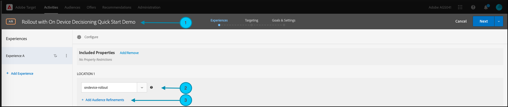
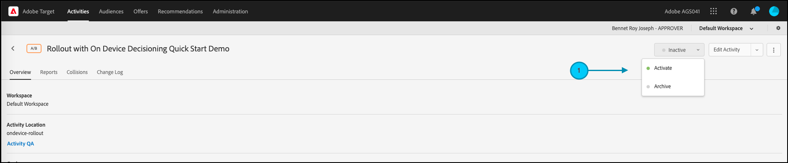

# Gestion des déploiements pour les tests de fonctionnalité

## Résumé des étapes

1. Activez la [!UICONTROL prise de décision sur l’appareil] pour votre organisation
1. Création d’une activité [!UICONTROL Test A/B]
1. Définition des paramètres de fonctionnalité et de déploiement
1. Implémenter et générer la fonctionnalité dans votre application
1. Implémenter le suivi des événements dans votre application
1. Activer votre activité A/B
1. Ajustez le déploiement et l’affectation du trafic selon les besoins

## &#x200B;1. Activez la [!UICONTROL prise de décision sur l’appareil] pour votre organisation

L’activation de la prise de décision sur l’appareil garantit l’exécution d’une activité A/B avec une latence proche de zéro. Pour activer cette fonctionnalité, accédez à **[!UICONTROL Administration]** > **[!UICONTROL Implémentation]** > **[!UICONTROL Détails du compte]** dans [!DNL Adobe Target], puis activez le bouton (bascule) **[!UICONTROL Prise de décision sur l’appareil]**.


>[!NOTE]
>
>Vous devez disposer du [rôle utilisateur](https://experienceleague.adobe.com/docs/target/using/administer/manage-users/user-management.html) Administrateur ou Approbateur pour activer ou désactiver le bouton [!UICONTROL Prise de décision sur l’appareil].

Après avoir activé le bouton (bascule) [!UICONTROL Prise de décision sur l’appareil], [!DNL Adobe Target] commence à générer des *artefacts de règle* pour votre client.

## &#x200B;2. Création d’une activité [!UICONTROL Test A/B]

1. Dans [!DNL Adobe Target], accédez à la page **[!UICONTROL Activités]**, puis sélectionnez **[!UICONTROL Créer une activité]** > **[!UICONTROL Test A/B]**.

   

1. Dans la boîte de dialogue modale **[!UICONTROL Créer une activité de test A/B]**, laissez l’option par défaut **[!UICONTROL Web]** sélectionnée (1), sélectionnez **[!UICONTROL Formulaire]** comme compositeur d’expérience (2), sélectionnez **[!UICONTROL Workspace par défaut]** avec **[!UICONTROL Aucune restriction de propriété]** (3), puis cliquez sur **[!UICONTROL Suivant]** (4).

   

## &#x200B;3. Définition des paramètres de fonctionnalité et de déploiement

À l’étape **[!UICONTROL Expériences]** de la création d’une activité, attribuez un nom à votre activité (1). Saisissez le nom de l’emplacement (2) dans votre application où vous souhaitez gérer les déploiements de votre fonctionnalité. Par exemple, `ondevice-rollout` ou `homepage-addtocart-rollout` sont des noms d’emplacement indiquant les destinations pour la gestion des déploiements de fonctionnalités. Dans l’exemple illustré ci-dessous, `ondevice-rollout` est l’emplacement défini pour l’expérience A. Vous pouvez éventuellement ajouter des ajustements d’audience (4) pour limiter la qualification à l’activité.



1. Dans la section **[!UICONTROL Contenu]** de la même page, sélectionnez **[!UICONTROL Créer une offre JSON]** dans la liste déroulante (1), comme illustré.

   

1. Dans la zone de texte **[!UICONTROL Données JSON]** qui s’affiche, saisissez la variable d’indicateur de fonctionnalité pour la fonctionnalité que vous prévoyez de déployer avec cette activité dans l’expérience A (1), à l’aide d’un objet JSON valide (2).

   

1. Cliquez sur **[!UICONTROL Suivant]** (1) pour passer à l’étape **[!UICONTROL Ciblage]** de création de l’activité.

   

1. À l’étape **[!UICONTROL Ciblage]**, conservez l’audience **[!UICONTROL Tous les visiteurs]** (1) pour plus de simplicité. Mais ajustez l&#39;allocation du trafic (2) à 10%. Cette opération limitera la fonctionnalité à seulement 10 % des visiteurs de votre site. Cliquez sur Suivant (3) pour passer à l’étape **[!UICONTROL Objectifs et paramètres]**.

   

1. À l’étape **[!UICONTROL Objectifs et paramètres]**, choisissez **[!UICONTROL Adobe Target]** (1) comme **[!UICONTROL Source de création de rapports]** pour afficher les résultats de votre activité dans l’interface utilisateur de [!DNL Adobe Target].

1. Choisissez une **[!UICONTROL mesure d’objectif]** pour mesurer l’activité. Dans cet exemple, une conversion réussie dépend du fait que l’utilisateur achète ou non un article, comme indiqué par le fait qu’il a atteint ou non l’emplacement orderConfirm (2).

1. Cliquez sur **[!UICONTROL Enregistrer et fermer]** (3) pour enregistrer l’activité.

   

## &#x200B;4. Implémenter et générer la fonctionnalité dans votre application

>[!BEGINTABS]

>[!TAB Node.js]

```js {line-numbers="true"}
targetClient.getAttributes(["ondevice-rollout"]).then(function(attributes) {
      const featureFlags = attributes.asObject("ondevice-rollout");

      // Your flag variables are now available in the featureFlags object variable.
      //If you failed to qualify for the Activity, you will have an empty object.
      console.log(featureFlags);
    });
```

>[!TAB Java]

```java {line-numbers="true"}
    Attributes attrs = targetJavaClient.getAttributes(targetDeliveryRequest, "ondevice-rollout");
    Map<String, Object> featureFlags = attrs.toMboxMap("ondevice-rollout");
​
    // Your flag variables are now available in the featureFlags object variable.
    //If you failed to qualify for the Activity, you will have an empty object.
    System.out.println(featureFlags);
```

>[!ENDTABS]

## &#x200B;5. Implémenter le suivi des événements dans votre application

Après avoir rendu la variable d’indicateur de fonctionnalité disponible dans l’application, vous pouvez l’utiliser pour activer toute fonctionnalité qui fait déjà partie de votre application. Si un visiteur ne remplit pas les critères de l’activité, cela signifie qu’il n’a pas été inclus dans l’intervalle de 10 % défini comme audience.

>[!BEGINTABS]

>[!TAB Node.js]

```js {line-numbers="true"}
//... Code removed for brevity

if(featureFlags.enable == "yes") { //Fell within 10% traffic
    console.log("Render Feature");
}
else {
    console.log("Disable Feature");
}

// alternatively, the getValue method could be used on the Attributes object.

if(attributes.getValue("ondevice-rollout", "enable") === "yes") { //Fell within 10% traffic
    console.log("Render Feature");
}
else {
    console.log("Disable Feature");
}
```

>[!TAB Java]

```java {line-numbers="true"}
//... Code removed for brevity
​
if("yes".equals(String.valueOf(featureFlags.get("enable")))) { //Fell within 10% traffic
    System.out.println("Render Feature");
}
else {
    System.out.println("Disable Feature");
}
​
// alternatively, the getString method could be used on the Attributes object.
​
if("yes".equals(attrs.getString("ondevice-rollout", "enable"))) { //Fell within 10% traffic
    System.out.println("Render Feature");
}
else {
    System.out.println("Disable Feature");
}
```

>[!ENDTABS]

## &#x200B;6. Activation de votre activité de déploiement



## &#x200B;7. Ajustez le déploiement et l’affectation du trafic selon les besoins

Une fois votre activité activée, modifiez-la à tout moment afin d’augmenter ou de réduire l’affectation du trafic, si nécessaire.

Augmentation de l’affectation du trafic de 10 % à 50 % en raison du succès du déploiement initial.


