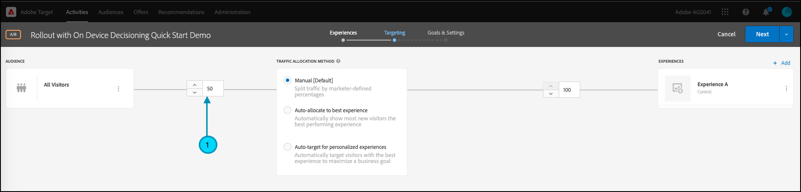

# Gestion des déploiements pour les tests de fonctionnalités

## Résumé des étapes

1. Activer [!UICONTROL prise de décision sur appareil] pour votre organisation
1. Créez un [!UICONTROL Test A/B] activité
1. Définition de votre fonction et des paramètres de déploiement
1. Mise en oeuvre et rendu de la fonctionnalité dans votre application
1. Mise en oeuvre du suivi des événements dans votre application
1. Activation de votre activité A/B
1. Ajuster le déploiement et l’affectation du trafic selon les besoins

## 1. Activez [!UICONTROL prise de décision sur appareil] pour votre organisation

L’activation de la prise de décision sur l’appareil garantit qu’une activité A/B est exécutée à une latence proche de zéro. Pour activer cette fonction, accédez à **[!UICONTROL Administration]** > **[!UICONTROL Implémentation]** > **[!UICONTROL Détails du compte]** in [!DNL Adobe Target], puis activez la variable **[!UICONTROL Prise de décision sur appareil]** bascule.


>[!NOTE]
>
>Vous devez avoir l’administrateur ou l’approbateur [rôle utilisateur](https://experienceleague.adobe.com/docs/target/using/administer/manage-users/user-management.html) pour activer ou désactiver la fonction [!UICONTROL Prise de décision sur appareil] bascule.

Après avoir activé la variable [!UICONTROL Prise de décision sur appareil] basculer, [!DNL Adobe Target] commence à générer *artefacts de règle* pour votre client.

## 2. Créez une [!UICONTROL Test A/B] activité

1. Dans [!DNL Adobe Target], accédez à la **[!UICONTROL Activités]** page, puis sélectionnez **[!UICONTROL Créer une activité]** > **[!UICONTROL Test A/B]**.

   

1. Dans le **[!UICONTROL Créer une activité de test A/B]** modale, conservez la valeur par défaut **[!UICONTROL Web]** option sélectionnée (1), sélectionnez **[!UICONTROL Formulaire]** en tant que compositeur d’expérience (2), sélectionnez **[!UICONTROL Espace de travail par défaut]** avec **[!UICONTROL Aucune restriction de propriété]** (3), puis cliquez sur **[!UICONTROL Suivant]** (4).

   

## 3. Définissez les paramètres de votre fonction et de déploiement.

Dans le **[!UICONTROL Expériences]** de la création de l’activité, attribuez un nom à votre activité (1). Saisissez le nom de l’emplacement (2) dans votre application où vous souhaitez gérer les déploiements de votre fonction. Par exemple :  `ondevice-rollout` ou `homepage-addtocart-rollout` sont des noms d’emplacement indiquant les destinations de gestion des déploiements de fonctionnalités. Dans l’exemple ci-dessous, `ondevice-rollout` est l’emplacement défini pour l’expérience A. Vous pouvez éventuellement ajouter des ajustements d’audience (4) pour limiter la qualification à l’activité.


1. Dans le **[!UICONTROL Contenu]** , sélectionnez **[!UICONTROL Création d’une offre JSON]** dans la liste déroulante (1), comme indiqué.

   

1. Dans le **[!UICONTROL Données JSON]** zone de texte qui s’affiche, saisissez la variable d’indicateur de fonctionnalité pour la fonctionnalité que vous avez l’intention de déployer avec cette activité dans l’expérience A (1), à l’aide d’un objet JSON valide (2).

   

1. Cliquez sur **[!UICONTROL Suivant]** (1) pour accéder à la variable **[!UICONTROL Ciblage]** de la création de l’activité.

   

1. Dans le **[!UICONTROL Ciblage]** , conservez la variable **[!UICONTROL Tous les visiteurs]** audience (1), pour plus de simplicité. Mais ajustez l’affectation du trafic (2) à 10 %. Cette option limite la fonctionnalité à seulement 10 % des visiteurs de votre site. Cliquez sur Suivant (3) pour accéder à la variable **[!UICONTROL Objectifs et paramètres]** étape .

   

1. Dans le **[!UICONTROL Objectifs et paramètres]** étape, choisissez **[!UICONTROL Adobe Target]** (1) en tant que **[!UICONTROL Source de création de rapports]** pour afficher les résultats de votre activité dans la variable [!DNL Adobe Target] Interface utilisateur.

1. Choisissez une **[!UICONTROL Mesure de l’objectif]** pour mesurer l’activité. Dans cet exemple, une conversion réussie dépend de l’achat ou non d’un élément par l’utilisateur, comme indiqué par l’accès ou non de l’utilisateur à l’emplacement orderConfirm (2).

1. Cliquez sur **[!UICONTROL Enregistrer et fermer]** (3) pour enregistrer l’activité.

   

## 4. Implémentez et effectuez le rendu de la fonctionnalité dans votre application.

>[!BEGINTABS]

>[!TAB Node.js]

```js {line-numbers="true"}
targetClient.getAttributes(["ondevice-rollout"]).then(function(attributes) {
      const featureFlags = attributes.asObject("ondevice-rollout");

      // Your flag variables are now available in the featureFlags object variable.
      //If you failed to qualify for the Activity, you will have an empty object.
      console.log(featureFlags);
    });
```

>[!TAB Java ]

```java {line-numbers="true"}
    Attributes attrs = targetJavaClient.getAttributes(targetDeliveryRequest, "ondevice-rollout");
    Map<String, Object> featureFlags = attrs.toMboxMap("ondevice-rollout");
​
    // Your flag variables are now available in the featureFlags object variable.
    //If you failed to qualify for the Activity, you will have an empty object.
    System.out.println(featureFlags);
```

>[!ENDTABS]

## 5. Implémentation du suivi des événements dans votre application

Après avoir rendu la variable d’indicateur de fonctionnalité disponible dans l’application, vous pouvez l’utiliser pour activer toute fonctionnalité qui fait déjà partie de votre application. Si un visiteur ne remplit pas les critères de l’activité, cela signifie qu’il n’a pas été inclus dans le compartiment de 10 % défini comme audience.

>[!BEGINTABS]

>[!TAB Node.js]

```js {line-numbers="true"}
//... Code removed for brevity

if(featureFlags.enable == "yes") { //Fell within 10% traffic
    console.log("Render Feature");
}
else {
    console.log("Disable Feature");
}

// alternatively, the getValue method could be used on the Attributes object.

if(attributes.getValue("ondevice-rollout", "enable") === "yes") { //Fell within 10% traffic
    console.log("Render Feature");
}
else {
    console.log("Disable Feature");
}
```

>[!TAB Java ]

```java {line-numbers="true"}
//... Code removed for brevity
​
if("yes".equals(String.valueOf(featureFlags.get("enable")))) { //Fell within 10% traffic
    System.out.println("Render Feature");
}
else {
    System.out.println("Disable Feature");
}
​
// alternatively, the getString method could be used on the Attributes object.
​
if("yes".equals(attrs.getString("ondevice-rollout", "enable"))) { //Fell within 10% traffic
    System.out.println("Render Feature");
}
else {
    System.out.println("Disable Feature");
}
```

>[!ENDTABS]

## 6. Activez votre activité de déploiement.


## 7. Ajustez le déploiement et l’affectation du trafic selon les besoins

Une fois que vous avez activé votre activité, modifiez-la à tout moment afin d’augmenter ou de diminuer l’affectation du trafic, le cas échéant.

Augmentation de l’affectation du trafic de 10 % à 50 % en raison du succès du déploiement initial.


