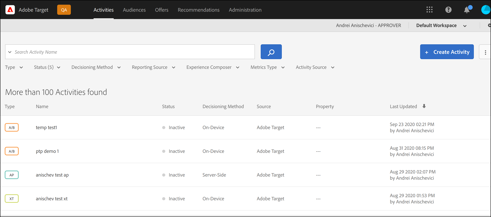

# Présentation de la prise de décision sur l’appareil

La prochaine génération [!DNL Adobe Target] Offre de SDK [!UICONTROL on-device decisioning], qui permet de mettre en cache vos campagnes A/B et de ciblage d’expérience (XT) sur votre serveur et d’effectuer une prise de décision en mémoire à une latence proche de zéro, sans bloquer les requêtes réseau à [!DNL Adobe Target]est Edge Network.

[!DNL Adobe Target] offre également la flexibilité de fournir l’expérience la plus pertinente et la plus à jour à partir de vos campagnes d’expérimentation et de personnalisation pilotées par ML via un appel serveur actif. En d’autres termes, lorsque les performances sont plus importantes, vous pouvez choisir d’utiliser [!UICONTROL on-device decisioning], mais lorsque l’expérience la plus pertinente et la plus à jour est nécessaire, un appel au serveur peut être effectué à la place. Voir [quand utiliser la prise de décision sur l’appareil ou sur le périphérique](../../sdk-guides/on-device-decisioning/supported-features.md) pour en savoir plus sur les cas d’utilisation qui justifient l’utilisation de l’un par rapport à l’autre.

>[!NOTE]
>
>La prise de décision sur appareil est disponible pour les mises en oeuvre côté client et côté serveur. Cet article décrit [!UICONTROL on-device decisioning] pour côté serveur. Pour plus d’informations sur [!UICONTROL on-device decisioning] pour le côté client, consultez la documentation de mise en oeuvre côté client . [here](../../../client-side/atjs/on-device-decisioning/on-device-decisioning.md).

## Comment cela fonctionne-t-il ?

Lorsque vous installez et initialisez une [!DNL Adobe Target] SDK avec [!UICONTROL on-device decisioning] activée, une *artefact de règle* est téléchargé et mis en cache localement sur votre serveur, à partir du réseau de diffusion de contenu Akamai le plus proche de votre serveur. Lorsqu’une requête permet de récupérer une [!DNL Adobe Target] l’expérience est effectuée dans votre application côté serveur, la décision concernant le contenu à renvoyer est prise en mémoire, en fonction des métadonnées codées dans l’artefact de règle mis en cache, qui définit l’ensemble de vos [!UICONTROL on-device decisioning] Activités A/B et XT.

Le diagramme suivant illustre la variable [!UICONTROL on-device decisioning] l’architecture. Cliquez sur pour développer l’image.

(Cliquez sur l’image pour agrandir l’image en largeur réelle.)

{zoomable=&quot;yes&quot;}

## Quels sont les avantages ?

* **Prendre des décisions de latence proches de zéro.** Le regroupement et la prise de décision sont effectués en mémoire et sur l’appareil afin d’éviter de bloquer les requêtes réseau.
* **Amélioration des performances de l’application.** Exécutez des expériences et personnalisez vos clients et utilisateurs sans compromettre les expériences de l’utilisateur final.
* **Amélioration du score de qualité du site Google.** Une fois la prise de décision effectuée en mémoire et côté serveur, améliorez le score de qualité du site Google de votre entreprise en ligne pour le rendre plus facilement détectable par les consommateurs.
* **Découvrez les analyses en temps réel.** Obtenez des informations sur les performances de votre activité en temps réel via [!DNL Adobe Target] pour les rapports A4T, ce qui vous permet de faire pivoter votre stratégie à des moments critiques.

## Fonctionnalité prise en charge

### Activités

La prise de décision sur les appareils prend en charge les types d’activité suivants créés par le [Compositeur d’expérience d’après les formulaires](https://experienceleague.adobe.com/docs/target/using/experiences/form-experience-composer.html):

* [!UICONTROL A/B Test]
* [!UICONTROL Experience Targeting] (XT)

### Méthode d’affectation

La prise de décision sur appareil prend en charge la méthode d’attribution suivante :

* Manuel

### Ciblage d’audience

La prise de décision sur les appareils prend en charge les règles d’audience suivantes :

| Règle d’audience | Prise de décision sur appareil |
| --- | --- |
| [Géo](https://experienceleague.adobe.com/docs/target/using/audiences/create-audiences/categories-audiences/geo.html) | Oui
Lors de l’utilisation de la prise de décision sur l’appareil, les attributs géographiques suivants sont pris en charge :<ul><li>Pays/zone géographique</li><li>Ville</li><li>Latitude</li><li>Longitude</li></ul> |
| [Réseau](https://experienceleague.adobe.com/docs/target/using/audiences/create-audiences/categories-audiences/network.html) | Non |
| [Mobile](https://experienceleague.adobe.com/docs/target/using/audiences/create-audiences/categories-audiences/mobile.html) | Non |
| [Paramètres personnalisés](https://experienceleague.adobe.com/docs/target/using/audiences/create-audiences/categories-audiences/custom-parameters.html) | Oui |
| [Système d’exploitation](https://experienceleague.adobe.com/docs/target/using/audiences/create-audiences/categories-audiences/operating-system.html) | Oui |
| [Pages du site](https://experienceleague.adobe.com/docs/target/using/audiences/create-audiences/categories-audiences/site-pages.html) | Oui |
| [Navigateur](https://experienceleague.adobe.com/docs/target/using/audiences/create-audiences/categories-audiences/browser.html) | Oui |
| [Profil du visiteur](https://experienceleague.adobe.com/docs/target/using/audiences/create-audiences/categories-audiences/visitor-profile.html) | Non |
| [Sources de trafic](https://experienceleague.adobe.com/docs/target/using/audiences/create-audiences/categories-audiences/traffic-sources.html) | Non |
| [Période](https://experienceleague.adobe.com/docs/target/using/audiences/create-audiences/categories-audiences/time-frame.html) | Oui |
| [Audiences Experience Cloud](https://experienceleague.adobe.com/docs/target/using/integrate/mmp.html) (Audiences de Adobe Audience Manager, Adobe Analytics et Adobe Experience Manager | Non |

## Comment configurer mon client pour utiliser [!UICONTROL on-device decisioning]?

La prise de décision sur appareil est disponible pour tous les [!DNL Adobe Target] clients qui utilisent [!DNL Adobe Target] SDK côté serveur. Pour activer cette fonction, accédez à **[!UICONTROL Administration]** > **[!UICONTROL Implementation]** > **[!UICONTROL Account details]** dans le [!DNL Adobe Target] et activez l’option **[!UICONTROL On-Device Decisioning]** bascule.

>[!NOTE]
>
>Vous devez avoir l’administrateur ou l’approbateur *rôle utilisateur* pour activer ou désactiver la fonction [!UICONTROL On-Device Decisioning] bascule.

Après avoir activé le bouton activer/désactiver de la prise de décision sur le périphérique, [!DNL Adobe Target] commencera à générer et à propager *artefacts de règle* pour votre client.

>[!NOTE]
>
>Assurez-vous d’activer le bouton bascule avant d’initialiser le [!DNL Adobe Target] SDK à utiliser [!UICONTROL on-device decisioning]. Les artefacts de règle devront d’abord être générés et propagés aux réseaux de diffusion de contenu Akamai pour que [!UICONTROL on-device decisioning] au travail.

### Inclure tous les [!UICONTROL on-device decisioning] activités qualifiées dans le basculement d’artefact

Activer/désactiver ceci **on** quand vous souhaitez que tout votre vie [!DNL Target] activités qui remplissent les critères [!UICONTROL on-device decisioning] à inclure automatiquement dans l’artefact.

Laisser ce bouton **off** signifie que vous devrez recréer et activer tout [!UICONTROL on-device decisioning] activités afin qu’elles soient incluses dans l’artefact de règles généré.

## Comment savoir si une activité est [!UICONTROL on-device decisioning] capable ?

Après avoir créé une activité, un libellé appelé **[!UICONTROL Decisioning Method]**, visible dans la page des détails de l’activité, indique si l’activité est [!UICONTROL on-device decisioning] capable.

Vous pouvez également voir toutes les activités qui sont [!UICONTROL on-device decisioning] est capable de **[!UICONTROL Activities]** en ajoutant la colonne **[!UICONTROL Decisioning Method]** à la liste des activités.

>[!NOTE]
>
>Après avoir créé et activé une activité qui est [!UICONTROL on-device decisioning] Cette fonction peut prendre jusqu’à 20 minutes avant d’être incluse dans l’artefact de règles généré et propagé vers les PoPs de réseau de diffusion de contenu Akamai.

## Quel est le résumé des étapes que je dois suivre pour garantir que [!UICONTROL on-device decisioning] les activités sont diffusées avec succès via [!DNL Adobe Target]SDK côté serveur de

1. Accédez au [!DNL Adobe Target] et accédez à **[!UICONTROL Administration]** > **[!UICONTROL Implementation]** > **[!UICONTROL Account details]** pour activer la variable **[!UICONTROL On-Device Decisioning]** bascule.
1. Activez la variable **[!UICONTROL Include all existing [!UICONTROL on-device decisioning] qualified activities in the artifact]** bascule.
1. Créer et activer un type d’activité pris en charge par [!UICONTROL on-device decisioning]et vérifiez que la variable **[!UICONTROL Decisioning Method]** is **[!UICONTROL On-Device Decisioning]** pour cette activité.
1. Installez et initialisez le [Node.js](../../node-js/overview.md) ou [Java](../../java/overview.md) SDK avec `decisioningMethod = on-device`.
1. Mise en oeuvre `getOffers()` ou `getAttributes()` dans votre code pour récupérer une expérience sur l’appareil.
1. Déployez votre code.

Pour obtenir des exemples illustrant la prise en main des étapes 1 à 3 ci-dessus, reportez-vous à la section [Prise en main](../getting-started/getting-started.md) .

## Ressources supplémentaires

### Webinaire : personnaliser et tester sans latence avec prise de décision sur l’appareil à partir d’[!DNL Adobe Target]

Plus que jamais, les spécialistes marketing, les propriétaires et les développeurs de produits sont chargés d’optimiser l’expérience client globale sur les sites, les applications et dans toutes les situations où ils sont en contact avec leurs clients. Les multiples outils avec des silos de données et des mises en oeuvre complexes sont inadéquats.

Dans ce webinaire enregistré, [!DNL Adobe Target] les experts en produits expliquent comment le déplacement des décisions d’optimisation d’expérience critiques sur l’appareil pour s’exécuter localement avec une latence proche de zéro peut ouvrir la voie à de nouveaux cas d’utilisation passionnants tout en améliorant les performances du site pour vos clients.

>[!VIDEO](https://video.tv.adobe.com/v/328148/?quality=12)

### Tutoriel : prise de décision sur l’appareil

[!DNL Adobe Target] [!UICONTROL on-device decisioning] active la diffusion de contenu à latence proche de zéro.

Cette vidéo de 7 minutes :

* Description [!UICONTROL on-device decisioning], y compris la manière dont il se compare à d’autres méthodes de [!DNL Target] implémentation
* Illustre comment activer [!UICONTROL on-device decisioning] dans Target
* Examiner un exemple d’activité de compositeur d’après les formulaires qui a été configuré avec du contenu JSON
* Affiche un exemple de code du SDK Node.JS contenant la configuration de clé requise pour [!UICONTROL on-device decisioning]
* Illustre les résultats dans un navigateur

>[!VIDEO](https://video.tv.adobe.com/v/329032/?quality=12)

Pour visionner d’autres vidéos et tutoriels, voir la section [[!DNL Adobe Target] Tutorials](https://experienceleague.adobe.com/docs/target-learn/tutorials/overview.html?lang=fr).

### Adobe Tech Blog - Partie 1 : Exécutez [!DNL Adobe Target] SDK NodeJS pour l’expérimentation et la personnalisation sur les plateformes Edge (Akamai Edge Workers)

[Cliquez ici pour accéder à la publication de blog.](https://medium.com/adobetech/part-1-run-adobe-target-nodejs-sdk-for-experimentation-and-personalization-on-edge-platforms-4d8660964ed9).

### Blog Adobe Tech - Partie 2 : exécutez le SDK NodeJS [!DNL Adobe Target] pour permettre l’expérimentation et la personnalisation sur les plateformes Edge (AWS Lambda@Edge)

[Cliquez ici pour accéder à la publication de blog.](https://medium.com/adobetech/part-2-run-adobe-target-nodejs-sdk-for-experimentation-and-personalization-on-edge-platforms-aws-4d6bdac24563).
