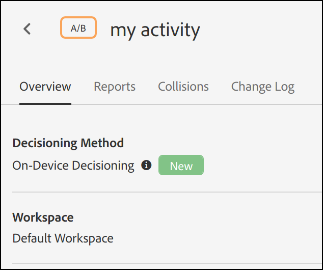

# Présentation de la prise de décision sur l’appareil

Les SDK [!DNL Adobe Target] nouvelle génération offrent désormais la prise de décision sur l’appareil [!UICONTROL on-device], qui permet de mettre en cache vos campagnes A/B et de ciblage d’expérience (XT) sur votre serveur et d’effectuer une prise de décision en mémoire à une latence proche de zéro, sans bloquer les requêtes réseau à l’Edge Network d’[!DNL Adobe Target].

[!DNL Adobe Target] offre également la flexibilité de fournir l’expérience la plus pertinente et la plus récente à partir de vos campagnes d’expérimentation et de personnalisation pilotées par ML via un appel au serveur en direct. En d’autres termes, lorsque les performances sont les plus importantes, vous pouvez choisir d’utiliser la [!UICONTROL prise de décision sur l’appareil], mais lorsque l’expérience la plus pertinente et la plus récente est nécessaire, un appel serveur peut être effectué à la place. Consultez [quand utiliser la prise de décision sur l’appareil ou à la périphérie ](../../sdk-guides/on-device-decisioning/supported-features.md) pour en savoir plus sur les cas d’utilisation qui justifient l’utilisation de l’un plutôt que l’autre.

>[!NOTE]
>
>La prise de décision sur l’appareil est disponible pour les implémentations côté client et côté serveur. Cet article décrit la [!UICONTROL prise de décision sur l’appareil] pour le côté serveur. Pour plus d’informations sur la [!UICONTROL prise de décision sur l’appareil] pour le côté client, consultez la documentation sur l’implémentation côté client [ici](../../../client-side/atjs/on-device-decisioning/on-device-decisioning.md).

## Comment cela fonctionne-t-il ?

Lorsque vous installez et initialisez un [!DNL Adobe Target] SDK avec la fonction [!UICONTROL prise de décision sur l’appareil] activée, un *artefact de règle* est téléchargé et mis en cache localement sur votre serveur, à partir du réseau CDN Akamai le plus proche de votre serveur. Lorsqu’une demande de récupération d’une expérience [!DNL Adobe Target] est effectuée dans votre application côté serveur, la décision concernant le contenu à renvoyer est prise en mémoire, en fonction des métadonnées codées dans l’artefact de règle mis en cache, qui définit toutes vos activités A/B et XT de [!UICONTROL prise de décision sur l’appareil].

Le diagramme suivant illustre l’architecture de la [!UICONTROL prise de décision sur l’appareil]. Cliquez pour développer l’image.

(Cliquez sur l’image pour l’agrandir sur toute la largeur.)

{zoomable="yes"}

## Quels sont les avantages ?

* **Prenez des décisions relatives à la latence quasi nulle.** Le regroupement et la prise de décision sont effectués en mémoire et sur l’appareil pour éviter de bloquer les requêtes réseau.
* **Amélioration des performances des applications.** Exécutez des expériences et offrez une personnalisation à vos clients et utilisateurs sans compromettre les expériences des utilisateurs finaux.
* **Amélioration du score de qualité du site Google.** Avec la prise de décision en mémoire et côté serveur, améliorez le score de qualité du site Google de votre entreprise en ligne pour qu’elle soit plus facilement détectable par les consommateurs et consommatrices.
* **En savoir plus sur l’analyse en temps réel.** Obtenez des informations à partir des performances de votre activité en temps réel via les rapports [!DNL Adobe Target] ou A4T, ce qui vous permet de faire pivoter votre stratégie aux moments critiques.

## Fonctionnalités prises en charge

### Activités

La prise de décision sur l’appareil prend en charge les types d’activité suivants créés par le [compositeur d’expérience d’après les formulaires](https://experienceleague.adobe.com/docs/target/using/experiences/form-experience-composer.html) :

* [!UICONTROL Test A/B]
* [!UICONTROL Ciblage d’expérience] (XT)

### Méthode d&#39;allocation

La prise de décision sur l’appareil prend en charge la méthode d’attribution suivante :

* Manuel

### Ciblage d’audience

La prise de décision sur l’appareil prend en charge les règles d’audience suivantes :

| Règle d’audience | Prise de décision sur l’appareil |
| --- | --- |
| [Géo](https://experienceleague.adobe.com/docs/target/using/audiences/create-audiences/categories-audiences/geo.html) | Oui
Lors de l’utilisation de la prise de décision sur l’appareil, les attributs géographiques suivants sont pris en charge :<ul><li>Pays/zone géographique</li><li>Ville</li><li>Latitude</li><li>Longitude</li></ul> |
| [Réseau](https://experienceleague.adobe.com/docs/target/using/audiences/create-audiences/categories-audiences/network.html) | Non |
| [Mobile](https://experienceleague.adobe.com/docs/target/using/audiences/create-audiences/categories-audiences/mobile.html) | Non |
| [Paramètres personnalisés](https://experienceleague.adobe.com/docs/target/using/audiences/create-audiences/categories-audiences/custom-parameters.html) | Oui |
| [Système d’exploitation](https://experienceleague.adobe.com/docs/target/using/audiences/create-audiences/categories-audiences/operating-system.html) | Oui |
| [Pages du site](https://experienceleague.adobe.com/docs/target/using/audiences/create-audiences/categories-audiences/site-pages.html) | Oui |
| [Navigateur](https://experienceleague.adobe.com/docs/target/using/audiences/create-audiences/categories-audiences/browser.html) | Oui |
| [Profil du visiteur](https://experienceleague.adobe.com/docs/target/using/audiences/create-audiences/categories-audiences/visitor-profile.html) | Non |
| [Sources de trafic](https://experienceleague.adobe.com/docs/target/using/audiences/create-audiences/categories-audiences/traffic-sources.html) | Non |
| [Période](https://experienceleague.adobe.com/docs/target/using/audiences/create-audiences/categories-audiences/time-frame.html) | Oui |
| [ Audiences Experience Cloud ](https://experienceleague.adobe.com/docs/target/using/integrate/mmp.html) (audiences de Adobe Audience Manager, Adobe Analytics et Adobe Experience Manager) | Non |

## Comment configurer mon client pour qu’il utilise [!UICONTROL la prise de décision sur l’appareil] ?

La prise de décision sur l’appareil est disponible pour tous les clients [!DNL Adobe Target] qui utilisent des SDK côté serveur [!DNL Adobe Target]. Pour activer cette fonctionnalité, accédez à **[!UICONTROL Administration]** > **[!UICONTROL Implémentation]** > **[!UICONTROL Détails du compte]** dans l’interface utilisateur de [!DNL Adobe Target], puis activez le bouton (bascule) **[!UICONTROL Prise de décision sur l’appareil]**.

>[!NOTE]
>
>Vous devez disposer du *rôle utilisateur* Administrateur ou Approbateur pour activer ou désactiver le bouton [!UICONTROL Prise de décision sur l’appareil].

Après avoir activé le bouton (bascule) Prise de décision sur l’appareil , [!DNL Adobe Target] commencerez à générer et à propager des artefacts de règles *artefacts de règle* pour votre client.

>[!NOTE]
>
>Assurez-vous d’activer le bouton avant d’initialiser le SDK [!DNL Adobe Target] pour utiliser [!UICONTROL la prise de décision sur l’appareil]. Les artefacts de règles devront d’abord générer et se propager sur les réseaux CDN Akamai pour que la [!UICONTROL prise de décision sur l’appareil] fonctionne.

### Incluez toutes les activités qualifiées [!UICONTROL prise de décision sur l’appareil] existantes dans le bouton (bascule) des artefacts

Activez ce bouton **activé** lorsque vous souhaitez que toutes vos activités Live [!DNL Target] qui remplissent les critères de la [!UICONTROL  prise de décision sur l’appareil] soient automatiquement incluses dans l’artefact.

Si vous laissez ce bouton **désactivé**, vous devrez recréer et activer toutes les activités [!UICONTROL prise de décision sur l’appareil] afin qu’elles soient incluses dans l’artefact de règles généré.

## Comment puis-je savoir si une activité [!UICONTROL prise de décision sur l’appareil] est compatible ?

Une fois que vous avez créé une activité, un libellé appelé **[!UICONTROL Méthode de prise de décision]**, visible dans la page des détails de l’activité, indique si l’activité est compatible [!UICONTROL avec la prise de décision sur l’appareil].

Vous pouvez également afficher toutes les activités compatibles avec la [!UICONTROL prise de décision sur l’appareil] sur la page **[!UICONTROL Activités]** en ajoutant la colonne **[!UICONTROL Méthode de prise de décision]** à la liste des activités.

>[!NOTE]
>
>Après la création et l’activation d’une activité compatible avec la [!UICONTROL prise de décision sur l’appareil], il peut s’écouler 20 minutes avant qu’elle ne soit incluse dans l’artefact de règles généré et propagé aux points de vente Akamai CDN.

## Quel est le résumé des étapes que je dois suivre pour m’assurer que mes activités [!UICONTROL de prise de décision sur l’appareil] sont diffusées avec succès via le SDK côté serveur d’[!DNL Adobe Target] ?

1. Accédez à l’interface utilisateur de [!DNL Adobe Target] et accédez à **[!UICONTROL Administration]** > **[!UICONTROL Implémentation]** > **[!UICONTROL Détails du compte]** pour activer le bouton (bascule) **[!UICONTROL Prise de décision sur l’appareil]**.
1. Activez le bouton (bascule) **[!UICONTROL Inclure toutes les activités qualifiées [!UICONTROL prise de décision sur l’appareil] existantes dans l’artefact]**.
1. Créez et activez un type d’activité pris en charge par la [!UICONTROL prise de décision sur l’appareil], et vérifiez que la **[!UICONTROL méthode de prise de décision]** est **[!UICONTROL prise de décision sur l’appareil]** pour cette activité.
1. Installez et initialisez le SDK [Node.js](../../node-js/overview.md) ou [Java](../../java/overview.md) avec `decisioningMethod = on-device`.
1. Implémentez `getOffers()` ou `getAttributes()` dans votre code pour récupérer une expérience sur l’appareil.
1. Déployez votre code.

Pour obtenir des exemples montrant comment commencer à utiliser les étapes 1 à 3 ci-dessus, reportez-vous à la section [Prise en main](../getting-started/getting-started.md).

## Ressources supplémentaires

### Webinaire : personnaliser et tester sans latence avec prise de décision sur l’appareil à partir d’[!DNL Adobe Target]

Plus que jamais, les spécialistes marketing, les propriétaires et les développeurs de produits sont chargés d’optimiser l’expérience client globale sur les sites, les applications et dans toutes les situations où ils sont en contact avec leurs clients. Plusieurs outils avec des silos de données et des implémentations complexes ne sont pas adaptés.

Dans ce webinaire enregistré, [!DNL Adobe Target] experts en produits expliquent en quoi le transfert de décisions essentielles d’optimisation de l’expérience sur les appareils, pour une exécution locale avec une latence proche de zéro, peut ouvrir la voie à de nouveaux cas d’utilisation intéressants, tout en améliorant les performances du site pour vos clients.

>[!VIDEO](https://video.tv.adobe.com/v/328148/?quality=12)

### Tutoriel : Prise de décision sur l’appareil

[!DNL Adobe Target] [!UICONTROL prise de décision sur l’appareil] permet une diffusion de contenu à latence quasi nulle.

Cette vidéo de 7 minutes :

* Décrit la [!UICONTROL prise de décision sur l’appareil], y compris sa comparaison avec d’autres méthodes d’implémentation [!DNL Target]
* Montre comment activer la [!UICONTROL prise de décision sur l’appareil] dans Target
* Examine un exemple d’activité de compositeur basée sur des formulaires qui a été configurée avec du contenu JSON
* Affiche l’exemple de code SDK Node.JS contenant la configuration de clé requise pour la [!UICONTROL prise de décision sur l’appareil]
* Affiche les résultats dans un navigateur

>[!VIDEO](https://video.tv.adobe.com/v/329032/?quality=12)

Pour plus de vidéos et de tutoriels, voir [[!DNL Adobe Target] Tutoriels](https://experienceleague.adobe.com/docs/target-learn/tutorials/overview.html?lang=fr).

### Blog Adobe Tech - Partie 1 : exécutez [!DNL Adobe Target] NodeJS SDK pour permettre l’expérimentation et la personnalisation sur les plateformes Edge (Akamai Edge Workers)

[Cliquez ici pour accéder à l&#39;article de blog](https://medium.com/adobetech/part-1-run-adobe-target-nodejs-sdk-for-experimentation-and-personalization-on-edge-platforms-4d8660964ed9).

### Blog Adobe Tech - Partie 2 : exécutez le SDK NodeJS [!DNL Adobe Target] pour permettre l’expérimentation et la personnalisation sur les plateformes Edge (AWS Lambda@Edge)

[Cliquez ici pour accéder à l&#39;article de blog](https://medium.com/adobetech/part-2-run-adobe-target-nodejs-sdk-for-experimentation-and-personalization-on-edge-platforms-aws-4d6bdac24563).
