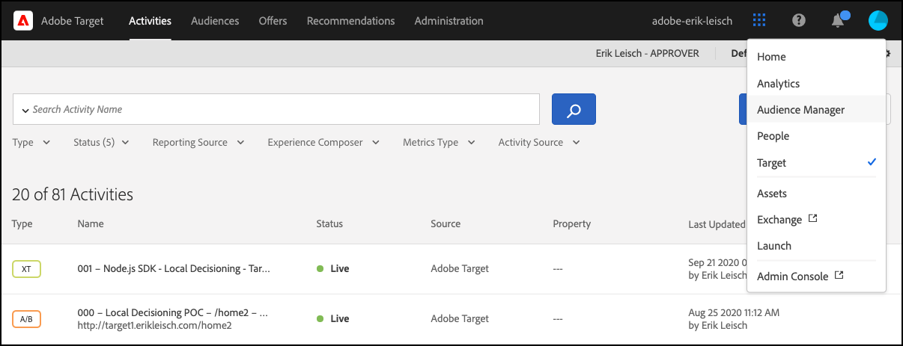

# Aperçu de l’artefact de règle

L’artefact de règle est une représentation JSON de vos activités de [!UICONTROL on-device decisioning] [!DNL Adobe Target]. Elle est générée par [!DNL Adobe Target] et propagée sur le réseau CDN Akamai afin de s’assurer qu’un artefact de règle est disponible aussi près que possible de vos utilisateurs finaux. Il contient des métadonnées qui assurent une exécution et une diffusion précises de vos activités, tout en permettant des analyses en temps réel via le suivi des événements. Les SDK [!DNL Adobe Target] peuvent être configurés de manière à permettre la gestion automatique de l’artefact de règle, grâce auquel il peut être téléchargé ou mis à jour selon un intervalle de temps spécifié par l’utilisateur. De plus, vous pouvez également conserver votre propre copie locale de l’artefact de règle à l’aide d’un système de mise en cache de la mémoire distribuée tel que [Memcached](https://memcached.org/) pour initialiser le SDK [!DNL Adobe Target], de sorte que vos serveurs sans état puissent traiter les requêtes immédiatement. Pour en savoir plus sur ces options, consultez les guides suivants :

* [Téléchargement, stockage et mise à jour automatique de l’artefact de règle via le [!DNL Adobe Target] SDK](rule-artifact-sdk.md)
* [Téléchargement, stockage et mise à jour de l’artefact de règle via la payload JSON](rule-artifact-json.md)

## Exemple d’artefact de règle

Cliquez ici pour obtenir un exemple de l’[artefact de règle](rule-artifact-example.md).

## Comment afficher l’artefact de règle pour votre client

L’activation des traces génère des informations supplémentaires à partir de [!DNL Adobe Target] en ce qui concerne l’artefact de règle, en particulier l’URL.

1. Accédez à l’interface utilisateur de Target.

   &lt;!— Insérer image-target-ui-1.png —>
   

1. Accédez à **[!UICONTROL Administration]** > **[!UICONTROL Implementation]** et cliquez sur **[!UICONTROL Generate New Authorization Token]**.

   &lt;!— Insérer image-target-ui-2.png —>
   

1. Copiez le jeton d’autorisation nouvellement généré dans le presse-papiers et ajoutez-le à votre requête Target.

   ```javascript {line-numbers="true"}
   const request = {
     trace: {
       authorizationToken: '88f1a924-6bc5-4836-8560-2f9c86aeb36b'
     },
     execute: {
       mboxes: [{
         address: getAddress(req),
         name: "node-sdk-mbox"
       }]
   }};
   ```

1. Générez la trace de Target via le terminal pour afficher les détails sur l’artefact. L’URL est accessible via la variable `artifactLocation` .

   ```
   "trace": {
     "clientCode": "your-client-code",
     "artifact": {
       "artifactLocation": "https://assets.adobetarget.com/your-client-code/production/v1/rules.bin",
       "pollingInterval": 300000,
       "pollingHalted": false,
       "artifactVersion": "1.0.0",
       "artifactRetrievalCount": 10,
       "artifactLastRetrieved": "2020-09-20T00:09:42.707Z",
        "clientCode": "your-client-code",
      "environment": "production",
       "generatedAt": "2020-09-22T17:17:59.783Z"
     },
   ```
