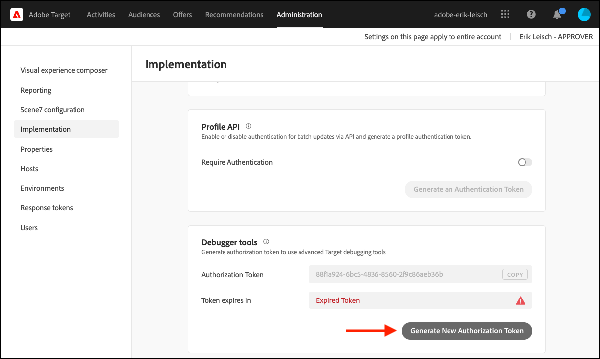
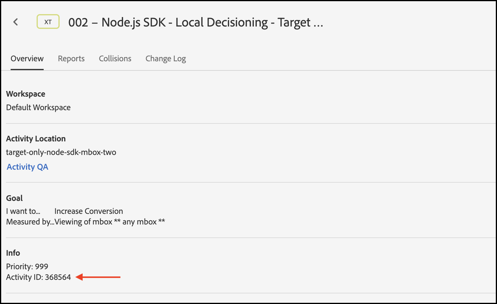

# Dépannage [!UICONTROL prise de décision sur appareil]

## Validation de la configuration

### Résumé des étapes

1. Assurez-vous que la variable `logger` est configuré
1. Assurez-vous que [!DNL Target] traces activées
1. Vérifiez les [!UICONTROL prise de décision sur appareil] *artefact de règle* a été récupéré et mis en cache selon l’intervalle d’interrogation défini.
1. Validation de la diffusion de contenu via l’artefact de règle mis en cache en créant un test [!UICONTROL prise de décision sur appareil] activité via le compositeur d’expérience d’après les formulaires.
1. Erreurs de notification d’envoi Inspect

## 1. Vérifiez que l’enregistreur est configuré.

Lors de l’initialisation du SDK, veillez à activer la journalisation.

**Node.js**

Pour le SDK Node.js a `logger` doit être fourni.

```js {line-numbers="true"}
const CONFIG = {
  client: "<your client code>",
  organizationId: "<your organization ID>",
  logger: console
};
```

**SDK Java**

Pour le SDK Java `logRequests` sur le `ClientConfig` doit être activé.

```js {line-numbers="true"}
ClientConfig config = ClientConfig.builder()
  .client("<your client code>")
  .organizationId("<your organization ID>")
  .logRequests(true)
  .build();
```

La JVM doit également être lancée avec le paramètre de ligne de commande suivant :

```bash {line-numbers="true"}
java -Dorg.slf4j.simpleLogger.defaultLogLevel=DEBUG ...
```

## 2. Assurez-vous que[!DNL Target]Les traces sont activées

L’activation des traces génère des informations supplémentaires à partir de [!DNL Adobe Target] en ce qui concerne l’artefact rules.

1. Accédez au[!DNL Target]Interface utilisateur dans [!DNL Experience Cloud].

   

1. Accédez à **[!UICONTROL Administration]** > **[!UICONTROL Implémentation]** et cliquez sur **[!UICONTROL Générer un nouveau jeton d’autorisation]**.

   

1. Copiez le jeton d’autorisation nouvellement généré dans le Presse-papiers et ajoutez-le à votre[!DNL Target]request :

   **Node.js**

   ```js {line-numbers="true"}
   const request = {
     trace: {
       authorizationToken: "88f1a924-6bc5-4836-8560-2f9c86aeb36b"
     },
     execute: {
       mboxes: [{
         name: "sdk-mbox"
       }]
   }};
   ```

   **Java **

   ```js {line-numbers="true"}
   Trace trace = new Trace()
     .authorizationToken("88f1a924-6bc5-4836-8560-2f9c86aeb36b");
   Context context = new Context()
     .channel(ChannelType.WEB);
   MboxRequest mbox = new MboxRequest()
     .name("sdk-mbox")
     .index(0);
   ExecuteRequest executeRequest = new ExecuteRequest()
     .mboxes(Arrays.asList(mbox));
   
   TargetDeliveryRequest request = TargetDeliveryRequest.builder()
     .trace(trace)
     .context(context)
     .execute(executeRequest)
     .build();
   ```

1. Une fois l’enregistreur et la trace en place, démarrez votre application et surveillez le terminal du serveur. La sortie suivante de l’enregistreur confirme que l’artefact de règle a été récupéré :

   **SDK Node.js**

   ```text {line-numbers="true"}
     AT: LD.ArtifactProvider fetching artifact - https://assets.adobetarget.com/your-client-code/production/v1/rules.json
     AT: LD.ArtifactProvider artifact received - status=200
   ```

## 3. Vérifiez les [!UICONTROL prise de décision sur appareil] *artefact de règle* a été récupéré et mis en cache selon l’intervalle d’interrogation défini.

1. Patientez pendant la durée de l’intervalle d’interrogation (la valeur par défaut est de 5 minutes) et assurez-vous que l’artefact est récupéré par le SDK. Les mêmes journaux de terminal seront générés.

   En outre, des informations provenant de la variable[!DNL Target]Trace doit être généré vers le terminal avec des détails sur l’artefact de règle.

   ```text {line-numbers="true"}
   "trace": {
     "clientCode": "your-client-code",
     "artifact": {
       "artifactLocation": "https://assets.adobetarget.com/your-client-code/production/v1/rules.json",
       "pollingInterval": 300000,
       "pollingHalted": false,
       "artifactVersion": "1.0.0",
       "artifactRetrievalCount": 10,
       "artifactLastRetrieved": "2020-09-20T00:09:42.707Z",
       "clientCode": "your-client-code",
       "environment": "production",
       "generatedAt": "2020-09-22T17:17:59.783Z"
     },
   ```

## 4. Validez la diffusion de contenu via l’artefact de règle mis en cache en créant un test. [!UICONTROL prise de décision sur appareil] activité via le compositeur d’expérience d’après les formulaires

1. Accédez au[!DNL Target]Interface utilisateur dans Experience Cloud

   

1. Créez une activité XT à l’aide du compositeur d’expérience d’après les formulaires.

   

1. Saisissez le nom de mbox utilisé dans votre[!DNL Target]request comme emplacement de l’activité XT (notez qu’il doit s’agir d’un nom de mbox unique, spécifiquement à des fins de développement).

   

1. Remplacez le contenu par une offre de HTML ou JSON. Cette valeur est renvoyée dans la variable[!DNL Target]à votre application. Laissez le ciblage de l’activité &quot;Tous les visiteurs&quot; et sélectionnez une mesure de votre choix. Nommez l’activité, enregistrez-la, puis activez-la pour vous assurer que la mbox/l’emplacement utilisé est réservé au développement.

   

1. Dans votre application, ajoutez une instruction de journal pour le contenu reçu dans la réponse de votre[!DNL Target]requête

   **SDK Node.js**

   ```js {line-numbers="true"}
   try {
     const response = await targetClient.getOffers({ request });
     console.log('Response: ', response.response.execute.mboxes[0].options[0].content);
   } catch (error) {
     console.error('Something went wrong', error);
   }
   ```

   **SDK Java**

   ```js {line-numbers="true"}
   try {
     Context context = new Context()
       .channel(ChannelType.WEB);
     MboxRequest mbox = new MboxRequest()
       .name("sdk-mbox")
       .index(0);
     ExecuteRequest executeRequest = new ExecuteRequest()
       .mboxes(Arrays.asList(mbox));
   
     TargetDeliveryRequest request = TargetDeliveryRequest.builder()
       .context(context)
       .decisioningMethod(DecisioningMethod.ON_DEVICE)
       .execute(executeRequest)
       .build();
   
       TargetDeliveryResponse response = targetClient.getOffers(request);
     logger.debug("Response: ", response.getResponse().getExecute().getMboxes().get(0).getOptions().get(0).getContent());
   } catch (Exception exception) {
     logger.error("Something went wrong", exception);
   }
   ```

1. Consultez les journaux de votre terminal pour vérifier que votre contenu est en cours de diffusion et qu’il a été diffusé via l’artefact de règles sur votre serveur. La variable `LD.DeciscionProvider` est généré lorsque la qualification et la prise de décision de l’activité ont été déterminées sur l’appareil en fonction de l’artefact de règles. En outre, en raison de la journalisation de la variable `content`, vous devriez voir `<div>test</div>` ou toutefois, vous avez décidé que la réponse doit être lors de la création de l’activité de test.

   **Sortie de journal**

   ```text {line-numbers="true"}
   AT: LD.DecisionProvider {...}
   AT: Response received {...}
   Response:  <div>test</div>
   ```

## Erreurs de notification d’envoi Inspect

Lors de l’utilisation de la prise de décision sur l’appareil, des notifications sont envoyées automatiquement pour que getOffers exécute les requêtes. Ces demandes sont envoyées en arrière-plan de manière silencieuse. Toutes les erreurs peuvent être inspectées en s’abonnant à un événement appelé `sendNotificationError`. Voici un exemple de code montrant comment s’abonner aux erreurs de notification à l’aide du SDK Node.js.

```js {line-numbers="true"}
const TargetClient = require("@adobe/target-nodejs-sdk");
let client;

function onSendNotificationError({ notification, error }) {
  console.log(
    `There was an error when sending a notification: ${error.message}`
  );
  console.log(`Notification Payload: ${JSON.stringify(notification, null, 2)}`);
}

async function targetClientReady() {
  const request = {
    context: { channel: "web" },
    execute: {
      mboxes: [{
        name: "a1-serverside-ab",
        index: 1
      }]
    }
  };
  const targetResponse = await client.getOffers({ request });
}

client = TargetClient.create({
  events: {
    clientReady: targetClientReady,
    sendNotificationError: onSendNotificationError
  }
});
```

## Scénarios de dépannage courants

Veillez à consulter [fonctionnalités prises en charge](supported-features.md) pour [!UICONTROL prise de décision sur appareil] lorsque vous rencontrez des problèmes.

### Les activités de prise de décision sur appareil ne s’exécutent pas en raison d’une audience ou d’une activité non prise en charge

Un problème courant qui peut se produire est [!UICONTROL prise de décision sur appareil] les activités ne s’exécutent pas en raison de l’audience en cours d’utilisation ou du type d’activité non pris en charge.

(1) À l’aide de la sortie du journal, passez en revue les entrées de la propriété trace dans votre objet de réponse. Identifiez spécifiquement la propriété des campagnes :

**Sortie de suivi**

```text {line-numbers="true"}
  "execute": {
  "mboxes": [
    {
      "name": "your-mbox-name",
      "index": 0,
      "trace": {
        "clientCode": "your-client-code",
        ...
        "campaigns": [],
        ...
      }
    }
```

Vous remarquerez que l’activité pour laquelle vous essayez de vous qualifier ne figure pas dans la variable `campaigns` car l’audience ou le type d’activité n’est pas pris en charge. Si l’activité est répertoriée sous la variable `campaigns` , votre problème n’est pas dû à un type d’audience ou d’activité non pris en charge.

(2) Recherchez également la variable `rules.json` en examinant le fichier `trace` > `artifact` > `artifactLocation` dans la sortie de l’enregistreur et notez que votre activité est absente du `rules` > `mboxes` property:

**Sortie de journal**

```text {line-numbers="true"}
 ...
 rules: {
   mboxes: { },
   views: { }
 }
```

Enfin, accédez au[!DNL Target]et localisez l’activité en question : [experience.adobe.com/target](https://experience.adobe.com/target)

Passez en revue les règles utilisées dans l’audience et assurez-vous de n’utiliser que celles mentionnées ci-dessus qui sont prises en charge. De plus, assurez-vous que le type d’activité est A/B ou XT.


### Les activités de prise de décision sur appareil ne s’exécutent pas en raison d’une audience non qualifiée

Si une activité de prise de décision sur l’appareil ne s’exécute pas, mais que vous avez vérifié que votre fichier rules.json contient l’activité, procédez comme suit :

(1) Assurez-vous que la mbox que vous exécutez dans votre application est la même que celle utilisée par l’activité :

>[!BEGINTABS]

>[!TAB rule.json]

```text {line-numbers="true"}
 ...
 rules: {
   mboxes: {
    target-only-node-sdk-mbox: [{ // this mbox name must match the mbox in your request
      ...
    }]
   }
 ...
```

>[!TAB SDK Node.js]

```js {line-numbers="true"}
 const request = {
   trace: {
     authorizationToken: '2dfc1dce-1e58-4e05-bbd6-a6725893d4d6'
   },
   execute: {
     mboxes: [{
       address: getAddress(req),
       name: "target-only-node-sdk-mbox-two" // this mbox name must match the mbox the activity is using
     }]
   }};
```

>[!TAB SDK Java]

```js {line-numbers="true"}
Context context = new Context()
  .channel(ChannelType.WEB);
MboxRequest mbox = new MboxRequest()
  .name("target-only-node-sdk-mbox-two")
  .index(0);
ExecuteRequest executeRequest = new ExecuteRequest()
  .mboxes(Arrays.asList(mbox));

TargetDeliveryRequest request = TargetDeliveryRequest.builder()
  .context(context)
  .decisioningMethod(DecisioningMethod.ON_DEVICE)
  .execute(executeRequest)
  .build();

TargetDeliveryResponse response = targetClient.getOffers(request);
```

>[!ENDTABS]

(2) Assurez-vous que vous êtes qualifié pour l’audience de votre activité en consultant la section `matchedRuleConditions` ou `unmatchedRuleConditions` de votre sortie de trace :

**Sortie de suivi**

```text {line-numbers="true"}
...
},
"campaignId": 368564,
"campaignType": "landing",
"matchedSegmentIds": [],
"unmatchedSegmentIds": [
  6188838
      ],
      "matchedRuleConditions": [],
          "unmatchedRuleConditions": [
            {
              "in": [
                "true",
                {
                  "var": "mbox.auth_lc"
                }
              ]
            }
          ]
    ...
```

Si vous avez des conditions de règle sans correspondance, vous n’êtes pas qualifié pour l’activité et l’activité ne s’exécutera donc pas. Passez en revue les règles de votre audience pour voir pourquoi vous n’êtes pas qualifié.

### L’activité de prise de décision sur appareil ne s’exécute pas, mais la raison n’est pas apparente

Il n’est peut-être pas évident de comprendre pourquoi une activité de prise de décision sur appareil ne s’exécute pas. Dans ce cas, procédez comme suit pour identifier le problème :

(1) Lisez la sortie de trace de journal dans votre console et identifiez la propriété d’artefact, qui ressemblera à ce qui suit :

**Sortie de suivi**

```text {line-numbers="true"}
...
      "artifact": {
          "artifactLocation": "https://assets.adobetarget.com/your-client-code/production/v1/rules.json",
          "pollingInterval": 300000,
          "pollingHalted": false,
          "artifactVersion": "1.0.0",
          "artifactRetrievalCount": 3,
          "artifactLastRetrieved": "2020-10-16T00:56:27.596Z",
          "clientCode": "adobeinterikleisch",
          "environment": "production"
        },
...
```

Consultez la `artifactLastRetrieved` date de l’artefact et assurez-vous que vous disposez de la dernière `rules.json` téléchargé dans votre application.

(2) Recherchez la variable `evaluatedCampaignTargets` dans la sortie de l’enregistreur :

**Sortie de journal**

```text {line-numbers="true"}
...
  "evaluatedCampaignTargets": [
      {
        "context": {
          "current_timestamp": 1602812599608,
          "current_time": "0143",
          "current_day": 5,
          "user": {
            "browserType": "unknown",
            "platform": "Unknown",
            "locale": "en",
            "browserVersion": -1
          },
          "page": {
            "url": "localhost:3000/",
            "path": "/",
            "query": "",
            "fragment": "",
            "subdomain": "",
            "domain": "3000",
            "topLevelDomain": "",
            "url_lc": "localhost:3000/",
            "path_lc": "/",
            "query_lc": "",
            "fragment_lc": "",
            "subdomain_lc": "",
            "domain_lc": "3000",
            "topLevelDomain_lc": ""
          },
          "referring": {
            "url": "localhost:3000/",
            "path": "/",
            "query": "",
            "fragment": "",
            "subdomain": "",
            "domain": "3000",
            "topLevelDomain": "",
            "url_lc": "localhost:3000/",
            "path_lc": "/",
            "query_lc": "",
            "fragment_lc": "",
            "subdomain_lc": "",
            "domain_lc": "3000",
            "topLevelDomain_lc": ""
          },
          "geo": {},
          "mbox": {},
          "allocation": 23.79
        },
        "campaignId": 368564,
        "campaignType": "landing",
        "matchedSegmentIds": [],
        "unmatchedSegmentIds": [
          6188838
        ],
        "matchedRuleConditions": [],
        "unmatchedRuleConditions": [
          {
            "in": [
              "true",
              {
                "var": "mbox.auth_lc"
              }
            ]
          }
        ]
...
```

(3) Consultez la section `context`, `page`, et `referring` pour s’assurer qu’elle est aussi performante que prévu, ce qui peut affecter la qualification de ciblage de l’activité.

(4) Consultez la section `campaignId` pour s’assurer que l’activité ou les activités que vous prévoyez d’exécuter sont évaluées. La variable `campaignId` correspondra à l’ID d’activité sur l’onglet d’aperçu de l’activité dans la variable[!DNL Target]Interface utilisateur :



(5) Consultez la section `matchedRuleConditions` et `unmatchedRuleConditions` pour identifier les problèmes liés à la qualification aux règles d’audience pour une activité donnée.

(6) Consultez la dernière version `rules.json` pour vous assurer que l’activité ou les activités que vous souhaitez exécuter localement sont incluses. L’emplacement est référencé ci-dessus à l’étape 1.

(7) Assurez-vous que vous utilisez les mêmes noms de mbox dans votre requête et dans vos activités.

(8) Assurez-vous d’utiliser les règles d’audience prises en charge et les types d’activité pris en charge.

### Un appel au serveur est effectué même si la configuration de l’activité sous une mbox indique &quot;Lors de la prise de décision du périphérique éligible&quot; dans la variable[!DNL Target]interface utilisateur

Il existe plusieurs raisons pour lesquelles un appel au serveur est effectué même si l’appareil est éligible pour la prise de décision sur l’appareil :

* Lorsque la mbox utilisée pour une activité &quot;On Device Decisioning Eligible&quot; est également utilisée pour d’autres activités qui ne sont pas &quot;On Device Decisioning Eligible&quot;, la mbox est répertoriée sous le `remoteMboxes` dans la section `rules.json` artefact. Lorsqu’une mbox est répertoriée sous `remoteMboxes`, n’importe quel `getOffer(s)` les appels à cette mbox entraînent un appel au serveur.

* Si vous configurez une activité sous un espace de travail/une propriété et que vous n’en incluez pas la même lors de la configuration du SDK, la variable `rules.josn` de l’espace de travail par défaut à télécharger, qui peut utiliser la mbox sous la propriété `remoteMboxes` .
