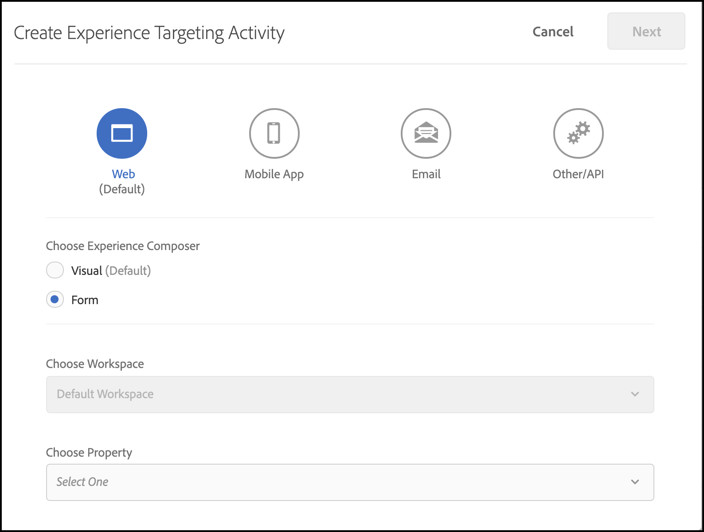

# Dépannage [!UICONTROL prise de décision sur l’appareil]

## Validation de la configuration

### Résumé des étapes

1. Vérifiez que le `logger` est configuré
1. Assurez-vous que [!DNL Target] traces sont activées
1. Vérifiez que l’[!UICONTROL artefact de règle ** prise de décision sur l’appareil] a été récupéré et mis en cache conformément à l’intervalle d’interrogation défini.
1. Validez la diffusion de contenu via l’artefact de règle mis en cache en créant une activité test [!UICONTROL prise de décision sur l’appareil] via le compositeur d’expérience basé sur les formulaires.
1. Inspecter les erreurs de notification d’envoi

## &#x200B;1. Vérifiez que l’enregistreur est configuré

Lors de l’initialisation du SDK, veillez à activer la journalisation.

**Node.js**

Pour le SDK Node.js, un objet `logger` doit être fourni.

```js {line-numbers="true"}
const CONFIG = {
  client: "<your client code>",
  organizationId: "<your organization ID>",
  logger: console
};
```

**Java SDK**

Pour Java SDK, les `logRequests` sur l’`ClientConfig` doivent être activées.

```js {line-numbers="true"}
ClientConfig config = ClientConfig.builder()
  .client("<your client code>")
  .organizationId("<your organization ID>")
  .logRequests(true)
  .build();
```

En outre, la JVM doit être démarrée avec le paramètre de ligne de commande suivant :

```bash {line-numbers="true"}
java -Dorg.slf4j.simpleLogger.defaultLogLevel=DEBUG ...
```

## &#x200B;2. Assurez[!DNL Target]vous que Traces est activé.

L’activation des traces génère des informations supplémentaires à partir de [!DNL Adobe Target] en ce qui concerne l’artefact de règles.

1. Accédez à l’interface utilisateur [!DNL Target] dans [!DNL Experience Cloud].

   

1. Accédez à **[!UICONTROL Administration]** > **[!UICONTROL Implémentation]** et cliquez sur **[!UICONTROL Générer un nouveau jeton d’autorisation]**.

   

1. Copiez le jeton d’autorisation nouvellement généré dans le presse[!DNL Target]papiers et ajoutez-le à votre requête :

   **Node.js**

   ```js {line-numbers="true"}
   const request = {
     trace: {
       authorizationToken: "88f1a924-6bc5-4836-8560-2f9c86aeb36b"
     },
     execute: {
       mboxes: [{
         name: "sdk-mbox"
       }]
   }};
   ```

   **Java**

   ```js {line-numbers="true"}
   Trace trace = new Trace()
     .authorizationToken("88f1a924-6bc5-4836-8560-2f9c86aeb36b");
   Context context = new Context()
     .channel(ChannelType.WEB);
   MboxRequest mbox = new MboxRequest()
     .name("sdk-mbox")
     .index(0);
   ExecuteRequest executeRequest = new ExecuteRequest()
     .mboxes(Arrays.asList(mbox));
   
   TargetDeliveryRequest request = TargetDeliveryRequest.builder()
     .trace(trace)
     .context(context)
     .execute(executeRequest)
     .build();
   ```

1. Une fois l’enregistreur et la trace en place, démarrez votre application et surveillez le terminal du serveur. La sortie suivante du journal confirme que l’artefact de règle a été récupéré :

   **Node.js SDK**

   ```text {line-numbers="true"}
     AT: LD.ArtifactProvider fetching artifact - https://assets.adobetarget.com/your-client-code/production/v1/rules.json
     AT: LD.ArtifactProvider artifact received - status=200
   ```

## &#x200B;3. Vérifiez que l’[!UICONTROL artefact de règle ** prise de décision sur l’appareil] a été récupéré et mis en cache conformément à l’intervalle d’interrogation défini.

1. Patientez pendant la durée de l’intervalle d’interrogation (20 minutes par défaut) et assurez-vous que l’artefact est récupéré par le SDK. Les mêmes logs de terminal seront générés.

   En outre, les informations provenant de l’[!DNL Target] Trace doivent être générées vers le terminal avec des détails sur l’artefact de règle.

   ```text {line-numbers="true"}
   "trace": {
     "clientCode": "your-client-code",
     "artifact": {
       "artifactLocation": "https://assets.adobetarget.com/your-client-code/production/v1/rules.json",
       "pollingInterval": 300000,
       "pollingHalted": false,
       "artifactVersion": "1.0.0",
       "artifactRetrievalCount": 10,
       "artifactLastRetrieved": "2020-09-20T00:09:42.707Z",
       "clientCode": "your-client-code",
       "environment": "production",
       "generatedAt": "2020-09-22T17:17:59.783Z"
     },
   ```

## &#x200B;4. Validez la diffusion de contenu via l’artefact de règle mis en cache en créant une activité test [!UICONTROL prise de décision sur l’appareil] via le compositeur d’expérience basé sur les formulaires

1. Accéder à l’interface utilisateur [!DNL Target] dans Experience Cloud

   

1. Créez une activité XT à l’aide du compositeur d’expérience d’après les formulaires.

   

1. Saisissez le nom de la mbox utilisée dans votre demande [!DNL Target] tant qu’emplacement de l’activité XT (notez qu’il doit s’agir d’un nom de mbox unique utilisé spécifiquement à des fins de développement).

   

1. Modifiez le contenu en offre HTML ou en offre JSON. Elle est renvoyée dans la requête [!DNL Target] à votre application. Laissez le ciblage de l’activité sur « Tous les visiteurs » et sélectionnez les mesures de votre choix. Nommez l’activité, enregistrez-la, puis activez-la pour vous assurer que la mbox/l’emplacement utilisé est uniquement pour le développement.

   

1. Dans votre application, ajoutez des instructions de journal pour le contenu reçu dans la réponse de votre [!DNL Target]

   **Node.js SDK**

   ```js {line-numbers="true"}
   try {
     const response = await targetClient.getOffers({ request });
     console.log('Response: ', response.response.execute.mboxes[0].options[0].content);
   } catch (error) {
     console.error('Something went wrong', error);
   }
   ```

   **Java SDK**

   ```js {line-numbers="true"}
   try {
     Context context = new Context()
       .channel(ChannelType.WEB);
     MboxRequest mbox = new MboxRequest()
       .name("sdk-mbox")
       .index(0);
     ExecuteRequest executeRequest = new ExecuteRequest()
       .mboxes(Arrays.asList(mbox));
   
     TargetDeliveryRequest request = TargetDeliveryRequest.builder()
       .context(context)
       .decisioningMethod(DecisioningMethod.ON_DEVICE)
       .execute(executeRequest)
       .build();
   
       TargetDeliveryResponse response = targetClient.getOffers(request);
     logger.debug("Response: ", response.getResponse().getExecute().getMboxes().get(0).getOptions().get(0).getContent());
   } catch (Exception exception) {
     logger.error("Something went wrong", exception);
   }
   ```

1. Consultez les journaux de votre terminal pour vérifier que votre contenu est en cours de diffusion et qu’il a été diffusé via l’artefact de règles sur votre serveur. L’objet `LD.DeciscionProvider` est généré lorsque la qualification de l’activité et la prise de décision ont été déterminées sur l’appareil en fonction de l’artefact de règles. En outre, en raison de la journalisation de l’`content`, vous devriez voir `<div>test</div>` ou selon la manière dont vous avez décidé que la réponse serait lors de la création de l’activité de test.

   **Sortie du journal**

   ```text {line-numbers="true"}
   AT: LD.DecisionProvider {...}
   AT: Response received {...}
   Response:  <div>test</div>
   ```

## Inspecter les erreurs de notification d’envoi

Lors de l’utilisation de la prise de décision sur l’appareil, des notifications sont envoyées automatiquement pour les requêtes d’exécution getOffers. Ces requêtes sont envoyées silencieusement en arrière-plan. Toute erreur peut être inspectée en s’abonnant à un événement appelé `sendNotificationError`. Voici un exemple de code montrant comment s’abonner aux erreurs de notification à l’aide du SDK Node.js.

```js {line-numbers="true"}
const TargetClient = require("@adobe/target-nodejs-sdk");
let client;

function onSendNotificationError({ notification, error }) {
  console.log(
    `There was an error when sending a notification: ${error.message}`
  );
  console.log(`Notification Payload: ${JSON.stringify(notification, null, 2)}`);
}

async function targetClientReady() {
  const request = {
    context: { channel: "web" },
    execute: {
      mboxes: [{
        name: "a1-serverside-ab",
        index: 1
      }]
    }
  };
  const targetResponse = await client.getOffers({ request });
}

client = TargetClient.create({
  events: {
    clientReady: targetClientReady,
    sendNotificationError: onSendNotificationError
  }
});
```

## Scénarios de dépannage courants

Veillez à consulter [fonctionnalités prises en charge](supported-features.md) pour la [!UICONTROL prise de décision sur l’appareil] lorsque vous rencontrez des problèmes.

### Activités de prise de décision sur l’appareil non exécutées en raison d’une audience ou d’une activité non prise en charge

Un problème courant qui peut se produire est la [!UICONTROL prise de décision sur l’appareil] activités qui ne s’exécutent pas en raison de l’audience utilisée ou d’un type d’activité non pris en charge.

(1) À l’aide de la sortie de l’enregistreur, passez en revue les entrées de la propriété de trace dans votre objet de réponse. Identifiez spécifiquement la propriété des campagnes :

**Sortie Trace**

```text {line-numbers="true"}
  "execute": {
  "mboxes": [
    {
      "name": "your-mbox-name",
      "index": 0,
      "trace": {
        "clientCode": "your-client-code",
        ...
        "campaigns": [],
        ...
      }
    }
```

Vous remarquerez que l’activité pour laquelle vous tentez de vous qualifier ne se trouve pas dans la propriété `campaigns` , car l’audience ou le type d’activité n’est pas pris en charge. Si l’activité est répertoriée sous la propriété `campaigns` , votre problème n’est pas dû à une audience ou un type d’activité non pris en charge.

(2) En outre, recherchez le fichier `rules.json` en consultant le `artifactLocation` `trace` > `artifact` > dans la sortie de votre enregistreur et notez que votre activité est absente de la propriété `rules` > `mboxes` :

**Sortie du journal**

```text {line-numbers="true"}
 ...
 rules: {
   mboxes: { },
   views: { }
 }
```

Enfin, accédez à l’interface utilisateur [!DNL Target] et localisez l’activité en question : [experience.adobe.com/target](https://experience.adobe.com/target)

Passez en revue les règles utilisées dans l’audience et assurez-vous de n’utiliser que celles mentionnées ci-dessus qui sont prises en charge. En outre, assurez-vous que le type d’activité est A/B ou XT.


### Activités de prise de décision sur l’appareil non exécutées en raison d’une audience non qualifiée

Si une activité de prise de décision sur l’appareil n’est pas en cours d’exécution, mais que vous avez vérifié que votre fichier rules.json contient l’activité, procédez comme suit :

(1) Assurez-vous que la mbox que vous exécutez dans votre application est la même que celle utilisée par l’activité :

>[!BEGINTABS]

>[!TAB rule.json]

```text {line-numbers="true"}
 ...
 rules: {
   mboxes: {
    target-only-node-sdk-mbox: [{ // this mbox name must match the mbox in your request
      ...
    }]
   }
 ...
```

>[!TAB Node.js SDK]

```js {line-numbers="true"}
 const request = {
   trace: {
     authorizationToken: '2dfc1dce-1e58-4e05-bbd6-a6725893d4d6'
   },
   execute: {
     mboxes: [{
       address: getAddress(req),
       name: "target-only-node-sdk-mbox-two" // this mbox name must match the mbox the activity is using
     }]
   }};
```

>[!TAB Java SDK]

```js {line-numbers="true"}
Context context = new Context()
  .channel(ChannelType.WEB);
MboxRequest mbox = new MboxRequest()
  .name("target-only-node-sdk-mbox-two")
  .index(0);
ExecuteRequest executeRequest = new ExecuteRequest()
  .mboxes(Arrays.asList(mbox));

TargetDeliveryRequest request = TargetDeliveryRequest.builder()
  .context(context)
  .decisioningMethod(DecisioningMethod.ON_DEVICE)
  .execute(executeRequest)
  .build();

TargetDeliveryResponse response = targetClient.getOffers(request);
```

>[!ENDTABS]

(2) Assurez-vous que vous êtes qualifié pour l’audience de votre activité en examinant la propriété `matchedRuleConditions` ou `unmatchedRuleConditions` de votre sortie de suivi :

**Sortie Trace**

```text {line-numbers="true"}
...
},
"campaignId": 368564,
"campaignType": "landing",
"matchedSegmentIds": [],
"unmatchedSegmentIds": [
  6188838
      ],
      "matchedRuleConditions": [],
          "unmatchedRuleConditions": [
            {
              "in": [
                "true",
                {
                  "var": "mbox.auth_lc"
                }
              ]
            }
          ]
    ...
```

Si des conditions de règle ne correspondent pas, cela signifie que vous n’êtes pas qualifié pour l’activité et que celle-ci ne s’exécutera pas. Passez en revue les règles de votre audience pour voir pourquoi vous ne remplissez pas les conditions.

### L’activité de prise de décision sur l’appareil ne s’exécute pas, mais la raison n’apparaît pas

Les raisons pour lesquelles une activité de prise de décision sur l’appareil ne s’exécute pas peuvent ne pas être facilement apparentes. Dans ce cas, procédez comme suit pour identifier le problème :

(1) Lisez la sortie de trace de l’enregistreur dans votre console et identifiez la propriété d’artefact qui ressemblera à ce qui suit :

**Sortie Trace**

```text {line-numbers="true"}
...
      "artifact": {
          "artifactLocation": "https://assets.adobetarget.com/your-client-code/production/v1/rules.json",
          "pollingInterval": 300000,
          "pollingHalted": false,
          "artifactVersion": "1.0.0",
          "artifactRetrievalCount": 3,
          "artifactLastRetrieved": "2020-10-16T00:56:27.596Z",
          "clientCode": "adobeinterikleisch",
          "environment": "production"
        },
...
```

Vérifiez la date de `artifactLastRetrieved` de l’artefact et assurez-vous que le dernier fichier `rules.json` est téléchargé sur votre application.

(2) Recherchez la propriété `evaluatedCampaignTargets` dans la sortie de votre enregistreur :

**Sortie du journal**

```text {line-numbers="true"}
...
  "evaluatedCampaignTargets": [
      {
        "context": {
          "current_timestamp": 1602812599608,
          "current_time": "0143",
          "current_day": 5,
          "user": {
            "browserType": "unknown",
            "platform": "Unknown",
            "locale": "en",
            "browserVersion": -1
          },
          "page": {
            "url": "localhost:3000/",
            "path": "/",
            "query": "",
            "fragment": "",
            "subdomain": "",
            "domain": "3000",
            "topLevelDomain": "",
            "url_lc": "localhost:3000/",
            "path_lc": "/",
            "query_lc": "",
            "fragment_lc": "",
            "subdomain_lc": "",
            "domain_lc": "3000",
            "topLevelDomain_lc": ""
          },
          "referring": {
            "url": "localhost:3000/",
            "path": "/",
            "query": "",
            "fragment": "",
            "subdomain": "",
            "domain": "3000",
            "topLevelDomain": "",
            "url_lc": "localhost:3000/",
            "path_lc": "/",
            "query_lc": "",
            "fragment_lc": "",
            "subdomain_lc": "",
            "domain_lc": "3000",
            "topLevelDomain_lc": ""
          },
          "geo": {},
          "mbox": {},
          "allocation": 23.79
        },
        "campaignId": 368564,
        "campaignType": "landing",
        "matchedSegmentIds": [],
        "unmatchedSegmentIds": [
          6188838
        ],
        "matchedRuleConditions": [],
        "unmatchedRuleConditions": [
          {
            "in": [
              "true",
              {
                "var": "mbox.auth_lc"
              }
            ]
          }
        ]
...
```

(3) Examinez les données `context`, `page` et `referring` pour vous assurer qu’elles sont conformes aux attentes, car cela peut affecter la qualification de ciblage de l’activité.

(4) Examinez le `campaignId` pour vous assurer que l’activité ou les activités que vous prévoyez d’exécuter sont évaluées. L’`campaignId` correspond à l’ID de l’activité dans l’onglet Présentation de l’activité dans l’interface utilisateur [!DNL Target] :


(5) Examinez les `matchedRuleConditions` et les `unmatchedRuleConditions` pour identifier les problèmes liés à la qualification pour les règles d’audience pour une activité donnée.

(6) Consultez le dernier fichier `rules.json` pour vous assurer que l’activité ou les activités que vous souhaitez exécuter localement sont incluses. L’emplacement est référencé ci-dessus à l’étape 1.

(7) Assurez-vous d’utiliser les mêmes noms de mbox dans votre requête et vos activités.

(8) Assurez-vous d’utiliser les règles d’audience et les types d’activité pris en charge.

### Un appel au serveur est effectué même si la configuration de l’activité sous une mbox indique « Éligible à la prise de décision sur l’appareil » dans l’interface [!DNL Target]

Il existe plusieurs raisons pour lesquelles un appel au serveur est effectué, même si l’appareil est éligible pour la prise de décision sur l’appareil :

* Lorsque la mbox utilisée pour une activité « Éligible à la prise de décision sur l’appareil » est également utilisée pour d’autres activités qui ne sont pas « Éligible à la prise de décision sur l’appareil », la mbox est répertoriée sous la section `remoteMboxes` de l’artefact `rules.json`. Lorsqu’une mbox est répertoriée sous `remoteMboxes`, tout appel `getOffer(s)` à cette mbox entraîne un appel au serveur.

* Si vous configurez une activité sous un espace de travail/une propriété et que vous ne l’incluez pas lors de la configuration du SDK, cela peut entraîner le téléchargement du `rules.josn` de l’espace de travail par défaut, qui peut utiliser la mbox située sous la section `remoteMboxes` .
